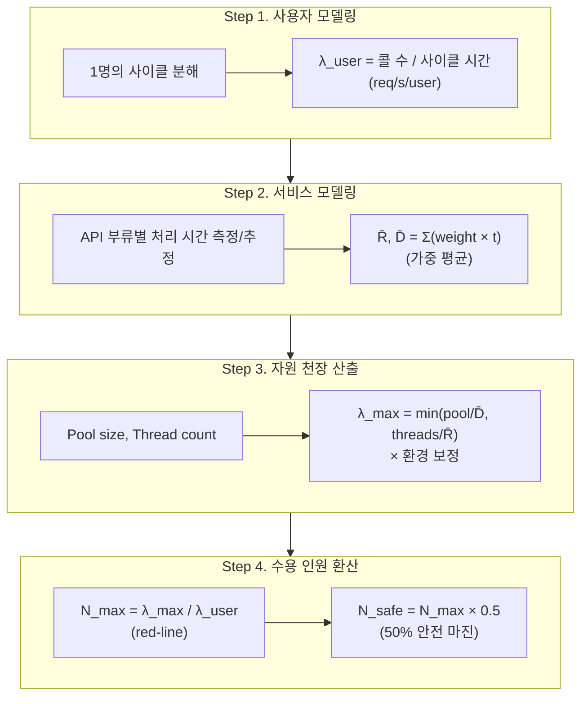

운영 DAU나 액세스 로그가 없는 신규 서비스에서도, 인프라 설정과 사용자 행동만으로 시스템이 받아낼 수 있는 동시 인원을 정량적으로 추정할 수 있다.

- 통상적인 부하 테스트는 목표 TPS가 위에서 내려와야 시작 가능하지만, 신규 서비스에는 그 근거가 없음
- 풀 사이즈, 스레드 수, 평균 처리 시간이라는 인프라 파라미터는 처음부터 결정
- 이 파라미터로부터 사용자 1명 → API 처리 시간 → 자원 천장 → 수용 인원을 차례로 잇는 역산 방법론

## 역산 이유

부하 테스트를 곧바로 돌리는 대신 역산으로 출발하는 것은, 가설 없는 측정이 정보를 만들지 못하기 때문이다.

|        접근         |              필요 입력               |        한계        |
|:-----------------:|:--------------------------------:|:----------------:|
|   실측 우선 부하 테스트    |  목표 TPS, 시나리오, 가상 사용자 수, 합격 기준   |  신규 서비스에 모두 부재함  |
|       경험 추정       |             과거 운영 경험             |  검증 가능한 수치가 아님   |
| 역산 (Reverse Calc) | 인프라 파라미터(pool/threads), 사용자 시나리오 | 가정값 의존, 실측 보정 필요 |

역산 모델은 실측 가능한 가정값을 명시적으로 드러내, 부하 테스트를 "검증의 도구"로 정상화한다.

- 출발점 제공: 어느 VU 수에서 임계가 무너질지 예측한 뒤 테스트 → 무작정 계단식 증가보다 효율적
- 합격선 제시: SLO 기준 N_safe를 사전에 산출 → 테스트 후 OK/NOT-OK 판단 기준 확보
- 병목 가설 확보: D̄, R̄, 보정 계수 중 무엇이 어긋났는지 실측으로 추궁 가능

## 4-Step Reverse Calculation

목표 사용자 수가 위에서 내려오지 않을 때, 1명의 행동에서 출발해 인프라 천장까지 역산한다.



## Step 1. User Behavior to Per-User Throughput

한 사용자의 핵심 비즈니스 사이클을 콜과 think time 단위로 분해하여 1인당 요청률을 산출한다.

### 사이클 분해 절차

비즈니스 가치가 발생하는 1회 사이클(예: 로그인부터 주문 완료까지)을 행동 단위로 나눈다.

|      구성요소       |       의미        | 측정 방법                     |
|:---------------:|:---------------:|:--------------------------|
|  호출 시퀀스 (Call)  | 사이클 동안 호출되는 API | 사용자 시나리오에서 추출             |
| 콜당 평균 응답 시간 (R) |    서버 처리 시간     | 측정값 또는 부류별 가중 평균 (Step 2) |
| 콜 사이 Think Time | 사용자가 화면을 보는 시간  | 사용자 여정 분석 (4초 등 가정값)      |

### 1인당 요청률 산출

사이클 시간은 콜 처리 시간 합과 think time 합을 더해 산출한다.

```text
Cycle Time = Σ(call latency) + Σ(think time)

λ_user = (호출 수) / Cycle Time   [req/s/user]
```

예를 들어 8콜 × 콜당 0.2s + 7회 think × 4s = 1.6 + 28 = 29.6초 사이클이라면:

- `λ_user = 8 / 29.6 ≈ 0.27 req/s/user` (사용자 1명이 분당 약 16 호출 발생)

이 값이 이후 단계에서 "1명이 시스템에 가하는 부하"의 단위가 된다.

## Step 2. Per-Endpoint Weighted Average

엔드포인트마다 응답 시간과 DB 점유 시간이 다르므로, 단일 평균이 아닌 호출 비중에 따른 가중 평균을 사용한다.

### 부류별 처리 시간 분류

API를 처리 비용 기반으로 부류화하여 부류별 평균값을 따로 추정한다.

|       부류        |             특성             |         예시 엔드포인트          |
|:---------------:|:--------------------------:|:-------------------------:|
|      단순 조회      |     인덱스 hit, 직렬화 비용 위주     |      GET /resources       |
|     조인/페이징      |   다중 테이블 조인, 디스크 I/O 가능    | GET /resources/{id}/items |
| 인증/암호화 (CPU 집약) |  BCrypt, 해시 등 CPU 점유 큰 작업  |     POST /auth/login      |
|     트랜잭션 쓰기     | INSERT/UPDATE, flush, 락 점유 |       POST /orders        |

부류 분리의 핵심 이유는 단일 평균값이 분포의 꼬리(tail)를 가리기 때문이다.

- 단순 조회만 60% 비중이라도 인증·쓰기 한 호출의 D가 250ms를 넘으면 사이클 평균이 크게 들림
- 부류별 측정은 실측 시 어느 부류부터 최적화할지를 정량적으로 결정하는 근거가 됨

### 가중 평균 산출

호출 비중을 가중치로 두고 응답 시간 R과 DB 점유 시간 D의 가중 평균을 계산한다.

```text
R̄ = Σ(weight_i × R_i)    (전체 응답 시간 가중 평균)
D̄ = Σ(weight_i × D_i)    (DB 점유 시간 가중 평균)
```

- R̄: 스레드 자원 점유 시간 추정에 사용
- D̄: 커넥션 풀 점유 시간 추정에 사용
- 두 값을 분리하는 이유: 자원별 천장이 따로 결정되기 때문 (Step 3)

예를 들어 호출 비중이 단순 조회 5/8, 조인 1/8, 인증 1/8, 쓰기 1/8 같이 가중을 두어 계산하면 다음과 같은 결과가 나온다.

- `R̄ = 200 ms`, `D̄ ≈ 80 ms`

## Step 3. Resource-Level Throughput Ceiling

Little's Law(`L = λW`)를 자원 단위에 적용하면 풀과 스레드 각각의 TPS 천장이 도출된다.

### Little's Law 적용 정당성

Little's Law는 정상 상태(steady state) 큐잉 시스템에서 평균 큐 길이 L, 도착률 λ, 평균 체류 시간 W의 관계를 보장하는 분포 무관한 항등식이다.

- 자원 단위 적용: DB 커넥션 풀과 스레드 풀은 각각 "동시에 점유 중인 작업의 수 = L"이 상한선으로 고정된 큐
- 평균 점유 시간 W가 곧 D̄ 또는 R̄ → 자원이 받아낼 수 있는 최대 처리량 λ_max = L/W

### 가정 - 동기 블로킹 I/O

본 모델은 동기 블로킹 I/O 환경을 전제로 한다.

- 외부 네트워크 호출 대기 시간(N)은 R̄에 자연스럽게 포함 (스레드가 N 동안 점유 유지)
- N이 커지면 `threads / R̄`가 작아져 스레드가 풀보다 먼저 병목으로 전환 가능
- 비동기·논블로킹·가상 스레드 환경에서는 외부 I/O 대기 동안 스레드 반납 → 점유 시간이 R̄와 분리되어 별도 모델 필요

### 자원별 TPS 공식

자원의 동시성 한계를 평균 점유 시간으로 나누면 해당 자원이 받아낼 수 있는 최대 TPS가 된다.

|       자원 유형        |  동시성 한계 (L)  | 평균 점유 시간 (W) |     TPS 천장     |
|:------------------:|:------------:|:------------:|:--------------:|
| DB Connection Pool |  pool size   |      D̄      |  `pool / D̄`   |
|  HTTP Thread Pool  | thread count |      R̄      | `threads / R̄` |

실효 천장은 두 자원 중 더 작은 값으로 결정된다.

```text
λ_ceiling = min(pool / D̄, threads / R̄)
```

예를 들어 T-Mid 단일 노드 기준 pool=40, threads=200, R̄=200ms, D̄=80ms 인 경우:

- DB 풀: `40 / 0.08 = 500 TPS`
- 스레드: `200 / 0.20 = 1000 TPS`
- 실효 천장: `min(500, 1000) = 500 TPS` → DB 풀이 먼저 병목

이 결과는 단일 노드 기준이며, 클러스터 N대로 수평 확장 시 천장은 N×500 TPS에 근사하나 공유 자원(DB, 캐시)에 의해 다시 제약된다.

### 환경 보정 계수

이론 천장은 자원 점유만 고려하므로, 실제 운영 환경의 제약을 보정 계수로 반영한다.

- CPU 한계: vCPU 수 대비 CPU-bound 연산 비중이 높으면 컨텍스트 스위칭 오버헤드 발생
- 자원 동거: 동일 호스트에 DB와 앱이 함께 실행되면 메모리·디스크 I/O 경쟁
- 동시성 비선형성: USL(Universal Scalability Law)에 따르면 동시성 증가 시 직렬화·일관성 오버헤드(α, β)로 처리량이 선형보다 낮게 증가

|             환경 조건             |  보정 계수   |
|:-----------------------------:|:--------:|
|     멀티 vCPU + DB 분리 + 캐시      | −10~−20% |
|        2 vCPU + DB 분리         | −20~−30% |
| 1 vCPU + DB 동거 + CPU-bound 혼합 | −30~−40% |

```text
λ_max = λ_ceiling × (1 - 보정률)
```

예시 케이스(멀티 vCPU + DB 분리 환경)에서 −20% 보정을 적용하면 `λ_max = 500 × 0.8 = 400 TPS`가 실용 천장이 된다.

## Step 4. Capacity Conversion

시스템 천장(λ_max)을 1인당 부하(λ_user)로 나누면 동시 수용 가능한 사용자 수가 도출된다.

### Red-line과 Safety Margin

수용 인원은 두 가지 기준으로 정의한다.

- N_max (red-line): `λ_max / λ_user` — 천장을 정확히 채우는 인원, 응답 시간이 급증하기 시작하는 Knee Point 부근
- N_safe (합격선): `N_max × 0.5` — 50% 안전 마진, 천장의 절반 수준에서 안정적으로 운영 가능한 인원

```text
N_max  = λ_max / λ_user
N_safe = N_max × safety_factor   (보통 0.5 ~ 0.7)
```

예시 케이스에서 `λ_max = 400 TPS`, `λ_user = 0.27 req/s/user`이면 다음과 같은 결과가 나온다.

- N_max = 400 / 0.27 ≈ 1,500명 (이때 부하 ≈ 405 TPS, 천장 정확히 채움)
- N_safe = 1,500 × 0.5 ≈ 750명 (이때 부하 ≈ 200 TPS, 천장까지 200 TPS 여유)

### 50% Safety Factor의 근거

안전 마진을 50%로 두는 것은 부하-응답 시간 곡선이 천장 부근에서 비선형으로 폭발하기 때문이다.

- 큐잉 이론(M/M/1)에서 응답 시간 ≈ R̄ / (1 - ρ), 가동률 ρ가 0.5에서 0.9로 가면 응답 시간이 5배 증가
- 가동률 50% 지점은 P95 응답 시간이 약 2×R̄ 이내로 유지되는 구간 → SLO 마진 확보
- 가동률 70%까지는 폭증 직전의 안정 구간 → 비용 절감 우선이면 0.7까지 끌어 사용 가능

red-line은 운영 한계, safe-line은 SLO 기준선으로 사용한다.

## Sensitivity Analysis

역산 방법론은 가정값 의존도가 크므로, 가장 민감한 파라미터를 사전에 식별해 둔다.

### D̄가 천장 결정

DB 풀이 먼저 병목인 환경에서 D̄(평균 DB 점유 시간)는 수용 인원에 1차 비례한다.

|   D̄   | 풀 TPS (40 pool) | 실용 TPS (×0.8) | 수용 인원 (50% 마진) |
|:------:|:---------------:|:-------------:|:--------------:|
| 40 ms  |      1,000      |      800      |   ≈ 1,500 명    |
| 80 ms  |       500       |      400      |    ≈ 750 명     |
| 150 ms |       267       |      213      |    ≈ 400 명     |
| 250 ms |       160       |      128      |    ≈ 240 명     |

D̄가 두 배 늘면 수용 인원이 절반으로 줄어든다는 사실이, "DB 점유 시간 단축이 인프라 증설보다 비용 효율이 높다"는 결론으로 이어진다.

- pool을 40 → 80으로 늘리면 ×2 효과 → 인프라 비용 발생
- D̄를 80ms → 40ms로 단축하면 동일한 ×2 효과 → 인덱스·N+1·트랜잭션 범위 조정으로 달성 가능
- 따라서 실측 시 가장 먼저 검증·최적화할 값이 D̄

### 검증 우선순위

가정값이 흔들리는 순서는 통상 다음과 같다.

- D̄ (DB 점유 시간): 쿼리 효율, 인덱스, N+1 문제에 민감
- CPU 보정 계수: 실제 워크로드의 CPU 점유 비율에 따라 변동
- λ_user (사이클 시간): think time이 짧으면 1인당 부하 증가
- R̄ (전체 응답): 스레드 천장이 먼저 막힐 때만 영향

## Verification by Load Testing

역산으로 도출한 수용 인원은 가설일 뿐, 실측으로 검증해야 한다.

### 검증 시나리오 매핑

각 추정값을 검증할 수 있는 부하 테스트 유형이 다르다.

|   추정값    |             검증 방법              |  매칭 테스트 유형   |
|:--------:|:------------------------------:|:------------:|
|  R̄, D̄  |        VU 1로 부류별 P50 측정        | 베이스라인 (Load) |
|  λ_max   | Stepwise VU 증가, 에러율/P95 임계 도달점 |    Stress    |
|  N_safe  |    N_safe 수준 VU로 30분 이상 유지     | Soak (Mini)  |
| 환경 보정 계수 |        실측 TPS / 이론 TPS         |   베이스라인 비교   |

### 결과 반영

실측 후 가정값을 갱신하고 N_max, N_safe를 재산출하는 과정을 반복하여 모델의 정확도를 높여간다.

- 1차 실측: D̄ 보정 → 풀 천장 갱신
- 2차 실측: CPU 보정 계수 보정 → 실용 천장 갱신
- 3차 실측: λ_user 보정 → 1인당 부하 갱신

이 사이클이 반복될수록 모델은 가설에서 운영 지표로 수렴하며, 다음 SLO·SLA 협상의 정량적 근거가 된다.
