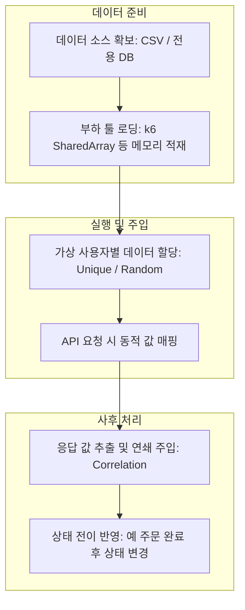

단순히 동일한 식별자를 반복 호출하는 것이 아니라, 실제 운영 환경의 데이터 분포를 재현하여 성능 결과의 왜곡을 방지해야 한다.

## Cardinality and Data Distribution (카디널리티와 데이터 분포)

테스트 데이터의 고유값 개수인 카디널리티는 데이터베이스의 실행 계획과 메모리 효율을 결정짓는 핵심 요소이다.

### 낮은 카디널리티의 위험성

제한된 수의 데이터만으로 부하를 생성할 경우 실제 운영 환경과 다른 성능 결과가 도출된다.

- 비정상적인 캐시 히트율: 모든 요청 데이터가 버퍼 풀이나 인-메모리 캐시에 상주하게 되어 실제보다 과도하게 빠른 응답 속도 기록
- 인덱스 비효율성: 데이터 분포가 좁을 경우 인덱스 스캔 대신 풀 스캔이 선택되는 등 쿼리 실행 계획의 정합성 훼손
- 데이터베이스 락 경합: 동일한 레코드에 대한 빈번한 수정으로 인해 실제 운영 대비 과도한 락 대기 현상 발생

### 실제 운영 수준의 데이터 셋 구축 전략

- 데이터 양의 확보: 운영 환경의 테이블 크기를 고려하여 최소 수백만 건 이상의 데이터를 사전에 적재함으로써 인덱스 트라이(Trie) 깊이 재현
- 파레토 법칙(80/20 Rule) 적용: 80%의 요청이 20%의 핫 데이터(Hot Data)에 집중되는 불균형한 유입 패턴을 설계하여 실제 캐시 경합 상황 모사
- 무작위성 확보: 테스트 도구의 파라미터화 기능을 활용하여 매 요청마다 고유한 식별자를 사용하도록 유도

## Dynamic Data Lifecycle (동적 데이터 생명주기)

부하 테스트 스크립트에서 정적인 값이 아닌 실시간으로 변하는 데이터를 관리하고 주입하는 기법이다.

### 1. Data Correlation (데이터 상관관계 처리)

이전 요청의 응답 결과를 다음 요청의 입력값으로 사용하는 연쇄 작업이다.

- 세션 유지: 로그인 응답으로 받은 토큰이나 쿠키를 다음 API 헤더에 자동으로 주입
- 비즈니스 흐름 연결: 생성된 주문 ID를 조회하거나 취소하는 시나리오를 통해 실제 데이터의 흐름 재현

### 2. State Management (데이터 상태 관리)

테스트 데이터가 소모되거나 상태가 변경되는 경우를 고려한 설계이다.

- 일회성 데이터 처리: 쿠폰 코드나 인증 번호와 같이 한 번 사용하면 폐기되는 데이터의 순차적 할당 보장
- 멱등성 데이터 활용: 여러 번 호출해도 상태가 변하지 않는 조회용 데이터 셋을 별도로 분리하여 부하의 안정성 확보

## Resource Performance Analysis (데이터 기반 성능 분석)

데이터 설계 방식에 따라 시스템 자원이 소모되는 양상이 다르게 나타난다.

|   설계 방식   |  캐시 효율  |   DB I/O 패턴    | 현실성 및 신뢰도 |
|:---------:|:-------:|:--------------:|:---------:|
| 단일 ID 반복  | 100% 히트 | 메모리 상주 데이터만 접근 |   매우 낮음   |
| 좁은 범위 무작위 |   높음    | 버퍼 풀 내 데이터 위주  |    낮음     |
| 운영 수준 분포  | 실제와 유사  | 물리적 디스크 I/O 발생 |   매우 높음   |

- 디스크 읽기 유도: 캐시 크기를 넘어서는 광범위한 데이터 범위를 설정하여 실제 디스크에서 데이터를 읽어오는 물리적 부하 재현
- 인덱스 탐색 부하: 카디널리티가 높은 데이터를 사용하여 인덱스 페이지 탐색 시 발생하는 CPU 및 메모리 비용 측정

## Conclusion - Data as a Performance Driver

데이터는 단순한 입력값이 아니라 성능 테스트의 정밀도를 결정하는 인프라의 일부이다.

- 제약 조건의 사전 검증: 유니크 제약 조건이 있는 필드(이메일 등)에 대해 테스트 전 충분한 가용 데이터 셋 확보 여부 점검
- 데이터 정리 및 복구: 테스트 종료 후 생성된 대규모 쓰레기 데이터를 정리하고 시스템을 초기 상태로 복구하는 자동화 스크립트 구축
- 인덱스 파라미터 최적화: 데이터 분포에 따라 변하는 데이터베이스 통계 정보를 최신으로 유지하여 테스트 결과의 재현성 확보
