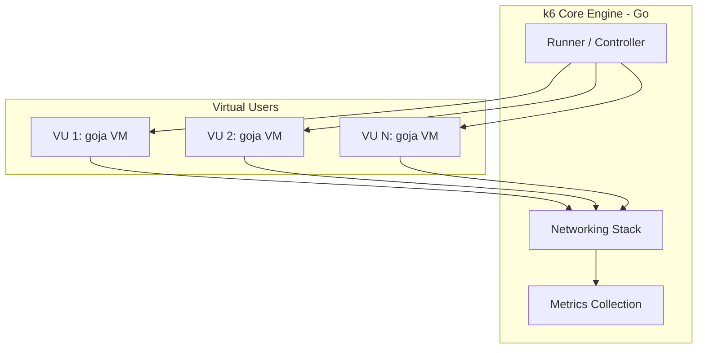

k6는 Go 언어로 작성된 부하 테스트 엔진과 JavaScript(goja) 런타임이 결합된 고성능 부하 생성 도구이다.

## Internal Architecture (내부 구조)

k6는 부하 생성의 고성능을 보장하기 위해 Go의 동시성 모델을 활용하면서도, JavaScript 기반의 스크립팅 환경을 제공한다.

- Go Runtime: 네트워크 I/O, 데이터 수집, 가상 사용자(VU) 관리 등 실제 부하 생성 담당 핵심 엔진
- JavaScript VM (goja): 각 가상 사용자별로 독립적으로 할당되는 JS 엔진으로, 사용자가 작성한 스크립트를 해석하고 실행
- VU (Virtual User): 각 가상 사용자는 개별적인 JS VM 인스턴스를 소유하며, 상호 독립적인 상태 유지

## VU vs Arrival Rate Executors (익스큐터 비교)

목표 TPS를 달성하기 위해 부하를 제어하는 방식에 따라 크게 두 가지 유형의 익스큐터로 나뉜다.

### 1. VU-based (Closed System)

가상 사용자 수(VU)를 고정하고 각 사용자가 스크립트를 반복 실행하는 방식이다.

- 제어 요소: 동시 접속자 수 (VU)
- 특성: 시스템 응답이 느려지면 각 VU의 루프 주기가 길어져 실제 유입되는 TPS 감소
- 적합한 상황: 사내 ERP 서비스나 고정된 사용자 풀이 있는 시스템 테스트

### 2. Arrival Rate-based (Open System)

시스템의 응답 속도와 관계없이 초당 요청 유입률(Rate)을 일정하게 유지하는 방식이다.

- 제어 요소: 초당 유입률 (TPS / RPS)
- 특성: 응답이 늦어져도 새로운 요청은 계속 생성되므로 시스템 병목 시 대기 큐 적체 상황을 정확히 재현
- 적합한 상황: 대중적인 웹 서비스나 오픈 API의 트래픽 유입 모델링

|    구분    | Per-VU Iterations | Constant Arrival Rate |
|:--------:|:-----------------:|:---------------------:|
| 부하 조절 방식 |     고정된 VU 반복     |       초당 유출률 고정       |
| 시스템 지연 시 |    TPS 비례하여 감소    | TPS 일정 유지 (부하 압박 증가)  |
|  핵심 목표   |  각 사용자의 총 작업량 달성  |     고정된 트래픽 강도 유지     |

## Execution Phases (실행 단계)

k6 스크립트는 초기화부터 종료까지 총 4단계의 라이프사이클을 거친다.

- Init Stage: 파일 로드, 모듈 가져오기, 라이브러리 초기화 수행 (각 VU 생성 전 1회 실행)
- Setup Stage: 테스트 데이터 준비 및 환경 설정. 모든 VU가 시작되기 전 한 번 실행되며 결과를 각 VU에 전달ㅁ
- VU Stage: 실제 부하가 발생하는 단계. 정의된 익스큐터 설정에 따라 스크립트의 `default` 함수 반복 실행
- Teardown Stage: 테스트 결과 정리 및 리소스 반환. 모든 VU 실행 완료 후 1회 실행

## Resource Management (자원 관리)

k6는 각 VU마다 독립된 JS VM을 생성하므로, 대규모 부하 생성 시 메모리 관리가 중요하다.

- 메모리 최적화: `SharedArray` 등을 사용하여 각 VU가 공통 데이터를 공유하게 함으로써 메모리 사용량 절감
- 부하 분산: 단일 장비의 자원(파일 디스크립터, CPU 등) 한계 도달 시 k6 Cloud나 클러스터링을 통한 분산 부하 고려
