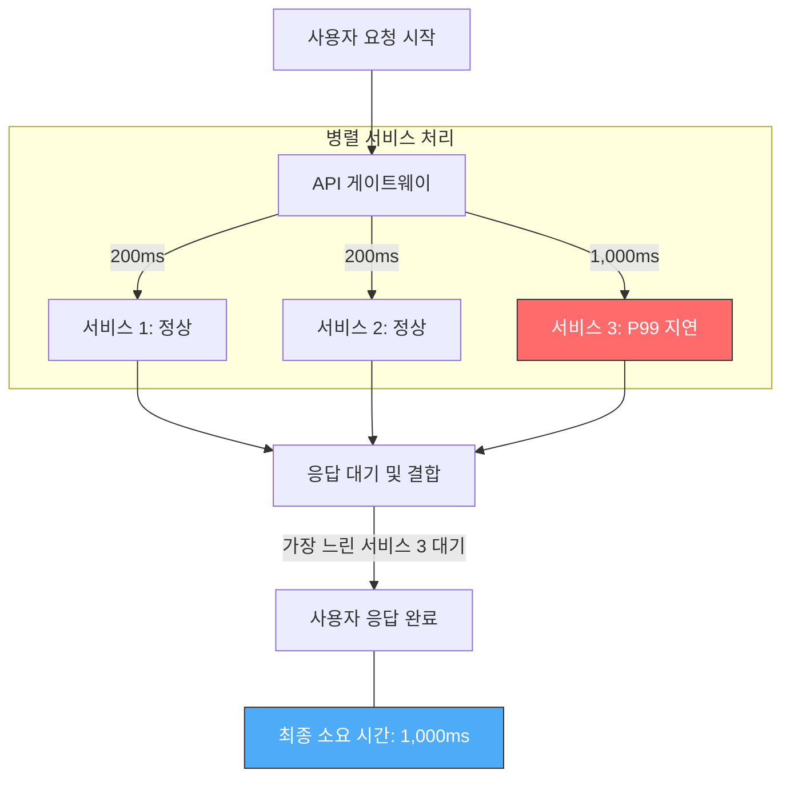

수천 건의 요청 중 단 몇 건의 극단적인 지연이 전체 사용자 경험을 파괴할 수 있기 때문에, 통계적 관점에서 지표를 해석하는 능력이 필수적이다.

## The Trap of Averages (평균의 함정)

평균값(Mean)은 전체적인 경향성을 보여주지만, 시스템의 실제 성능 상태를 왜곡하는 경우가 많다.

- 데이터 왜곡: 대부분의 요청이 100ms 이내에 처리되더라도 1%의 요청이 10초 이상 걸린다면 평균값은 크게 상승하여 정상적인 요청들의 상태를 가림
- 사용자 경험 불일치: 평균값은 대다수 사용자가 느끼는 지연(Latent) 현상을 반영하지 못함
- 이상치 탐지 불가: 시스템 병목이나 자원 경합으로 발생하는 간헐적 지연을 평균으로는 찾아낼 수 없음

## Percentiles and Tail Latency (백분위수와 꼬리 지연)

전체 데이터를 크기순으로 나열했을 때 특정 위치의 값을 나타내는 백분위수를 통해 성능 분포를 파악한다.

- P50 (Median): 전체 요청 중 50%가 이 시간 이내에 처리됨을 의미하며, 일반적인 사용자 경험의 기준점
- P95 / P99: 상위 5% 또는 1%의 요청이 겪는 지연 시간으로, 시스템의 최악의 상황을 대변
- Tail Latency: P99 이상의 극단적인 지연 시간을 의미하며, 분산 시스템에서 전체 응답 시간을 결정짓는 핵심 요인

### The Tail at Scale

분산 아키텍처에서 하위 1%의 지연이 전체 시스템에 미치는 영향은 매우 큰 영향을 끼치며, 서비스가 늘어날수록 사용자 경험이 급격히 저하될 수 있다.

### The Tail at Scale: 규모에 따른 지연 확률

서비스 개수가 늘어날수록 단 하나의 서비스라도 P99 지연(1%)을 겪을 확률은 급격히 증가한다.

- 서비스 1개 호출 시: 지연 확률 1%
- 서비스 10개 병렬 호출 시: 지연 확률 약 10%
- 서비스 100개 병렬 호출 시: 지연 확률 약 63%

이처럼 분산 시스템에서는 하위 1%의 지연이 소수의 경험이 아니라 보편적 지연으로 증폭되므로, P99와 같은 꼬리 지연을 반드시 관리해야 한다.

## Apdex (Application Performance Index) - 사용자 만족도

사용자 만족도를 0.0에서 1.0 사이의 점수로 환산하여 시스템의 서비스 품질(QoS)을 단일 지표로 관리하는 방식이다.

- 만족(Satisfied): 응답 시간이 목표 시간(T) 이내인 경우 (가중치 1.0)
- 허용(Tolerating): 응답 시간이 T보다 크고 4T 이내인 경우 (가중치 0.5)
- 좌절(Frustrated): 응답 시간이 4T를 초과하거나 에러가 발생한 경우 (가중치 0)

### Apdex Score 계산식

성능 지표를 단일 수치로 나타내기 위해 다음과 같은 가중치 수식을 사용한다.

`Apdex = (S + (T / 2)) / N`

- S (Satisfied): 만족 상태의 요청 수 (목표 시간 T 이내)
- T (Tolerating): 허용 상태의 요청 수 (T ~ 4T 사이)
- N (Total): 전체 샘플 수 (S + T + F)
- 0.5(1/2) 가중치의 의미: 허용 범위의 응답은 사용자에게 절반의 만족감을 준다고 가정하여 0.5의 가중치를 부여함
- 좌절(Frustrated)의 역할: 총 샘플 수(N)에는 포함되어 전체 점수를 낮추는 역할을 하며, 시스템의 품질 저하를 반영함

### Apdex 실제 적용 케이스

목표 응답 시간(T)을 500ms로 설정한 커머스 서비스의 부하 테스트 결과가 다음과 같다고 가정한다.

- 전체 요청 수(N): 10,000건
- 만족(S, <= 500ms): 8,500건
- 허용(T, 500ms ~ 2,000ms): 1,200건
- 좌절(F, > 2,000ms 또는 에러): 300건

`Apdex = (8,500 + (1,200 * 0.5)) / 10,000 = 0.91`

- 분석: 만족한 사용자(8,500)에 허용 범위 사용자(1,200)의 절반 가치인 600을 더해 전체 비율 산출
- 점수 해석: 0.91은 우수(Excellent) 등급으로 분류되며, 현재 인프라 구조가 목표 트래픽을 안정적으로 수용하고 있음을 의미
- 의사결정 활용: 만약 점수가 0.70 이하로 떨어진다면, 성능 튜닝이나 서버 증설이 즉시 필요한 경고 신호로 간주

## Metrics Analysis Strategy: 지표 분석 우선순위

성능 테스트 도구(k6 등)가 쏟아내는 수많은 지표 중, 분석가는 다음의 우선순위에 따라 데이터를 해석해야 한다.

### Step 1. HTTP 에러율 (가용성 점검) - 최우선 순위

시스템이 응답을 제대로 주지 못한다면 속도 지표는 아무런 의미가 없다.

- 분석 포인트: 에러율이 1%를 초과하는 경우, 성능 측정보다는 에러 로그 분석을 통한 시스템 결함(Connection Refused, Timeout 등) 해결에 집중함
- 판단 기준: 에러율이 0%에 수렴할 때 비로소 하위 단계의 성능 지표 분석을 시작함

### Step 2. P95 / P99 응답 시간 (품질 분석)

평균의 함정을 벗어나 대다수 사용자가 겪는 실제 경험의 마지노선을 확인한다.

- 분석 포인트: 평균값과 P95의 차이가 크다면, 특정 요청들이 시스템 자원을 독점하거나 락(Lock) 경합이 발생하고 있다는 강력한 근거
- 목표: P95 응답 시간을 서비스 목표 SLA 이내로 안착시키는 것을 최우선 목표로 삼음

### Step 3. 처리량 - TPS / RPS (용량 분석)

시스템이 단위 시간당 처리할 수 있는 비즈니스 트랜잭션의 양을 확인한다.

- 분석 포인트: 부하가 증가함에도 TPS가 더 이상 늘어나지 않고 정체(Plateau)된다면, 시스템이 포화 상태(Saturation)에 도달했음을 의미
- 활용: 마케팅 이벤트 시 유입 가능한 최대 트래픽 규모를 산정하는 근거로 사용

### Step 4. Max Latency 및 자원 포화도 (안정성 분석)

최악의 상황에서도 시스템이 완전히 붕괴하지 않는지 확인한다.

- 분석 포인트: Max Latency가 무한히 발산한다면 Buckle Point에 도달한 것이며, CPU/메모리/디스크 I/O 중 어느 자원이 임계치에 도달했는지 대조 분석
- 활용: 장애 상황에서의 서킷 브레이커 작동 시점이나 요청 제한(Rate Limiting) 임계치 설정
