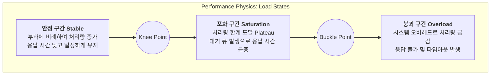

성능 테스트는 단순한 측정을 넘어 시스템의 물리적 한계를 이해하는 과정이다.

- 시스템에 부하가 가해질 때 내부 자원이 어떻게 사용되고, 어떤 지점에서 병목이 발생하는지
- 왜 특정 시점부터 응답 시간이 기하급수적으로 증가하는지

## Little's Law

시스템 내의 평균 고객 수와 도착률, 평균 체류 시간 사이의 관계를 설명하는 성능 공학의 가장 기초적인 법칙이다.

- 공식: `L = λW`
    - `L (Lead Time / Inventory)`: 시스템 내에 머물고 있는 평균 요청 수 (Concurrency / VU)
    - `λ (Throughput / Arrival Rate)`: 단위 시간당 도착하는 요청 수 (TPS / RPS)
    - `W (Wait Time / Residence Time)`: 요청이 시스템에 머무는 평균 시간 (Latency / Response Time)

### Interpretation

- 동일한 응답 시간(`W`) 조건에서 처리량(`λ`)을 높이려면 동시 접속자 수(`L`)를 늘려야 함
- 시스템의 동시 처리 능력(`L`)이 고정된 상태에서 응답 시간(`W`)이 길어지면 처리량(`λ`)은 비례하여 감소
- 부하 테스트 시 목표 TPS를 달성하기 위해 필요한 가상 사용자(VU) 수를 계산하는 수학적 근거

### Resource-level Application

Little's Law는 시스템 전체뿐 아니라 개별 자원(커넥션 풀, 스레드 풀)에도 동일하게 적용된다.

- 자원 동시성(L) = 풀 크기 또는 스레드 수
- 자원 점유 시간(W) = 해당 자원이 요청 1건을 잡고 있는 평균 시간
- 자원 처리량(λ) = `L / W` → 해당 자원이 받아낼 수 있는 최대 TPS

|       자원 유형        |   L (동시성)    |  W (점유 시간)  |     λ (TPS 천장)     |
|:------------------:|:------------:|:-----------:|:------------------:|
| DB Connection Pool |  pool size   | 평균 DB 점유 시간 |    `pool / D̄`     |
|  HTTP Thread Pool  | thread count |  평균 응답 시간   |   `threads / R̄`   |
|      CPU Core      |  core count  | 요청당 CPU 시간  | `cores / CPU time` |

- 시스템 실효 천장은 가장 작은 자원 천장으로 결정 (`min(...)`)
- 자원별 점유 시간이 다르므로, 평균 응답 시간 하나로 천장을 추정하면 어느 자원이 병목인지 보이지 않는 한계 존재

## Utilization vs Response Time

시스템 부하(Load)가 증가함에 따라 처리량(Throughput)과 응답 시간(Latency)은 특정 변곡점을 기준으로 급격한 상태 변화를 겪는다.

### The Knee Point (Optimal Capacity)

- 정의: 처리량(Throughput)이 최대치에 도달하면서 동시에 응답 시간(Latency)이 본격적으로 상승하기 시작하는 지점
- 의미: 시스템이 자원을 가장 효율적으로 사용하면서도 안정적인 응답 속도를 유지할 수 있는 최적의 운영 한계치
- 특징: 이 지점까지는 부하가 늘어남에 따라 처리량이 선형적으로 증가하지만, 이 후부터는 대기 큐(Queue)가 형성되며 응답 시간이 급격히 상승

### The Buckle Point (System Failure)

- 정의: 부하가 시스템의 수용 능력을 완전히 초과하여 처리량(Throughput)이 오히려 감소하기 시작하는 지점
- 원인: 과도한 컨텍스트 스위칭, 메모리 스왑, 락 경합 등으로 인해 부하 관리 자체에 더 많은 자원을 소모하는 'Thrashing' 현상 발생
- 결과: 시스템이 Buckling 현상을 일으키며 응답 시간은 무한대로 발산하고, 5xx 에러나 타임아웃이 빈번하게 발생

## Queuing Theory

요청이 시스템 자원을 사용하기 위해 줄을 서는 과정을 수학적으로 모델링하는 이론으로, 시스템의 대기 시간과 서비스 타임 간의 관계를 분석하는 데 사용된다.

- 서비스 타임 (Service Time): 실제 자원(CPU, Disk)을 사용하여 연산을 수행하는 시간
- 대기 타임 (Wait Time): 자원을 점유하기 위해 큐에서 기다리는 시간
- Response Time = Service Time + Wait Time
- 자원 사용률이 높아질수록 대기 타임이 서비스 타임보다 훨씬 커지며, 성능 저하의 주된 원인

## Implications for Performance Testing

- 성능 목표 설정: 단순한 '성공/실패'가 아니라 시스템의 Knee Point와 Buckle Point를 정밀하게 찾아내고, 운영 환경에서 Knee Point의 70~80% 수준을 유지하도록 관리하는 것이 목표
- 병목 지점의 이동: 특정 자원의 병목을 해결하면 Knee Point는 우측으로 이동하지만, 곧 다른 구성 요소에 의해 새로운 Buckle Point가 형성
- 부하 제어 전략: 시스템이 Buckle Point에 도달하여 무너지기 전에 서킷 브레이커(Circuit Breaker)나 요청 제한(Rate Limiting)을 통해 부하를 선제적으로 제어하는 전략이 필요
