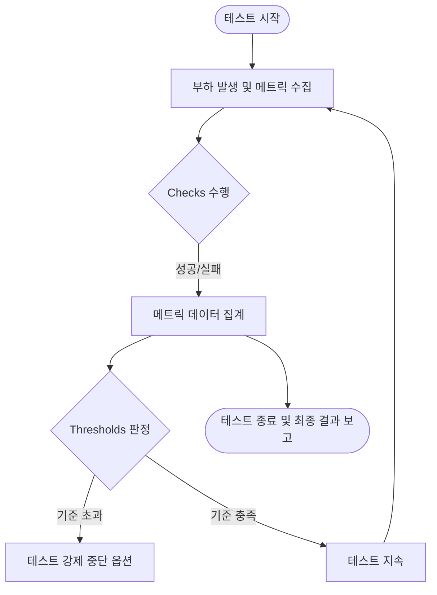

k6는 JavaScript를 기반으로 테스트 시나리오를 코드로 관리하며, 체크(Checks)와 임계치(Thresholds)를 통해 테스트 성공 조건을 정의한다.

## 코드로서의 성능 테스트 (Performance as Code)

성능 테스트 시나리오를 코드로 관리하면 버전 관리와 CI/CD 통합 등 소프트웨어 공학적 이점을 성능 영역까지 확장할 수 있다.

- 시나리오 명세: 사용자 흐름을 명시적인 코드로 작성하여 테스트 의도를 명확하게 표현
- 자동화된 검증: 수동 분석 대신 코드에 정의된 조건에 따라 결과의 성공 여부를 자동 판정
- 환경 일관성: 로컬, 스테이징, 운영 환경에서 동일한 시나리오를 재사용하여 결과의 신뢰도 확보

GUI 기반 도구와 달리 스크립트 기반 방식은 로직의 조건부 실행이나 동적 데이터 생성이 용이하여 복잡한 비즈니스 시나리오 대응이 가능하다.

## 체크 (Checks)

체크는 부하가 발생하는 동안 특정 조건이 충족되는지 확인하는 불린(Boolean) 검증 기능이다.

- 실시간 상태 확인: 테스트 실행 도중 개별 요청의 성공 여부를 지속적으로 모니터링
- 비중단 검증: 검증에 실패하더라도 테스트를 중단하지 않고 통계 데이터만 기록
- 유연한 조건 설정: HTTP 상태 코드, 응답 본문의 특정 값, 헤더 정보 등 다양한 속성 검증 가능

일반적인 단위 테스트의 Assert와 유사한 역할을 수행하지만, 성능 테스트의 특성상 일시적인 실패가 전체 중단으로 이어지지 않도록 설계되어 있다.

```javascript
import {check} from 'k6';
import http from 'k6/http';

export default function () {
  const res = http.get('https://example.com');
  check(res, {
    'is status 200': (r) => r.status === 200,
    'body size is > 0': (r) => r.body.length > 0,
  });
}
```

## 임계치 (Thresholds)

임계치는 테스트 전체의 성공 및 실패 여부를 결정하는 성능 기준으로, 측정된 메트릭이 정의한 범위를 벗어나면 k6는 에러 코드와 함께 종료하게 된다.

### 메트릭 집계 방식

임계치는 단순히 현재 값이 아닌, 테스트 기간 동안 수집된 데이터의 통계적 집계를 기준으로 판정한다.

|    집계 방식     |      설명      |      주요 활용 사례      |
|:------------:|:------------:|:------------------:|
| p(95), p(99) | 상위 백분위 값 기준  | 지연 시간(Latency) 보장  |
|     rate     |   발생 비율 기준   | 에러율(Error Rate) 제한 |
|    count     |  총 발생 횟수 기준  |    최소 요청 처리량 검증    |
|   avg, med   | 평균 또는 중앙값 기준 |   전체적인 시스템 추세 확인   |

### 임계치 설정 예시

```javascript
export const options = {
  thresholds: {
    // 전체 에러율이 1% 미만
    http_req_failed: ['rate<0.01'],
    // 95%의 요청이 500ms 이내 완료
    http_req_duration: ['p(95)<500'],
    // 특정 태그(정적 자원)에 대해 별도의 기준 설정
    'http_req_duration{staticAsset:yes}': ['p(99)<1000'],
  },
};
```

### Cost-based Differentiated SLO (처리 비용 기반 차등 임계치)

엔드포인트마다 본질적인 처리 비용이 다르므로, 일괄 임계치를 적용하는 것보단 부류별로 임계치를 달리 잡아야 SLO가 의미를 가진다.

|      부류      | P95 베이스라인 | P95 한계 부근 |       비고        |
|:------------:|:---------:|:---------:|:---------------:|
|    단순 조회     | ≤ 200 ms  | ≤ 800 ms  |   인덱스 hit 위주    |
|    조인/페이징    | ≤ 400 ms  |  ≤ 1.2 s  |   디스크 I/O 가능    |
| 인증/암호화 (CPU) | ≤ 500 ms  |  ≤ 1.5 s  | BCrypt 등 CPU 점유 |
|   트랜잭션 쓰기    | ≤ 600 ms  |  ≤ 1.5 s  |   락·flush 포함    |

각 부류를 k6 태그로 구분하여 임계치를 분리한다.

```javascript
export const options = {
  thresholds: {
    'http_req_duration{class:read}': ['p(95)<200'],
    'http_req_duration{class:join}': ['p(95)<400'],
    'http_req_duration{class:auth}': ['p(95)<500'],
    'http_req_duration{class:write}': ['p(95)<600'],
    'http_req_failed': ['rate<0.01'],
  },
};
```

## 모듈화 및 시나리오 분리

기능별로 스크립트를 분리하고 필요에 따라 조합하는 구조를 사용하여 유지보수성과 재사용성을 높일 수 있다.

- 기능별 추상화: 로그인, 상품 검색, 결제 등 비즈니스 프로세스를 독립된 함수나 모듈로 정의
- 데이터 중심 설계: 테스트 데이터(CSV, JSON)와 로직을 분리하여 데이터 변경이 코드에 미치는 영향 최소화
- 시나리오 조합: 각 모듈을 임포트하여 실제 사용자 흐름에 맞는 복합 시나리오 구성

### 디렉토리 구조 전략

```text
performance-test/
├── data/             # 테스트용 데이터 세트
├── lib/              # 공통 유틸리티 및 API 클라이언트
│   ├── auth.js       # 인증 및 세션 관리
│   └── api.js        # 엔드포인트 호출 래퍼
├── scenarios/        # 비즈니스 로직 단위
│   ├── checkout.js   # 주문 및 결제 흐름
│   └── search.js     # 검색 및 필터링 흐름
└── main.js           # 테스트 설정 및 진입점
```

## 임계치 판정 및 흐름 제어

임계치는 테스트가 종료된 시점에 최종 판정되거나, 실시간으로 기준을 초과할 경우 테스트를 즉시 중단(Abort)하도록 설정할 수 있다.


