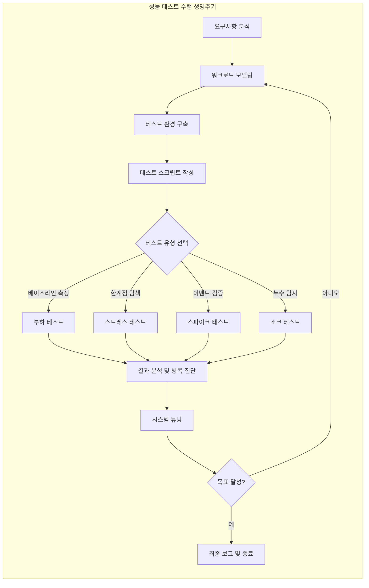

성능 테스트는 비즈니스 목표와 검증하려는 위험 요소에 따라 다양한 유형으로 나뉜다.

- 단순히 시스템의 속도를 측정하는 행위가 아니라, 비즈니스 연속성을 저해하는 잠재적 위험 요소를 수치화하여 관리하는 과정
- 각 테스트 유형은 서로 다른 실패 지점을 탐색하도록 설계 필요

## Core Testing Types (핵심 테스트 유형)

### 1. Load Testing (부하 테스트) - 성능 기준점 확립

시스템이 설계된 부하 범위 내에서 정상적으로 동작하는지 검증하고 성능 베이스라인을 설정한다.

- 목적: 평상시 동시 접속자 수에 따른 자원 사용량과 응답 시간 측정 및 서비스 운영 가능 여부 판단
- 설계 전략: 예상되는 최대 동시 접속자 수(Expected Peak)를 목표로 하며, 부하를 일정 기간(최소 30분 이상) 안정적으로 유지
- 의사결정 가이드: 현재 인프라 규모가 적절한지, 신규 기능 배포 전후로 성능 퇴보가 없는지 확인
- 주요 관찰 지표 및 세부 전략
    - 응답 시간 분포: 평균값보다 P95, P99 등 꼬리 지연(Tail Latency) 안정성 확인
    - 처리량(Throughput): 부하 증가에 따라 TPS가 선형적으로 증가하다가 목표치에서 유지되는지 관찰
    - 자원 사용률: CPU와 메모리가 임계치(보통 70%) 이하에서 안정적으로 유지되는지 점검
- 성공 기준: 정의된 모든 SLA(Service Level Agreement) 충족 및 에러율 0% 수렴

### 2. Stress Testing (스트레스 테스트) - 임계치 및 회복력 검증

시스템이 감당할 수 있는 한계를 넘어서는 부하를 가해 장애 발생 지점과 양상을 확인한다.

- 목적: 서비스 중단점(Break Point) 식별 및 장애 복구 능력(Resilience) 검증
- 설계 전략: 부하를 단계적으로 높이는 램프업(Ramp-up) 시나리오를 적용하여 Knee Point와 Buckle Point 식별
- 의사결정 가이드: 트래픽 폭주 시 시스템의 어느 계층(DB, WAS 등)이 먼저 무너지는지 파악하여 확장 계획 수립
- 기술적 초점 및 주요 지표
    - 파괴적 검증: 한 리소스의 고갈이 시스템 전체의 연쇄 장애(Cascading Failure)로 이어지는지 분석
    - 자동 회복(Self-healing): 부하를 다시 낮췄을 때 별도의 재시작 없이 정상 상태로 스스로 돌아오는지 확인
    - 병목 지점 식별: 데이터베이스 커넥션, 스레드 풀, 네트워크 I/O 등 시스템의 한계 지점 도달 순서 기록
- 핵심 결과: 시스템이 완전히 무너지는 Buckle Point 지점과 그 원인 리소스 특정

### 3. Spike Testing (스파이크 테스트) - 충격 흡수 능력

이벤트 오픈이나 푸시 발송 시 발생하는 급격한 트래픽 유입에 대한 시스템의 탄력성을 테스트한다.

- 목적: 이벤트 시작, 푸시 알림 발송 등 갑작스러운 부하 폭증 시의 안정성 확보
- 설계 전략: 빠른 속도 ㅗ부하를 투입한 후 짧은 시간 유지하고 다시 급격히 제거하는 과정 반복
- 의사결정 가이드: 순간적인 트래픽 폭주 시 서킷 브레이커가 정상 작동하는지, 오토 스케일링이 민첩하게 대응하는지 확인
- 주요 위험 요소 분석 및 지표
    - Thundering Herd: 대규모 요청 동시 유입 시 캐시 미스(Cache Miss)로 인한 DB 과부하 발생 여부 분석
    - Scaling 지연: 인프라 확장 속도가 트래픽 증가 속도를 따라가지 못할 때의 에러 발생 패턴 및 사용자 경험 분석
    - 보호 기작 검증: 요청 제한(Rate Limiting) 전략 및 서킷 브레이커가 설정된 임계치에서 정확히 작동하는지 검증
- 최적화 포인트: 대기열(Queue) 도입, 정적 자원 캐싱, 유입 제어 전략 수립

### 4. Soak Testing (소크 테스트): 장기 안정성 및 자원 누수

평균 부하를 장시간 유지하며 시간이 지남에 따라 누적되는 결함을 찾아낸다.

- 목적: 메모리 누수(Memory Leak), DB 커넥션 고갈 등 장기 운영 시 발생하는 결함 발견
- 설계 전략: 시스템 가동 시간이 길어짐에 따라 발생하는 성능 저하(Performance Degradation) 추세 분석 (최소 8시간~24시간 이상)
- 의사결정 가이드: 장시간 운영 시 시스템 성능이 일정하게 유지되는지, 주기적인 재시작이나 힙 메모리 튜닝이 필요한지 판단
- 중점 점검 항목 및 분석 방법
    - 자원 누수 점검: GC 이후에도 반환되지 않는 JVM 힙 메모리 영역, 파일 디스크립터 누수, DB 커넥션 미반환 확인
    - 데이터 누적 영향: DB 인덱스 크기 증가나 로그 파일 비대화가 쿼리 성능에 미치는 장기적 영향 분석
    - 주기적 작업 간섭: 테스트 도중 실행되는 배치 작업이나 로그 로테이션 등이 전체 성능에 끼치는 영향 분석
- 가용 시간 예측: 자원 사용량의 기울기(Slope)를 측정하여 시스템의 잠재적 실패 시점(Time to Failure) 예측

## Strategic Test Modeling (전략적 테스트 모델링)

단순한 요청 반복이 아닌, 실제 운영 환경과 유사한 정교한 부하 모델을 설계해야 한다.

### 1. Workload Model: Open vs Closed System

시스템의 유입 특성에 따라 부하 발생 방식을 결정한다.

- Closed System: 현재 처리 중인 요청이 완료되어야 다음 요청이 들어오는 모델로, VU 수와 Think Time에 의해 부하 결정 (예: 사내 시스템)
- Open System: 시스템 상태와 관계없이 외부에서 요청이 계속 유입되는 모델로, 지연 발생 시 대기 큐가 급격히 쌓임 (예: 일반 웹 서비스)

### 2. Think Time Distribution

사용자가 페이지를 읽거나 데이터를 입력하는 시간을 정교하게 설정한다.

- 고정된 시간보다는 실제 사람과 유사한 지수 분포나 포아송 분포와 같은 확률 분포를 적용하여 부하의 변동성 확보

### 3. Warm-up Phase

테스트 분석 전 시스템을 충분히 예열하는 단계를 반드시 포함한다.

- JIT(Just-In-Time) 컴파일러 최적화, 커넥션 풀 사전 확보, 캐시 로딩 등을 고려하여 초기 5~10분은 분석 대상에서 제외하거나 별도 관리

## Strategy Matrix for Decision-Making

|  분석 차원  |     부하 테스트     |     스트레스 테스트     |   스파이크 테스트    |      소크 테스트      |
|:-------:|:--------------:|:----------------:|:-------------:|:----------------:|
|  핵심 질문  |  목표 달성 가능한가?   |    어디서 무너지는가?    |  갑작스러운 폭증은?   |   오래 버틸 수 있는가?   |
| 비즈니스 상황 |   신규 기능 배포 전   |    용량 산정 및 확장    |  마케팅 이벤트 준비   |    운영 안정성 보장     |
|  부하 형태  | 일정 유지 (Static) | 점진적 증가 (Ramp-up) | 급격한 증감 (Step) | 장시간 일정 유지 (Flat) |
|  주요 지표  |   TPS, 응답 시간   |    한계 지점, 리소스    |   에러율, 스케일링   |  메모리 누수, GC 추세   |

## Performance Testing Lifecycle

성공적인 성능 테스트 수행을 위한 단계별 의사결정 프로세스는 다음과 같다.

### 필수 체크리스트

- 테스트 환경과 상용 환경의 인프라 스펙 차이가 정량적으로 파악되었는지 확인
- 데이터베이스의 데이터 셋이 운영 수준의 카디널리티를 확보했는지 확인
- 모니터링 도구(APM, 인프라 메트릭)가 모든 계층에 대해 활성화되어 있는지 점검
- 테스트 종료 후 자원을 정리하고 데이터를 초기화하는 프로세스 존재 여부 확인
