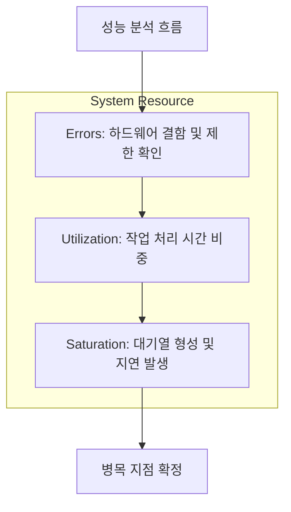

Brendan Gregg이 제안한 USE(Utilization, Saturation, Errors) 방법론은 시스템 자원을 중심으로 문제의 범위를 빠르게 좁히는 표준 분석 프레임워크다.

## 핵심 개념 정의

성능 분석의 시작은 각 지표가 의미하는 바를 정확히 이해하는 것이다.

- Utilization (사용률): 특정 시간 동안 자원이 작업을 수행하는 데 할당된 비율 (예: CPU 사용량 80%)
- Saturation (포화도): 자원이 처리할 수 있는 용량을 초과하여 대기열(Queue)에 쌓인 작업의 양 (예: CPU Run Queue 길이)
- Errors (오류): 자원이 정상적으로 요청을 처리하지 못하고 반환한 실패 건수 (예: 디스크 I/O 에러)

시스템의 응답 지연은 대개 사용률이 100%에 도달한 뒤 포화도가 증가하기 시작할 때 발생하며, 대기열이 생성되는 시점부터 응답 시간은 비선형적으로 급증하며, 이를 성능 임계치(Knee Point)라고 부른다.

## 자원별 체크리스트 및 메트릭

운영체제 수준에서 각 자원의 상태를 확인할 수 있는 주요 명령어와 지표는 다음과 같다.

|  대상 자원   |        사용률 (Utilization)        |           포화도 (Saturation)           |         오류 (Errors)          |
|:--------:|:-------------------------------:|:------------------------------------:|:----------------------------:|
|   CPU    |     `top`, `mpstat` (%util)     |  `uptime` (Load Avg), `vmstat` (r)   | `dmesg`, `/var/log/messages` |
|  Memory  |     `free`, `sar -r` (%mem)     | `vmstat` (si/so), `sar -B` (pgscand) |     `dmesg` (OOM Killer)     |
| Disk I/O |       `iostat -x` (%util)       |    `iostat -x` (avgqu-sz, await)     |     `smartctl`, `dmesg`      |
| Network  | `sar -n DEV` (rxpck/s, txpck/s) |      `sar -n EDEV` (txqueuelen)      | `ifconfig` (errors, dropped) |

### CPU 분석 - 연산과 스케줄링

CPU 분석 시 단순히 사용률만 보는 것이 아니라 사용률이 낮더라도 특정 코어에 부하가 집중되거나, 프로세스 간 컨텍스트 스위칭이 빈번하면 포화도가 높아질 수 있다.

- 사용률 확인: `mpstat -P ALL 1` 명령으로 각 코어별 균형 확인
- 포화도 확인: `vmstat 1`의 `r` 컬럼(실행 대기 프로세스 수)이 논리 코어 수보다 지속적으로 높은지 확인
- 판단 기준: 사용률 90% 이상이면서 포화도가 증가한다면 연산 최적화나 스케일 아웃 검토

### 메모리 분석 - 물리 공간과 가상 메모리

메모리 부족은 운영체제의 페이징(Paging)과 스왑(Swap) 활동을 유발하여 시스템 전체를 마비시킨다.

- 사용률 확인: `free -m` 명령에서 `available` 메모리 추이 분석
- 포화도 확인: `sar -B` 명령의 `pgscand/s`(페이지 스캔 비율)가 높다면 메모리 회수 활동이 발생 중임을 의미
- 판단 기준: 스왑 인/아웃(`vmstat`의 `si/so`)이 발생하기 시작하면 이미 심각한 성능 저하 상태

### 디스크 I/O 분석: 대기 시간의 함정

디스크는 기계적/물리적 한계로 인해 가장 빈번하게 병목이 발생하는 자원이다.

- 사용률 확인: `iostat -xz 1`의 `%util` 지표가 100%에 근접하는지 확인
- 포화도 확인: `avgqu-sz`(평균 큐 크기)와 `await`(평균 대기 시간) 수치 확인
- 판단 기준: 지연 시간(`await`)이 수 밀리초(ms) 이상 지속되면 I/O 중심 작업(로깅, DB 등)의 비동기화 필요

## 분석 절차와 우선순위

성능 이슈 발생 시 다음과 같은 순서로 USE 방법론을 적용할 수 있다.

1. 오류 확인: 가장 먼저 하드웨어 결함이나 시스템 제한(Limit)으로 인한 에러가 있는지 `dmesg` 등으로 확인
2. 포화도 진단: 현재 응답 지연이 발생 중이라면 사용률보다 포화도(대기열)를 먼저 확인하여 병목 자원 식별
3. 사용률 추이 분석: 식별된 병목 자원의 사용률 변화를 시계열로 분석하여 부하의 패턴(지속성, 일시성) 파악
4. 연관 자원 추론: 한 자원의 포화가 다른 자원에 미치는 영향 분석 (예: 메모리 부족 -> 디스크 I/O 포화)

## 시스템 분석 베스트 프랙티스

효과적인 성능 분석을 위해 다음의 원칙을 권장하고 있

- 자동화된 모니터링 대시보드 구축: 사용률뿐만 아니라 포화도(Queue Length, Wait Time)를 반드시 포함
- 자원 간의 계층 구조 이해: 디스크 I/O 포화는 CPU 사용률 중 `iowait` 수치 상승으로 전이됨을 인지
- 주기적인 에러 로그 모니터링: 성능 저하 이전에 시스템 라이브러리나 드라이버 수준의 전조 증상 확인
- 베이스라인 유지: 평상시의 정상적인 USE 지표 범위를 기록해두어 장애 발생 시 비교군으로 활용
