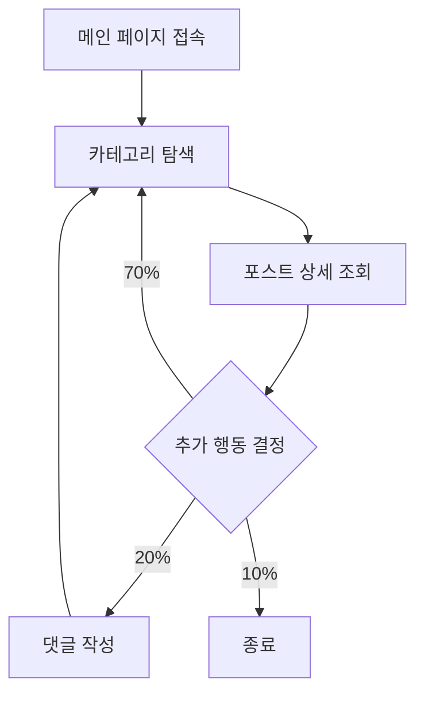

부하 테스트의 유효성은 테스트 시나리오가 실제 사용자의 행동을 얼마나 정교하게 재현하느냐에 따라 결정된다.

## User Journey (사용자 여정 설계)

단순한 API 호출의 반복이 아닌, 비즈니스 가치가 발생하는 핵심 흐름을 중심으로 시나리오를 구성한다.

### 핵심 비즈니스 흐름 식별

시스템에 가장 큰 부하를 주거나 비즈니스적으로 중요한 경로를 우선순위에 둔다.

- 이커머스 사례: 상품 검색 → 상품 상세 조회 → 장바구니 담기 → 주문 및 결제
- 블로그 사례: 메인 페이지 접속 → 카테고리 탐색 → 포스트 상세 읽기 → 댓글 작성

## Scenario Weighting (시나리오 비중 설정)

모든 사용자가 동일한 경로를 따르지 않으므로, 실제 트래픽 로그를 기반으로 시나리오별 비중을 설정한다.

- 기능별 가중치 부여: 전체 트래픽 중 단순 조회가 80%, 생성 및 수정 작업이 20%를 차지한다면 이를 테스트 모델에 반영
- 데이터 기반 설계: APM이나 액세스 로그의 URL 패턴별 빈도수를 분석하여 정량적인 확률 모델 구축

|  시나리오  | 비중  |          핵심 호출 API          |
|:------:|:---:|:---------------------------:|
| 단순 열람  | 70% | GET /posts, GET /categories |
| 활발한 탐색 | 20% |   GET /search, GET /tags    |
| 데이터 생성 | 10% | POST /comments, POST /likes |

## Think Time Distribution (Think Time 분산 처리)

기계적인 요청 유입을 방지하고 실제 사용자의 사고 및 조작 시간을 반영한다.

- 정적 대기 시간의 한계: 모든 요청 사이에 동일한 간격을 두면 시스템 자원 사용이 비정상적으로 일정해져 동시성 병목 발견이 어려움
- 확률 분포 적용: 실제 사용자는 각자 다른 속도로 페이지를 읽으므로, 지수 분포나 정규 분포를 적용하여 요청 간격을 무작위화
- 무작위성 확보: k6의 `sleep()` 함수와 무작위 난수 생성기를 결합하여 범위 내 무작위 대기 시간 적용

## Person-like Load Generation (사람처럼 행동하는 부하 생성)

성공적인 시나리오 설계는 테스트 도구가 실제 사람처럼 행동하게 만드는 과정이다.

- 세션 관리: 쿠키나 토큰을 유지하여 실제 로그인 세션이 유지되는 상태에서의 부하 재현
- 데이터 파라미터화: 동일한 자원이 아닌 수천 개의 다양한 식별자를 무작위로 호출하여 캐시 히트율을 실제와 유사하게 조정
- 가상 사용자 독립성: 각 가상 사용자가 독립적인 상태를 가지고 서로 다른 가중치에 따라 행동하도록 설계

## Conclusion: Business Impact over Request Count

시나리오 설계의 목표는 단순한 요청 횟수 달성이 아니라 비즈니스 위험 요소의 조기 발견에 있다.

- 실패 케이스 포함: 정상적인 흐름뿐만 아니라 잘못된 요청이나 권한 없는 접근 시나리오를 일부 포함하여 예외 처리 성능 확인
- 동적 부하 조정: 테스트 도중 특정 비즈니스 이벤트 상황을 가정하여 시나리오 비중을 동적으로 변경하는 고도화 고려
- 결과 해석의 연계: 설계된 시나리오별 응답 시간을 분석하여 어떤 비즈니스 단계에서 병목이 발생하는지 구체적으로 특정
