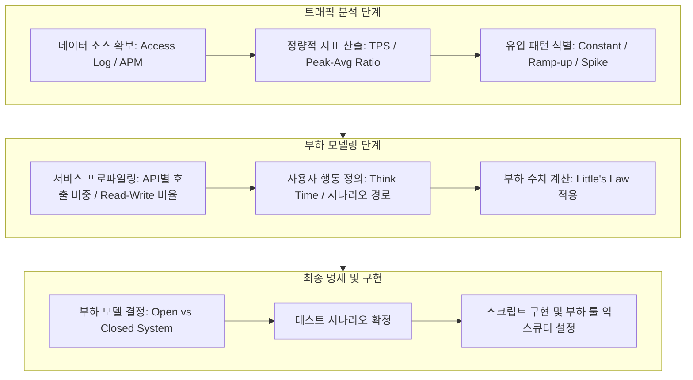

성능 테스트는 단순히 많은 사용자를 투입하는 것이 아니라, 실제 유입 패턴과 시스템의 응답 특성을 반영한 정교한 설계가 필요하다.

## Open vs Closed System (부하 모델의 분류)

부하 모델은 새로운 요청이 유입되는 방식에 따라 크게 두 가지로 분류된다.

|   구분    |    Closed System    |       Open System       |
|:-------:|:-------------------:|:-----------------------:|
|   정의    | 고정된 수의 사용자가 순환하며 요청 | 시스템 상태와 무관하게 고정된 비율로 유입 |
|  제어 요소  |    가상 사용자 수 (VU)    |  초당 유입률 (Arrival Rate)  |
| 응답 지연 시 | 시스템 전체 처리량(TPS) 감소  |   대기 큐 적체 및 응답 시간 급증    |
| 적합한 사례  |  사내 ERP/어드민, 배치 작업  |    대중적 웹 서비스, 오픈 API    |

- Closed System: 사용자가 응답을 받은 후에만 다음 행동을 수행하므로 시스템이 느려지면 부하량도 자동으로 조절
- Open System: 응답이 늦어져도 새로운 사용자는 계속 유입되므로 임계점을 넘는 순간 시스템이 급격히 붕괴

## Workload Modeling Procedure (부하 모델링 절차)

현실적인 부하를 설계하기 위해서는 로그 분석부터 시나리오 확정까지 단계적인 접근이 필요하다.

## 1. Analysis (트래픽 분석 단계)

실제 운영 데이터를 기반으로 성능 목표의 기초가 되는 정량적 지표를 추출한다.

### Throughput Calculation (처리량 산정)

과거의 피크 타임 데이터를 분석하여 목표 처리량을 결정한다.

- 평균 TPS: 전체 요청 수 / 측정 시간(초). 평상시 부하 수준 파악
- 피크 TPS: 최대 유입 시간대의 요청 수 / 측정 시간(초). 가용성 한계 측정의 기준
- Peak-to-Average Ratio: 평균 대비 피크 트래픽의 배수 산출 (인프라 확장성 설계의 근거)

### Traffic Pattern Identification (유입 패턴 식별)

트래픽이 유입되는 시간적 특성에 따라 테스트 형태를 정의한다.

- Constant: 일정하게 유지되는 부하 (시스템 안정성 확인)
- Ramp-up: 선형적으로 증가하는 부하 (시스템 확장성 및 병목 지점 파악)
- Spike: 짧은 순간 급격히 몰리는 부하 (충격 흡수 및 회복력 검증)

## 2. Modeling (부하 모델링 단계)

추출된 지표를 바탕으로 시스템 내부에서 발생하는 상세 동작을 설계한다.

### 서비스 프로파일링 및 시나리오 정의

전체 트래픽 중 각 기능이 차지하는 비중을 설정한다.

- 호출 비중 산정: 메인 페이지 50%, 검색 30%, 주문 20% 등 실제 로그 기반의 API 호출 비율 적용
- Read-Write 비율: 데이터베이스 및 캐시 부하에 직접적인 영향을 미치는 조회와 생성 작업의 비율 설정
- 사용자 시나리오 경로: 로그인부터 구매 완료까지 이어지는 실제 사용자 비즈니스 흐름 설계

### 부하 수치 계산 (Little's Law)

시스템 내 동시 접속자 수와 처리량, 응답 시간 사이의 관계를 산출한다.

`L (Concurrency) = λ (Throughput) * W (Latency)`

- 목표 TPS 유지: 응답 시간(Latency)이나 생각 시간(Think Time)이 길어질수록 더 많은 동시 접속자(VU) 투입 필요
- 현실적인 Think Time 적용: 사용자 생각 시간을 무작위화(Exponential Distribution)하여 트래픽 변동성 확보

## 3. Specification (최종 명세 및 구현)

설계된 모델을 테스트 도구의 설정으로 변환하고 실행 준비를 마친다.

### 부하 모델 결정 및 익스큐터 설정

Open vs Closed 특성에 맞는 최적의 테스트 도구 옵션을 선택한다.

- Open System 구현: k6의 `constant-arrival-rate`와 같이 응답 시간과 독립적인 요청 유입 설정
- Closed System 구현: 가상 사용자 수(VU)를 고정하고 루프를 반복하는 방식 채택
- 테스트 시나리오 확정: 워밍업 기간, 램프업 구간, 정상 상태 유지 기간, 램프다운 구간을 시나리오에 명시

### 최종 명세서 구성 항목

- 목표 성능 지표: TPS, 응답 시간(P95, P99), 허용 에러율
- 테스트 데이터: 데이터베이스 카디널리티를 고려한 테스트 계정 및 상품 데이터 셋
- 모니터링 범위: 인프라 메트릭(CPU, MEM, Disk I/O) 및 APM 트레이싱 범위

## Conclusion: Reality over Theory

부하 모델링은 수학적 정확성보다 운영 환경의 현실을 얼마나 투영하느냐가 중요하다.

- 임계치 설계: 목표 TPS는 보수적으로 잡되, 피크 상황의 꼬리 지연(Tail Latency) 시나리오를 반드시 포함
- 부하 균형: 사용자 시나리오 비중을 실제 데이터와 일치시켜 백엔드 자원의 부하 균형을 정밀하게 재현
- 지속적 개선: 테스트 결과와 운영 지표를 비교하여 부하 모델을 주기적으로 고도화하는 과정 필수
