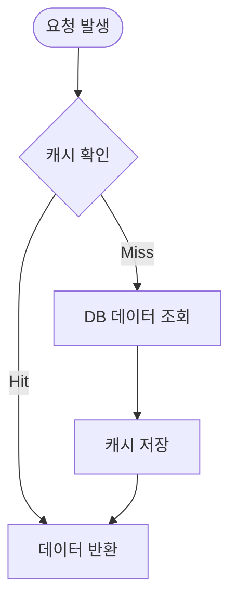
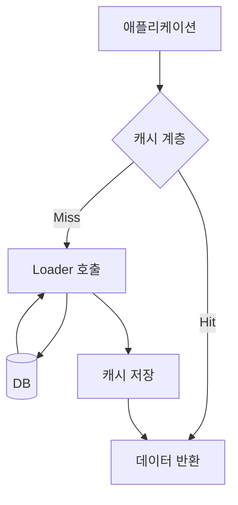
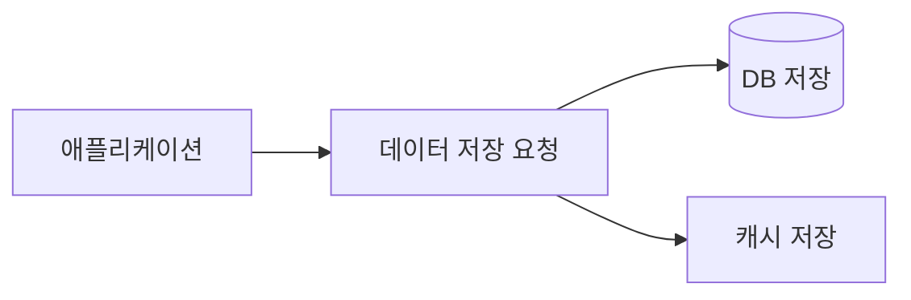
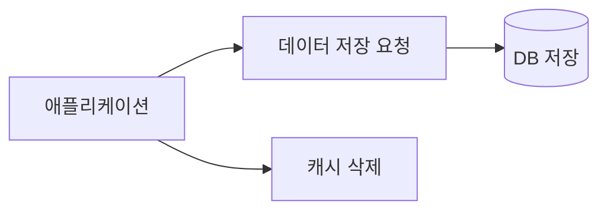
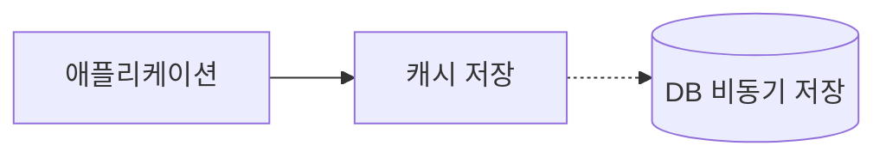
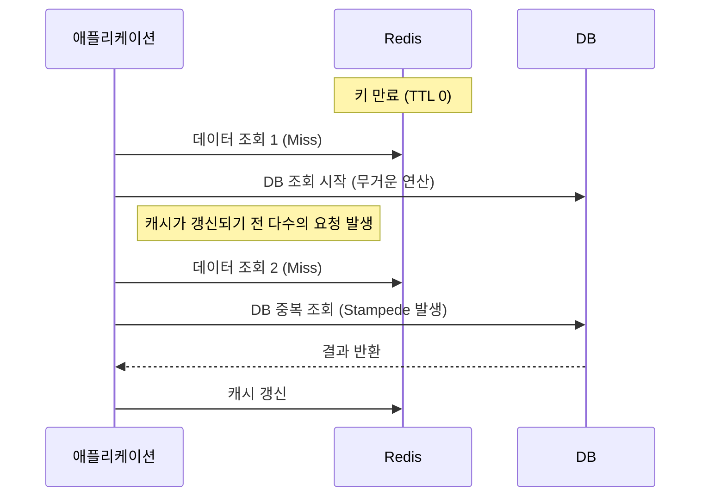

캐시(Cache)는 데이터나 값을 미리 복사해두는 임시 저장소로, 데이터에 대한 접근을 더 빠르게 만드는 역할을 한다.

- 원본 데이터베이스(DB)에서 데이터를 가져오는 과정이 복잡하거나 계산이 필요한 정보
- 데이터가 자주 변경되지 않고, 반복적으로 조회되는 정보

## 캐시로서의 레디스

레디스는 인메모리(In-Memory) 데이터 저장소로서 캐시를 구현하는 데 다음과 같은 이점을 제공한다.

- 빠른 속도: 모든 데이터가 메모리에 있어 평균 1ms 미만의 빠른 읽기/쓰기 성능 보장
- 다양한 자료구조: 단순 Key-Value를 넘어 List, Hash, Sorted Set 등을 지원해 복잡한 캐싱 요구사항을 구현
- 높은 안정성: 복제(Replication)와 센티널(Sentinel) 같은 고가용성 솔루션을 자체 제공해 캐시 장애 시 서비스 연속성 확보
- 유연한 확장성: 클러스터를 통해 데이터를 여러 노드에 분산해 저장 공간과 처리량을 수평 확장(Scale-out)

## 읽기 전략

### Look-Aside (Cache-Aside)

가장 일반적으로 사용되는 캐싱 패턴으로, 애플리케이션이 데이터 흐름을 직접 제어한다.

1. 애플리케이션에서 먼저 레디스 캐시에서 데이터를 조회
2. 데이터가 캐시에 존재하면(Cache Hit) -> 즉시 해당 데이터를 반환
3. 데이터가 캐시에 없으면(Cache Miss) -> 원본 DB에서 데이터를 조회
4. DB에서 가져온 데이터를 캐시에 저장한 후, 애플리케이션에 반환
5. 이후 동일한 데이터 요청은 캐시에서 처리



- 장점
    - 실제로 조회된 데이터만 캐시에 적재되므로 메모리를 선별적으로 사용
    - 레디스 장애 시에도 DB로 직접 조회 경로가 유지되어 서비스 연속성 확보
- 단점
    - 최초 조회 시 항상 Cache Miss가 발생해 DB 조회가 필수
    - 대량 요청이 동시에 Cache Miss를 일으키면 DB에 부하가 집중(캐시 스탬피드)
    - 캐시에만 갱신이 누락되면 원본이 바뀌어도 오래된 값이 남는 stale cache 위험 → TTL로 최종 일관성을 확보하거나, 쓰기 전략(Invalidation 등)과 조합해 해결

최초 Cache Miss 비용을 줄이기 위해 서비스 시작 시점에 자주 조회될 데이터를 미리 적재하는 작업을 캐시 워밍(cache warming)이라고 한다.

### Read-Through

캐시 계층이 DB 로딩 책임까지 맡는 패턴으로, 애플리케이션은 캐시만 바라보고 Cache Miss 시 DB 접근은 캐시 계층이 대신 수행한다.

1. 애플리케이션이 캐시에 데이터를 요청
2. Cache Hit → 캐시 계층이 즉시 반환
3. Cache Miss → 캐시 계층이 등록된 loader를 통해 DB에서 조회
4. 조회 결과를 캐시에 저장하고 애플리케이션에 반환



- 장점
    - 애플리케이션 코드에서 Cache Miss 처리 로직이 사라져 캐싱 관심사가 캐시 계층에 집중
    - 로딩·갱신·무효화 정책을 한 곳에서 일괄 관리 가능해 팀 간 일관성 확보
- 단점
    - 캐시 계층이 DB 커넥션과 loader를 직접 관리하므로, 캐시 장애가 곧 읽기 장애로 이어짐(Look-Aside의 "DB 우회" 안전망이 사라짐)
    - 최초 조회 시 Cache Miss 지연은 동일하게 발생
- 레디스에서의 구현
    - 레디스 자체는 DB loader 개념을 제공하지 않으므로 네이티브 지원이 없음
    - Spring Cache(`@Cacheable`) + Redis 조합, Caffeine 앞단, AWS DAX, Ehcache 같은 라이브러리·프록시 계층을 통해 구현
- Look-Aside와의 차이: 흐름 제어 주체가 애플리케이션(Look-Aside)인지 캐시 계층(Read-Through)인지

## 쓰기 전략

쓰기 전략은 캐시 불일치와 쓰기 성능·데이터 유실 위험 사이에서 어느 쪽에 비용을 지불할지를 결정하는 선택지다.

### Write-Through

DB와 캐시를 동일 트랜잭션처럼 함께 갱신하는 방식.

- 쓰기 순서: 애플리케이션이 DB에 저장한 뒤 캐시도 같은 값으로 업데이트
- Why: 읽기 쪽에서 항상 최신 값을 보장하고 싶을 때 선택(주문 상태·잔액 등 불일치를 즉시 드러내야 하는 데이터)
- 장점: Cache Miss 이후에도 첫 읽기가 바로 캐시에서 처리되어 Hit Rate 안정
- 단점
    - 매 쓰기마다 두 저장소에 접근하므로 쓰기 지연이 증가
    - 다시 읽힐 가능성이 낮은 데이터까지 적재되어 메모리 낭비
    - 두 저장소에 대한 쓰기를 원자적으로 묶을 수 없으므로, 한쪽만 성공하는 부분 실패 시 보상 처리가 필요



### Write-Around + Cache Invalidation

쓰기는 DB에만 수행하고, 해당 키의 캐시 엔트리는 삭제(Invalidation)하는 방식.

- 쓰기 순서: DB 업데이트 → 캐시 삭제(반대 순서로 하면, 삭제 직후 다른 요청이 stale 값을 다시 채워 넣을 수 있음)
- Why: Look-Aside와 자연스럽게 결합되는 가장 일반적인 쓰기 패턴. 캐시를 "갱신"하는 대신 "지운 뒤 다음 읽기에서 다시 채움"으로써 불일치 창을 최소화
- 장점
    - 캐시 업데이트 로직이 없어 구현이 단순하고, 쓴 값이 곧 읽히지 않는 데이터에서 메모리를 낭비하지 않음
    - 삭제는 값 계산이 없어 쓰기 지연 오버헤드가 작음
- 단점
    - 변경 직후 첫 읽기는 반드시 Cache Miss
    - 삭제와 동시성 읽기가 겹치면 여전히 stale 값을 재적재하는 레이스가 가능 → TTL 축소, 변경 후 짧은 지연 뒤 2차 삭제 같은 완화책 병행



### Write-Back (Write-Behind)

캐시에만 먼저 쓰고, 주기적 또는 조건부로 DB에 비동기 일괄 저장하는 방식.

- 쓰기 순서: 애플리케이션 → 캐시 → (버퍼에 쌓은 뒤) → DB로 비동기 flush
- Why: 쓰기 부하가 매우 높고 일시적 데이터 유실을 허용할 수 있는 경우(조회수·좋아요 카운터, 로그 버퍼)
- 장점: 쓰기를 메모리 수준 지연으로 처리해 처리량 극대화, 여러 변경을 합쳐 DB 쓰기 횟수 감소
- 단점
    - flush 전에 레디스가 다운되면 버퍼 데이터 유실 → AOF·복제·영속성 설정으로 완화 필수
    - DB와 캐시의 일관성이 시차만큼 벌어지므로, 타 서비스가 DB를 직접 읽으면 오래된 값을 관측
- 레디스는 DB로 직접 flush하는 기능이 없으므로, 애플리케이션이 스케줄러·큐·배치 잡으로 직접 구현 필요



### 전략 선택 가이드

|      선택 기준       |   Write-Through    | Write-Around + Invalidation |  Write-Back  |
|:----------------:|:------------------:|:---------------------------:|:------------:|
|    읽기 직후 일관성     |         강함         |       중간(짧은 불일치 창 존재)       |  약함(시차 존재)   |
|      쓰기 지연       |    높음(2곳 동기 기록)    |           낮음(삭제만)           |  매우 낮음(비동기)  |
|  장애 시 데이터 유실 위험  |         낮음         |             낮음              | 높음(버퍼 유실 가능) |
| 다시 읽힐 확률이 낮은 데이터 |    비효율(메모리 낭비)     |             적합              |      적합      |
|      대표 사용처      | 잔액·주문 상태 등 금융성 데이터 |      일반 조회 캐시(프로필·게시글)      |  카운터·로그·집계   |

## 캐시에서의 데이터 흐름

캐시는 메모리 용량이 한정적이므로, 불필요한 데이터를 삭제하고 중요한 데이터를 유지하는 정책이 필수적이다.

### 만료 시간(TTL) 설정

레디스에서는 키에 만료 시간(Time To Live, TTL)을 설정하여 지정된 시간이 지나면 데이터가 자동으로 삭제되도록 할 수 있다.

- `EXPIRE key seconds`: 키의 만료 시간을 초 단위 설정
- `SET key value EX seconds`: 키를 저장함과 동시에 만료 시간 설정
- `TTL key`: 키의 남은 만료 시간을 조회(영구 키는 -1, 존재하지 않으면 -2)

한 번 설정 된 만료 시간은 키의 이름을 바꾸거나 데이터를 조작하더라도 만료 시간은 변경되지 않지만, 새로운 값으로 키를 덮어 쓰면 만료 시간이 초기화된다.

```text
EXPIRE key 100
INCR key
TTL key
# 100, 그대로 유지
RENAME key newkey
TTL newkey
# 100, 그대로 유지
SET key 200 EX 100
SET key 300
TTL key
# -1, 만료 시간 초기화
```

### 만료 시 삭제 정책

레디스에서 키가 만료됐더라도 바로 메모리에서 삭제되는 것이 아니라, `passive` 방식과 `active` 방식 두 가지 방식으로 삭제된다.

- passive: 클라이언트가 키에 접근하고자 할 때 만료됐을 경우 메모리에서 수동적으로 삭제
    - 사용자가 다시 접근하지 않는 키가 존재할 수 있어 메모리를 낭비할 수 있음
- active: 일정 주기마다 TTL이 존재하는 키 중 일정 갯수만큼 랜덤하게 뽑아낸 뒤, 만료된 키를 삭제(1초에 10번 씩 / 20개씩 랜덤으로)

### 메모리 한계 도달 시 삭제 정책

설정한 최대 메모리(`maxmemory`)에 도달했을 때, 어떤 키를 삭제할지 결정하는 정책(`maxmemory-policy`)이다.

- Noeviction(기본값): 메모리가 가득 차면 쓰기 명령에 에러를 반환하고 삭제하지 않음
    - 로직에 따라 장애 상황으로 이어질 수 있어 캐시 용도로는 권장되지 않음
    - 데이터 관리 책임을 캐시가 아닌 애플리케이션이 전적으로 갖는 경우에만 고려
- LRU eviction: 가장 오랫동안 사용되지 않은 키를 삭제
    - volatile-lru / allkeys-lru 제공(공식 문서는 allkeys-lru 권장)
    - 레디스는 전체 키에 대한 정확한 LRU 대신 샘플링 기반 근사 LRU(approximated LRU)를 사용해 오버헤드를 줄임(`maxmemory-samples`로 표본 크기 조절)
- LFU eviction: 가장 적게 사용된 키를 삭제
    - volatile-lfu / allkeys-lfu 제공
    - 접근 빈도를 기록하므로 "한 번 몰려 조회되고 끝나는 키"가 캐시를 밀어내는 현상을 완화 → 접근 패턴이 편중된 워크로드에 유리
- Random eviction: 랜덤하게 키를 삭제(일반적으로 권장하지 않음)
    - 삭제 대상 선정 비용이 거의 없어 부하는 가장 낮음
- volatile-ttl: 만료 시간이 설정된 키 중 만료가 가장 임박한 키를 삭제

선택 기준은 접근 패턴이다. 시간 지역성이 강하면 LRU, 인기 편중이 강하면 LFU, 모든 키에 TTL이 있고 수명이 선택 기준이면 volatile-ttl을 고려한다.

## 캐시 스탬피드

캐시 스탬피드는 특정 키가 만료되는 순간, 수많은 요청이 동시에 해당 키를 조회하여 Cache Miss를 일으키고, 그 요청들이 모두 DB로 몰려들어 DB에 과부하를 주는 현상이다.

1. 애플리케이션에서 특정 데이터를 조회
2. 캐시에 데이터가 없어 데이터베이스에서 데이터를 조회
3. 데이터베이스에서 데이터를 조회하여 캐시에 저장하는 동안 다른 요청이 발생
4. 아직 캐시에 데이터가 저장되지 않은 상태에서 다른 요청에 의해 데이터베이스에서 다시 조회
5. 한꺼번에 많은 요청이 왔다면 데이터베이스에 많은 쿼리가 발생하여 부하가 걸릴 수 있음



### 캐시 스탬피드 방지 방법

가장 단순한 방법은 TTL을 충분히 길게 두거나, 키마다 TTL에 랜덤 지터(jitter)를 더해 동시 만료를 회피하는 것이다. 더 적극적인 방식은 DB로 몰리는 중복 요청 자체를 제거하는 쪽으로 설계한다.

1. 선 계산(재갱신, Refresh Ahead): 만료 전 백그라운드 잡이나 랜덤 확률로 캐시를 미리 다시 채워 만료 경계에서 Miss가 발생하지 않게 함
2. PER(Probabilistic Early Recomputation) 알고리즘: 만료 시점이 가까워질수록 갱신 확률을 점증시키는 방식
    - 각 요청이 `-log(random()) * β * recompute_time`을 현재 시각에 더해 만료 시점을 넘는지 판단
    - 갱신 비용이 큰 키일수록 더 일찍, 랜덤하게 한 요청만 갱신을 시작하게 되어 동시 재계산 폭증을 피함
3. 분산 락(Mutex Key): Cache Miss가 난 요청 중 하나만 `SET key NX EX` 같은 명령으로 락을 획득해 DB 재계산을 수행하고, 나머지는 짧게 대기 후 캐시를 다시 조회
    - DB로 가는 요청이 항상 1개로 고정되어 스탬피드를 구조적으로 차단
    - 락 획득에 실패한 요청은 stale 값을 일시적으로 반환하거나 재시도
4. Request Coalescing(요청 합치기): 애플리케이션 내에서 동일 키에 대한 동시 조회를 하나의 DB 호출로 묶어 결과를 공유(Go의 singleflight 등)
    - 단일 프로세스 내 중복 제거에 유효하며, 다중 인스턴스에서는 분산 락과 병행

###### 참고자료

- [개발자를 위한 레디스](https://kobic.net/book/bookInfo/view.do?isbn=9791161757926)
