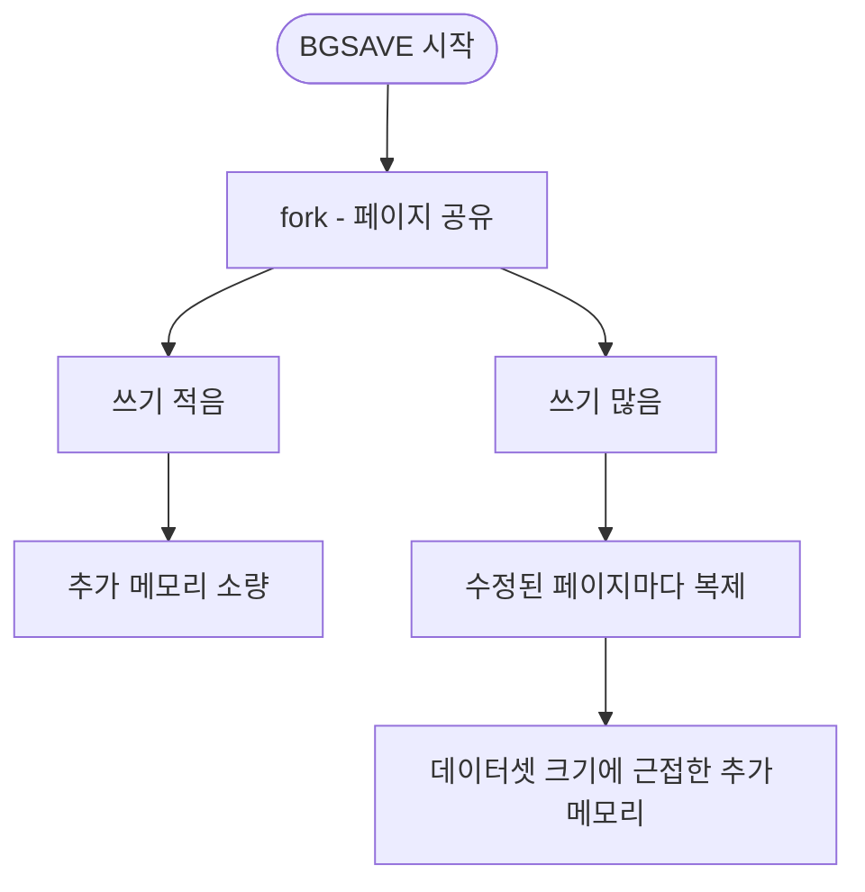
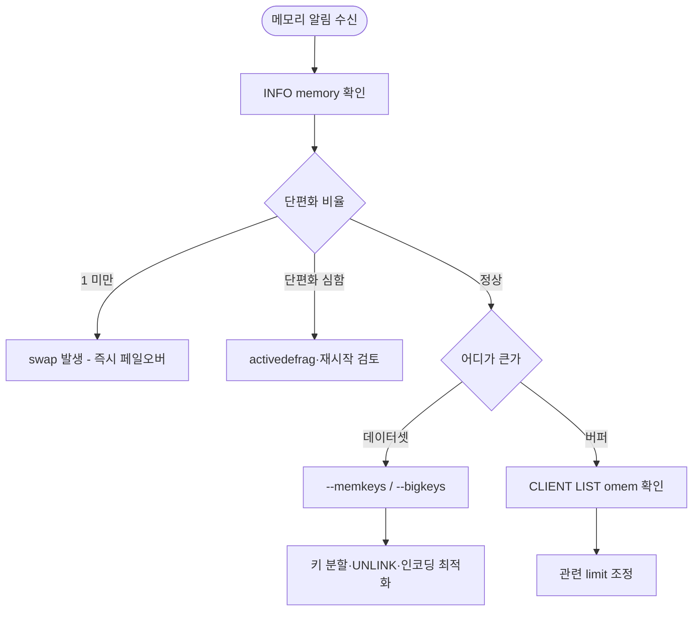

레디스는 모든 데이터를 메모리에 두는 인메모리 저장소이므로, 메모리는 곧 저장 용량인 동시에 장애 취약점이 된다.

- 메모리 한계 도달 시 쓰기 명령이 실패하거나 키가 비의도적으로 삭제
- 단일 키가 비대해지거나 한 키에 트래픽이 집중되면 싱글 스레드 이벤트 루프가 통째로 블로킹
- 영속성 작업·복제 지연이 일시적으로 메모리 사용량을 데이터셋 크기에 가깝게 끌어올림

## 메모리 사용량의 구성

`INFO memory` 출력의 핵심 지표를 이해하면 어떤 메모리가 어디에 쓰이는지 파악할 수 있다.

|            지표             |                        의미                         |
|:-------------------------:|:-------------------------------------------------:|
|       `used_memory`       | 레디스가 자료구조·키·메타데이터·버퍼 등에 사용한 논리적 메모리(allocator 기준) |
|     `used_memory_rss`     |  OS가 레디스 프로세스에 실제 할당한 물리 메모리(Resident Set Size)   |
|    `used_memory_peak`     |            구동 이후 도달한 `used_memory` 최댓값            |
| `mem_fragmentation_ratio` |          `used_memory_rss / used_memory`          |
|        `maxmemory`        |                  운영자가 설정한 메모리 상한                  |

- `used_memory_rss`가 `used_memory`보다 크게 차이나면 외부 단편화 또는 allocator 내부 단편화 의미
- `used_memory_peak`가 현재 `used_memory`보다 큰 상태는 한 번 부풀었다가 줄어든 흔적으로, 단편화 가능성 존재

## BigKey

값의 크기 또는 컬렉션 원소 수가 비정상적으로 큰 키를 BigKey라 하며, 절대적 기준은 없으나 보통 String 10KB 이상, 컬렉션 5000원소 이상, 단일 키 메모리 1MB 이상 수준이다.

### 발생하는 문제

- 싱글 스레드 블로킹: `DEL`로 거대한 컬렉션을 삭제하거나 `HGETALL`/`SMEMBERS`로 통째로 읽으면 메인 스레드가 수십~수백 ms 멈춤
- 네트워크 대역폭 점유: 단일 응답이 수 MB를 넘으면 RTT가 비대해지고 다른 클라이언트 응답까지 지연
- 클러스터 슬롯 재배치 부하: 슬롯 마이그레이션 단위가 키이므로, BigKey 한 개가 재배치 시 큰 페이로드를 한 번에 옮김
- 메모리 단편화 가속: 큰 객체의 잦은 할당·해제는 외부 단편화의 주된 원인

### 대응

- 키 분할
    - 거대한 Hash를 `user:1001:profile:basic`, `user:1001:profile:meta`처럼 의미 단위로 분할
    - 모듈러 샤딩(`user:1001:items:{0..N}`)으로 분산
- 부분 조회 명령 사용: `HGETALL` 대신 `HSCAN`·`HMGET`, `SMEMBERS` 대신 `SSCAN`을 사용하여 응답을 페이지 단위로 끊음
- `UNLINK`로 비동기 삭제: 큰 키는 `DEL` 대신 `UNLINK`로 메인 스레드 블로킹 회피
- 주기적 탐지: `--bigkeys`/`--memkeys`를 운영 자동화 잡에 포함해 임계 초과 키 알림

## HotKey

특정 키 한두 개에 트래픽이 비정상적으로 몰리는 상황을 HotKey라 한다.

### 발생하는 문제

- 단일 샤드 CPU 포화: 클러스터 환경에서 HotKey가 속한 샤드만 CPU 100%, 다른 샤드는 한가로운 비대칭 부하
- 수평 확장 효과 무력화: 노드를 늘려도 키가 한 슬롯에 묶여 있어 처리량이 늘지 않음
- 만료 시 스탬피드: HotKey가 만료되는 순간 다수 요청이 동시에 DB로 폴백되면서 장애 발생 가능

### 대응

- 로컬 캐시 도입: 애플리케이션 프로세스 내 Caffeine 등으로 짧게 캐싱하여 레디스 호출 자체를 감소
- 키 샤딩: HotKey를 `key:0`~`key:N`으로 복제해 클라이언트가 해시 또는 라운드 로빈으로 분산 조회
- 읽기 부하 분산: Replica로 읽기 라우팅하여 Master CPU 보호(replica lag 허용 가능한 데이터에 한함)
- 사전 갱신·분산 락: 캐시 스탬피드 방지 패턴과 동일한 방식으로 만료 경계의 폭주 차단

## 메모리 단편화

`mem_fragmentation_ratio` 값으로 단편화 상태를 진단한다.

|     값     |                      의미                       |
|:---------:|:---------------------------------------------:|
|   1 미만    | rss가 used_memory보다 작음 → 일부 메모리가 swap으로 밀려난 상태 |
| 1.0 ~ 1.5 |                     정상 범위                     |
|  1.5 이상   |     외부 단편화 심각 → 같은 데이터에 1.5배 이상 물리 메모리 점유     |

swap 발생은 메모리 부족보다 더 위험한 신호로, 디스크 I/O가 명령 처리 경로에 끼어들어 지연 시간이 수백 ms~초 단위로 튄다.

### 대응

- `activedefrag yes` 활성화: jemalloc 기반 온라인 단편화 정리 기능으로, 일정량의 CPU를 사용하며 점진적으로 단편화 해소
- `MEMORY PURGE`: jemalloc에 미사용 페이지 반납을 즉시 요청(효과 제한적, 일회성)
- 인스턴스 재시작: 가장 확실한 해소책이지만 페일오버 절차 필요
- 객체 크기 균일화: 가능한 범위에서 키·값 크기를 비슷한 클래스로 맞추어 jemalloc의 size class 효율 향상

## 비동기 메모리 회수 (Lazy Free)

레디스 4.0부터 도입된 lazyfree 메커니즘은 메모리 해제 작업을 메인 스레드에서 분리해 백그라운드 스레드로 옮긴다.

|             설정             |                  역할                   | 기본값 |
|:--------------------------:|:-------------------------------------:|:---:|
|  `lazyfree-lazy-eviction`  |    `maxmemory` 도달로 키가 축출될 때 비동기 해제    | no  |
|   `lazyfree-lazy-expire`   |        TTL 만료로 키가 삭제될 때 비동기 해제        | no  |
| `lazyfree-lazy-server-del` | `RENAME` 등 서버 내부 명령이 키를 덮어쓸 때 비동기 해제  | no  |
|  `lazyfree-lazy-user-del`  |    사용자의 `DEL`을 자동으로 `UNLINK`처럼 처리     | no  |
|    `replica-lazy-flush`    | 전체 재동기화 시 기존 데이터셋을 비동기 flush(replica) | no  |

- 기본값이 모두 `no`이므로 운영 인스턴스에서는 명시적으로 활성화해야 BigKey가 만료·축출될 때의 메인 스레드 블로킹을 피할 수 있음
- 특히 `lazyfree-lazy-eviction`·`lazyfree-lazy-expire`는 클라이언트가 통제할 수 없는 자동 트리거 경로이므로 우선적으로 켤 후보
- `lazyfree-lazy-user-del yes`로 두면 애플리케이션 코드를 바꾸지 않고도 `DEL`이 자동으로 `UNLINK`처럼 비동기 처리
- 비동기 해제는 메인 스레드의 부담을 덜지만 `used_memory_rss` 회수까지 짧은 지연이 있으므로, 모니터링 알림 임계값을 약간 보수적으로 설정

## 출력 버퍼와 메모리

클라이언트별·복제별 출력 버퍼는 `used_memory`에 포함되지만, 데이터셋과 무관하게 갑자기 부풀 수 있다.

### `client-output-buffer-limit`

`client-output-buffer-limit <class> <hard> <soft> <soft seconds>` 형식으로 클래스별 상한을 설정한다.

|   class   |           대상           |         기본 권장값         |
|:---------:|:----------------------:|:----------------------:|
| `normal`  |        일반 클라이언트        | `0 0 0`(무제한, 클라이언트 책임) |
| `replica` | Master가 복제 데이터를 보내는 버퍼 |    `256mb 64mb 60`     |
| `pubsub`  |   Pub/Sub 구독자 전송 버퍼    |     `32mb 8mb 60`      |

- 느린 컨슈머가 pubsub 채널을 따라가지 못하면 해당 클라이언트 버퍼가 한도까지 쌓인 뒤 강제 종료
- replica 지연이 길어지면 Master의 replica 버퍼가 부풀어 Master 자체가 OOM 위험에 도달
- `CLIENT LIST` 출력의 `omem` 필드로 클라이언트별 출력 버퍼 점유량을 즉시 확인 가능

### 기타 메모리 영향 항목

- `client-query-buffer-limit`: 클라이언트 입력 버퍼 한도(기본 1GB) → 거대한 파이프라인이나 큰 인자(수십 MB `SET` 등)가 들어오면 단일 클라이언트가 1GB까지 점유 가능
- `repl-backlog-size`: 복제 단절 후 부분 재동기화에 쓰이는 환형 버퍼 → 너무 작으면 전체 동기화(BGSAVE + 전송) 폴백으로 Master에 큰 충격, 너무 크면 Master 메모리 상시 점유

## 영속성 작업과 메모리

RDB 스냅샷(`BGSAVE`)과 AOF 재작성(`BGREWRITEAOF`)은 fork() + Copy-On-Write로 동작한다.

- fork 직후 자식 프로세스는 부모와 같은 페이지를 공유하므로 추가 메모리는 거의 사용하지 않음
- 부모가 키를 수정하면 해당 페이지가 자식용으로 복제되어 메모리 사용량 증가
- 쓰기 트래픽이 높을수록 단시간에 데이터셋 크기에 근접한 추가 메모리를 소모
- 최악의 경우 메모리 사용량이 2배까지 튈 수 있으므로, `maxmemory`는 물리 메모리의 절반 수준으로 설정하는 것이 안전

## 자료구조 인코딩 최적화

레디스는 작은 컬렉션을 콤팩트한 인코딩으로 저장하여 키당 오버헤드를 줄인다.

|    자료구조    |              인코딩(7.x)               |                        전환 임계값 설정                        |
|:----------:|:-----------------------------------:|:-------------------------------------------------------:|
|    Hash    |      `listpack` ↔ `hashtable`       | `hash-max-listpack-entries` / `hash-max-listpack-value` |
|    List    |      `listpack` ↔ `quicklist`       |                `list-max-listpack-size`                 |
|    Set     | `intset` / `listpack` ↔ `hashtable` |  `set-max-intset-entries` / `set-max-listpack-entries`  |
| Sorted Set |       `listpack` ↔ `skiplist`       | `zset-max-listpack-entries` / `zset-max-listpack-value` |
|   String   |      `int` / `embstr` / `raw`       |       44바이트 이하: `embstr`, 정수형: `int`, 그 외: `raw`        |

- 임계값 이하에서는 콤팩트 인코딩이 유지되어 메모리·CPU 캐시 효율이 좋음
- 한 번 큰 인코딩으로 전환되면 자동으로 되돌아오지 않으므로, 거대 컬렉션을 줄여도 인코딩은 그대로 유지

## 메모리 이슈 대응 흐름

###### 참고자료

- [Redis Documentation - Memory optimization](https://redis.io/docs/latest/operate/oss_and_stack/management/optimization/memory-optimization/)
- [Redis Documentation - INFO command](https://redis.io/docs/latest/commands/info/)
- [개발자를 위한 레디스](https://kobic.net/book/bookInfo/view.do?isbn=9791161757926)
