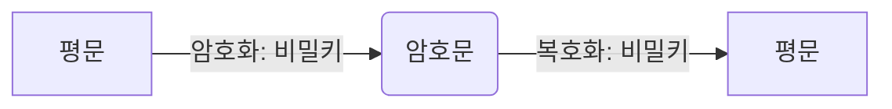
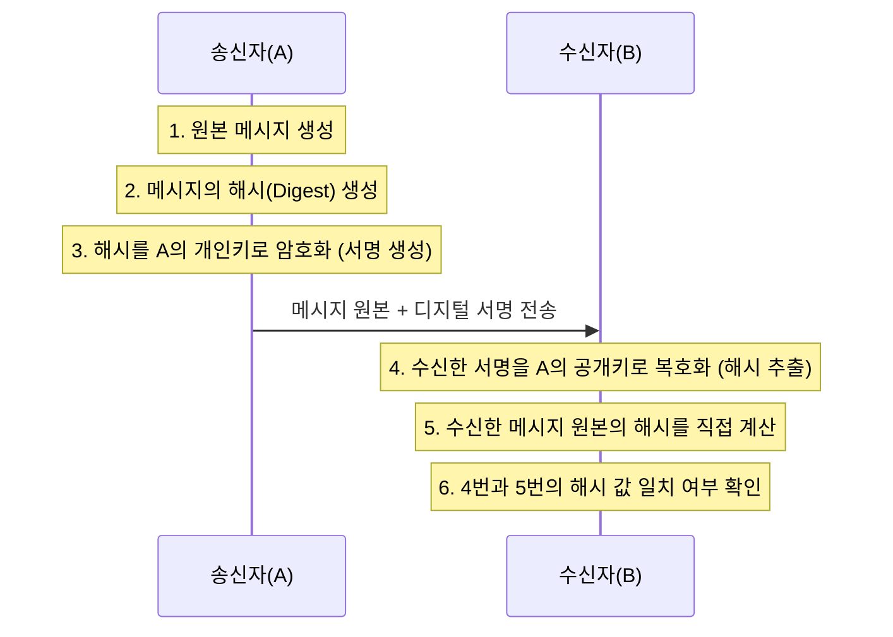

디지털 암호학은 데이터의 기밀성, 무결성, 인증, 부인 방지를 보장하기 위한 기술적 토대로, 현대 웹 보안(HTTPS) 등 다양한 시스템의 핵심 원리로 작동한다.

## 기본 용어 정리

- 암호(Cipher): 평문을 인가되지 않은 제3자가 해독할 수 없도록 변환하는 수학적 알고리즘
- 키(Key): 암호화 및 복호화 알고리즘의 동작을 제어하는 매개변수
- 대칭키 암호 체계(Symmetric-Key Cryptography): 암호화와 복호화에 동일한 키를 사용하는 방식
- 비대칭키 암호 체계(Asymmetric-Key Cryptography): 암호화와 복호화에 서로 다른 키(공개키, 개인키)를 사용하는 방식
- 공개키(Public Key): 외부에 공개되어 누구나 사용할 수 있는 키
- 개인키(Private Key): 소유자만 보관하며 절대 외부에 유출되어서는 안 되는 키
- 디지털 서명(Digital Signature): 메시지의 무결성과 송신자의 신원을 증명하는 암호화된 체크섬
- 디지털 인증서(Digital Certificate): 신뢰할 수 있는 제3기관(CA)이 서명하여 검증된 전자 신분증

## 대칭키 암호법(Symmetric-Key Algorithm)

송신자와 수신자가 동일한 비밀키(Secret Key)를 공유하여 데이터를 암호화하고 복호화하는 방식으로, 연산 속도가 매우 빠르다는 장점이 있어 대용량 데이터 전송에 적합하다.

- 과거에는 DES, Triple-DES, RC4 등이 사용되었으나 현재는 취약점이 발견되어 사용이 권장되지 않음
- 현대 시스템에서는 보안 강도가 높고 효율적인 AES(Advanced Encryption Standard)가 표준으로 사용
- AES-128 또는 AES-256 비트 키를 주로 채택

### 구조 및 데이터 흐름

### 한계점

대칭키 방식의 가장 큰 취약점은 통신 당사자 간에 비밀키를 안전하게 공유하는 방법이 어렵다는 점이다.

- 물리적으로 키를 전달하지 않는 이상, 네트워크를 통해 키를 전송하는 과정에서 탈취될 위험 존재
- 통신 대상이 늘어날수록 관리해야 할 키의 개수가 기하급수적으로 증가

### 보안 강도와 열거 공격

공격자가 가능한 모든 키 값을 대입해보는 열거 공격(Brute Force Attack)을 방어하기 위해 충분한 길이의 키를 사용해야 한다.

- 키 길이가 1비트 늘어날 때마다 해독 난이도는 2배씩 증가
- 현재 128비트 이상의 키는 현실적인 시간 내에 해독이 불가능한 것으로 간주

## 공개키 암호법(Public-Key Algorithm)

대칭키의 키 배송 문제를 해결하기 위해 고안된 방식으로, 공개키와 개인키라는 두 개의 키 쌍(Key Pair)을 사용한다.

1. 공개키 암호: 특정한 비밀 키를 가지고 있는 사용자만 복호화할 수 있도록 데이터를 암호화하는 방식
    - 암호화: 송신자가 수신자의 공개키로 데이터를 암호화
    - 복호화: 수신자는 자신의 수신자 개인키로 데이터를 복호화
    - 효과: 암호화된 데이터는 개인키를 가진 수신자만 열어볼 수 있으므로, 전송 도중 탈취되어도 안전
2. 공개키 서명: 특정한 비밀 키로 만들었다는 것을 누구나 확인 가능
    - 암호화(서명): 송신자가 송신자의 개인키로 데이터를 암호화
    - 복호화(검증): 수신자가 송신자의 공개키로 데이터를 복호화
    - 효과: 송신자의 공개키로 복호화가 된다는 것은, 송신자의 개인키로 암호화되었음을 증명(신원 확인 및 부인 방지)

### 주요 알고리즘 - RSA 알고리즘

가장 널리 사용되는 공개키 알고리즘으로, 큰 소수의 곱을 소인수분해하는 것이 수학적으로 매우 어렵다는 점에 기반한다.

- 공개키와 암호문, 알고리즘 소스가 있어도 개인키 유추 불가능
- 보안성을 위해 충분히 긴 키 길이(2048비트 이상)가 요구됨

RSA 구현 소스 코드를 가지고 있더라도, 비밀키를 찾아내는 것은 거의 불가능에 가깝다고 한다.(알려진 큰 소수를 계산하는 문제만큼의 비용 발생)

## 디지털 서명(Digital Signature)

종이 문서의 인장이나 서명과 같은 효력을 디지털 세계에서 구현한 기술로, 메시지 원본의 해시(Hash) 값을 송신자의 개인키로 암호화하여 생성한다.

- 메시지 작성자 식별: 작성자는 서명을 생성할 때 자신의 비밀키를 사용하기 때문에, 오직 작성자만 체크섬 계산 가능(이 체크섬은 개인 서명처럼 동작)
- 메시지 위조 방지: 악의적인 공격자가 송신 중인 메시지를 수정하게 되면, 체크섬은 더 이상 유효하지 않게 되어 위조 감지 가능

디지털 서명은 보통 비대칭 공개키에 의해 생성되며, 개인 키는 작성자만이 가지고 있기 때문에 일종의 '지문'(유니크한 값)처럼 사용된다.

### 서명 및 검증 프로세스

서명 검증 시 계산된 해시 값과 복호화된 해시 값이 일치한다면, 해당 메시지는 A가 보낸 것이 맞으며 전송 중 변경되지 않았음이 증명된다.

## 디지털 인증서(Digital Certificate)

공개키 암호 환경에서 통신 상대방의 공개키가 신뢰할 수 있는 것인지 보증하기 위한 시스템(PKI)이다.

- 신뢰할 수 있는 제3기관(CA)이 서버의 공개키와 신원 정보를 포함하여 발급
- CA는 자신의 개인키로 인증서에 전자 서명하여 위조 방지

### 디지털 인증서(X.509) 구조

대부분의 인증서는 X.509 표준을 따르며 다음 정보를 포함한다.

- 대상의 이름(사람, 서버, 조직 등)
- 유효 기간
- 인증서 발급자(인증서 보증 기관)
- 인증서 발급자의 디지털 서명
- 대상과 사용된 서명 알고리즘에 대한 정보
- 대상의 공개키

### 인증서 신뢰 모델(Chain of Trust)

브라우저나 OS는 최상위 인증 기관(Root CA)의 인증서를 미리 내장하여, 신뢰할 수 있는 인증서의 목록을 유지한다.

1. Root CA는 Intermediate CA(중간 인증 기관)의 인증서에 서명
2. Intermediate CA는 최종 사용자(Server)의 인증서에 서명
3. 클라이언트가 서버 인증서를 받으면, 내장된 Root CA까지 거슬러 올라가며 서명을 검증

###### 참고자료

- [HTTP 완벽 가이드](https://kobic.net/book/bookInfo/view.do?isbn=9788966261208)
