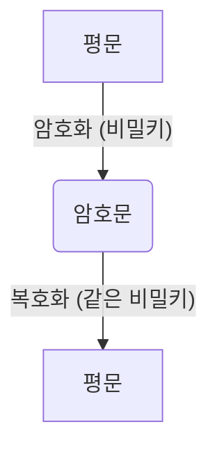
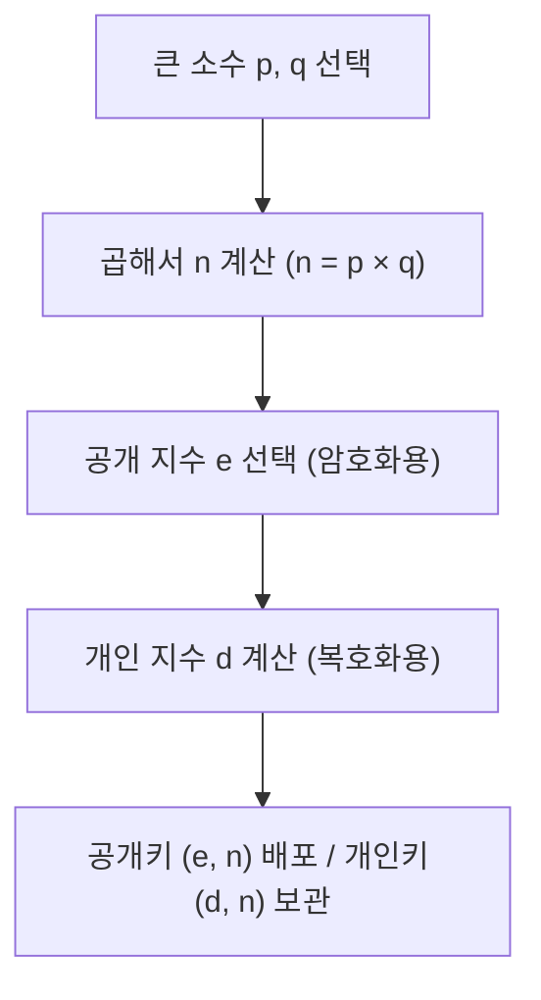
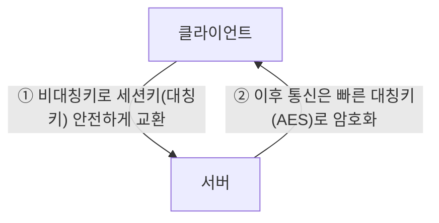
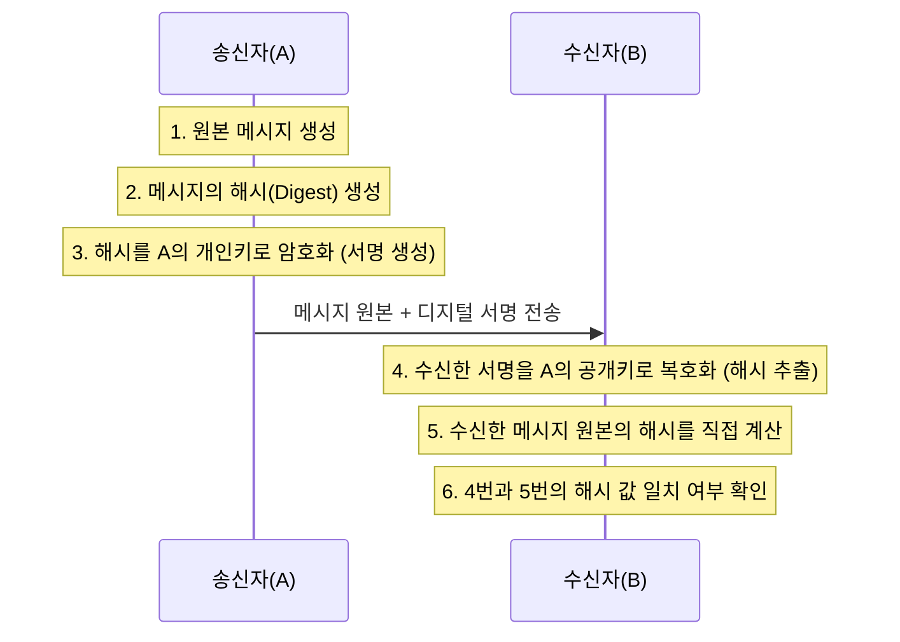

디지털 암호학은 데이터의 기밀성, 무결성, 인증, 부인 방지를 보장하기 위한 기술적 토대로, 현대 웹 보안(HTTPS) 등 다양한 시스템의 핵심 원리로 작동한다.

## 기본 용어 정리

- 평문(Plaintext): 암호화되기 전의 원본 데이터
- 암호문(Ciphertext): 평문을 암호화해 제3자가 해독할 수 없게 변환한 데이터
- 암호(Cipher): 평문을 인가되지 않은 제3자가 해독할 수 없도록 변환하는 수학적 알고리즘
- 키(Key): 암호화 및 복호화 알고리즘의 동작을 제어하는 매개변수
- 대칭키 암호 체계(Symmetric-Key Cryptography): 암호화와 복호화에 동일한 키를 사용하는 방식
- 비대칭키 암호 체계(Asymmetric-Key Cryptography): 암호화와 복호화에 서로 다른 키(공개키, 개인키)를 사용하는 방식
- 공개키(Public Key): 외부에 공개되어 누구나 사용할 수 있는 키
- 개인키(Private Key): 소유자만 보관하며 절대 외부에 유출되어서는 안 되는 키
- 키 배송 문제(Key Distribution Problem): 비밀키를 통신 상대에게 안전하게 전달하는 과정에서 발생하는 보안 문제
- 디지털 서명(Digital Signature): 메시지의 무결성과 송신자의 신원을 증명하는 암호화된 체크섬
- 디지털 인증서(Digital Certificate): 신뢰할 수 있는 제3기관(CA)이 서명하여 검증된 전자 신분증

## 대칭키 암호법(Symmetric-Key Algorithm)

송신자와 수신자가 동일한 비밀키(Secret Key)를 공유하여 데이터를 암호화하고 복호화하는 방식으로, 연산 속도가 매우 빠르다는 장점이 있어 대용량 데이터 전송에 적합하다.

- 과거에는 DES, Triple-DES, RC4 등이 사용되었으나 현재는 취약점이 발견되어 사용이 권장되지 않음
- 현대 시스템에서는 보안 강도가 높고 효율적인 AES(Advanced Encryption Standard)가 표준으로 사용
- AES-128 또는 AES-256 비트 키를 주로 채택

### 구조 및 데이터 흐름

같은 비밀키 하나로 평문을 암호문으로 바꾸고, 다시 그 암호문을 평문으로 되돌린다.


```mermaid
flowchart TB
    A[평문] -->|" 암호화 (비밀키) "| B(암호문)
    B -->|" 복호화 (같은 비밀키) "| C[평문]
```

### 한계점

대칭키 방식의 가장 큰 취약점은 통신 당사자 간에 비밀키를 안전하게 공유하는 방법이 어렵다는 점이다.

- 물리적으로 키를 전달하지 않는 이상, 네트워크를 통해 키를 전송하는 과정에서 탈취될 위험 존재
- 통신 대상이 늘어날수록 관리해야 할 키의 개수가 급증 — N명이 서로 통신하려면 `N(N-1)/2`개의 키가 필요

### 보안 강도와 열거 공격

공격자가 가능한 모든 키 값을 대입해보는 열거 공격(Brute Force Attack)을 방어하기 위해 충분한 길이의 키를 사용해야 한다.

- 키 길이가 1비트 늘어날 때마다 해독 난이도는 2배씩 증가
- 현재 128비트 이상의 키는 현실적인 시간 내에 해독이 불가능한 것으로 간주

## 공개키 암호법(Public-Key Algorithm)

대칭키의 키 배송 문제를 해결하기 위해 고안된 방식으로, 공개키와 개인키라는 두 개의 키 쌍(Key Pair)을 사용한다.

- 공개키(Public Key): 누구에게나 나눠줘도 되는 키 — 암호화와 서명 검증에 사용
- 개인키(Private Key): 소유자만 숨겨 두는 키 — 복호화와 서명에 사용

### 두 키의 관계

두 키는 한 방향으로만 대응한다.

- 한쪽 키로 암호화한 데이터는 같은 키로 복호화할 수 없고, 오직 짝이 되는 다른 키로만 복호화됨
- 두 키는 수학적으로 연결되어 있지만, 공개된 키만으로는 짝이 되는 개인키를 현실적인 시간 안에 역산할 수 없음(일방향성)

이 일방향성 덕분에 공개키가 배포되어도 안전하며, 어느 키로 암호화하느냐에 따라 보장하는 성질이 달라진다.

|  목적  |  암호화 키   | 복호화·검증 키 |       보장       |
|:----:|:--------:|:--------:|:--------------:|
| 기밀성  | 수신자의 공개키 | 수신자의 개인키 |  수신자만 복호화 가능   |
| 전자서명 | 송신자의 개인키 | 송신자의 공개키 | 위변조 방지 + 부인 방지 |

- 기밀성: 수신자의 공개키로 암호화하면, 짝인 개인키를 가진 수신자만 복호화할 수 있어 전송 도중 탈취되어도 안전
- 전자서명: 송신자가 자기 개인키로 서명하면, 누구나 송신자 공개키로 검증해 해당 개인키 소유자가 보냈음을 확인 가능

### RSA의 동작 원리

RSA는 가장 널리 쓰이는 공개키 알고리즘으로, 큰 소수 두 개를 곱하기는 쉽지만 그 곱에서 다시 원래 소수를 찾기는 어렵다는 수학적 사실에 안전성을 둔다.


```mermaid
flowchart TB
    A["큰 소수 p, q 선택"] --> B["곱해서 n 계산 (n = p × q)"]
    B --> C["공개 지수 e 선택 (암호화용)"]
    C --> D["개인 지수 d 계산 (복호화용)"]
    D --> E["공개키 (e, n) 배포 / 개인키 (d, n) 보관"]
```

각 단계가 맡는 역할은 다음과 같다.

- 큰 소수 p, q: 둘을 곱하기는 쉽지만 곱 n에서 다시 p·q를 되찾기는 어려움 — 이 비대칭이 안전성의 토대
- 모듈러스 n = p × q: 모든 연산이 이 n을 기준으로 순환하며, 키 길이(2048비트 등)는 곧 n의 비트 수
- 공개 지수 e: 보통 65537을 사용 — 거듭제곱 연산이 빠르면서 보안상 약점이 적음
- 개인 지수 d: `e × d`가 "한 바퀴 + 한 번"이 되도록 정해지는 값으로, p·q에서 유도되는 φ(n)(아래에서 설명할 "한 바퀴 횟수")을 알아야만 계산 가능

암호화와 복호화는 모두 "거듭제곱한 뒤 n으로 나눈 나머지를 취하는" 같은 모양의 연산이다.

| 단계  |         하는 일          |      수식      |
|:---:|:---------------------:|:------------:|
| 암호화 |   평문 M을 e번 거듭제곱해 변환   | C = Mᵉ mod n |
| 복호화 | 암호문 C를 d번 거듭제곱해 원문 복구 | M = Cᵈ mod n |

#### 왜 다시 원문으로 돌아오는가

암호화한 값을 복호화하면 결국 평문 M을 `e번` 곱한 뒤 다시 `d번` 곱한 것과 같다.

- 즉 M을 총 `e × d`번 거듭제곱한 셈
- `mod n`은 "n으로 나눈 나머지만 본다"는 뜻으로, 12시간 시계가 12를 넘으면 1로 돌아오듯 일정 값을 넘으면 작은 수로 순환

RSA가 성립하는 이유는 이 "한 바퀴 돌면 제자리"라는 성질을 이용하기 때문이다.

- 오일러 정리에 따르면, 나머지 세계에서 M을 어떤 특정 횟수(`φ(n)`)만큼 거듭제곱하면 결과가 1로 돌아옴 — 시계가 정확히 한 바퀴 돈 것
- 그래서 `e × d`를 "한 바퀴(φ의 배수) + 한 번"이 되도록 d를 고르면, 한 바퀴 도는 부분은 1로 사라지고 결국 M을 딱 한 번 곱한 값, 즉 원문 M만 남음
- 공개 지수 e와 개인 지수 d가 이렇게 정확히 짝을 이루도록 계산되어 있어, 한쪽이 변환한 값을 다른 쪽이 정확히 역변환

#### 작은 수로 따라가 보기

실제 RSA는 수백 자리 숫자를 쓰지만, 작은 수로 줄이면 원리가 그대로 보인다.

```text
두 소수: p=3, q=11
곱한 값: n = 3 × 11 = 33
한 바퀴 횟수: φ = (3-1) × (11-1) = 20

공개 지수 e=7  → 공개키 (7, 33)   ← 암호화에 사용
개인 지수 d=3  → 개인키 (3, 33)   ← 복호화에 사용
   (7 × 3 = 21 = 20×1 + 1, 즉 '한 바퀴 + 한 번')

평문 M=4
암호화: C = 4^7  mod 33 = 16384 mod 33 = 16
복호화: M = 16^3 mod 33 = 4096  mod 33 = 4   ✓ 원문 복구
```

## 대칭키와 비대칭키의 결합 - 하이브리드 암호화

두 방식은 속도와 키 배송이라는 정반대의 장단점을 갖는다.

|     구분      |          대칭키           |       비대칭키       |
|:-----------:|:----------------------:|:----------------:|
|      키      |       단일 공유 비밀키        |   공개키 + 개인키 쌍    |
|     속도      |           빠름           |   느림 (수백~수천 배)   |
|   키 배송 문제   |   있음 (안전한 전달 채널 필요)    | 없음 (공개키는 공개해도 됨) |
| 참여자 N명의 키 수 | `N(N-1)/2`개 (쌍마다 키 필요) |  `N`쌍 (각자 1쌍씩)   |
|  기밀성 외 기능   |           불가           | 전자서명·인증·부인방지 가능  |
|    주 용도     |       대용량 본문 암호화       |     키 교환·서명      |

- 대칭키는 빠르지만 키를 나누는 게 위험하고, 비대칭키는 키 나누기가 안전하지만 느림
- 어느 한쪽만으로는 부족해, 실무는 두 방식을 조합한 하이브리드 암호화를 사용

대표 사례는 HTTPS의 TLS로, 느린 비대칭키는 대칭키를 교환하는 데만 쓰고 실제 데이터는 빠른 대칭키로 암호화한다.


```mermaid
flowchart TB
    C["클라이언트"] -->|" ① 비대칭키로 세션키(대칭키) 안전하게 교환 "| S["서버"]
    S -->|" ② 이후 통신은 빠른 대칭키(AES)로 암호화 "| C
```

1. 키 교환 단계
    - 비대칭키를 이용해 대칭키(세션키)를 안전하게 합의
    - 키 배송 문제를 비대칭키로 해결
2. 데이터 전송 단계
    - 합의된 대칭키로 실제 트래픽을 빠르게 암호화
    - 속도 문제를 대칭키로 해결

## 디지털 서명(Digital Signature)

종이 문서의 인장이나 서명과 같은 효력을 디지털 세계에서 구현한 기술로, 메시지 원본의 해시(Hash) 값을 송신자의 개인키로 암호화하여 생성한다.

- 메시지 작성자 식별: 작성자는 서명을 생성할 때 자신의 비밀키를 사용하기 때문에, 오직 작성자만 체크섬 계산 가능(이 체크섬은 개인 서명처럼 동작)
- 메시지 위조 방지: 악의적인 공격자가 송신 중인 메시지를 수정하게 되면, 체크섬은 더 이상 유효하지 않게 되어 위조 감지 가능

디지털 서명은 보통 비대칭 공개키에 의해 생성되며, 개인 키는 작성자만이 가지고 있기 때문에 일종의 '지문'(유니크한 값)처럼 사용된다.

### 서명 및 검증 프로세스


```mermaid
sequenceDiagram
    participant Sender as 송신자(A)
    participant Receiver as 수신자(B)
    Note over Sender: 1. 원본 메시지 생성
    Note over Sender: 2. 메시지의 해시(Digest) 생성
    Note over Sender: 3. 해시를 A의 개인키로 암호화 (서명 생성)
    Sender ->> Receiver: 메시지 원본 + 디지털 서명 전송
    Note over Receiver: 4. 수신한 서명을 A의 공개키로 복호화 (해시 추출)
    Note over Receiver: 5. 수신한 메시지 원본의 해시를 직접 계산
    Note over Receiver: 6. 4번과 5번의 해시 값 일치 여부 확인
```

서명 검증 시 계산된 해시 값과 복호화된 해시 값이 일치한다면, 해당 메시지는 A가 보낸 것이 맞으며 전송 중 변경되지 않았음이 증명된다.

## 디지털 인증서(Digital Certificate)

공개키 암호 환경에서 통신 상대방의 공개키가 신뢰할 수 있는 것인지 보증하기 위한 시스템(PKI)이다.

- 신뢰할 수 있는 제3기관(CA)이 서버의 공개키와 신원 정보를 포함하여 발급
- CA는 자신의 개인키로 인증서에 전자 서명하여 위조 방지

### 디지털 인증서(X.509) 구조

대부분의 인증서는 X.509 표준을 따르며 다음 정보를 포함한다.

- 대상의 이름(사람, 서버, 조직 등)
- 유효 기간
- 인증서 발급자(인증서 보증 기관)
- 인증서 발급자의 디지털 서명
- 대상과 사용된 서명 알고리즘에 대한 정보
- 대상의 공개키

### 인증서 신뢰 모델(Chain of Trust)

브라우저나 OS는 최상위 인증 기관(Root CA)의 인증서를 미리 내장하여, 신뢰할 수 있는 인증서의 목록을 유지한다.

1. Root CA는 Intermediate CA(중간 인증 기관)의 인증서에 서명
2. Intermediate CA는 최종 사용자(Server)의 인증서에 서명
3. 클라이언트가 서버 인증서를 받으면, 내장된 Root CA까지 거슬러 올라가며 서명을 검증

###### 참고자료

- [HTTP 완벽 가이드](https://kobic.net/book/bookInfo/view.do?isbn=9788966261208)
