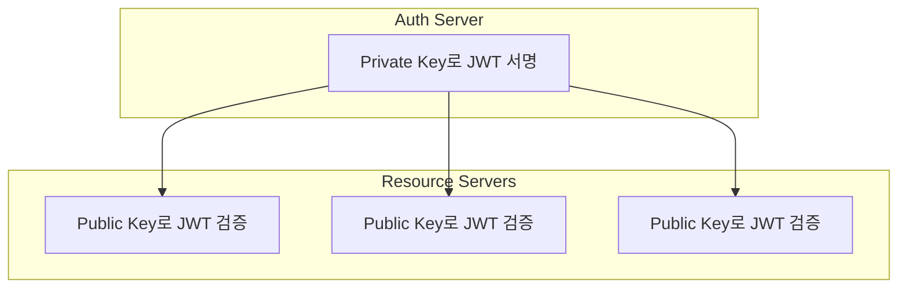
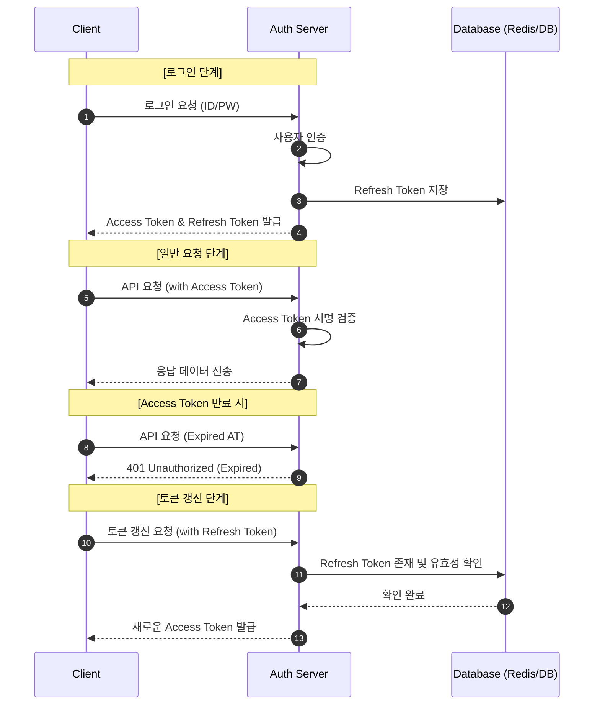

JWT는 두 개체 간에 정보를 JSON 객체로서 안전하게 전송하기 위한 컴팩트하고 독립적인(self-contained) 방식의 공개 표준(RFC 7519)이다.

- 흔히 토큰 기반 인증에서 사용되며, 서버가 클라이언트의 상태를 저장하지 않는 Stateless 환경을 구축하는 데 핵심적인 역할
- OAuth 2.0의 Access Token이나 OpenID Connect의 ID Token 구현체로 널리 활용
- 토큰 자체가 서명되어 있으므로, 서버는 토큰의 정보가 위변조되지 않았음을 검증 가능

## JWT 구조 - Header / Payload / Signature

JWT는 마침표(`.`)로 구분되는 세 부분으로 구성되며, 각 부분은 Base64Url로 인코딩되어 있다.

```
xxxxx.yyyyy.zzzzz
Header.Payload.Signature
```

### 1. Header (헤더)

토큰 자체에 대한 메타데이터를 담고 있으며, 두 가지 정보를 필수로 포함한다.

- `typ` (Type): 토큰의 타입을 지정(보통 `JWT`로 고정)
- `alg` (Algorithm): 토큰을 서명(sign)하는 데 사용된 암호화 알고리즘 지정(예: `HS256`, `RS256`)

```json
{
  "alg": "HS256",
  "typ": "JWT"
}
```

### 2. Payload (페이로드)

토큰이 실제로 전달하고자 하는 정보(클레임)를 담고 있으며, 사용자에 대한 정보나 토큰 자체에 대한 설명 등을 나타내는 키-값 쌍으로 구성된다.

다음은 Registered, Public, Private 클레임을 모두 포함하는 JWT 페이로드의 예시이다.

```json
{
  "sub": "1234567890",
  "iss": "your_auth_server",
  "aud": "your_client_app",
  "exp": 1678886400,
  "iat": 1678800000,
  "name": "Hyoguoo",
  "email": "hyoguoo@example.com",
  "role": "editor"
}
```

- Registered Claims(등록된 클레임): JWT 사양에 이미 정의된 클레임들로, 필수는 아니지만 상호 운용성을 위해 사용 권장
    - `iss`(Issuer): 토큰 발급자
    - `sub`(Subject): 토큰의 주체(예: 사용자의 고유 ID)
    - `aud`(Audience): 토큰의 수신자(이 토큰을 사용해야 하는 서비스)
    - `exp`(Expiration Time): 토큰의 만료 시간
    - `iat`(Issued At): 토큰이 발급된 시간
- Public Claims(공개 클레임): JWT를 사용하는 여러 주체들이 공통적으로 사용하기 위해 공개적으로 정의된 클레임
    - 공개되어도 좋은 정보가 아닌, 표준처럼 공개적으로 정의된 규약이라는 의미
    - 이름 충돌을 방지하기 위해 IANA JWT 클레임 레지스트리에 등록하거나, URI 형식으로 네임스페이스를 관리
- Private Claims(비공개 클레임): 토큰을 발급하는 서버와 토큰을 사용하는 서버 간에 협의 하에 사용하는 비공개적인 클레임(예: `role: "editor"`)

페이로드는 단순히 Base64Url로 인코딩되었을 뿐, 암호화된 것이 아니므로, 비밀번호와 같은 민감한 정보는 절대 페이로드에 담아서는 안 된다.

### 3. Signature(서명)

서명은 토큰의 무결성(Integrity)과 발급자의 신원(Authenticity)을 보장하는 가장 중요한 부분이다.

- 서명은 인코딩된 `Header`와 `Payload`를 합치고, 지정된 비밀 키(Secret) 또는 개인 키(Private Key)를 사용하여 `alg`에 명시된 알고리즘으로 암호화하여 생성
- 수신 측은 이 서명을 검증함으로써, 토큰이 중간에 변경되지 않았으며 신뢰할 수 있는 발급자에 의해 발급되었음을 확인

## 서명 알고리즘

JWT 서명 방식은 대칭키와 비대칭키 방식으로 나뉜다.

- HS256(HMAC with SHA-256): 대칭키 알고리즘
    - 하나의 비밀 키(Secret)를 서명과 검증에 모두 사용
    - 서버 내에서 토큰을 생성하고 검증하는 등, 신뢰할 수 있는 단일 시스템 혹은 소수의 시스템 환경에 적합
    - 단점: 서명을 검증해야 하는 모든 주체가 동일한 비밀 키를 공유해야 하므로, 키가 유출될 경우 누구나 유효한 토큰을 생성 가능 위험 존재
- RS256(RSA Signature with SHA-256): 비대칭키 알고리즘
    - 개인 키(Private Key)로 서명하고, 쌍을 이루는 공개 키(Public Key)로 검증
    - 토큰 발급자(예: 인증 서버)만이 개인 키를 안전하게 보관하고, 토큰 검증자(예: 리소스 서버들)는 공개 키만 소지하여 검증
    - MSA(Microservice Architecture)와 같이 여러 서비스에서 토큰을 검증해야 하는 분산 환경에 적합하며, 현재 가장 널리 권장되는 방식



## JWT 보안 및 주의사항

JWT는 편리하지만, 잘못 사용하면 심각한 보안 취약점으로 이어질 수 있다.

- `alg: none` 취약점
    - 과거 일부 라이브러리에서 `alg` 헤더를 `none`으로 설정하면 서명 검증을 건너뛰는 취약점 존재
    - 공격자는 서명을 제거하고 `alg`를 `none`으로 조작하여 유효한 토큰인 것처럼 위장 가능
    - 해결책: 서버는 반드시 `alg: none`을 거부하고, 허용할 알고리즘 목록(Whitelist)을 명시적으로 관리
- 토큰 저장 위치(`localStorage` vs `HttpOnly` Cookie)
    - `localStorage`: JavaScript로 접근이 쉬워 사용이 편리하지만, XSS(Cross-Site Scripting) 공격에 취약
        - 악성 스크립트가 주입되면 토큰 탈취 가능성 존재
    - `HttpOnly` Cookie: JavaScript 접근이 불가능하여 XSS 공격으로부터 토큰을 보호 가능
        - 하지만 브라우저가 모든 요청에 자동으로 쿠키를 포함시키므로 CSRF(Cross-Site Request Forgery) 공격에 취약(SameSite 속성으로 완화 가능)
- Stateless와 토큰 폐기의 어려움
    - JWT는 서버가 상태를 저장하지 않는 Stateless하다는 장점이 있지만, 이는 곧 한 번 발급된 토큰을 만료 전의 폐기 어려움 존재
    - 해결책
        1. 짧은 만료 시간: Access Token의 만료 시간을 매우 짧게(예: 5~15분) 설정하여 탈취되더라도 위험을 최소화
        2. 토큰 폐기 목록(Blacklist) 유지: 폐기된 토큰 ID를 별도의 저장소(예: Redis)에 목록으로 관리(JWT의 Stateless 장점을 일부 희생하는 방법)

## Refresh Token 전략

### Access Token 단독 사용의 한계

JWT를 Access Token 하나로만 운용할 경우, Stateless 특성이 오히려 보안상 혹은 편의상 약점으로 작용할 수 있다.

- 제어권 상실: 토큰이 탈취되어도 서버에서 강제로 로그아웃(무효화)시킬 방법 없음
- 유효기간 딜레마: 보안을 위해 기간을 짧게 잡으면 사용자가 너무 자주 로그인해야 하고, 길게 잡으면 탈취 시 피해 확대 가능성 존재

### 두 토큰의 역할 분담

|  구분   |  Access Token   |             Refresh Token              |
|:-----:|:---------------:|:--------------------------------------:|
|  목적   |    리소스 접근 승인    |          새로운 Access Token 발급           |
| 유효 기간 |      매우 짧음      |                상대적으로 김                 |
|  저장소  | 클라이언트 메모리(변수) 등 | 서버 DB / Redis 및 클라이언트(HttpOnly Cookie) |

### 인증 시나리오(Flow)



1. 로그인 성공: 서버는 Access Token(AT)과 Refresh Token(RT)을 모두 발급
    - 이때 RT는 서버 데이터베이스나 Redis에 저장하여 추적 가능하게 관리
2. API 요청: 클라이언트는 AT를 헤더에 담아 요청 전송
    - 서버는 AT의 서명을 검증하고 응답
3. AT 만료: AT가 만료되면 서버는 `401 Unauthorized` 에러를 반환
4. 토큰 갱신: 클라이언트는 저장해둔 RT를 서버의 별도 갱신 엔드포인트로 전송하여 새로운 AT 요청
5. 검증 및 재발급: 서버는 RT의 유효성을 DB와 대조하여 확인한 후, 새로운 AT를 발급

### 보안 강화 기법 - Refresh Token Rotation

RT는 수명이 길기 때문에 이 토큰 자체가 탈취되면 공격자가 지속적으로 AT를 생성할 수 있는 위험이 있어, 이를 방지하기 위해 Refresh Token Rotation 기법을 권장한다.

- 동작 방식: 클라이언트가 RT를 사용하여 AT를 갱신할 때, 기존의 RT를 무효화하고 새로운 RT도 함께 발급
- 효과
    - 만약 공격자가 RT를 탈취해 먼저 사용했다면, 이후 정당한 사용자가 동일한 RT로 갱신을 시도할 때 서버는 이미 사용된 RT임을 감지
    - 이 경우 해당 사용자와 관련된 모든 토큰을 즉시 무효화하여 피해 최소화

때문에 Refresh Token을 서버 side(예: Redis)에서 관리하게 되면 완전한 Stateless는 깨지게 되지만, 실무에서는 보안상의 이유로 이러한 Hybrid 방식을 표준처럼 사용한다.
