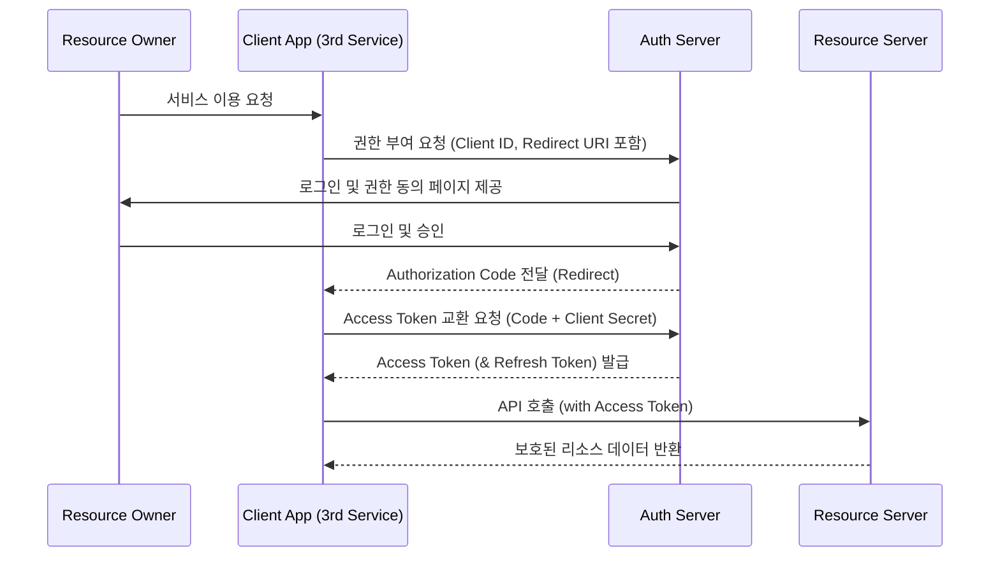

OAuth(2.0)은 애플리케이션이 사용자 대신 리소스에 접근할 수 있도록 권한을 위임(Delegation)하는 업계 표준 프로토콜(RFC 6749)이다.

- 단순한 인증(Authentication)을 넘어 특정 리소스에 대한 접근 권한(Authorization)을 관리하는 프레임워크 역할 수행
- 현대 웹 생태계에서 보안성과 사용자 편의성을 동시에 확보하는 핵심 규격

## OAuth의 탄생과 발전 배경

### 1. OAuth 이전 비밀번호 공유의 문제

OAuth가 존재하지 않던 초기 웹 환경에서는 서드파티 서비스가 사용자의 리소스에 접근하기 위해 사용자의 아이디와 비밀번호를 직접 저장해야 했다.

- 비밀번호 공유의 위험성: 서드파티 서비스가 해킹당할 경우 사용자의 원본 계정 전체가 탈취되는 심각한 보안 결함 발생
- 권한 제어 불가: 특정 기능(예: 주소록 조회)만 허용하고 싶지만 모든 데이터에 접근 가능한 과도한 권한 부여 문제
- 관리의 어려움: 사용자가 포털 사이트 비밀번호를 변경하면 연동된 모든 서비스의 연결이 끊어지며, 개별 서비스별로 권한을 취소할 방법이 부재

### 2. OAuth 1.0의 한계와 2.0으로의 진화

2007년 등장한 OAuth 1.0은 보안을 강화했으나 기술적인 복잡성이 높았다.

- 1.0의 한계: 모든 요청에 대해 복잡한 HMAC 서명(Signature) 생성이 필수적이라 라이브러리 구현 난이도가 매우 높음
- 환경적 제약: 데스크톱이나 모바일 환경에서의 지원이 미흡하며 세션 관리가 까다로움
- 2.0의 개선: 암호화 서명 대신 HTTPS(TLS) 보안 통신에 의존하여 구현을 단순화함
- 확장성 강화: 웹, 모바일, 서버 간 통신 등 다양한 클라이언트 환경에 맞춘 네 가지 이상의 승인 방식(Grant Types) 정의 및 스코프(Scope) 개념 도입

## OAuth 2.0이 해결하는 문제

### 1. 보안성 증대와 관리 주체의 중앙화

사용자는 자신의 민감한 정보를 신뢰도가 낮은 서드파티 서비스에 노출할 필요가 없어졌다.

- 대기업 보안 인프라 활용: 비밀번호 관리 및 2단계 인증(2FA)과 같은 고도의 보안 처리를 구글, 애플 등 검증된 플랫폼에 위임 가능
- 리스크 분산: 서비스가 해킹당하더라도 유출되는 것은 해당 서비스에 국한된 임시 액세스 토큰일 뿐이며 사용자의 통합 계정 정보는 안전하게 보호

### 2. 사용자 편의성 및 권한 제어

- 간편 로그인(Single Sign-On): 별도의 회원가입 없이 기존 플랫폼 계정으로 즉시 서비스 이용 가능
- 최소 권한 원칙: 사용자가 서비스에 허용할 데이터 범위(예: 이메일만 허용)를 직접 선택하여 제어 가능

## 핵심 용어 및 구성 요소

OAuth 2.0 아키텍처를 구성하는 네 가지 주요 역할은 다음과 같다.

1. 리소스 소유자(Resource Owner): 데이터의 주인 사용자(User)
2. 클라이언트(Client): 사용자의 권한을 받아 리소스 서버에 접근하려는 애플리케이션(서드파티 서비스)
3. 권한 부여 서버(Authorization Server): 사용자를 인증하고 클라이언트에게 토큰을 발급하는 서버
4. 리소스 서버(Resource Server): 사용자의 보호된 자원을 호스팅하고 API를 제공하는 서버

## 현대 웹 표준 인증 플로우 - Authorization Code Grant

가장 권장되는 방식으로, 클라이언트가 직접 토큰을 받지 않고 일시적인 승인 코드(Code)를 거쳐 백엔드에서 안전하게 토큰을 교환한다.

### 승인 코드 방식이 안전한 이유

- 브라우저를 통하는 데이터는 탈취 가능성이 높으므로 일회성 코드만 노출
- 실제 토큰 교환은 백엔드 서버와 권한 서버 간의 직접 통신(Server-to-Server)으로 수행
- Client Secret이라는 비밀 정보를 사용하여 클라이언트의 신원을 추가 검증

## PKCE(Proof Key for Code Exchange) 심층 이해

PKCE는 승인 코드 가로채기 공격을 방지하기 위한 필수 보안 확장 사양이다.

### PKCE 등장 배경과 목적

일반적인 승인 코드 방식에서도 리다이렉트 과정에서 코드가 탈취될 위험이 존재한다.

- 모바일 앱, SPA처럼 소스 코드가 노출되기 쉬운 환경에서는 Client Secret을 안전하게 보관 불가능
- 공격자가 중간에 코드를 가로채어 액세스 토큰을 부정 발급 받을 수 있는 취약점 존재
- PKCE는 토큰 요청 시점에 별도의 검증 단계(Proof Key)를 추가하여 문제 해결

### PKCE 동작 매커니즘 및 플로우

1. Code Verifier 생성: 클라이언트가 임의의 무작위 문자열을 생성
2. Code Challenge 생성: Verifier를 SHA-256으로 해싱하여 생성
3. 승인 요청: 클라이언트가 권한 서버에 Challenge 전송
4. 토큰 교환: 코드를 받은 클라이언트가 토큰을 요청할 때 원본 Verifier를 함께 전송
5. 서버 검증: 서버는 저장했던 Challenge와 전달받은 Verifier가 일치하는지 확인 후 토큰 발급
