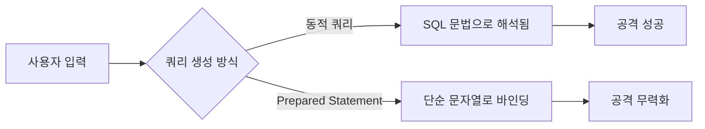
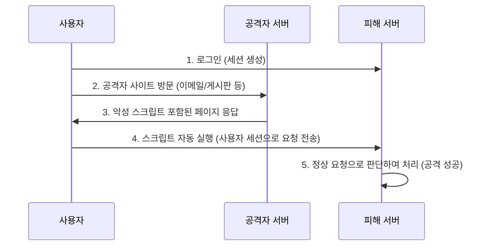

소프트웨어 개발 과정에서 개발자의 실수나 논리적 오류로 인해 발생할 수 있는 보안 취약점을 사전에 제거하여 안전한 소프트웨어를 개발하는 기법이다.

## 입력 데이터 검증 및 표현

외부 입력값에 대한 검증 누락이나 부적절한 처리는 SQL Injection, XSS 등 심각한 보안 사고의 주원인으로, 모든 입력값은 신뢰하지 않는다는 전제로 검증해야 한다.

### 1. SQL Injection

사용자로부터 입력된 값을 입력 받은 경우 동적쿼리(Dynamic Query)를 생성하는데, 악의적인 SQL 구문을 주입하여 데이터베이스를 조작하거나 정보를 탈취하는 공격이다.

#### 방어 및 대응 방안

- 정적 쿼리(Prepared Statement) 사용: DB 컴파일러가 쿼리 문법을 미리 파싱한 후 데이터를 바인딩하므로, 입력값이 문법에 영향을 주지 않고 단순 문자열로 처리됨
- ORM(Object Relational Mapping) 프레임워크 사용: Hibernate, JPA 등은 기본적으로 내부적인 파라미터 바인딩을 수행
- 입력값 검증: 특수문자 필터링 및 입력 길이 제한



### 2. 크로스 사이트 스크립트(XSS)

공격자가 웹 페이지에 악성 스크립트를 삽입하여, 이를 열람하는 사용자의 브라우저에서 스크립트가 실행되도록 하는 공격으로, 세션 탈취, 리다이렉트, 악성코드 다운로드 등을 유발한다.

- Stored XSS: 악성 스크립트가 DB에 저장되어 지속적으로 피해 발생
- Reflected XSS: URL 파라미터 등에 포함된 스크립트가 즉시 반사되어 실행

#### 방어 및 대응 방안

- 입/출력값 치환: `< > & " '` 등의 특수문자를 `&lt; &gt;` 등의 HTML Entity로 변환(HTML Escaping)
- 라이브러리 사용: OWASP Java Encoder, Naver Lucy XSS Filter 등 검증된 라이브러리 활용
- White List 방식 필터링: HTML 태그 허용이 필수적인 경우, 안전한 태그만 허용

### 3. 위험한 형식 파일 업로드

확장자나 파일 타입 검증 없이 업로드를 허용할 경우, 웹 쉘(Web Shell)과 같은 실행 가능한 악성 파일이 서버에 저장되고 실행될 수 있다.

#### 방어 및 대응 방안

- 화이트리스트 확장자 검사: 허용된 확장자(예: jpg, png)만 업로드 가능하도록 제한
- 파일 시그니처(Magic Number) 검증: 확장자 위변조 방지를 위해 파일 헤더의 고유 바이트 확인
- 파일명 난수화: 업로드된 파일명을 UUID 등으로 변경하여 공격자가 파일에 접근하거나 실행하는 것을 방해
- 실행 권한 제거: 업로드 디렉토리의 실행 권한(Execute) 제거
- 저장 경로 분리: 웹 루트(Web Root) 외부의 경로에 파일 저장

### 4. 경로 조작 및 자원 삽입

입력값에 경로 순회 문자(`../`, `..%2f`) 등을 포함시켜 허가되지 않은 파일 시스템 경로에 접근하는 공격이다.

- 변조 전: `http://www.example.com/file/download/?filename=pic.jpg%path=data`
- 변조 후: `http://www.example.com/file/download/?filename=paaword%path=../../etc`

#### 방어 및 대응 방안

- 경로 순회 문자 필터링: 파일명에서 `/`, `\`, `..` 제거
- 베이스 디렉토리 고정: 입력받은 파일명이 지정된 디렉토리 내부인지 `canonicalPath` 등으로 확인 후 처리
- 식별자 매핑: 파일명 직접 입력 대신 ID 등을 받아 내부적으로 매핑된 파일 접근

### 5. 운영체제 명령어 삽입

외부 입력값이 시스템 명령어의 파라미터나 일부로 전달될 때, 메타 문자(`|`, `;`, `&` 등)를 이용해 추가 명령어를 실행시키는 취약점이다.

#### 방어 및 대응 방안

- 언어 자체 API 사용: `Runtime.exec()` 같은 쉘 호출 대신 라이브러리 함수 사용
- 화이트리스트 입력 제한: 허용된 명령어 목록 내에서만 실행되도록 제한
- 메타 문자 필터링: 명령어 연결에 사용되는 특수문자 제거

### 6. 오픈 리다이렉트

사용자가 입력한 URL로 자동 이동하는 기능이 검증 없이 구현될 경우, 피싱 사이트로 유도하거나 악성 코드를 유포하는 데 악용될 수 있다.

#### 방어 및 대응 방안

- 화이트리스트 도메인 관리: 허용된 도메인 리스트 내에서만 리다이렉트 허용
- 상대 경로 사용: 외부 도메인 이동이 불필요한 경우 도메인을 제외한 경로만 사용

### 7. 크로스 사이트 요청 위조(Cross-Site Request Forgery)

사용자가 자신의 의지와 무관하게 공격자가 의도한 행위(수정, 삭제, 등록 등)를 특정 웹사이트에 요청하게 만드는 공격이다.



만약 사용자가 아래와 같은 태그가 포함된 사이트를 열람할 시 아래 태그에 있는 스크립트가 실행되어 비밀번호가 강제로 변경된다.

```html

```

#### 방어 및 대응 방안

- 메서드 구분: 상태를 변경하는 요청은 `GET` 대신 `POST`, `PUT`, `DELETE` 사용
- CSRF Token 사용: 난수화된 토큰을 세션에 저장하고, 요청 시마다 토큰 일치 여부 검증
- Referer 검증: 요청을 발송한 출처가 허용된 도메인인지 확인
- SameSite Cookie 설정: 쿠키의 `SameSite` 속성을 `Strict` 또는 `Lax`로 설정하여 타 도메인에서의 쿠키 전송 제한

### 8. 서버사이드 요청 위조(SSRF)

공격자가 서버를 매개로 하여 외부에서 접근할 수 없는 내부망(Internal Network)의 자원에 접근하거나 스캔하는 공격이다.

```
[공격자] <--> [웹 서버] <--> [내부 서버]
# 공격자는 내부 서버에 직접 접근이 불가능한 환경
```

#### 방어 및 대응 방안

- 내부 IP 대역 차단: `127.0.0.1`, `localhost`, `10.x.x.x`, `192.168.x.x` 등 사설 IP 및 루프백 주소 접근 차단
- URL 스키마 제한: `file://`, `gopher://` 등 불필요한 프로토콜 비활성화하고 `http`, `https`만 허용

삽입 코드의 예시는 다음과 같다.

|                 설명                  |                                                               삽입 코드의 예                                                               |
|:-----------------------------------:|:------------------------------------------------------------------------------------------------------------------------------------:|
| 내부망 중요 정보 획득 외부 접근 차단된 admin 페이지 접근 | http://sample_site.com/connect?url=http://192.168.0.45/member/list.json http://sample_site.com/connect?url=http://192.168.0.45/admin |
|        도메인 체크를 우회하여 중요 정보 획득        |                      http://sample_site.com/connect?url=http://sample_site.com:x@192.168.0.45/member/list.json                       |
|        단축 URL을 이용한 Filter 우회        |                                     http://sample_site.com/connect?url=http://bit.ly/sdjk3kjhkl3                                     |
|       도메인을 사설IP로 설정 해 중요정보 획득       |                               http://sample_site.com/connect?url=http://192.168.0.45/member/list.json                                |
|             서버 내 파일 열람              |                                        http://sample_site.com/connect?url=file:///etc/passwd                                         |

### 9. HTTP 응답 분할

입력값에 CR(`\r`, %0d), LF(`\n`, %0a) 문자가 포함되어 HTTP 헤더가 분리되는 취약점으로, 개행 문자(CRLF)를 삽입하여 서버가 보낸 하나의 응답을 두 개 이상의 응답으로 해석하게 만든다.

#### HTTP 메시지 구조와 원리

HTTP 프로토콜은 헤더와 본문(Body)을 `CRLF` (Carriage Return `\r` + Line Feed `\n`)로 구분한다.

|        Start Line        |
|:------------------------:|
|      General Header      |
| Request(Response) Header |
|      Entity Header       |
|     CRLF(Empty Line)     |
|           Body           |

공격 핵심은 헤더에 `CRLF(%0d%0a)`를 주입하여 강제로 줄을 바꿈으로써, 이후에 오는 데이터를 새로운 헤더나 별도의 응답 메시지로 인식하게 만드는 것이다.

#### 공격 수행 과정

공격자는 `Content-Length: 0` 헤더를 주입하여 첫 번째 응답을 강제로 종료시키고, 뒤이어 악성 코드가 담긴 두 번째 가짜 응답을 생성한다.

##### 1. 악성 코드가 삽입된 요청 전송

공격자는 파라미터에 CRLF와 가짜 응답 헤더를 인코딩하여 전송한다.

```http request
GET /test?
    param=Value%0d%0aContent-Length:%200%0d%0a%0d%0aHTTP/1.1%20200%20OK%0d%0aContent-Type:%20text/html%0d%0aContent-Length:%2019%0d%0a%0d%0a<html>Attack</html>

```

- `%0d%0a`: 줄바꿈(CRLF)
- `Content-Length: 0`: 첫 번째 응답이 여기서 끝난 것처럼 위장
- `%0d%0a%0d%0a`: 헤더와 바디를 구분하는 빈 줄 삽입 (첫 번째 응답 종료)
- `HTTP/1.1 200 OK...`: 두 번째 가짜 응답 시작

##### 2. 서버의 처리 및 응답 분할

서버는 입력값을 검증 없이 헤더에 포함시키며, 이로 인해 응답 패킷이 논리적으로 분할된다.

```http request
HTTP/1.1 200 OK
Set-Cookie: param=Value
Content-Length: 0

# --- [여기서 첫 번째 응답이 종료된 것으로 처리됨] ---

HTTP/1.1 200 OK
Content-Type: text/html
Content-Length: 19

<html>Attack</html>

# --- [공격자가 주입한 가짜 응답이 실행됨] ---

```

##### 3. 결과 및 피해

- 브라우저나 프록시 서버는 이를 두 개의 별도 응답으로 인식
- 첫 번째 응답은 `Content-Length: 0`에 의해 무시되거나 정상 처리된 것으로 간주
- 두 번째 가짜 응답(`Attack`)이 사용자의 브라우저에서 실행되거나(XSS), 프록시 서버의 캐시에 저장되어 다른 사용자에게 악성 페이지가 노출 가능성 존재(Cache Poisoning)

#### 방어 및 대응 방안

- 개행 문자 제거: HTTP 헤더에 들어가는 입력값에서 CR, LF 문자를 공백 등으로 치환
- 라이브러리 활용: 최신 웹 프레임워크나 WAS는 기본적으로 헤더 내 개행 문자를 차단하는 기능을 내장하고 있음

## 캡슐화

객체 지향 프로그래밍의 정보 은닉 원칙을 위배하거나 불필요한 정보가 노출되는 경우 발생하는 취약점이다.

### 1. 디버그 코드 잔존

개발 편의를 위해 작성한 디버깅 코드(로그, 테스트 페이지 등)가 운영 환경에 남을 경우 중요 정보 유출 경로가 된다.

#### 대응 방안

- 빌드 프로세스 제어: 운영 배포 시 디버그 코드가 제외되도록 전처리기 또는 빌드 스크립트 설정
- 로깅 레벨 관리: 운영 환경에서는 디버그 레벨 로그가 출력되지 않도록 설정 파일 분리

### 2. Public 메서드를 통한 Private 배열 반환

`private` 배열을 `public` 메서드(Getter)가 그대로 반환할 경우, 외부에서 배열의 참조 주소를 통해 내부 데이터를 직접 수정할 수 있게 되어 이는 불변성(Immutability)을 깨뜨린다.

#### 대응 방안

- 배열 반환 시 원본이 아닌 복사본을 생성하여 반환(Deep Copy 또는 Clone)
- 배열 입력 시에도 복사본을 생성하여 내부 변수에 할당

```java
public class SafeObject {

    private String[] colors;

    // Getter: 복사본 반환
    public String[] getColors() {
        if (this.colors == null)
            return null;
        return Arrays.copyOf(this.colors, this.colors.length);
    }

    // Setter: 복사해서 저장
    public void setColors(String[] newColors) {
        if (newColors != null) {
            this.colors = Arrays.copyOf(newColors, newColors.length);
        }
    }
}
```

## 기타 보안 약점

### 1. 에러 처리(Error Handling)

시스템 내부 에러 메시지(Stack Trace 등)가 사용자에게 그대로 노출될 경우, 서버 구조나 DB 정보 등 공격에 유용한 정보를 제공하게 된다.

- 사용자에게는 약속된 에러 메시지만 노출
- 상세 로그는 서버 내부에만 기록

### 2. 경쟁 조건(Race Condition)

검사 시점(Time of Check)과 사용 시점(Time of Use) 사이의 시간차를 이용하여 자원을 조작하는 공격이다(TOCTOU).

- 동기화(Synchronized) 블록 사용
- DB 트랜잭션 격리 수준 적절히 설정
- Node.js 환경의 경우 `pm2` 등 클러스터 모드 사용 시 프로세스 간 자원 공유 문제 주의

### 3. 하드코딩된 중요 정보

비밀번호, 암호화 키 등을 소스코드 내부에 텍스트로 저장하는 행위는 절대 금지한다.

- 환경 변수(Environment Variable) 또는 별도의 설정 파일로 분리 관리
- 소스코드 저장소 업로드 시 설정 파일 제외 확인 (.gitignore)

### 4. 그 외

- 인증/접근 제어/기밀성/암호화 등 보안 기능 미흡
- 코드 오류(형변환 오류/반환/NullPointer 참조 등)
- API 오용(보안에 취약한 API 사용)
- 시간 및 상태 관리 부적절(동시성 문제)

###### 참고자료

- [한국인터넷진흥원](https://www.kisa.or.kr/2060204/form?postSeq=13&lang_type=KO)
- [행정자치부](https://www.mois.go.kr/frt/bbs/type001/commonSelectBoardArticle.do%3Bjsessionid=fr7QaTyG2gK5o02XJnYETp3havIQ1MGLKMYdWaaEe5me9IOk932SIy2BbP1AM08Z.mopwas54_servlet_engine1?bbsId=BBSMSTR_000000000012&nttId=42152)
- [인포섹 네이버 블로그](https://blog.naver.com/skinfosec2000/220694143144)
