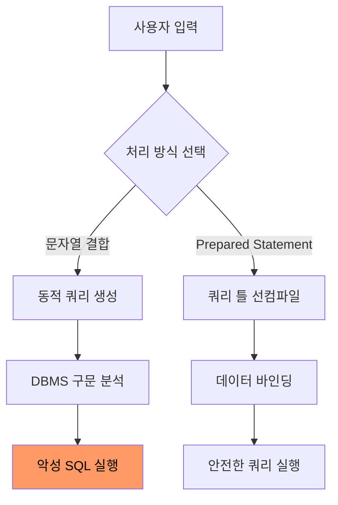
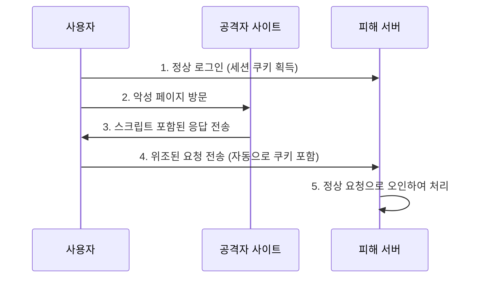

소프트웨어 개발 과정에서 개발자의 실수나 논리적 오류로 인한 보안 취약점을 사전에 차단하여 안전한 시스템을 구축하는 기법이다.

## 입력 데이터 검증 및 표현

외부 유입되는 모든 데이터는 신뢰할 수 없다는 전제 하에 엄격한 검증 절차를 거쳐야 한다.

### 1. SQL Injection

DBMS의 구문 분석(Parsing) 단계를 악용하여 기존 로직에 악성 SQL 구문을 주입하는 방식으로 동작한다.

#### 대응 방안

- Prepared Statement 사용: 쿼리 문법을 미리 컴파일하여 실행 계획을 확정하고 입력값은 단순 데이터로 처리
- ORM 파라미터 바인딩: JPA, Hibernate 등 현대적 프레임워크를 사용하여 자동으로 차단

#### 예시

```java
void main() {
    // 취약한 예: 문자열 결합 (Dynamic Query)
    String query = "SELECT * FROM users WHERE id = '" + userId + "'";

    // 안전한 예: Prepared Statement
    String sql = "SELECT * FROM users WHERE id = ?";
    PreparedStatement pstmt = connection.prepareStatement(sql);
    pstmt.setString(1, userId);
}
```


```mermaid
flowchart TD
    classDef point fill: #f96, color: #000
    A[사용자 입력] --> B{처리 방식 선택}
    B -- 문자열 결합 --> C[동적 쿼리 생성]
    C --> D[DBMS 구문 분석]
    D --> E[악성 SQL 실행]:::point
    B -- Prepared Statement --> F[쿼리 틀 선컴파일]
    F --> G[데이터 바인딩]
    G --> H[안전한 쿼리 실행]
```

### 2. 크로스 사이트 스크립트 (XSS)

웹 페이지에 악성 스크립트를 삽입하여 이를 열람하는 사용자의 브라우저에서 실행되도록 유도하는 공격이다.

- Stored XSS: 악성 스크립트가 DB에 저장되어 지속적으로 피해 발생
- Reflected XSS: URL 파라미터 등에 포함된 스크립트가 즉시 반사되어 실행

#### 대응 방안

- 출력값 인코딩: HTML 특수문자를 Entity 코드로 변환하여 브라우저가 스크립트가 아닌 단순 문자로 인식하도록 조치
- CSP (Content Security Policy) 도입: 브라우저가 실행 가능한 스크립트의 소스를 제한하여 미승인 스크립트 실행 차단
- 안전한 API 사용: innerHTML 대신 textContent나 innerText를 사용하여 브라우저 파싱 차단

#### 예시

```javascript
// 취약한 예: innerHTML 사용
document.getElementById('output').innerHTML = userInput;

// 안전한 예: textContent 사용
document.getElementById('output').textContent = userInput;
```

```http
// 보안 헤더 적용 예시
Content-Security-Policy: default-src 'self'; script-src 'self' https://trusted.cdn.com;
```

### 3. 위험한 형식 파일 업로드

확장자나 파일 타입 검증 없이 업로드를 허용하여 웹 쉘(Web Shell) 등의 악성 파일이 서버에서 실행되는 취약점이다.

#### 대응 방안

- 파일 시그니처 검증: 파일 헤더의 고유 바이트(Magic Number)를 확인하여 실제 파일 형식 검증
- 실행 권한 제거: 업로드 디렉토리의 실행 권한을 완전 제거하여 스크립트 파일 실행 방지
- 파일명 난수화 및 외부 저장: 원본 파일명을 UUID로 변경하고 웹 루트 외부 경로에 저장하여 직접 접근 차단

#### 예시

```java
public void uploadFile(MultipartFile file) {
    // 파일 시그니처 확인 (PNG 예시)
    byte[] header = file.getBytes(0, 8);
    if (!isPngSignature(header))
        throw new SecurityException("유효하지 않은 파일 형식");

    // 파일명 난수화 저장
    String savedName = UUID.randomUUID().toString() + ".png";
    Files.copy(file.getInputStream(), Paths.get("/upload/storage", savedName));
}
```

### 4. 경로 조작 및 자원 삽입

입력값에 경로 순회 문자(../) 등을 포함시켜 허가되지 않은 파일 시스템 경로에 접근하는 공격이다.

- 변조 전: `http://www.example.com/file/download/?filename=pic.jpg%path=data`
- 변조 후: `http://www.example.com/file/download/?filename=paaword%path=../../etc`

#### 대응 방안

- 경로 정규화 및 검증: getCanonicalPath() 등을 호출하여 최종 경로가 허용된 디렉토리 내에 존재하는지 확인
- 경로 순회 문자 제거: 파일명에서 슬래시(/), 백슬래시(\), 마침표(..) 등의 특수문자 필터링
- 인덱스 기반 접근: 파일명을 직접 받지 않고 서버 내 정의된 ID 값을 통해 매핑된 자원에 접근

#### 예시

```java
// 안전한 경로 검증
void main() {
    File file = new File("/app/data/", request.getParameter("filename"));
    String canonicalPath = file.getCanonicalPath();

    if (!canonicalPath.startsWith("/app/data/")) {
        throw new SecurityException("허가되지 않은 경로 접근");
    }
}
```

### 5. 운영체제 명령어 삽입

외부 입력값이 시스템 명령어 파라미터로 전달될 때 메타 문자(`|`, `;`, `&` 등)를 이용해 추가 명령어를 실행시키는 취약점이다.

#### 대응 방안

- 고수준 API 사용: OS 명령어를 직접 호출하는 대신 언어 및 프레임워크에서 제공하는 라이브러리 함수 활용
- 인자 분리 전달: ProcessBuilder와 같이 명령어와 인자를 분리된 리스트로 전달하는 API 사용
- 화이트리스트 검증: 명령어 옵션이나 인자의 값을 미리 정의된 안전한 목록과 대조하여 검증

#### 예시

```java
// 안전한 예: 인자 분리 전달
void main() {
    ProcessBuilder pb = new ProcessBuilder("nslookup", domain);
    pb.start();
}
```

### 6. 오픈 리다이렉트

사용자가 입력한 외부 URL로 자동 이동하는 기능을 악용하여 피싱 사이트로 유도하는 공격이다.

#### 대응 방안

- 도메인 화이트리스트 관리: 신뢰할 수 있는 도메인 리스트를 구축하여 허용된 범위 내에서만 리다이렉트 수행
- 상대 경로 강제: 외부 도메인 이동이 불필요한 경우 도메인 정보가 포함되지 않은 상대 경로만 사용하도록 제한

#### 예시

```java
public String safeRedirect(String url) {
    if (ALLOWED_DOMAINS.contains(extractDomain(url))) {
        return "redirect:" + url;
    }
    return "redirect:/home";
}
```

### 7. 크로스 사이트 요청 위조 (CSRF)

사용자의 인증된 세션을 악용하여 본인 의사와 무관하게 특정 웹 사이트에 위조된 요청을 전송하게 만드는 공격이다.

#### 대응 방안

- CSRF 토큰 사용: 모든 상태 변경 요청에 서버가 발행한 일회성 난수 토큰을 포함시켜 검증
- SameSite 쿠키 설정: 쿠키 속성을 Lax 또는 Strict로 지정하여 제3자 사이트에서의 쿠키 전송 제한
- 재인증 유도: 결제, 비밀번호 변경 등 민감한 작업 수행 시 비밀번호 재입력이나 추가 인증 요구

#### 예시

```html

<form action="/transfer" method="POST">
  <input type="hidden" name="_csrf" value="unique-token-per-session">
  <input type="text" name="amount">
  <button type="submit">이체</button>
</form>
```


```mermaid
sequenceDiagram
    participant User as 사용자
    participant Attacker as 공격자 사이트
    participant Server as 피해 서버
    User ->> Server: 1. 정상 로그인 (세션 쿠키 획득)
    User ->> Attacker: 2. 악성 페이지 방문
    Attacker ->> User: 3. 스크립트 포함된 응답 전송
    User ->> Server: 4. 위조된 요청 전송 (자동으로 쿠키 포함)
    Server ->> Server: 5. 정상 요청으로 오인하여 처리
```

### 8. 서버 사이드 요청 위조 (SSRF)

공격자가 서버를 대리자로 내세워 외부에서 접근 불가능한 내부망 자원이나 클라우드 메타데이터 API에 접근하는 공격이다.

#### 대응 방안

- 내부망 IP 접근 차단: 사설 IP 대역(10.x, 172.16.x, 192.168.x) 및 루프백 주소 접근 필터링
- 스키마 화이트리스트: http, https 프로토콜만 허용하고 file, gopher, ftp 등 불필요한 스키마 차단
- 도메인 검증: 외부 API 호출 시 사전에 정의된 도메인 화이트리스트와 대조 후 요청 전송

#### 예시

|      목적       |                              공격 코드 예시                              |
|:-------------:|:------------------------------------------------------------------:|
| 내부망 관리 페이지 접근 |         http://site.com/fetch?url=http://192.168.0.1/admin         |
|  서버 내부 파일 열람  |            http://site.com/fetch?url=file:///etc/passwd            |
| 클라우드 메타데이터 탈취 | http://site.com/fetch?url=http://169.254.169.254/latest/meta-data/ |

### 9. HTTP 응답 분할

헤더 영역에 개행 문자(CRLF)를 주입하여 하나의 응답을 두 개 이상의 응답으로 분리시키는 취약점이다.

#### 공격 수행 과정

공격자는 `Content-Length: 0` 헤더를 주입하여 첫 번째 응답을 강제로 종료시키고, 뒤이어 악성 코드가 담긴 두 번째 가짜 응답을 생성한다.

```http request
GET /test?
    param=Value%0d%0aContent-Length:%200%0d%0a%0d%0aHTTP/1.1%20200%20OK%0d%0aContent-Type:%20text/html%0d%0aContent-Length:%2019%0d%0a%0d%0a<html>Attack</html>
```

- `%0d%0a`: 줄바꿈(CRLF)
- `Content-Length: 0`: 첫 번째 응답이 해당 지점에서 끝난 것처럼 위장
- `%0d%0a%0d%0a`: 헤더와 바디를 구분하는 빈 줄 삽입 (첫 번째 응답 종료)
- `HTTP/1.1 200 OK...`: 두 번째 가짜 응답 시작

서버는 입력값을 검증 없이 헤더에 포함시키며, 이로 인해 응답 패킷이 논리적으로 분할된다.

```http request
HTTP/1.1 200 OK
Set-Cookie: param=Value
Content-Length: 0

# --- [여기서 첫 번째 응답이 종료된 것으로 처리됨] ---

HTTP/1.1 200 OK
Content-Type: text/html
Content-Length: 19

<html>Attack</html>

# --- [공격자가 주입한 가짜 응답이 실행됨] ---

```

- 브라우저나 프록시 서버는 이를 두 개의 별도 응답으로 인식
- 첫 번째 응답은 `Content-Length: 0`에 의해 무시되거나 정상 처리된 것으로 간주
- 두 번째 가짜 응답(`Attack`)이 사용자의 브라우저에서 실행되거나(XSS), 프록시 서버의 캐시에 저장되어 다른 사용자에게 악성 페이지가 노출 가능성 존재(Cache Poisoning)

#### 대응 방안

- 개행 문자 필터링: HTTP 헤더에 유입되는 모든 데이터에서 \r(CR), \n(LF) 문자를 제거하거나 치환
- 라이브러리 보안 강화: 최신 버전의 웹 프레임워크나 WAS의 헤더 검증 및 차단 기능 활성화

#### 예시

```java
public void setHeader(HttpServletResponse response, String name, String value) {
    // 개행 문자 제거 처리
    String cleanValue = value.replaceAll("[\\r\\n]", "");
    response.setHeader(name, cleanValue);
}
```

## 캡슐화와 정보 은닉

객체 지향 설계 원칙을 위배하여 내부 데이터나 시스템 구조가 의도치 않게 노출되는 보안 약점이다.

### 1. Private 배열의 외부 노출

private으로 선언된 배열의 참조 주소를 public 메서드가 그대로 반환하여 외부에서 내부 데이터를 직접 수정할 수 있게 되는 취약점이다.

#### 대응 방안

- 방어적 복사 수행: Getter 호출 시 Arrays.copyOf() 등을 통해 원본 데이터가 아닌 복사본 반환
- 입력 데이터 복사: Setter 호출 시 인자로 받은 배열을 복사하여 내부 변수에 할당함으로써 외부 참조 차단

#### 예시

```java
public class SecurityConfig {

    private String[] allowedIps;

    public String[] getAllowedIps() {
        if (this.allowedIps == null)
            return null;
        // 복사본 반환으로 원본 보호
        return Arrays.copyOf(this.allowedIps, this.allowedIps.length);
    }
}
```

### 2. 에러 메시지 정보 노출

시스템 오류 발생 시 상세한 Stack Trace가 사용자에게 노출되어 서버 구조나 라이브러리 정보가 유출되는 취약점이다.

#### 대응 방안

- 에러 메시지 추상화: 사용자에게는 간결한 표준 에러 메시지만 노출하고 상세 내용은 내부 로그에만 기록
- 전역 예외 처리기 도입: RestControllerAdvice 등을 통해 예외 발생 시 일관된 응답 구조 강제

#### 예시

```java

@ExceptionHandler(Exception.class)
public ResponseEntity<ErrorResponse> handle(Exception e) {
    log.error("Internal Error", e); // 서버 내부 기록
    return ResponseEntity.status(500).body(new ErrorResponse("시스템 오류가 발생했습니다."));
}
```

## 동시성 및 자원 관리

### 1. 경쟁 조건 (Race Condition)

자원에 대한 검사 시점(Check)과 사용 시점(Use) 사이의 시간차를 이용하는 TOCTOU 공격이 대표적이다.

#### 대응 방안

- 원자적 연산 수행: 검사와 사용이 단일 트랜잭션 또는 단일 연산 내에서 이루어지도록 구조 개선
- 동기화 블록 적용: 공유 자원 접근 시 synchronized 또는 Lock 객체를 사용하여 임계 영역 보호
- 격리 수준 조정: DB 트랜잭션 격리 수준을 강화하여 데이터 일관성 보장

#### 예시

```java
// 안전한 예: 동기화 적용
private final Object lock = new Object();

public void safeUpdate() {
    synchronized (lock) {
        if (!isProcessing)
            process();
    }
}
```

### 2. 하드코딩된 중요 정보

비밀번호나 암호화 키를 소스코드 내부에 평문으로 기록하여 노출되는 보안 약점이다.

#### 대응 방안

- 환경 변수 관리: 중요 정보를 운영 체제 환경 변수 또는 별도의 설정 파일로 분리하여 관리
- 빌드 도구 활용: 프로필(Profile) 기능을 사용하여 환경별 설정을 유동적으로 주입

#### 예시

```yaml
# 안전한 예: 설정 파일에서 환경 변수 참조
db:
  password: ${DB_PASSWORD}
```

---

###### 참고자료

- KISA 소프트웨어 보안 약점 가이드
- OWASP Top 10 웹 보안 위협 대응 보고서
- 행정안전부 정보시스템 구축·운영 지침
