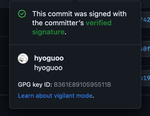

로컬 환경에서 생성한 GPG(GNU Privacy Guard) 키를 이용해 커밋에 서명하고, GitHub에서 `Verified` 딱지를 받기 위한 설정 방법을 안내한다.



### 1. GnuPG 설치

GPG 암호 입력을 위한 GUI 프롬프트를 제공하는 `pinentry-mac`을 먼저 설치한다.

```shell
brew install gnupg pinentry-mac
```

### 2. GPG 키 생성

아래 명령어를 실행하여 GPG 키를 생성한다.

```shell
gpg --full-generate-key
```

명령어 실행 후 나타나는 프롬프트에서 다음 옵션을 순서대로 선택한다.

- 키 종류: `(1) RSA and RSA`
- 키 사이즈: `4096`
- 키 유효 기간: `0` (key does not expire)
- 사용자 정보: 이름(`Real name`)과 이메일 주소(`Email address`) 입력
    - 이메일은 GitHub 계정과 반드시 일치

옵션 설정을 마치면 키를 보호하기 위한 암호를 입력받는데, 이 암호는 커밋 서명 시 사용된다.

### 3. 생성된 GPG 키 ID 확인

Git이 커밋에 서명할 때 사용하기 위한 생성된 GPG 키의 ID를 확인한다.

```shell
gpg --list-secret-keys --keyid-format=long
```

```
/Users/hyogu/.gnupg/pubring.kbx
-------------------------------
sec   rsa4096/A*************** 2023-04-25 [SC]
   B***************************************
uid                 [ultimate] hyoguoo <hyoguoo@gmail.com>
ssb   rsa4096/C*************** 2023-04-25 [E]
```

위에 값 중 A로 시작하는 키가 있는 곳이 GPG Key ID다.

### 4. Git 설정

GPG 서명을 사용하도록 설정하기 위해, `.gitconfig` 파일에 아래 내용을 추가한다.

```
# ~/.gitconfig
[user]
    name = hyoguoo
    email = hyoguoo@gmail.com
    signingkey = A***************
[commit]
    gpgsign = true
[gpg]
    program = gpg
```

`signingkey`에는 위에서 확인한 GPG 키 ID를 입력한다.

### 5. GPG Agent 설정

`pinentry-mac`을 사용하도록 GPG Agent 설정을 추가하고 Agent를 재시작한다.

```shell
# pinentry-mac 경로를 gpg-agent.conf 파일에 추가
echo "pinentry-program $(which pinentry-mac)" >> ~/.gnupg/gpg-agent.conf
```

```shell
# GPG Agent 재시작
killall gpg-agent
```

### 6. GitHub에 GPG 공개키 등록

로컬에서 생성한 GPG 키의 공개키를 GitHub 계정에 등록한다.

#### 공개키 확인

아래 명령어로 공개키를 터미널에 출력한다.

```shell
gpg --armor --export A***************
```

명령어를 실행하여 출력된 `-----BEGIN PGP PUBLIC KEY BLOCK-----`부터 `-----END PGP PUBLIC KEY BLOCK-----`까지의 내용을 모두 복사한다.

#### 키 등록

GitHub 설정의 `Settings > Access > SSH and GPG keys` 페이지로 이동하여 `New GPG key`를 클릭하고, 복사한 공개키를 붙여넣어 등록한다.

### 7. 커밋 확인

모든 설정이 완료되면, 최초 커밋 암호 입력 이후 생성하는 커밋은 자동으로 서명되며 GitHub에서 `Verified`로 표시된다.(암호는 GPG 키 생성 시 설정한 암호)

## GPG 서명 에러

커밋 시 `error: gpg failed to sign the data` 와 같은 에러가 발생하면 GPG 키 신뢰도나 `pinentry` 설정 문제일 수 있다.

### 1. GPG 키 확인 및 git에 등록된 키 일치 여부 확인

먼저 GPG 키가 올바르게 설정되어 있는지 확인한다.

```shell
gpg --list-secret-keys --keyid-format LONG
git config --global user.signingkey A***************
```

### 2. 해당 키에 대한 신뢰 수준을 `ultimate`로 수동 설정

GPG 키에 대한 신뢰 수준을 `ultimate`으로 수동 설정한다.

```shell
gpg --edit-key A***************
```

GPG 프롬프트가 나타나면 `trust`를 입력하고, 신뢰 수준을 `5`로 선택한 뒤 `quit`로 빠져나온다.

### 3. GPG Agent 재설정

`pinentry` 경로를 다시 설정하고 Agent를 재시작한다.

```shell
echo "pinentry-program $(which pinentry-mac)" > ~/.gnupg/gpg-agent.conf
killall gpg-agent
```

위의 절차를 모두 수행한 뒤 다시 커밋을 시도하면 다시 정상적으로 `Verified` 커밋이 가능해진다.
