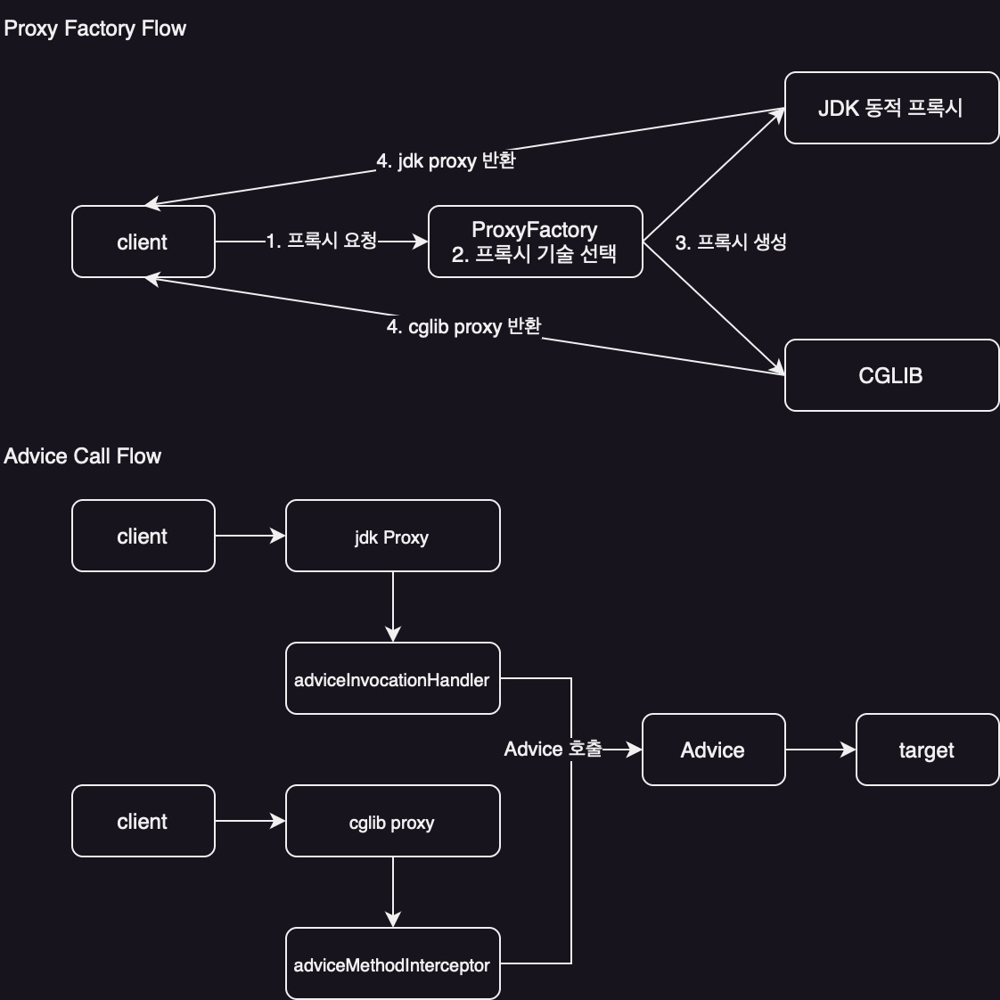
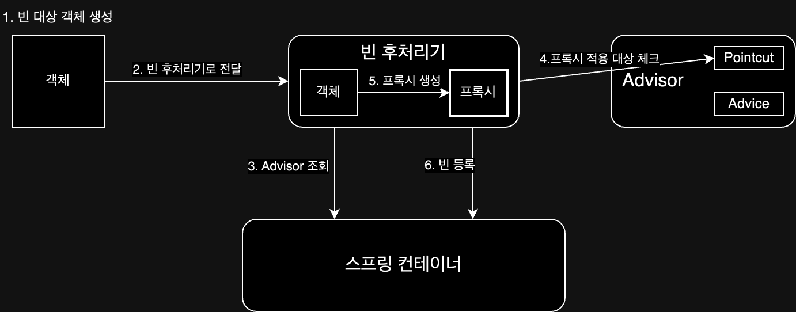

> 관점 지향 프로그래밍

애플리케이션 로직은 크게 핵심 기능과 부가 기능으로 나눌 수 있는데, 두 코드를 같은 곳에 작성하게 되면 다음과 같은 문제가 발생한다.

- 중복되는 부가 기능 코드가 여러 곳에 흩어져 존재
- 핵심 기능과 부가 기능이 섞여 코드가 복잡해짐
- 부가 기능을 변경할 때 핵심 기능 코드도 함께 수정해야 함

때문에 이를 분리하려는 시도를 하기 시작했고, 부가적인 기능을 분리하여 설계하여 개발 하는 방법을 관점 지향 프로그래밍(AOP)이라고 한다.

## 용어 정리

- 애스펙트(Aspect)
    - 여러 객체에 공통으로 적용되는 관심사(부가 기능)의 모듈화(어드바이스 + 포인트컷)
    - 스프링에서는 `@Aspect` 애노테이션을 사용한 클래스로 구현
- 조인 포인트(Join point)
    - 추상적인 개념으로, 어드바이스가 적용될 수 있는 모든 지점을 의미
    - 메소드 실행 시점, 생성자 호출 시점, 필드 값 접근 시점 등 애플리케이션 실행 흐름의 특정 지점 모두가 해당
- 어드바이스(Advice)
    - 조인 포인트에서 실행되어야 할 부가 기능 로직
- 포인트컷(Pointcut)
    - 수많은 조인 포인트 중에서 어드바이스를 적용할 지점을 선별하는 기능
    - AspectJ 표현식을 사용하여 구체적으로 지정
- 타겟(Target)
    - 어드바이스가 적용되는 대상 객체
- 어드바이저(Advisor)
    - 하나의 어드바이스와 하나의 포인트컷으로 구성된 객체
    - 스프링 AOP에서만 사용되는 용어
- 위빙(Weaving)
    - 포인트컷으로 결정한 타겟의 조인 포인트에 어드바이스를 적용하는 과정
    - 위빙을 통해 핵심 기능 코드의 변경 없이 부가 기능을 추가할 수 있다
- AOP 프록시(AOP Proxy)
    - AOP 기능을 구현하기 위해 만든 프록시 객체

## JDK 동적 프록시 / CGLIB

스프링에서 프록시 패턴을 구현하는 방법으론 다음 두 가지가 있다.

### JDK 동적 프록시

- 자바 표준 라이브러리가 제공하는 기술
- 인터페이스 기반으로 프록시를 생성(타겟이 구현한 인터페이스가 있어야만 프록시 생성 가능)
- `InvocationHandler` 인터페이스를 구현하여 프록시의 동작 정의

```java
class TestInvocationHandler implements InvocationHandler {

    private TargetInterface target; // Target, 적용이 될 실제 객체

    public TestInvocationHandler(TargetInterface target) {
        this.target = target;
    }

    @Override
    public Object invoke(Object proxy, Method method, Object[] args) throws Throwable {
        log.info("log start");
        Object result = method.invoke(target, args);  // 실제 객체의 메서드 호출
        log.info("log end");

        return result;
    }
}
```

### CGLIB

- 외부 라이브러리로, 바이트코드를 조작하여 프록시를 생성
- 클래스 상속 기반으로 프록시를 생성하므로 인터페이스 필요 없음
- 클래스나 메서드에 `final` 키워드가 있으면 상속이 불가능하거나 오버라이딩이 불가능하기 때문에 `final` 키워드가 없는 클래스나 메서드만 적용 가능
- `MethodInterceptor` 인터페이스를 구현하여 프록시의 동작을 정의

```java
class TestMethodInterceptor implements MethodInterceptor {

    private TargetImpl target; // Target, 적용이 될 실제 객체

    public TestMethodInterceptor(TargetImpl target) {
        this.target = target;
    }

    @Override
    public Object intercept(Object obj, Method method, Object[] args, MethodProxy proxy) throws Throwable {
        log.info("log start");
        Object result = proxy.invoke(target, args); // 실제 객체의 메서드 호출
        log.info("log end");

        return result;
    }
}
```

예시 코드에서 볼 수 있듯이 프록시 패턴을 구현해야하는 인터페이스가 다르기 때문에 구현하는데 복잡성을 가지는데, 스프링에서는 이를 추상화시켜 사용할 수 있도록 Proxy Factory를 제공한다.

## Proxy Factory

Proxy Factory는 스프링에서 프록시 객체를 생성하고 요청을 처리하는 방법을 통일하여 사용할 수 있도록 추상화한 것이다.



인터페이스 유무 혹은 옵션에 따라 JDK 동적 프록시와 CGLIB를 사용하여 프록시 패턴을 구현해주는 기능을 제공한다.

- Proxy Factory를 이용한 예시 코드

```java
// 부가 기능을 제공할 Advice
class LogTraceAdvice implements MethodInterceptor {

    @Override
    public Object invoke(MethodInvocation invocation) throws Throwable {
        log.info("log start");
        Object result = invocation.proceed(); // 실제 객체의 메서드 호출
        log.info("log end");

        return result;
    }
}

class ExampleProxyFactory {

    public Object getProxy(Object target) {
        // Pointcut
        NameMatchMethodPointcut pointcut = new NameMatchMethodPointcut();
        pointcut.setMappedNames("request*", "order*", "save*");

        // Advice
        LogTraceAdvice advice = new LogTraceAdvice();

        // Advisor
        Advisor advisor = new DefaultPointcutAdvisor(pointcut, advice);

        return new ProxyFactory()
                .setTarget(target)
                .addAdvisor(advisor)
                .getProxy();
    }
}

class Main {

    public static void main(String[] args) {
        Example example = new Example();
        ExampleProxyFactory proxyFactory = new ExampleProxyFactory();
        Example proxy = (Example) proxyFactory.getProxy(example);
        proxy.execute();
    }
}
```

이 방법으로 생성 방법은 통일되었지만, 다음과 같은 단점이 존재한다.

- 적용할 메서드를 하나하나 수동으로 등록 필요
- 컴포넌트 스캔을 하는 경우 프록시 객체 생성이 불가능

때문에 컴포넌트 스캔을 포함한 등록되는 빈들에 대해 프록시 객체를 적용하는 빈 후처리기 방법이 등장하게 되었다.

## 빈 후처리기

빈 후처리기를 이용하면 컴포넌트 스캔을 포함한 등록되는 빈들에 대해 프록시 객체를 적용하여 등록할 수 있다.

```java
// Processor.java
class PackageLogTracePostProcessor implements BeanPostProcessor {

    private final String basePackage; // 프록시 적용 패키지
    private final Advisor advisor; // Advice + Pointcut

    public PackageLogTracePostProcessor(String basePackage, Advisor advisor) {
        this.basePackage = basePackage;
        this.advisor = advisor;
    }

    @Override
    public Object postProcessAfterInitialization(Object bean, String beanName) throws BeansException {
        String packageName = bean.getClass().getPackageName();

        // 프록시 적용 대상 여부 체크
        if (!packageName.startsWith(basePackage)) {
            return bean; // 프록시 적용 대상이 아니면 원본을 반환
        }

        // 프록시 대싱이면 프록시를 만들어서 반환
        return new ProxyFactory()
                .setTarget(bean)
                .addAdvisor(advisor)
                .getProxy();
    }
}

// Config.java
@Configuration
@Import({AppV1Config.class, AppV2Config.class})
class BeanPostProcessorConfig {

    @Bean
    public PackageLogTracePostProcessor logTracePostProcessor() {
        return new PackageLogTracePostProcessor("hello.proxy.app", getAdvisor());
    }

    @Bean
    public DefaultPointcutAdvisor advisor() {
        return new DefaultPointcutAdvisor(Pointcut.TRUE, new MyAdvice());
    }
}
```

하지만 이 방법을 사용하더라도 포인트 컷(=빈 후처리기)과 어드바이스(=Proxy Factory)를 별도로 정의해야 하기 때문에 여전히 복잡하고 관리하기 어렵다는 단점이 존재한다.

## @Aspect

프록시를 직접 생성하여 구현하는 방법이 아닌 CGLib를 사용하여 바이트 코드를 조작하여 기능을 제공하는 방법으로, 가장 간단하게 AOP를 구현할 수 있는 방법이다.

```java
// Aspect.java
@Aspect
class ExampleAspect {

    @Around(value = "execution(* hello.proxy.app..*(..))") // Pointcut
    public Object execute(ProceedingJoinPoint joinPoint) throws Throwable {
        // Advice 로직
        // ...

        Object result = joinPoint.proceed(); // 실제 객체의 메서드 호출

        // ...
        // Advice 로직
        return result;
    }
}

// Config.java
@Configuration
class AopConfig {

    @Bean
    public LogTraceAspect logTraceAspect(LogTrace logTrace) {
        return new LogTraceAspect(logTrace);
    }
}
```

포인트컷(Pointcut)과 어드바이스(Advice)로 구성된 어드바이저(Advisor)의 생성을 편리하게 해주는 기능을 가진 어노테이션을 통해 훨씬 간단하게 부가 기능을 제공할 수 있다.

### @Aspect의 동작 방식

@Aspect를 사용하여 프록시 객체를 적용할 때, 어드바이저 생성과 프록시 객체 적용은 다음과 같은 흐름으로 동작하게 된다.

- 어드바이저 자동 탐색 및 생성
    1. 스프링 컨테이너 초기화 시 `@Aspect` 애노테이션이 붙은 빈 조회
    2. `@Aspect` 애노테이션 정보를 기반으로 어드바이저 생성
    3. 어드바이저 등록



- 프록시 객체 적용
    1. 스프링 빈 대상이 되는 객체 생성
    2. 생스프링 컨테이너는 등록되는 모든 빈에 대해 `BeanPostProcessor`를 통해 2차 가공 시도
    3. 스프링 빈 컨테이너에서 어드바이저 조회
    4. 생성된 빈이 캐싱된 어드바이저들의 포인트컷 조건 대상인지 검사
    5. 대상이라면, 프록시 팩토리를 통해 해당 빈의 프록시 객체를 생성(원본 객체는 프록시 내부에서 참조)
    6. 원본 객체 대신 프록시 객체를 스프링 빈으로 컨테이너에 등록

## 프록시 내부 호출 (Self-Invocation) 문제

AOP 프록시가 적용된 객체의 내부에서 다른 메서드를 호출할 때 AOP가 적용되지 않는 문제가 발생할 수 있다. 이는 프록시를 거치지 않고 `this` 참조를 통해 원본 객체의 메서드를 직접 호출하기 때문이다.

```java

@Service
class MyService {

    public void external() {
        // ... 로직 ...
        this.internal(); // 프록시를 거치지 않고 원본 객체의 메서드를 직접 호출
    }

    @Transactional
    public void internal() {
        // 트랜잭션이 적용되기를 기대하는 로직
    }
}
```

위 코드에서 `external()`을 호출하면 `internal()`은 트랜잭션 어드바이스를 타지 않는다. 이 문제를 해결하는 방법은 다음과 같다.

- 자기 자신 주입: 생성자나 `@Autowired`를 통해 프록시 객체인 자기 자신을 주입받아 호출하는 방식
- 지연 조회: `ApplicationContext`나 `ObjectProvider`를 사용해 실제 필요한 시점에 프록시 객체를 조회(lookup)하여 사용하는 방식
- 구조 변경: 스프링이 가장 권장하는 방법 내부 호출이 필요한 로직을 별도의 클래스로 분리하여 의존성을 주입받아 사용하는 방식

## 스프링과 CGLIB

최신 버전의 스프링 부트에서는 프록시 객체를 생성할 때 기본적으로 CGLIB를 사용하는데, 이를 통해 아래와 같은 장점을 가지게 된다.

- 인터페이스가 없는 클래스도 프록시로 만들 수 있음
- 의존관계 주입 시 문제가 발생하지 않음(JDK 동적 프록시는 발생)

하지만 CGLIB는 클래스를 상속받아 생성하는 방식이기 때문에 다음과 같은 제약사항이 존재했지만 3번을 제외하고는 이미 해결되었다.(`objenesis`라는 라이브러리를 사용하여 해결)

1. 대상 클래스에 기본 생성자가 반드시 존재해야 함
2. 생성자 호출이 두 번 발생(실제 객체를 생성할 때 + 프록시 객체를 생성할 때)
3. final 클래스, final 메서드가 있는 경우 프록시를 생성할 수 없음

3번 문제는 아직 해결하지 못했으나 대부분의 경우 final 키워드를 잘 사용하지 않기 때문에 큰 문제가 되지 않는다.

###### 참고자료

- [스프링 핵심 원리 - 고급편](https://www.inflearn.com/course/스프링-핵심-원리-고급편)
