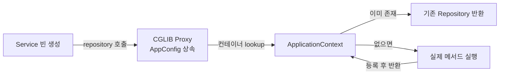

> 스프링 빈(Bean) : 스프링 컨테이너가 생성하고 생명주기를 관리하는 자바 객체

Bean은 스프링을 구성하는 핵심 요소로, 빈 정의 메타데이터(BeanDefinition)로 등록되고 컨테이너는 해당 정의에 따라 객체를 생성, 의존성 주입, 초기화, 소멸까지 관리한다.

## BeanDefinition (빈 설정 메타데이터)

스프링 컨테이너는 다양한 설정 형식(XML, JavaConfig)을 `BeanDefinition`이라는 추상화된 메타데이터로 변환하여 관리한다.

1. class
    - 빈으로 등록할 Java 클래스
    - 스프링 컨테이너에 의해 객체로 생성 및 관리되어 클래스의 인스턴스를 Bean으로 사용
2. id
    - 컨테이너에서 빈을 식별하기 위한 고유 식별자
    - 클래스명을 decapitalize한 이름을 기본으로 부여하며, 명시적으로 지정 가능
3. scope
    - 빈 인스턴스의 생존 범위 정의
    - 기본값 singleton
4. constructor-arguments
    - Bean을 생성할 때 생성자에 전달할 인자들을 정의
    - Bean을 초기화하는 데 사용
5. property
    - Bean을 생성할 때 setter를 통해 전달할 인자들을 정의
6. 기타 메타데이터
    - initMethod, destroyMethod, lazyInit, primary, autowireCandidate, dependsOn, description 등

## 단일 구현체임에도 빈을 사용하는 이유

다형성을 활용하지 않는 단일 구현 클래스도 빈으로 등록하면 다음과 같은 인프라적 혜택을 얻을 수 있다.

- AOP 프록시 적용: `@Transactional`, `@Async`, `@Cacheable` 등 프록시 기반의 선언적 기능을 사용하기 위해 필수적임
- 생명주기 제어: 초기화 및 소멸 콜백을 통해 결정적인 자원 해제와 부트스트랩 로직을 수행할 수 있음
- 외부 설정 바인딩: `@Value`나 `@ConfigurationProperties`를 통해 환경 변수를 자동으로 주입받아 객체 내부를 구성할 수 있음
- 일관된 테스트: Mock 객체 주입을 통해 외부 의존성 없이 핵심 로직을 검증하는 환경을 제공함

## 스프링 빈 등록 방법

### 1. 컴포넌트 스캔

- 사용 어노테이션: `@Component` 와 특화 어노테이션(`@Controller`, `@Service`, `@Repository`, 등)
- 탐색 범위: `@ComponentScan` 을 통해 지정하며, 일반적으로 `@SpringBootApplication` 위치를 기준으로 하위 패키지를 스캔함

### 2. 자바 설정(@Configuration + @Bean)

- 외부 라이브러리 객체 등록: 소스 코드를 수정할 수 없는 외부 라이브러리를 빈으로 등록할 때 필수적임
- 조건부 빈 등록: 런타임 환경이나 특정 설정값에 따라 구현체를 동적으로 선택해야 하는 경우 유용함
- 생성 과정에 로직이 필요한 경우: 빌더 호출, 검증, 여러 빈의 조립 등 생성 자체가 한 줄로 끝나지 않을 때 메서드 본문에 로직을 담을 수 있음

## @Configuration과 @Component의 차이

`@Configuration` 클래스를 CGLIB 프록시로 감싸서, `@Bean` 메서드 호출을 가로채 이미 생성된 빈이 있으면 컨테이너 캐시에서 반환하여 싱글톤을 보장한다.

```java

@Configuration
class AppConfig {

    @Bean
    Repository repository() {
        return new Repository();
    }

    @Bean
    Service service() {
        return new Service(repository());  // 직접 호출처럼 보이지만 프록시가 가로채 컨테이너 캐시 반환
    }

    @Bean
    AuditLog auditLog() {
        return new AuditLog(repository());  // 위와 동일한 Repository 인스턴스
    }
}
```

`repository()`는 코드상 두 번 호출되지만 실제 인스턴스는 하나만 생성되어 `service()`와 `auditLog()` 모두 같은 Repository 빈을 참조한다.



## 빈 생명주기

1. 스프링 컨테이너 생성
2. 스프링 빈 생성 및 등록: 생성자 주입은 이 단계에서 의존성 주입이 동시에 발생
3. [의존 관계 주입](/docs/spring/dependency-injection/): 수정자 및 필드 주입 단계
4. 초기화 콜백: 의존관계 주입 완료 후 호출
5. 런타임 사용
6. 소멸 전 콜백: 빈이 소멸되기 직전에 호출
7. 스프링 종료

## 초기화·소멸 콜백 방식 비교

### `@PostConstruct`, `@PreDestroy`

자바 표준 기술로 가장 권장된다.

```java
class MyBean {

    @PostConstruct
    void init() {
    }

    @PreDestroy
    void close() {
    }
}
```

### `@Bean(initMethod, destroyMethod)`

외부 라이브러리의 특정 메서드를 콜백으로 지정할 때 사용한다.

```java

@Bean(initMethod = "init", destroyMethod = "close")
HikariDataSource dataSource() {
    return new HikariDataSource();
}
```

### 인터페이스(`InitializingBean`, `DisposableBean`)

스프링 전용 인터페이스에 의존하므로 최신 설계에서는 권장되지 않는다.

```java
class MyBean implements InitializingBean, DisposableBean {

    @Override
    public void afterPropertiesSet() {
    }

    @Override
    public void destroy() {
    }
}
```

#### @Bean(initMethod, destroyMethod) 상세

`@Bean(initMethod, destroyMethod)`는 리플렉션으로 호출하는 방식으로 콜백을 등록하기 때문에, 라이브러리마다 종료 메서드 이름이 다르더라도 자유롭게 지정할 수 있다.

```java

@Configuration
class InfraConfig {

    @Bean(destroyMethod = "close")
    JedisPool jedisPool() {
        return new JedisPool("localhost", 6379);
    }

    @Bean(destroyMethod = "close")
    HikariDataSource dataSource() {
        HikariConfig config = new HikariConfig();
        config.setJdbcUrl("jdbc:mysql://...");
        return new HikariDataSource(config);
    }
}
```

라이브러리마다 종료 메서드 이름이 다르더라도, 임의의 메서드명을 지정하여 컨테이너가 종료 시점에 호출하도록 할 수 있다.

|         라이브러리          |             종료 메서드              |
|:----------------------:|:-------------------------------:|
|        HikariCP        |            `close()`            |
| Netty `EventLoopGroup` |     `shutdownGracefully()`      |
|   Quartz `Scheduler`   |          `shutdown()`           |
|        커스텀 클래스         | `cleanup()`, `dispose()` 등 자유롭게 |

`destroyMethod`를 지정하지 않으면, 스프링이 `close()` 같은 일반적인 종료 메서드를 자동으로 찾아 등록하기 때문에, 의도치 않은 호출을 막으려면 명시적으로 빈 문자열로 비활성화해야 한다.

## 스코프 (Scope)

- 싱글톤(Default): 컨테이너 기동부터 종료까지 단 하나의 인스턴스만 유지하며 모든 사용자가 공유함
- 프로토타입: 요청 시마다 새로운 인스턴스를 생성하며, 컨테이너는 생성·주입·초기화까지만 책임지고 이후 관여하지 않음 (소멸 콜백 호출 안 됨)
- 웹 스코프: request(요청), session(세션), application(서블릿 컨텍스트) 등 특정 웹 생명주기에 결속됨

### 스코프 불일치 문제 (Scope Mismatch)

싱글톤 빈이 짧은 생명주기를 가진 빈(prototype, request)을 주입받으면, 주입 시점에 고정되어 의도한 대로 동작하지 않는 문제가 발생한다.

- 원인: 싱글톤 빈은 생성 시점에 딱 한 번만 의존성을 주입받기 때문임
- 해결 1 (Scoped Proxy): `@Scope(proxyMode = ScopedProxyMode.TARGET_CLASS)`를 설정하여, 실제 빈이 아닌 호출 시점에 컨테이너에 요청하는 프록시 객체를 주입함
- 해결 2 (ObjectProvider): `ObjectProvider<T>`를 주입받아, 실제 사용 시점에 `provider.getObject()`를 호출하여 매번 새 인스턴스를 가져옴

###### 참고자료

- [스프링 핵심 원리 - 기본편](https://www.inflearn.com/course/스프링-핵심-원리-기본편)
