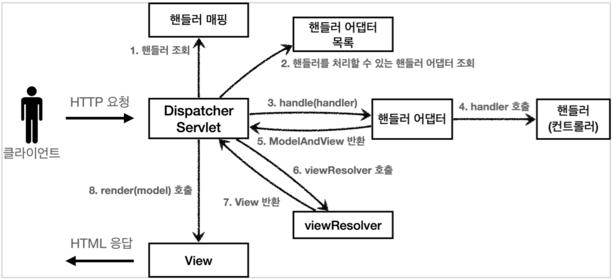

`org.springframework.web.servlet.DispatcherServlet` 클래스는 스프링 MVC의 핵심 컴포넌트로, 요청을 처리하는 프론트 컨트롤러 역할을 한다.

- 부모 클래스에서 `HttpServlet`을 상속받아 사용하고, 서블릿으로 동작
- 스프링 부트는 자동 구성으로 디스패처 서블릿을 서블릿 컨테이너에 등록하고 기본 경로에 (`urlPatterns = "/"`) 매핑
- 디스패처 서블릿은 웹 애플리케이션 컨텍스트가 준비된 직후, 요청 처리에 필요한 전략 객체(리졸버·어댑터·매핑 등)를 한 번에 조회해 보관하고 처리

## 요청 흐름

1. 서블릿 컨테이너가 `HttpServlet`의 `service()`를 호출하여 HTTP 메서드에 맞는 `doGet`/`doPost` 등으로 진입
2. `FrameworkServlet`은 각 `doXxx()`를 공통 처리로 묶어 `processRequest()`를 실행
    - Locale, Context 바인딩 및 요청 속성 준비
    - 멀티파트 요청 감지 시 래핑 처리
    - `doService(request, response)` 호출
3. `DispatcherServlet`은 `doService()`를 오버라이드하여 핵심 라우팅 로직인 `doDispatch()`를 호출

`HttpServlet.service → FrameworkServlet.service/doXxx → processRequest → DispatcherServlet.doService → doDispatch`

### `doDispatch()` 코드 분석 및 요청 흐름



핵심 로직인 `doDispatch()`의 내부 코드를 살펴보면 Spring MVC Flow의 전반적인 동작을 확인할 수 있다.

```java
public class DispatcherServlet extends FrameworkServlet { // FrameworkServlet -> HttpServletBean -> HttpServlet

    // ...
    protected void doDispatch(HttpServletRequest request, HttpServletResponse response) throws Exception {
        HttpServletRequest processedRequest = request;
        HandlerExecutionChain mappedHandler = null;

        // ...

        try {
            ModelAndView mv = null;
            try {
                // 1. 핸들러 조회
                mappedHandler = getHandler(processedRequest);
                if (mappedHandler == null) {
                    noHandlerFound(processedRequest, response);
                    return;
                }
                // 2.핸들러 어댑터 조회 - 핸들러를 처리할 수 있는 어댑터
                HandlerAdapter ha = getHandlerAdapter(mappedHandler.getHandler());
            } catch (Exception ex) {
                // ...
            } catch (Throwable err) {
                // ...
            }
            /**
             * 3. 핸들러 어댑터 실행
             * 4. 핸들러 어댑터를 통해 핸들러 실행
             * 5. ModelAndView 반환 mv = ha.handle(processedRequest, response, mappedHandler.getHandler());
             */
            processDispatchResult(processedRequest, response, mappedHandler, mv, dispatchException);
        } catch (Exception ex) {
            // ...
        } catch (Throwable err) {
            // ...
        } finally {
            // ...
        }
    }

    private void processDispatchResult(HttpServletRequest request, HttpServletResponse response,
            @Nullable HandlerExecutionChain mappedHandler, @Nullable ModelAndView mv,
            @Nullable Exception exception) throws Exception {
        // ...
        render(mv, request, response); // 뷰 렌더링 호출
        // ...
    }

    protected void render(ModelAndView mv, HttpServletRequest request, HttpServletResponse response) throws Exception {
        // ...
        View view;
        String viewName = mv.getViewName(); //6. 뷰 리졸버를 통해서 뷰 찾기, 7.View 반환
        // ...
        view = resolveViewName(viewName, mv.getModelInternal(), locale, request);
        // ...
        // 8. 뷰 렌더링
        view.render(mv.getModelInternal(), request, response);
        // ...
    }
}
```

| 순서 |         내용         |                              설명                              |
|:--:|:------------------:|:------------------------------------------------------------:|
| 1  |       핸들러 조회       |                핸들러 매핑을 통해 요청 URL에 매핑된 핸들러 조회                 |
| 2  |     핸들러 어댑터 조회     |                   핸들러를 처리할 수 있는 핸들러 어댑터 조회                   |
| 3  |     핸들러 어댑터 실행     |                          핸들러 어댑터 실행                          |
| 4  | 핸들러 어댑터를 통해 핸들러 실행 |                      핸들러 어댑터를 통해 핸들러 실행                      |
| 5  |  ModelAndView 반환   |          핸들러 어댑터는 핸들러의 반환 정보를 ModelAndView로 변환해서 반환          |
| 6  |  뷰 리졸버를 통해서 뷰 찾기   |                       뷰 리졸버를 통해서 뷰를 찾음                       |
| 7  |      View 반환       | 뷰 리졸버는 논리 뷰 이름을 물리 뷰 이름으로 변환해서 반환 후 렌더링 역할을 담당하는 View 객체를 반환 |
| 8  |       뷰 렌더링        |             View 객체의 `render()` 메서드를 호출해서 뷰 렌더링              |

###### 참고자료

- [스프링 MVC 1편 - 백엔드 웹 개발 핵심 기술](https://www.inflearn.com/course/스프링-mvc-1)
