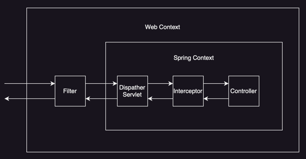

## 필터(Filter)

자바에서 제공하는 스펙으로, 디스패처 서블릿(DispatcherServlet)에 요청이 전달되기 전과 후에 작업을 필터링(Filter) 처리 할 수 있는 기능을 제공한다.

### 동작 순서

1. 클라이언트 요청이 서블릿 컨테이너에 도착
2. 등록된 필터 체인이 dispatcherType 설정에 맞는 요청에 대해 순서대로 실행
3. 체인 마지막에서 디스패처 서블릿으로 전달
4. 서블릿 처리 완료 후 필터 체인의 나머지 구간이 역순으로 실행

- 스프링 영역에 있지 않아, 스프링에 구현 된 예외 처리기를 적용 받지 않아 예외 처리 별도로 해야 함
- 필터는 체인하여 여러 개를 사용할 수 있으며, 체인된 순서대로 필터 실행

필터는 `javax.servlet.Filter` 인터페이스를 구현하여 사용한다.

```java
public interface Filter {

    default void init(FilterConfig filterConfig) throws ServletException {
    }

    void doFilter(ServletRequest request, ServletResponse response, FilterChain chain)
            throws IOException, ServletException;

    default void destroy() {
    }
}
```

- `init()`: 필터 초기화 메서드, 서블릿 컨테이너가 생성될 때 호출
- `doFilter()`: 고객의 요청이 올 때 마다 해당 메서드가 호출되는 곳으로, 필터의 로직 구현 부분
- `destroy()`: 필터 종료 메서드, 서블릿 컨테이너가 종료될 때 호출

doFilter 구현부에서 `chain.doFilter(request, response)`를 호출하지 않으면 다음 필터가 실행되지 않는다.

```java
public class MyFilter implements Filter {

    @Override
    public void doFilter(ServletRequest request, ServletResponse response, FilterChain chain)
            throws IOException, ServletException {
        // 다음 필터로 넘기기 전의 로직
        chain.doFilter(new MockHttpServletRequest(), new MockHttpServletResponse());
        // 다음 필터가 실행된 후의 로직
    }
}
```

파라미터로 넘기는 request / response 는 다음 필터에 전달되며, 아예 다른 객체를 넘길 수 있다.

### 등록 방법

스프링 부트에서는 FilterRegistrationBean으로 순서와 URL 패턴을 제어할 수 있다.

```java

@Configuration
public class FilterConfig {

    @Bean
    public FilterRegistrationBean<MyFilter> myFilter() {
        FilterRegistrationBean<MyFilter> reg = new FilterRegistrationBean<>();
        reg.setFilter(new MyFilter());
        reg.addUrlPatterns("/*");      // 적용 경로
        reg.setOrder(1);               // 실행 순서(값이 작을수록 먼저 실행)
        reg.setDispatcherTypes(DispatcherType.REQUEST, DispatcherType.ERROR);
        return reg;
    }
}
```

### 용도

필터는 스프링과 무관하게 전역적으로 처리해야 하는 작업들을 처리하는데 사용한다.

- 인코딩 변환
- 모든 요청에 대한 로깅
- 공통된 인증/인가 작업(Spring Security)
- 요청/응답 본문 로깅 시 ContentCachingRequestWrapper/ResponseWrapper 활용
- OncePerRequestFilter를 상속해 중복 실행을 방지

## 인터셉터(Interceptor)

Spring에서 제공하는 스펙으로, 디스패처 서블릿이 컨트롤러를 호출하기 전과 후에 요청과 응답을 가로채(intercept) 처리하는 기능을 제공한다.

- 필터와 달리 스프링 영역에 있어, 스프링에 구현 된 예외 처리기를 적용 받아 예외 처리 가능
- 디스패처 서블릿에서 핸들러 매핑을 통해 컨트롤러를 찾아 요청하면 실행 체인을 얻음
- 얻은 실행 체인에 인터셉터가 등록되어 있다면 컨트롤러를 호출하기 전과 후에 인터셉터가 실행

### 동작 순서

1. 디스패처 서블릿이 핸들러 매핑으로부터 HandlerExecutionChain 조회
2. 체인에 등록된 인터셉터의 preHandle이 순서대로 실행(false를 반환하면 이후 체인을 중단)
3. 컨트롤러가 실행되고 핸들러 반환 후 postHandle이 실행(예외 발생 시 생략)
4. 뷰 렌더링 단계가 끝난 뒤 afterCompletion이 역순으로 실행(예외 발생 여부와 무관)

인터셉터는 `org.springframework.web.servlet.HandlerInterceptor` 인터페이스를 구현하여 사용한다.

```java
public interface HandlerInterceptor {

    default boolean preHandle(
            HttpServletRequest request,
            HttpServletResponse response,
            Object handler
    ) throws Exception {
        return true;
    }

    default void postHandle(
            HttpServletRequest request,
            HttpServletResponse response,
            Object handler,
            @Nullable ModelAndView modelAndView
    ) throws Exception {
    }

    default void afterCompletion(
            HttpServletRequest request,
            HttpServletResponse response,
            Object handler,
            @Nullable Exception ex
    ) throws Exception {
    }
}
```

- `preHandle()`: 컨트롤러 호출 전에 실행, boolean 값에 따라 다음 단계 진행 여부를 결정
- `postHandle()`: 컨트롤러 호출 후에 실행, 컨트롤러에서 예외가 발생하면 실행되지 않음
- `afterCompletion()`: 컨트롤러 호출 후에 실행, 컨트롤러에서 예외가 발생해도 실행

구현된 인터셉터는 아래와 같이 등록할 수 있다.

```java

@Configuration
public class WebConfig implements WebMvcConfigurer {

    @Autowired
    private LoggingInterceptor loggingInterceptor;

    @Override
    public void addInterceptors(InterceptorRegistry registry) {
        // 모든 요청에 대해 인터셉터 적용
        registry.addInterceptor(loggingInterceptor).addPathPatterns("/**");
    }
}
```

### 용도

클라이언트의 요청과 관련되어 전역적으로 처리해야 하는 작업들을 처리하는데 사용한다.

- 로그인 사용자의 권한 체크, 세션 검사
- 공통 헤더 추가, 모델 공통 값 주입
- 컨트롤러로 넘기기 전 HttpServletRequest/HttpServletResponse 가공

## 필터 vs 인터셉터 비교

|   구분   | 필터(Filter)                                    | 인터셉터(HandlerInterceptor)                 |
|:------:|:----------------------------------------------|:-----------------------------------------|
|   위치   | 서블릿 컨테이너 레벨                                   | 스프링 MVC 디스패처 서블릿 내부                      |
| 적용 범위  | 컨트롤러 외 정적 리소스, 에러 디스패치까지 포함 가능                | 핸들러 매핑으로 선택된 컨트롤러 실행 흐름                  |
| 예외 처리  | @ControllerAdvice 적용 대상 아님                    | HandlerExceptionResolver 체계에 포함          |
| 등록/순서  | FilterRegistrationBean, @WebFilter / setOrder | WebMvcConfigurer#addInterceptors / 등록 순서 |
| 전형적 용도 | 인코딩, 보안 필터 체인, 요청 전처리                         | 인증/인가 체크, 로깅, 공통 모델 주입                   |

###### 참고자료

- [스프링 MVC 2편 - 백엔드 웹 개발 활용 기술](https://www.inflearn.com/course/스프링-mvc-2)
- [망나니개발자 티스토리](https://mangkyu.tistory.com/173)
