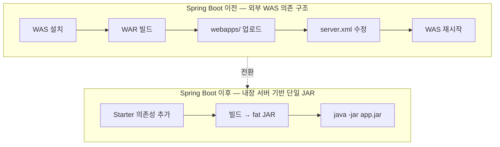
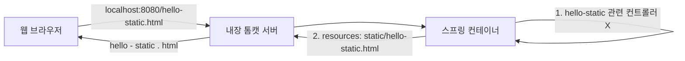
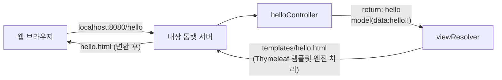
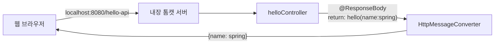

스프링이라는 단어는 문맥에 따라 다르게 사용되어 다음의 목록들을 지칭하게 된다.

- 스프링 DI 컨테이너 기술
- 스프링 프레임워크
- 스프링 부트, 스프링 프레임워크 등을 모두 포함한 스프링 생태계

## 사용 배경

스프링 등장 이전의 자바 엔터프라이즈 개발(J2EE)은 EJB(Enterprise JavaBeans) 컨테이너에 강하게 종속되어 개발 생산성이 낮고 기술 교체 비용이 매우 컸다.

|  영역   |        EJB의 제약        |        Spring의 해결         |
|:-----:|:---------------------:|:-------------------------:|
| 객체 모델 |  상속·구현 강제로 인한 무거운 객체  |   POJO 기반의 순수 자바 객체 활용    |
|  테스트  | 컨테이너 배포 필수, 단위 테스트 곤란 |  컨테이너 없이 Mock 주입으로 검증 가능  |
| 부가 기능 |  컨테이너 안에서만 트랜잭션 등 지원  |   AOP로 핵심 로직과 부가 기능 분리    |
| 기술 종속 |   특정 벤더 API에 강하게 결합   | PSA로 외부 기술에 대한 일관된 추상화 제공 |

## 스프링 기술 종류

현대 웹 개발에선 스프링 프레임워크와 스프링 부트는 거의 필수로 사용되고 있으며 그 외에 여러 기술들이 존재한다.

- 스프링 프레임워크: 핵심이 되는 프레임워크
- 스프링 부트: 여러 기술을 편리하게 사용하도록 서포트하는 역할
- 그 외: 스프링 데이터, 스프링 세션, 스프링 시큐리티, 스프링 Rest Docs, 스프링 배치, 스프링 클라우드

### 스프링 프레임워크

스프링의 핵심 기술로서 스프링 프레임워크를 사용하면 다음과 같은 기술들을 사용할 수 있다.

- 핵심 기술: 스프링 DI 컨테이너, AOP, 이벤트, 기타
- 웹 기술: 스프링 MVC, 스프링 WebFlux
- 데이터 접근 기술: 트랜잭션, JDBC, ORM 지원, XML 지원
- 기술 통합: 캐시, 이메일, 원격접근, 스케줄링
- 테스트: 스프링 기반 테스트 지원

### 스프링 부트

스프링 부트는 스프링 프레임워크를 쉽게 사용할 수 있게 도와주는 도구이며, 애플리케이션 실행 환경을 획기적으로 개선했다.

```mermaid
flowchart TB
    subgraph Before["Spring Boot 이전 — 외부 WAS 의존 구조"]
        direction LR
        B1[WAS 설치] --> B2[WAR 빌드]
        B2 --> B3["webapps/ 업로드"]
        B3 --> B4["server.xml 수정"]
        B4 --> B5[WAS 재시작]
    end

    subgraph After["Spring Boot 이후 — 내장 서버 기반 단일 JAR"]
        direction LR
        A1[Starter 의존성 추가] --> A2["빌드 → fat JAR"]
        A2 --> A3["java -jar app.jar"]
    end

    Before -. 전환 .-> After
```

- 단독 실행 가능: 내장 톰캣 등을 포함하여 별도의 웹 서버 설치 없이 실행 가능
- 손쉬운 빌드 구성: starter 종속성을 통해 자주 사용하는 라이브러리 조합을 한 번에 관리
- 자동 구성(Auto Configuration): 클래스패스의 라이브러리를 탐지하여 빈을 자동으로 설정
- 프로덕션 준비: 메트릭, 상태 확인(Health Check), 외부 구성 등 운영에 필요한 기능 기본 제공

## 스프링 핵심 개념

- 자바 언어의 가장 큰 특징인 객체지향을 살려내는 프레임워크
- 좋은 객체 지향 애플리케이션을 개발할 수 있도록 도와주는 프레임워크

스프링에서 응답 데이터를 만들어 내는 방법은 크게 아래 3가지가 있다.

### 1. 정적 컨텐츠

```mermaid
flowchart LR
    WB[웹 브라우저] -->|" localhost:8080/hello-static.html "| TS[내장 톰캣 서버]
    TS --> SC[스프링 컨테이너]
    SC -->|" 1. hello-static 관련 컨트롤러 X "| SC
    SC -->|" 2. resources: static/hello-static.html "| TS
    TS -->|hello - static . html| WB
```

### 2. MVC & 템플릿 엔진

```mermaid
flowchart LR
    WB[웹 브라우저] -->|" localhost:8080/hello "| TS[내장 톰캣 서버]
    TS --> HC[helloController]
    HC -->|" return: hello<br/>model(data:hello!!) "| VR[viewResolver]
    VR -->|" templates/hello.html<br/>(Thymeleaf 템플릿 엔진 처리) "| TS
    TS -->|" hello.html (변환 후) "| WB
```

### 3. API

```mermaid
flowchart LR
    WB[웹 브라우저] -->|" localhost:8080/hello-api "| TS[내장 톰캣 서버]
    TS --> HC[helloController]
    HC -->|" @ResponseBody<br/>return: hello(name:spring) "| HMC[HttpMessageConverter]
    HMC -->|" {name: spring} "| WB
```

- http body에 문자 내용 반환
- `HttpMessageConverter` 동작: 객체는 `MappingJackson2HttpMessageConverter`, 문자는 `StringHttpMessageConverter` 사용

## 스프링에서 사용되는 용어와 핵심

- [DI(Dependency Injection)](/docs/spring/dependency-injection/): 객체 간 의존성을 자신이 아닌 외부에서 두 객체 간의 관계를 설정하는 것
- IoC(Inversion of Control): 프로그램의 제어 흐름을 개발자가 아닌 프레임워크가 담당하는 것
- [AOP(Aspect Oriented Programming)](/docs/spring/aop/): 공통의 관심 사항을 추출하여 원하는 곳에 적용하는 기술

## 스프링이 주는 이점

|        이점        |                     설명                     |
|:----------------:|:------------------------------------------:|
| 객체지향 개발 (DI/IoC) | 의존성 역전으로 모듈 간 결합도를 낮추고 테스트와 구현체 교체를 용이하게 함 |
|   관심사 분리 (AOP)   |     공통 기능을 AOP로 분리하여 비즈니스 로직의 응집도를 높임      |
|   표준화된 인프라 추상화   | 트랜잭션, 데이터 접근, 캐시 등 공통 인프라를 일관된 방식으로 사용 가능  |
|     테스트 용이성      |    프로파일과 테스트 슬라이스를 통해 다양한 환경에서의 검증을 지원     |
|      운영 관찰성      |  Actuator를 통해 헬스체크, 메트릭, 트레이싱 등 운영 지표를 제공  |
|      생산성 향상      |      자동 구성과 Starter를 통해 초기 설정 비용을 최소화      |

###### 참고자료

- [스프링 핵심 원리 - 기본편](https://www.inflearn.com/course/스프링-핵심-원리-기본편)
- [스프링 부트 - 핵심 원리와 활용](https://www.inflearn.com/course/스프링부트-핵심원리-활용)
