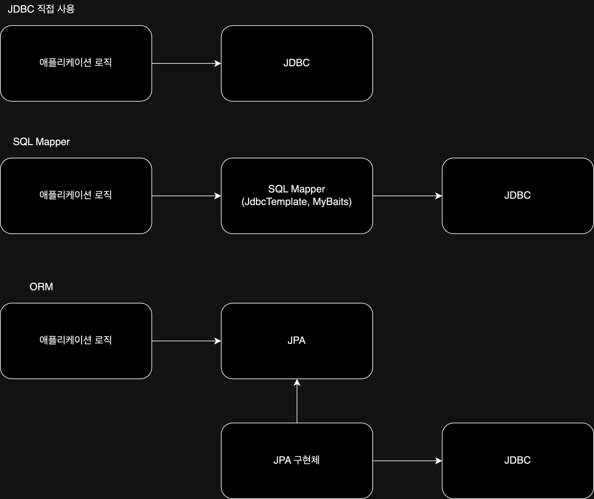

자바에서 데이터베이스에 접속할 수 있도록 하는 자바 API로, Java로 데이터베이스에 연결 및 쿼리를 실행하기 위한 표준 인터페이스를 제공한다.

|           인터페이스/개념           | 설명                                           |
|:----------------------------:|:---------------------------------------------|
|    `java.sql.Connection`     | 데이터베이스와의 연결(세션)을 나타내는 인터페이스                  |
|     `java.sql.Statement`     | SQL 쿼리를 실행하고 결과를 받아오는 역할을 하는 인터페이스           |
| `java.sql.PreparedStatement` | 미리 컴파일된 SQL 쿼리를 실행하는 인터페이스로, `Statement`를 상속 |
|     `java.sql.ResultSet`     | SQL 쿼리의 실행 결과를 나타내는 인터페이스                    |
|          JDBC 드라이버           | 특정 데이터베이스 벤더에서 제공하는 JDBC 표준 인터페이스의 구현체       |

## JDBC Flow

| 단계                     | 설명                                                                                                   | 사용 클래스/메서드                                                                                                                                   |
|------------------------|------------------------------------------------------------------------------------------------------|----------------------------------------------------------------------------------------------------------------------------------------------|
| 1. Get Connection      | 데이터베이스에 연결하기 위한 연결 정보를 사용하여 `DriverManager` 클래스를 통해 데이터베이스 연결                                        | `java.sql.Connection` 인터페이스를 반환하는 `DriverManager.getConnection()` 메서드를 사용하여 `Connection` 객체 생성                                               |
| 2. Create Statement    | `Connection` 객체로부터 SQL 쿼리를 실행하기 위한 `Statement` 객체를 생성                                                | `java.sql.Statement` 인터페이스를 반환하는 `Connection.createStatement()` 메서드를 사용하여 `Statement` 객체 생성                                                  |
| 3. Configure Statement | 생성된 `Statement` 객체에 실행하려는 SQL 쿼리를 설정 (보통 `PreparedStatement` 사용)                                     | `java.sql.PreparedStatement` 인터페이스를 사용하여 `PreparedStatement` 객체 생성 및 매개변수 설정                                                                 |
| 4. Execute Statement   | 구성된 SQL 쿼리를 실행                                                                                       | - `executeQuery()`: SELECT 문을 실행하고 결과를 `ResultSet` 객체로 반환  - `executeUpdate()`: INSERT, UPDATE, DELETE 등의 데이터 조작 쿼리를 실행하고 영향을 받은 행의 수를 반환 |
| 5. Handle Warning      | SQL 쿼리 실행 중에 발생한 경고나 예외 처리                                                                           | - `try-catch` 블록을 사용하여 예외 처리                                                                                                                 |
| 6. Return Result       | 쿼리를 실행한 결과 데이터 반환                                                                                    | - `ResultSet` 객체를 사용하여 결과를 검색 및 처리                                                                                                           |
| 7. Close Statement     | 작업이 완료되면 사용한 `Statement` 객체를 `Statement.close()` 메서드를 사용하여 명시적으로 닫아 자원 해제                            | `java.sql.Statement` 인터페이스의 `close()` 메서드                                                                                                    |
| 8. Close Connection    | 모든 데이터베이스 작업 완료 후 `Connection` 객체를 `Connection.close()` 메서드를 사용하여 명시적으로 닫아 데이터베이스 연결 자원을 해제 후 연결을 종료 | `java.sql.Connection` 인터페이스의 `close()` 메서드                                                                                                   |

굉장히 많은 과정을 필요로 하지만 `JdbcTemplate`를 사용하면 이러한 과정을 대신 처리해주어 편리하게 사용할 수 있다.

## Statement / PreparedStatement

JDBC는 SQL을 실행하기 위한 인터페이스로 `Statement`와 `PreparedStatement`를 제공한다.

- Statement: SQL 쿼리를 실행 시점에 생성하고 실행하는 방식
- PreparedStatement: SQL 쿼리의 템플릿을 미리 정의하고, 실행 시점에 파라미터만 전달하여 실행하는 방식
    - 성능: 데이터베이스는 전달받은 SQL 템플릿을 미리 파싱하고 컴파일하여 실행 계획을 캐싱
        - 이후 동일한 쿼리가 파라미터만 바뀌어 요청되면 캐시된 실행 계획을 재사용하여 성능상 이점을 가짐
    - 보안: 파라미터 바인딩 메커니즘을 통해 SQL Injection 공격을 원천적으로 방지
    - 가독성 및 유지보수: SQL 쿼리와 파라미터가 분리되어 코드가 더 깔끔하고 유지보수가 용이

## JDBC 사용의 문제점

JDBC API를 직접 사용하면 데이터베이스에 접근할 수 있지만, 실용적인 관점에서 몇 가지 문제점을 가진다.

- 반복적인 코드: 데이터베이스 연결, `Statement` 생성, `ResultSet` 처리, 그리고 연결 및 리소스 종료 등의 반복적인 코드 작성 필요
- 리소스 관리의 번거로움: `Connection`, `Statement`, `ResultSet` 등의 리소스의 명시적 관리 필요
- 예외 처리: JDBC는 대부분의 예외를 `SQLException`이라는 checked exception으로 던지며, 벤더별로 다른 에러 코드를 가지므로 일관된 예외 처리가 어려움

## JDBC의 사용

최근에는 직접 사용하는 것보다는 `SQL Mapper`나 `ORM`을 결합하여 사용하고 있다.

### SQL Mapper와 ORM 비교

|   기술 유형    | 장점                                            | 단점                        | 대표 기술                                   |
|:----------:|:----------------------------------------------|:--------------------------|:----------------------------------------|
| SQL Mapper | - SQL 응답 결과를 객체로 편리하게 변환 - JDBC의 반복 코드를 제거 | - 개발자가 SQL을 직접 작성         | 스프링 JdbcTemplate, MyBatis               |
|    ORM     | - 객체와 RDB의 패러다임 불일치 해결 - 생산성 - 유지보수     | - 학습비용 - 잘못 사용하면 성능 이슈 | JPA(자바 진영 ORM 표준 인터페이스), 하이버네이트, 이클립스링크 |

###### 참고자료

- [스프링 DB 1편 - 데이터 접근 핵심 원리](https://www.inflearn.com/course/스프링-db-1)
