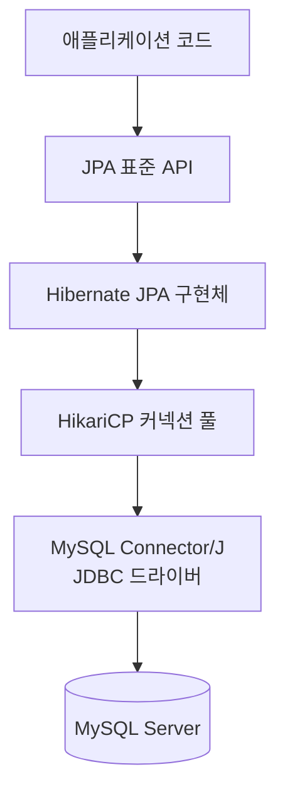
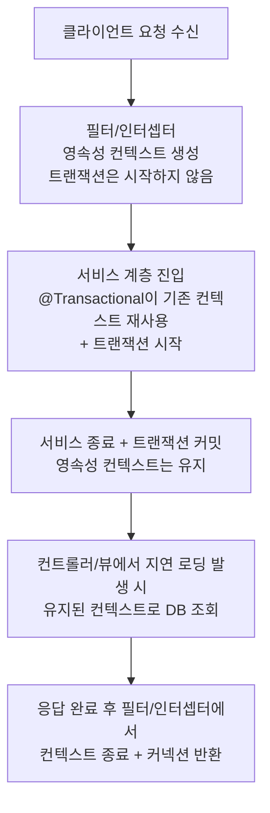

Java Persistence API의 약자로, 자바 진영의 ORM 기술 표준이다.

- ORM 기술을 사용하기 위한 표준 인터페이스의 모음
- 인터페이스를 구현한 구현체는 Hibernate, EclipseLink, DataNucleus 등 존재(보통 Hibernate 사용)

## JPA 사용의 이점

### 객체 중심 개발

SQL 중심의 데이터 접근에서 벗어나 객체 중심의 개발이 가능하다.

```java

@Entity
public class Member {

    @Id
    @GeneratedValue
    private Long id;
    private String name;

    // 연관관계 매핑
    @OneToMany(mappedBy = "member")
    private List<Order> orders = new ArrayList<>();
}
```

SQL 쿼리에 의존하는 대신 객체지향적인 코드를 작성하여 데이터를 관리할 수 있다.

### 생산성 및 유지보수성

- 생산성: `save()`, `findById()` 등 기본적인 CRUD 메서드가 기본으로 제공
- 유지보수성: 테이블에 컬럼이 추가되거나 변경될 때, 매핑된 엔티티 클래스 중심의 수정 작업

### 패러다임 불일치 해결

객체지향 언어와 관계형 데이터베이스 사이에는 근본적인 패러다임의 불일치를 JPA가 해결해준다.

- 연관관계: 외래 키(Foreign Key) 대신 객체의 참조(Reference)를 사용한 연관관계 매핑
- 객체 그래프 탐색: 연관된 객체를 사용할 때, JOIN 쿼리 없이 객체 그래프를 자유롭게 탐색 가능
- 동일성 비교: JPA는 같은 트랜잭션 내에서 조회한 동일한 로우에 대해 항상 동일한 객체 인스턴스를 반환하도록 보장 및 객체의 동등성 비교 가능

### 데이터베이스 독립성

JPA는 표준 인터페이스이므로, 설정 파일에서 데이터베이스 방언(Dialect)만 교체하면 애플리케이션 코드의 수정 없이 데이터베이스 종류를 변경할 수 있다.

### 성능 최적화

JPA는 단순히 SQL을 대신 생성해주는 것에서 그치지 않고, 다양한 성능 최적화 기능을 제공한다.

- 1차 캐시
    - 영속성 컨텍스트 내부에 존재하는 엔티티 저장소로, 트랜잭션 범위 안에서 동작
    - `em.find()` 등을 통해 데이터베이스에서 엔티티를 처음 조회하면, 해당 엔티티의 인스턴스를 1차 캐시에 저장하고 그 인스턴스를 반환
    - 이후 같은 트랜잭션 내에서 동일한 엔티티를 다시 조회할 경우, 데이터베이스에 접근하지 않고 1차 캐시에 있는 엔티티 인스턴스를 반환
    - 같은 트랜잭션 내에서 조회한 엔티티의 반복 가능한 읽기(Repeatable Read)와 객체 동일성 보장
- 쓰기 지연 (Transactional Write-Behind)
    - `em.persist()`와 같은 메서드가 호출되면, JPA는 해당 SQL 쿼리를 생성하여 영속성 컨텍스트 내부의 쓰기 지연 SQL 저장소에 쿼리를 저장
    - 이렇게 모아둔 쿼리들은 트랜잭션이 커밋되는 시점에 `flush()`가 호출되면서 한꺼번에 데이터베이스로 전송
- 지연 로딩 (Lazy Loading)
    - 연관관계가 설정된 엔티티를 조회할 때, 실제로 해당 엔티티를 사용하는 시점까지 데이터베이스 조회를 미루는 기술
    - 데이터 조회 시 연관된 엔티티 컬렉션(`@OneToMany(fetch = FetchType.LAZY)`)은 실제 데이터가 아닌 프록시(Proxy) 객체로 초기
        - `***ToOne` -> 기본값 즉시 로딩 / `***ToMany` -> 기본값 지연 로딩
    - 이후 코드에서 실제 컬렉션에 접근하는 시점에, JPA가 조회 쿼리를 실행하여 프록시 객체를 실제 데이터로 초기화

## JPA의 동작 과정

JPA는 `EntityManagerFactory`와 `EntityManager`를 중심으로 동작한다.

- `EntityManagerFactory`
    - `EntityManager`를 생성하는 팩토리
    - 데이터베이스 커넥션 풀과 같은 리소스를 관리(애플리케이션 전체에서 단 하나만 생성되어 공유)
    - 여러 스레드가 동시에 접근해도 안전하게 공유 가능
- `EntityManager`
    - 실질적인 데이터베이스 작업(저장, 수정, 삭제, 조회 등)을 처리하는 객체
    - 내부에 데이터베이스 커넥션을 유지하면서 영속성 컨텍스트를 통해 엔티티를 관리

## 데이터베이스 접근 스택 구성요소

JPA로 데이터를 다룰 때, 애플리케이션 코드에서 실제 데이터베이스에 도달하기까지 여러 컴포넌트가 계층적으로 협력한다.



|       컴포넌트        |     분류     | 역할                                                |
|:-----------------:|:----------:|:--------------------------------------------------|
|        JPA        |  표준 인터페이스  | ORM 동작 명세를 정의 (실제 동작은 구현체가 수행)                    |
|     Hibernate     |  JPA 구현체   | 엔티티 매핑·SQL 생성·영속성 컨텍스트·지연 로딩 등 ORM 기능 구현          |
|     HikariCP      | JDBC 커넥션 풀 | DB 커넥션을 미리 생성·재사용하여 연결 비용을 최소화하는 `DataSource` 구현체 |
| MySQL Connector/J | JDBC 드라이버  | JDBC API 호출을 MySQL 프로토콜로 변환하여 서버와 실제 통신           |

### JPA

자바 진영의 ORM 표준 인터페이스로, 객체와 관계형 데이터베이스를 어떻게 매핑하고 관리할지에 대한 명세를 정의한다.

- 패키지: `jakarta.persistence` (구 `javax.persistence`)
- `@Entity`, `@Id`, `EntityManager`, JPQL 등 ORM에 필요한 표준 API 제공
- 명세 자체는 동작하지 않으며, 구현체와 결합해야 실제 SQL 실행 가능

### Hibernate

가장 널리 쓰이는 JPA 구현체로, JPA 명세를 구현하면서 ORM 동작 전반을 담당한다.

- 영속성 컨텍스트의 1차 캐시·쓰기 지연·변경 감지(Dirty Checking) 구현
- 방언(Dialect) 설정에 따라 RDBMS 종류별로 SQL 자동 생성
- 페치 조인, 배치 페칭 등 N+1 회피를 위한 최적화 전략 제공
- Spring Boot의 `spring-boot-starter-data-jpa` 의존성 사용 시 기본 구현체로 자동 선택

### HikariCP

자바 진영에서 가장 빠른 JDBC 커넥션 풀로 알려진 `DataSource` 구현체로, 데이터베이스 커넥션의 생성·반환 비용을 최소화한다.

- 매 요청마다 TCP 연결을 새로 맺지 않고, 미리 생성한 `Connection`을 풀에서 꺼내 재사용
- 락 경쟁 최소화와 바이트코드 최적화로 다른 커넥션 풀 대비 오버헤드가 적음
- Spring Boot 2.x 이후 기본 `DataSource` 구현체로 채택

### MySQL Connector/J

MySQL이 공식 제공하는 자바용 JDBC 드라이버로, 자바 애플리케이션과 MySQL 서버 사이의 통신을 담당하는 최하위 계층이다.

- 드라이버 클래스: `com.mysql.cj.jdbc.Driver`
- `java.sql.Driver`·`Connection`·`PreparedStatement` 등 JDBC 표준 인터페이스 구현체 제공
- JDBC API 호출을 MySQL 바이너리 프로토콜로 인코딩하여 서버에 전송
- HikariCP가 풀 내부에서 새 커넥션을 만들 때 호출되어 실제 TCP 연결 수립

## 스프링 부트에서의 JPA 설정

과거에는 `DataSource`, `EntityManagerFactory`, `PlatformTransactionManager` 등 JPA를 사용하기 위한 여러 컴포넌트를 개발자가 직접 빈으로 등록해야 했다.

- `DataSource`: 데이터베이스 커넥션 정보를 담고 있는 객체
- `JpaVendorAdapter`: 사용할 JPA 구현체(예: Hibernate)에 대한 세부 설정을 담는 객체
- `LocalContainerEntityManagerFactoryBean`: `DataSource`와 `JpaVendorAdapter` 정보를 조합하여 `EntityManagerFactory`를 생성하는 객체
- `JpaTransactionManager`: JPA의 트랜잭션을 스프링의 트랜잭션 관리 체계(`@Transactional`)와 연동시켜주는 객체

```java

@Configuration
public class JpaConfig {

    // 어떤 데이터베이스를 사용할 것인지 설정
    @Bean
    public DataSource dataSource() {
        DriverManagerDataSource dataSource = new DriverManagerDataSource();
        dataSource.setDriverClassName("com.mysql.cj.jdbc.Driver");
        dataSource.setUrl("jdbc:mysql://localhost:3306/jpa_basic?serverTimezone=UTC");
        dataSource.setUsername("root");
        dataSource.setPassword("password");

        return dataSource;
    }

    // JPA 구현체 설정
    @Bean
    public JpaVendorAdapter jpaVendorAdapter(JpaProperties jpaProperties) {
        HibernateJpaVendorAdapter jpaVendorAdapter = new HibernateJpaVendorAdapter();
        jpaVendorAdapter.setShowSql(jpaProperties.isShowSql());
        jpaVendorAdapter.setGenerateDdl(jpaProperties.isGenerateDdl());
        jpaVendorAdapter.setDatabasePlatform(jpaProperties.getDatabasePlatform());

        return jpaVendorAdapter;
    }

    // Entity 객체를 생성하고 관리해주는 EntityManagerFactory 설정
    @Bean
    public LocalContainerEntityManagerFactoryBean entityManagerFactory(DataSource dataSource,
            JpaVendorAdapter jpaVendorAdapter, JpaProperties jpaProperties) {
        LocalContainerEntityManagerFactoryBean entityManagerFactoryBean = new LocalContainerEntityManagerFactoryBean();
        entityManagerFactoryBean.setDataSource(dataSource);
        entityManagerFactoryBean.setPackagesToScan("com.example.jpa_basic.domain");
        entityManagerFactoryBean.setJpaVendorAdapter(jpaVendorAdapter);

        Properties jpaProperties = new Properties();
        jpaProperties.putAll(jpaProperties.getProperties());
        entityManagerFactoryBean.setJpaProperties(jpaProperties);

        return entityManagerFactoryBean;
    }

    // Transaction을 관리해주는 TransactionManager 설정
    @Bean
    public PlatformTransactionManager transactionManager(LocalContainerEntityManagerFactoryBean entityManagerFactory) {
        JpaTransactionManager transactionManager = new JpaTransactionManager();
        transactionManager.setEntityManagerFactory(entityManagerFactory.getObject());

        return transactionManager;
    }
}
```

### 스프링 부트의 JPA 자동 설정

하지만 오늘날 스프링 부트 환경에서는 두 가지 설정만으로 JPA를 바로 사용할 수 있다.

- `spring-boot-starter-data-jpa` 의존성 추가
- `application.properties` (또는 `.yml`) 파일에 데이터베이스 접속 정보와 기본적인 JPA 옵션 명시

## OSIV (Open Session In View)

영속성 컨텍스트(JPA Session)를 트랜잭션 범위가 아닌 HTTP 요청 단위(뷰 계층까지)로 열어두는 설정으로, Spring Boot에서 `spring.jpa.open-in-view` 프로퍼티로 제어한다.

- 기본값: `true` (Spring Boot)
- 활성 시 영향 범위: 컨트롤러·뷰 렌더링이 끝나는 시점까지 영속성 컨텍스트와 DB 커넥션 유지

### OSIV가 해결하려는 문제

JPA의 지연 로딩은 영속성 컨텍스트가 살아있을 때만 동작하므로, OSIV가 비활성 상태에서 컨트롤러나 뷰에서 연관 엔티티에 접근하면 `LazyInitializationException`이 발생한다.

- OSIV 비활성: 트랜잭션 종료 시 영속성 컨텍스트도 닫혀, 뷰 계층의 지연 로딩 시 예외 발생
- OSIV 활성: 트랜잭션이 끝나도 응답 완료 시점까지 영속성 컨텍스트가 유지되어 어디서든 지연 로딩 사용 가능

### OSIV 동작 흐름



OSIV의 핵심은 트랜잭션 종료 후에도 DB 커넥션을 응답이 나갈 때까지 점유한다는 점이다.

### OSIV의 단점: 커넥션 점유 시간 증가

OSIV가 활성화되면 트랜잭션 종료 후에도 커넥션이 풀에 반환되지 않으므로, 후속 처리에서 외부 API 호출이나 직렬화가 길어질 경우 커넥션이 유휴 상태로 묶이게 된다.

- 커넥션 풀 고갈: 트래픽이 많을수록 사용 가능한 커넥션이 빠르게 소진되어 신규 요청이 대기하거나 실패
- 응답 지연 누적: 한 요청의 후처리가 늦어지면 그동안 점유된 커넥션이 다른 요청에도 영향
- 장애 전파: 커넥션 풀 고갈이 전체 시스템 장애로 확장 가능성

### `true` vs `false` 비교

|      설정      | 장점                            | 단점                                        | 적합한 환경                 |
|:------------:|:------------------------------|:------------------------------------------|:-----------------------|
| `true` (기본값) | 어디서든 지연 로딩 사용 가능, 코드 간결       | 응답 종료 시점까지 커넥션 점유, 성능 최적화 어려움             | 관리자 페이지·내부 도구·저트래픽 서비스 |
|   `false`    | 트랜잭션 종료 즉시 커넥션 반환, 리소스 효율 극대화 | 지연 로딩을 트랜잭션 범위 내에서 해결 필요 (페치 조인·DTO 조회 등) | 고트래픽 서비스·실시간 결제/주문 시스템 |

### 권장 사용 방법

고성능 환경에서는 OSIV를 끄고 트랜잭션 경계 안에서 필요한 데이터를 명시적으로 로드하는 방식이 일반적이다.

- `application.yml`에 `spring.jpa.open-in-view: false` 설정
- 서비스 계층에서 페치 조인이나 `@EntityGraph`로 연관 엔티티를 한 번에 로딩
- 조회 전용 로직은 DTO Projection 또는 CQRS 패턴으로 분리하여 영속성 컨텍스트 의존도를 제거

###### 참고자료

- [자바 ORM 표준 JPA 프로그래밍 - 기본편](https://www.inflearn.com/course/ORM-JPA-Basic)
