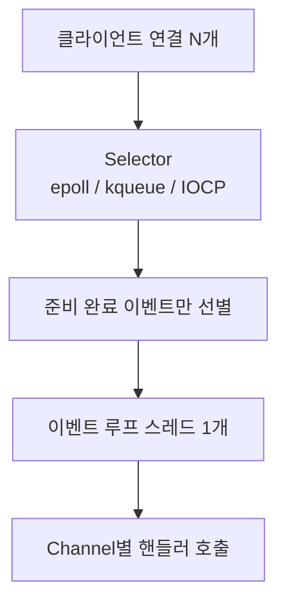
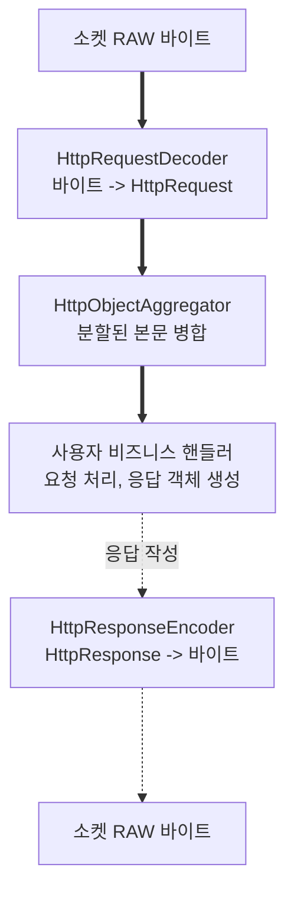

Spring WebFlux는 기본적으로 내장 서버로 Netty를 사용한다.

- Netty는 고성능 네트워크 애플리케이션을 개발하기 위한 비동기 이벤트 기반 프레임워크
- WebFlux가 지향하는 논블로킹(Non-Blocking) I/O 모델을 가장 효율적으로 구현하는 핵심 기술

## Netty

- 네트워크 프레임워크: TCP/UDP 소켓과 같은 저수준(low-level) 네트워크 프로그래밍을 추상화하여 개발자가 비즈니스 로직에 집중 가능
- 이벤트 기반 및 비동기: 모든 I/O 작업(연결 수립, 데이터 수신 등)을 이벤트로 간주
    - 작업이 완료되면 콜백을 통해 결과를 처리하는 방식으로 동작
    - 이로 인해 작업이 진행되는 동안 스레드 차단 없이 다른 작업 수행 가능

적은 수의 스레드로 수많은 동시 연결을 효율적으로 처리할 수 있는 Netty의 특성은 WebFlux의 리액티브 모델과 완벽하게 부합하여 내장 서버로 채택되었다.

## NIO Selector 기반 I/O 멀티플렉싱

Netty의 논블로킹 능력은 JVM 자체에서 오는 것이 아니라, 운영체제가 제공하는 I/O 멀티플렉싱(I/O Multiplexing) 시스템 콜에 기반한다.

- Java NIO `Selector`는 OS별 최적 구현(Linux: `epoll`, macOS/BSD: `kqueue`, Windows: IOCP)으로 매핑
- 단일 스레드가 수천 개 소켓의 준비 상태(읽기 가능, 쓰기 가능)를 한 번의 시스템 콜로 감지 가능
- 스레드는 이벤트가 발생한 채널만 골라서 처리하므로, 연결마다 스레드를 할당하지 않고도 높은 동시성 달성
- Netty는 이 메커니즘을 추상화하여 OS별 차이를 숨기고, 동일한 API로 효율적인 이벤트 처리 제공

## 이벤트 루프 기반의 비동기 동작 원리

Netty의 핵심은 이벤트 루프(Event Loop) 모델로, 성능의 핵심 역할을 한다.

- 이벤트 루프(Event Loop)
    - 무한 루프를 돌면서 자신에게 할당된 채널(Channel, 클라이언트와의 연결)에서 발생하는 이벤트를 감지하고 처리하는 스레드 할당
    - Netty 서버는 보통 CPU 코어 수에 맞춰 소수의 이벤트 루프 스레드를 생성하여 사용
    - 하나의 이벤트 루프 스레드는 하나 이상의 채널을 담당하며, 해당 채널들에서 발생하는 모든 이벤트를 순차적으로 처리
- 동작 과정
    1. 이벤트 루프는 자신에게 할당된 채널들을 계속해서 확인하며 이벤트 발생을 감시
    2. 이벤트가 발생하면(예: 클라이언트로부터 데이터 수신), 이벤트 큐(Task Queue)에 해당 작업을 등록
    3. 이벤트 루프는 큐에서 작업을 하나씩 꺼내 등록된 핸들러(Handler, 개발자가 작성한 로직)를 실행
    4. 핸들러의 실행은 매우 짧은 시간 안에 끝나야 하며, 절대 블로킹(Blocking) 작업을 포함해서는 안 됨
    5. 작업 처리가 끝나면 이벤트 루프는 다시 채널들을 감시하는 상태로 복귀
- 핵심 원칙: 이벤트 루프 스레드는 절대 차단되어서는 안 되며, 블로킹 호출은 별도 스케줄러로 격리

### Channel · ChannelPipeline · ChannelHandler

이벤트 루프가 실행하는 "핸들러"가 구체적으로 무엇이며 어떻게 조립되는지를 다루는 것이 Channel·ChannelPipeline·ChannelHandler 3종의 추상화이다.

- Channel: 하나의 TCP 연결(소켓)을 1:1로 감싼 객체
    - 클라이언트가 접속할 때마다 Channel 1개가 생성
    - 생성 즉시 Worker 그룹의 이벤트 루프 중 하나에 바인딩되며, 연결이 닫힐 때까지 같은 이벤트 루프에서만 처리
- ChannelHandler: 데이터를 한 단계 가공하는 단일 처리 유닛
    - 예: HTTP 바이트를 객체로 디코딩, SSL 복호화, 사용자 비즈니스 로직, 응답 인코딩
    - Inbound 핸들러(수신 처리)와 Outbound 핸들러(송신 처리)로 구분
- ChannelPipeline: Channel에 등록된 핸들러들의 양방향 체인
    - 수신 시 Inbound 방향으로 핸들러를 차례로 통과
    - 송신 시 반대 방향(Outbound)으로 통과

- 굵은 화살표: Inbound (수신·디코딩 단계)
- 점선: Outbound (응답 인코딩·송신 단계)

핵심 효과는 두 가지이다.

- 핸들러 단위 조립: 프로토콜 파싱·암호화·로깅 같은 횡단 관심사를 핸들러로 분리해 끼워 넣거나 교체 가능 (예: HTTPS 적용 시 SslHandler를 맨 앞에 추가)
- 동시성 제어 단순화: 동일한 Channel의 모든 핸들러는 항상 같은 이벤트 루프 스레드에서 실행되므로, 핸들러 내부 상태에 락이 필요 없음

### Netty의 스레드 구조

실제 Netty는 스레드별로 역할을 분리하여 효율성을 극대화한다.

- Boss 그룹
    - 보통 단일 스레드로 구성
    - 오직 서버 포트를 바인딩하고 클라이언트의 새로운 연결 요청을 수락(accept)하는 역할만 담당
    - 새로운 연결이 수립되면, 해당 연결(채널)을 Worker 그룹의 이벤트 루프 중 하나에 등록하고 자신은 즉시 다음 연결을 받기 위해 대기
- Worker 그룹
    - CPU 코어 수에 맞춰 생성된 여러 개의 이벤트 루프 스레드로 구성
    - Boss 그룹으로부터 넘겨받은 채널에서 발생하는 모든 I/O 이벤트(데이터 읽기, 쓰기 등) 처리
    - 실질적인 데이터 처리와 비즈니스 로직이 실행되는 스레드

이러한 구조 덕분에 연결 수락과 데이터 처리가 분리되어, 각자의 역할에만 집중함으로써 시스템 전체의 성능을 높일 수 있다.

## 논블로킹 모델의 새 병목

스레드 고갈 문제는 해결되었지만, 병목 지점은 사라진 것이 아니라 다른 자원으로 옮겨진다.

- CPU 부하: 시스템 처리 용량을 초과하는 요청이 유입되면 이벤트 루프 스레드의 CPU 사용률이 100%에 도달하면서 모든 요청의 처리 시간이 전반적으로 증가
- 메모리 누적: 처리 속도보다 유입 속도가 빠를 경우, 대기 중인 요청 데이터가 메모리에 계속 쌓이며 결국 `OutOfMemoryError` 유발
- 단일 블로킹 호출의 파급력: 한 핸들러가 이벤트 루프를 차단하면 그 스레드에 바인딩된 모든 Channel의 처리가 동시에 멈춤

이 중 메모리 누적 문제는 네트워크 계층의 TCP 흐름 제어로 자연스럽게 완화된다.

## 네트워크 레벨 배압

TCP 자체에 흐름 제어(Flow Control) 기능이 내장되어 있어, 애플리케이션이 별도 코드 없이도 송신 속도를 제어할 수 있다.

1. 애플리케이션이 TCP 수신 버퍼에서 데이터를 읽어가는 속도가 느려짐
2. 버퍼가 차오르면서 운영체제가 TCP 윈도우(Window) 크기를 감소시켜 ACK에 광고
3. 송신 측(클라이언트)은 광고된 윈도우 크기 이상으로 전송할 수 없으므로 자동으로 전송 속도 감소
4. 결과적으로 시스템의 처리 속도와 유입 속도가 네트워크 레벨에서 동기화

