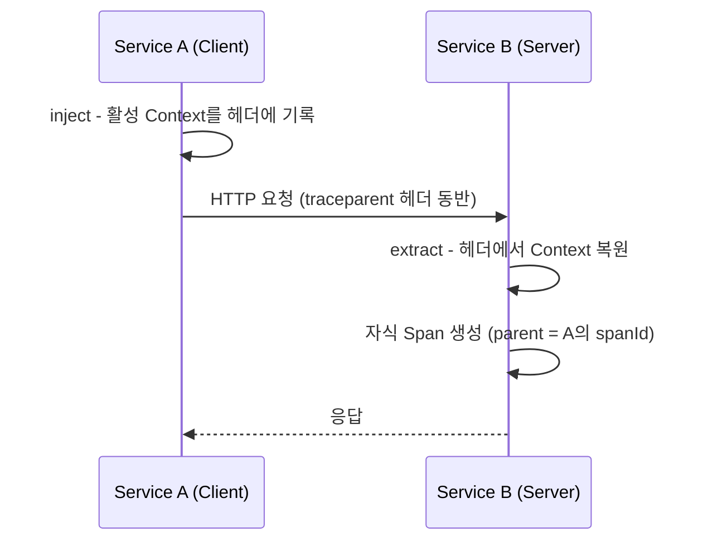
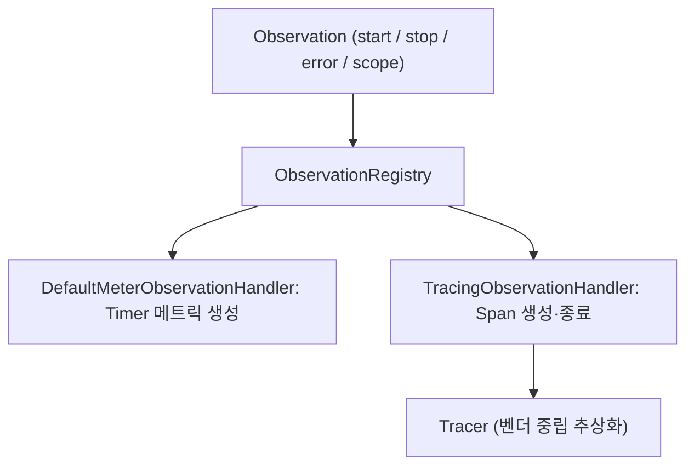

분산 트레이싱이 끊기는 지점은 대부분 코드 내부가 아니라 서비스와 서비스 사이, 혹은 스레드와 스레드 사이의 경계다.

## 헤더 프로퍼게이션 규격

추적 컨텍스트가 한 서비스의 메모리를 벗어나 다음 서비스로 이어지려면 표준화된 헤더 포맷에 직렬화되어야 한다.

- 전파 대상: `traceId`, `spanId`(다음 서비스의 부모가 됨), sampled flag
- 두 계열: 글로벌 웹 표준인 W3C Trace Context와 Zipkin/Brave 계열의 B3

### W3C Trace Context

W3C 공식 표준(Recommendation)으로, 추적 컨텍스트를 `traceparent`와 `tracestate` 두 헤더로 나눠 전파한다.

```text
traceparent: 00-4bf92f3577b34da6a3ce929d0e0e4736-00f067aa0ba902b7-01
             └┬┘ └──────────────┬──────────────┘ └───────┬──────┘ └┬┘
           version           trace-id              parent-id    trace-flags
```

- version: 포맷 버전 (현재 `00`)
- trace-id: 16바이트(hex 32자) 전역 고유 식별자, 전체 호출 체인 공통
- parent-id: 8바이트(hex 16자) 송신 측의 현재 `spanId`, 수신 측은 이를 부모로 삼아 자식 Span 생성
- trace-flags: 8비트 비트필드, 최하위 비트가 sampled 여부 (`01` = sampled)

`tracestate`는 `vendorA=value,vendorB=value` 형태로 벤더별 추적 상태를 담아 W3C 코어 필드가 표현하지 못하는 정보를 보존한다.

### B3 Propagation

Zipkin에서 출발한 규격으로, 헤더를 하나로 합친 single 포맷과 항목별로 분리한 multi 포맷을 모두 지원한다.

single 포맷은 모든 정보를 한 헤더에 하이픈으로 연결한다.

```text
b3: 80f198ee56343ba864fe8b2a57d3eff7-e457b5a2e4d86bd1-1-05e3ac9a4f6e3b90
    └──────────────┬──────────────┘ └───────┬──────┘ ┬ └───────┬──────┘
              TraceId                    SpanId    Sampled  ParentSpanId
```

multi 포맷은 항목마다 별도 헤더를 사용한다.

|         헤더          |               값               |
|:-------------------:|:-----------------------------:|
|   `X-B3-TraceId`    |        16바이트 trace 식별자        |
|    `X-B3-SpanId`    |         현재 작업 단위 식별자          |
| `X-B3-ParentSpanId` |           상위 작업 식별자           |
|   `X-B3-Sampled`    | 샘플링 결정 (`1`=accept, `0`=deny) |
|    `X-B3-Flags`     |    디버그 강제 샘플링 (`1`=debug)     |

### 규격 비교와 선택

|        규격         |         호환성          |          선택 기준          |
|:-----------------:|:--------------------:|:-----------------------:|
| W3C Trace Context | 멀티 클라우드·벤더 중립 글로벌 표준 |     신규 시스템 (기본 권장)      |
|     B3 single     |   최신 Zipkin/Brave    |  헤더 수를 줄여야 하는 메시징·gRPC  |
|     B3 multi      |   레거시 Zipkin/Brave   | 기존 B3 멀티 기반 시스템과의 하위 호환 |

- 혼재 환경 주의: 송신 측과 수신 측이 서로 다른 규격을 쓰면 헤더가 인식되지 않을 수 있음
- 스프링은 양방향 모두 수신할 수 있도록 다중 포맷 추출을 지원하나, 송신 포맷은 하나로 고정되므로 조직 전체의 규격을 통일하는 것이 안전

## inject와 extract가 일어나는 지점

프로퍼게이션은 헤더에 컨텍스트를 쓰는 inject와 헤더에서 컨텍스트를 읽는 extract 두 동작으로 이뤄진다.

- inject: 아웃바운드 요청 직전, 현재 활성 Context의 추적 정보를 캐리어(헤더)에 기록
- extract: 인바운드 요청 수신 직후, 캐리어에서 추적 정보를 꺼내 Context를 복원하고 자식 Span 시작



캐리어는 프로토콜마다 다르며, 인스트루멘테이션 라이브러리가 각 프로토콜의 메타데이터 영역에 inject·extract를 건다.

| 프로토콜  |   캐리어 (전파 매체)    |            계측 진입점             |
|:-----:|:----------------:|:-----------------------------:|
| HTTP  |    요청·응답 헤더 맵    |      클라이언트 인터셉터 / 서버 필터       |
| gRPC  |    `Metadata`    |   Client·Server Interceptor   |
| Kafka | Record `Headers` | Producer·Consumer Interceptor |

### 전파가 끊기는 지점

서비스 코드는 그대로인데 trace가 분리되어 보인다면 대부분 다음 경계에서 컨텍스트가 유실된다.

- 스레드 경계: `ThreadLocal`에 담긴 Context가 `@Async`·수동 생성 스레드로 넘어가지 않음
- 계측 누락: 자동 계측되지 않는 HTTP 클라이언트(예: 직접 만든 `HttpURLConnection`)는 inject를 수행하지 않아 헤더가 빈 상태로 전송
- 헤더 제거: 중간 게이트웨이·프록시가 알 수 없는 헤더라며 `traceparent`를 필터링
- 규격 불일치: 송신은 W3C, 수신은 B3만 추출하도록 설정되어 헤더를 인식하지 못함

## Micrometer Observation API와 Tracer Bridge

스프링 부트 3는 추적을 직접 호출하지 않고 Micrometer Observation API라는 단일 추상화 위에서 계측한다.

```java
void example() {
    Observation.createNotStarted("order.process", observationRegistry)
            .contextualName("process-order")
            .lowCardinalityKeyValue("region", "kr")
            .observe(() -> orderService.process(request));
}
```

- 단일 계측, 다중 신호: 같은 Observation 이벤트를 여러 `ObservationHandler`가 구독해 Timer(메트릭)와 Span(트레이스)을 각각 생성
- 코드 중립성: 애플리케이션 코드는 Observation API에만 의존하며, 실제로 어떤 트레이싱 백엔드가 붙는지는 알지 못함

### ObservationHandler 등록 흐름

`ObservationRegistry`에 등록된 핸들러들이 Observation의 라이프사이클 이벤트를 받아 각자의 신호로 변환한다.



- `TracingObservationHandler`가 Observation의 start/stop 시점에 Tracer를 호출해 Span을 열고 닫음
- Tracer는 인터페이스일 뿐이며, 실제 Span을 만드는 구현체는 Bridge가 결정

### Tracer Bridge 선택 기준

Micrometer Tracing은 Tracer 추상화만 제공하고, 구체 구현은 의존성에 추가한 bridge 모듈이 연결한다.

|            Bridge 의존성             |      연결되는 구현      |              특징              |             적합한 상황              |
|:---------------------------------:|:-----------------:|:----------------------------:|:-------------------------------:|
| `micrometer-tracing-bridge-brave` |       Brave       |    Zipkin 생태계, 경량, 오랜 안정성    |    기존 Zipkin/Brave 인프라 유지 시     |
| `micrometer-tracing-bridge-otel`  | OpenTelemetry SDK | 벤더 중립 표준, 폭넓은 자동 계측·Exporter | 신규 구축, OTLP·OTel Collector 연동 시 |

- 두 bridge는 동시에 추가하지 않음 (Tracer 빈이 충돌)
- 애플리케이션 코드는 어느 쪽을 쓰든 동일하며, 교체 시 의존성만 바꾸면 됨

## OpenTelemetry SDK 컴포넌트

`bridge-otel`을 선택하면 Span 생성 이후의 처리는 OpenTelemetry SDK가 담당한다.

|      컴포넌트       |          역할           |                  비고                   |
|:---------------:|:---------------------:|:-------------------------------------:|
|    `Tracer`     |      Span 생성 팩토리      |     Bridge가 Micrometer Tracer와 연결     |
| `SpanProcessor` | Span 시작·종료 시점의 후처리 훅  | `BatchSpanProcessor`가 큐잉·배치로 발신 부하 완화 |
| `SpanExporter`  | 완료된 Span을 직렬화해 외부로 전송 |     OTLP Exporter가 Collector로 전송      |

- 발신 경로: Span 종료 → `SpanProcessor` 큐 적재 → 배치 단위로 `SpanExporter` 호출 → OTLP 직렬화 후 전송
- `BatchSpanProcessor`는 Span을 매 건 보내지 않고 큐에 모았다가 일괄 전송해, 트레이싱이 본 서비스의 응답 지연에 끼치는 영향을 줄임
