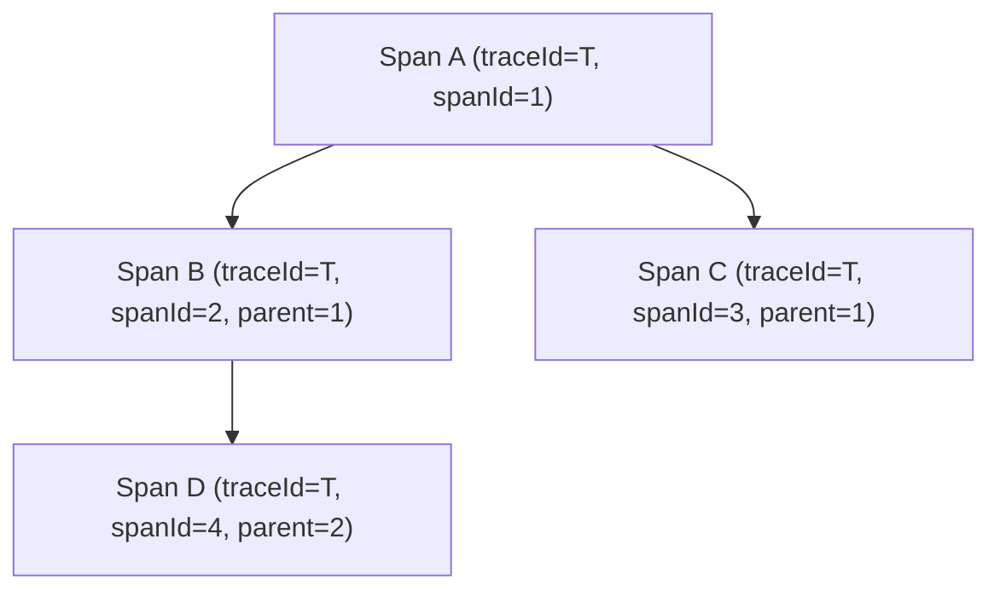
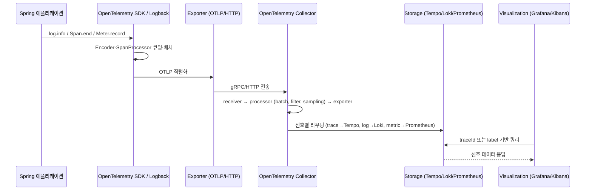

## 관측성 세 신호 (Three Signals)

세 신호는 애플리케이션에서 발생하는 이벤트와 상태를 서로 다른 관점에서 포착하는 보완적인 데이터 모델이다.

|   신호    |       정의        |     답하는 질문     |              대표 도구              |        한계         |
|:-------:|:---------------:|:--------------:|:-------------------------------:|:-----------------:|
|  Logs   | 시점에 일어난 이벤트 기록  |   무엇이 일어났는가    |  SLF4J, Logback, Loki, Kibana   | 양이 많아 검색·저장 비용이 큼 |
| Metrics | 시계열로 집계된 수치 신호  | 얼마나 자주·얼마나 빠른가 | Micrometer, Prometheus, Grafana |  개별 요청 단위 식별 불가능  |
| Traces  | 단일 요청의 호출 경로·시간 | 어디서 지연·실패가 났는가 |  OpenTelemetry, Tempo, Zipkin   |   샘플링 시 일부만 보존    |

- 메트릭으로 이상 감지 → 트레이스로 위치 파악 → 로그로 원인 확인의 분석 동선이 표준
- 단일 신호만으로는 "느려졌다"는 사실은 알아도 "왜 어디서 느려졌는지"는 알기 어려움
- 세 신호가 동일한 `traceId`로 묶일 때 비로소 End-to-End 추적이 가능

## OpenTelemetry 시그널 모델

OpenTelemetry(OTel)는 벤더 중립적인 단일 사양으로 세 신호를 모두 정의하여 발신 측 코드가 트레이싱 백엔드에 종속되지 않도록 한다.

|        구성 요소         |                   역할                    |                      예시                       |
|:--------------------:|:---------------------------------------:|:---------------------------------------------:|
|       Resource       |         신호를 생성한 주체(서비스·인스턴스) 식별         | `service.name=order-service`, `host.name=...` |
| InstrumentationScope |         신호를 발신한 라이브러리·계측 위치 식별          |     `io.opentelemetry.spring-webmvc-6.0`      |
|     Signal Data      | 신호별 본문 (Logs/Metrics/Traces 각각의 데이터 구조) |           LogRecord, Metric, Span 등           |
|       Context        |  현재 실행 중인 신호의 컨텍스트 (Span 참조, Baggage)   |             `traceparent` 헤더로 전파              |

- 세 신호가 같은 Resource·InstrumentationScope·Context 추상화 위에 정의되어 단일 식별자로 상호 연결
- 발신 측은 OTel API에만 의존하면 되며 SDK·Exporter 교체로 백엔드를 바꿀 수 있음

## Trace, Span, Context, Baggage

분산 트레이싱은 단일 요청의 처리 흐름을 트리 형태로 모델링한다.

### Trace와 Span의 관계

- Trace: 하나의 거대한 호출 흐름이며, 최초 진입점에서 생성된 `traceId`를 끝까지 유지
- Span: Trace 내부의 개별 작업 단위(서비스 호출, DB 쿼리, 메시지 처리 등)이며 고유 `spanId`를 가짐
- Parent Span ID: 현재 Span이 어느 작업에서 파생되었는지를 나타내 호출 트리(Call Tree)를 구성



### Context와 Baggage

Context는 실행 흐름의 현재 추적 상태를 담는 컨테이너이며, Baggage는 그 컨테이너 안에 들어가는 데이터 항목 중 하나다.

- Baggage는 Context의 부분 집합
- 둘 다 Span 흐름을 따라 전파되지만 전파되는 헤더와 사용 목적이 다름

Context가 담는 항목은 다음과 같다.

- 현재 활성 Span 참조 (`Span.current()`가 조회하는 대상)
- SpanContext (`traceId`, `spanId`, sampled flag)
- Baggage 엔트리
- 기타 OTel 확장 키 (Correlation, MetricsContext 등)

Context는 실행 모델에 따라 저장소가 달라지며, 이 차이가 비동기·리액티브 환경에서 컨텍스트 유실의 원인이 된다.

|      실행 모델      |             Context 저장소              |
|:---------------:|:------------------------------------:|
|     동기 스레드      |            `ThreadLocal`             |
| Reactor·WebFlux | Reactor Context (Subscriber Context) |
|  가상 스레드(Loom)   |    `ScopedValue` 또는 `ThreadLocal`    |

Baggage는 사용자 정의 key-value 모음으로, Trace를 따라다니며 자동으로 다음 서비스로 전파된다.

- 활용: 테넌트 ID, 요청 출처(country), 실험 그룹, 디버그 플래그 등 비기능 메타데이터를 모든 다운스트림이 동일하게 인지해야 할 때 사용
- Span attribute와의 차이: Baggage는 검색·집계 인덱스에 자동으로 포함되지 않으므로 분석 대상으로 쓰려면 명시적으로 attribute로 옮겨야 함
- 보안 주의: 모든 다운스트림 서비스로 전송되므로 PII(Personally Identifiable Information)나 큰 페이로드는 담지 않음
- 크기 주의: 키 개수·길이는 백엔드별 한도가 있어 무분별한 사용은 HTTP 헤더 크기 폭증과 성능 저하를 유발

W3C 표준에서는 추적 컨텍스트와 Baggage가 별개의 HTTP 헤더로 전파된다.

|      항목       |           HTTP 헤더           |                   담는 내용                   |
|:-------------:|:---------------------------:|:-----------------------------------------:|
| Trace Context | `traceparent`, `tracestate` | `traceId`, `spanId`, sampled flag, 벤더별 상태 |
|    Baggage    |          `baggage`          |      사용자 정의 key-value (URL-encoded)       |

```java
void example() {
    try (BaggageInScope scope = Baggage.current()
            .toBuilder()
            .put("tenant.id", "acme-corp")
            .build()
            .makeCurrent()) {
        orderService.process(request);
    }

    // 다운스트림 또는 같은 흐름의 다른 모듈에서 조회
    String tenant = Baggage.current().getEntryValue("tenant.id");
    Span.current().setAttribute("tenant.id", tenant);
}
```

## End-to-End 파이프라인

로그 한 줄과 트레이스 한 건이 애플리케이션 내부에서 생성된 뒤 시각화 도구 화면까지 도달하는 단계는 다음과 같다.



### 단계별 모듈 책임

|   단계   |                           대표 모듈                            |                          책임                          |
|:------:|:----------------------------------------------------------:|:----------------------------------------------------:|
|   생성   |     SLF4J Logger, Micrometer Observation, OTel Tracer      |    신호 객체 생성, MDC·Span Attribute 부착, `traceId` 발급     |
| 인코딩·배치 |           Logback Encoder, SpanProcessor(Batch)            |           JSON·OTLP 직렬화, 큐잉으로 발신 성능 영향 최소화           |
|   발신   |             OTLP/HTTP Exporter, File Appender              |             외부 Collector 또는 파일 시스템으로 전송              |
| 수신·라우팅 |                  OpenTelemetry Collector                   | receiver → processor → exporter 파이프라인으로 변환·필터·라우팅 수행 |
|   저장   | Tempo(Trace), Loki(Log), Prometheus(Metric), Elasticsearch |                  신호별 인덱싱과 보존 정책 적용                   |
|  시각화   |                 Grafana, Kibana, Jaeger UI                 |             `traceId` 기반 통합 조회와 대시보드 제공              |

- 발신 측(Spring 애플리케이션)은 Exporter까지의 흐름을 책임지며, Collector 이후는 수신 측 인프라의 영역
- 동일 `traceId`가 모든 단계에 흐르도록 유지하는 것이 End-to-End 추적의 전제
