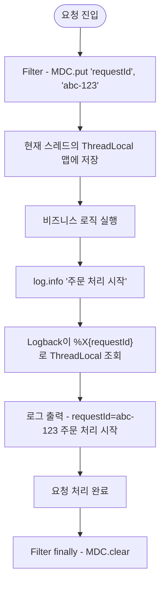

Spring Boot는 별도 설정 없이도 표준 로깅 스택을 제공하며, 컨텍스트 추적·구조화 출력까지 같은 스택 위에서 확장된다.

## 기본 로깅 스택

Spring Boot Starter는 SLF4J facade + Logback 구현체 조합을 기본으로 포함한다.

|     계층      |             역할             |                구성 요소                |
|:-----------:|:--------------------------:|:-----------------------------------:|
| facade(API) |   애플리케이션이 호출하는 추상 인터페이스    | `org.slf4j.Logger`, `org.slf4j.MDC` |
|     구현체     | 실제 로그 포맷·출력·필터링·컨텍스트 저장 담당 |       Logback (`MDCAdapter`)        |
|   기반 메커니즘   |        컨텍스트 저장 자료구조        |            `ThreadLocal`            |

- 출처는 SLF4J/Logback 라이브러리이며, Spring 프레임워크는 이를 의존하기만 함
- `org.slf4j.Logger`만 호출하면 구현체 교체(Logback ↔ Log4j2) 시에도 코드 변경 불필요
- Lombok `@Slf4j` 어노테이션으로 로거 선언을 자동 생성하는 것이 일반적

## 로그 레벨

|  레벨   |               용도               |
|:-----:|:------------------------------:|
| TRACE | 가장 세부적인 추적 정보, 운영에서는 거의 사용 안 함 |
| DEBUG |      개발 시 흐름 추적, 운영에서 OFF      |
| INFO  |  주요 비즈니스 이벤트(요청 진입, 외부 호출 결과)  |
| WARN  |  잠재적 문제, 즉시 장애는 아니지만 추적 가치 있음  |
| ERROR |      예외 발생, 알림·대응이 필요한 사건      |

- 운영 환경 기본은 INFO이며, 임시 디버깅 시에만 특정 패키지를 DEBUG로 일시 상승
- ERROR 로그는 알림 채널과 연결되는 경우가 많아 남발 시 노이즈 발생 → 진짜 예외 상황에만 사용

## 설정 방식

Spring Boot는 두 가지 위치에서 로깅 설정을 받는다.

|          위치          |                  용도                  |  적합한 시나리오   |
|:--------------------:|:------------------------------------:|:-----------:|
|  `application.yml`   |         레벨 설정·파일 경로 같은 단순 옵션         | 프로파일별 빠른 변경 |
| `logback-spring.xml` | 패턴·appender·필터·MDC 출력·환경별 분기 등 정밀 제어 | 운영 수준 로깅 정의 |

### `application.yml` 예시

```yaml
logging:
  level:
    root: INFO
    com.example.payment: DEBUG
  file:
    name: logs/app.log
  pattern:
    console: "%d{HH:mm:ss.SSS} %-5level [%X{requestId:-}] %logger{36} - %msg%n"
```

### `logback-spring.xml` 예시

```xml

<configuration>
  <springProfile name="prod">
    <appender name="JSON" class="ch.qos.logback.core.ConsoleAppender">
      <encoder class="net.logstash.logback.encoder.LogstashEncoder"/>
    </appender>
    <root level="INFO">
      <appender-ref ref="JSON"/>
    </root>
  </springProfile>
</configuration>
```

- `logback-spring.xml`은 `logback.xml`과 달리 `<springProfile>` 등 Spring Boot 통합 기능 사용 가능
- 운영/개발 패턴 분리, JSON 인코딩 적용 같은 정밀 제어가 필요할 때 사용

## 로그 패턴

Logback 패턴 문법으로 출력 형식을 정의한다.

|         패턴         |          의미           |
|:------------------:|:---------------------:|
|     `%d{...}`      |    타임스탬프(ISO/단축 등)    |
|     `%-5level`     | 레벨(WARN/INFO 등 5칸 정렬) |
|     `%thread`      |        스레드 이름         |
|   `%logger{36}`    |     로거 이름(36자 약식)     |
|     `%X{key}`      |      MDC 컨텍스트 값       |
| `%X{key:-default}` |    MDC 키 부재 시 대체 값    |
|       `%msg`       |        로그 메시지         |
|        `%n`        |          줄바꿈          |

## 컨텍스트 부여 (MDC)

요청·사용자·트랜잭션 단위로 모든 로그 라인에 동일 식별자를 부착하는 표준 메커니즘으로, SLF4J `org.slf4j.MDC`로 정의되어 자바 로깅 생태계의 사실상 표준 인터페이스 역할을 한다.

### 동작 원리

내부 구현은 `ThreadLocal<Map<String, String>>` 기반으로, 같은 스레드 내에서만 컨텍스트가 공유된다.

- Logback 1.2.x 시대(Spring Boot 2.x)에는 `InheritableThreadLocal`을 사용해 `new Thread()`로 만든 자식 스레드에 자동 전파되던 동작이 있었음
- Logback 1.4+(Spring Boot 3.x) 이후 일반 `ThreadLocal`로 교체되어 자식 스레드 자동 전파는 더 이상 보장되지 않으므로, 비동기 전파는 이후 절의 명시적 패턴으로 처리해야 함



### 주요 API

|             API             |           역할            |
|:---------------------------:|:-----------------------:|
|    `MDC.put(key, value)`    |   현재 스레드 컨텍스트에 키-값 추가   |
|       `MDC.get(key)`        |    현재 스레드의 컨텍스트 값 조회    |
|      `MDC.remove(key)`      |        특정 키만 제거         |
|        `MDC.clear()`        |   현재 스레드의 컨텍스트 전체 비움    |
| `MDC.getCopyOfContextMap()` | 컨텍스트 스냅샷 복사(다른 스레드 전파용) |

### Filter 적용 패턴

Spring Web에서는 요청 진입 시점에 MDC를 채우고 종료 시점에 비우는 것이 표준이다.

```java

@Component
public class MdcFilter extends OncePerRequestFilter {

    private static final String REQUEST_ID = "requestId";

    @Override
    protected void doFilterInternal(HttpServletRequest request,
            HttpServletResponse response,
            FilterChain chain) throws ServletException, IOException {
        try {
            String requestId = Optional.ofNullable(request.getHeader("X-Request-Id"))
                    .orElseGet(() -> UUID.randomUUID().toString());
            MDC.put(REQUEST_ID, requestId);
            chain.doFilter(request, response);
        } finally {
            MDC.clear();
        }
    }
}
```

- 서블릿 워커 스레드는 풀에서 재사용되므로 `clear()` 누락 시 이전 요청 컨텍스트가 다음 요청 로그에 노출
- 예외 발생 경로에서도 정리되도록 반드시 `finally`에 배치

## 비동기 환경에서의 컨텍스트 전파

MDC는 `ThreadLocal`에 묶여 있으므로 작업이 다른 스레드로 넘어가는 순간 컨텍스트가 사라진다. 실행 모델별로 명시적 전파 패턴이 필요하다.

|            실행 모델            |                           유실 시점                           |               전파 수단               |
|:---------------------------:|:---------------------------------------------------------:|:---------------------------------:|
|      `@Async`·스레드 풀 작업      |                    작업이 풀 스레드로 이관되는 시점                     |          `TaskDecorator`          |
| Reactor·WebFlux(리액티브 파이프라인) |                 operator가 다른 스레드에서 실행될 때                  | Reactor Context + 자동 컨텍스트 전파 hook |
|        가상 스레드(Loom)         | `Executors.newVirtualThreadPerTaskExecutor` 등에서 새 VT 생성 시 |     동일하게 `TaskDecorator`류 래핑      |

### 스레드 풀: `TaskDecorator`

Spring `TaskExecutor`에 데코레이터를 등록해 작업 제출 시점에 컨텍스트 스냅샷을 떠두고 실행 시점에 복원한다.

```java
public class MdcTaskDecorator implements TaskDecorator {

    @Override
    public Runnable decorate(Runnable runnable) {
        Map<String, String> contextMap = MDC.getCopyOfContextMap();
        return () -> {
            try {
                if (contextMap != null) {
                    MDC.setContextMap(contextMap);
                }
                runnable.run();
            } finally {
                MDC.clear();
            }
        };
    }
}

@Configuration
@EnableAsync
public class AsyncConfig implements AsyncConfigurer {

    @Override
    public Executor getAsyncExecutor() {
        ThreadPoolTaskExecutor executor = new ThreadPoolTaskExecutor();
        executor.setTaskDecorator(new MdcTaskDecorator());
        executor.initialize();
        return executor;
    }
}
```

- 제출 측 스레드에서 `getCopyOfContextMap()`으로 스냅샷을 잡고, 실행 스레드에서 `setContextMap()`으로 복원, 종료 시 `clear()`
- `CompletableFuture.supplyAsync`처럼 풀에 작업을 직접 던지는 경로는 데코레이터를 거치지 않아 `Runnable`을 동일하게 래핑하거나 데코레이터 적용 `Executor`를 명시적으로 전달

### 가상 스레드

가상 스레드도 자체 `ThreadLocal` 슬롯을 가지므로 단일 VT 내부에서는 MDC가 동일하게 동작하지만, 작업마다 새 VT를 생성하는 구조라 executor 경계에서는 동일한 유실이 발생한다.

- `Executors.newVirtualThreadPerTaskExecutor()` 제출 작업은 새 VT에서 시작되어 MDC가 비어 있음
- 해결 방식은 스레드 풀과 동일하게 `TaskDecorator`/`Runnable` 래퍼로 스냅샷·복원·정리

## 구조화 로깅 (Structured Logging)

운영 환경에서는 사람이 읽기 위한 텍스트 로그보다 Loki·Elasticsearch가 인덱싱할 수 있는 기계 친화 JSON 형태가 표준이다.

### LogstashEncoder JSON 인코딩

`net.logstash.logback:logstash-logback-encoder`가 사실상 표준 인코더이며, Logback appender에 붙이면 로그 한 줄을 JSON 한 객체로 직렬화한다.

```xml

<configuration>
  <appender name="STDOUT_JSON" class="ch.qos.logback.core.ConsoleAppender">
    <encoder class="net.logstash.logback.encoder.LogstashEncoder">
      <includeMdcKeyName>requestId</includeMdcKeyName>
      <includeMdcKeyName>traceId</includeMdcKeyName>
      <includeMdcKeyName>spanId</includeMdcKeyName>
      <customFields>{"service.name":"order-service","deploy.env":"prod"}</customFields>
      <fieldNames>
        <timestamp>@timestamp</timestamp>
        <message>message</message>
        <logger>logger_name</logger>
        <thread>thread_name</thread>
        <levelValue>[ignore]</levelValue>
      </fieldNames>
    </encoder>
  </appender>
  <root level="INFO">
    <appender-ref ref="STDOUT_JSON"/>
  </root>
</configuration>
```

- `includeMdcKeyName`: MDC 키를 JSON 최상위 필드로 노출 (지정하지 않으면 `mdc` 객체로 중첩)
- `customFields`: 인스턴스 공통 메타데이터(서비스명, 배포 환경 등)를 매 로그 라인에 정적으로 부착
- `fieldNames`: 기본 필드명을 표준 키로 매핑하거나 `[ignore]`로 출력 제외

### 키 표준화

로그를 트레이스·메트릭과 같은 식별자로 묶기 위해 키 명명을 OpenTelemetry semantic conventions에 맞춘다.

|       키        |          내용          |               표준 근거                |
|:--------------:|:--------------------:|:----------------------------------:|
|  `@timestamp`  |    ISO-8601 타임스탬프    |       Elasticsearch/Loki 관례        |
|    `level`     |      로그 레벨 문자열       |        OTel Logs Data Model        |
|   `message`    |      포매팅된 로그 본문      |        OTel Logs Data Model        |
| `logger_name`  |    로거(클래스/패키지) 이름    |                 관례                 |
|   `trace_id`   | 현재 활성 Span의 trace ID |   W3C Trace Context / OTel Logs    |
|   `span_id`    | 현재 활성 Span의 span ID  |   W3C Trace Context / OTel Logs    |
| `service.name` |      논리 서비스 식별자      | OTel Resource semantic conventions |
|  `deploy.env`  |        배포 환경         | OTel Resource semantic conventions |

- MDC에는 카멜케이스(`traceId`)로 담더라도 인코더에서 `trace_id`로 매핑해 OTel 표준 필드와 어긋나지 않게 유지
- Micrometer Tracing이 활성 Span 정보를 MDC에 `traceId`·`spanId` 키로 자동 채워주므로, 인코더 매핑만 잡으면 표준 필드로 노출

## 활용 시나리오

|   시나리오    |                           MDC 키 예시                            |           목적            |
|:---------:|:-------------------------------------------------------------:|:-----------------------:|
|   요청 추적   |                          `requestId`                          |  단일 요청의 모든 로그를 한 번에 모음  |
| 사용자 단위 분석 |                           `userId`                            |      특정 사용자 행동 분석       |
| 분산 추적 연동  | `traceId`, `spanId`(Micrometer Tracing + OpenTelemetry/Brave) |   마이크로서비스 간 요청 흐름 추적    |
|  멱등성 처리   |                       `idempotencyKey`                        | 결제·외부 API 재시도 시 동일 키 추적 |
|  테넌트 분리   |                          `tenantId`                           |  SaaS 환경에서 테넌트별 로그 분리   |
