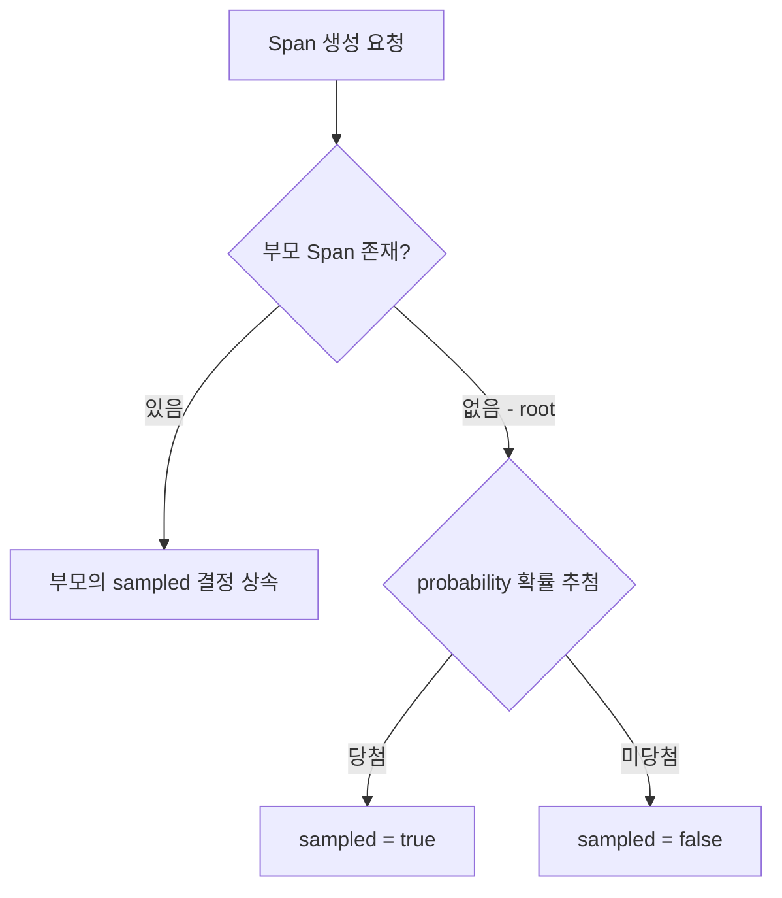

## 의존성 매트릭스

추적 신호를 OTLP로 내보내는 최소 조합은 네 의존성으로 구성되며, 각 의존성이 추가되는 순간 조건부로 빈이 등록된다.

|               의존성                |                    역할                    |                자동 등록 빈                |
|:--------------------------------:|:----------------------------------------:|:-------------------------------------:|
|  `spring-boot-starter-actuator`  |        Observation·Metrics 인프라 토대        |  ObservationRegistry, MeterRegistry   |
|       `micrometer-tracing`       | Tracer 추상화와 TracingObservationHandler 계약 |           (Tracer 인터페이스 정의)           |
| `micrometer-tracing-bridge-otel` |     Micrometer Tracer를 OTel SDK에 연결      | Tracer(OtelTracer), SdkTracerProvider |
|  `opentelemetry-exporter-otlp`   |          완료 Span을 OTLP로 직렬화·전송           |  SpanExporter(OtlpHttpSpanExporter)   |

빈 등록은 클래스패스 존재와 프로퍼티를 보는 조건부 자동 구성(`@ConditionalOnClass`·`@ConditionalOnEnabledTracing`)으로 동작한다.

## 핵심 프로퍼티

자동 구성된 빈의 동작은 `management.tracing`·`management.otlp` 프로퍼티로 조정할 수 있다.

```yaml
management:
  tracing:
    sampling:
      probability: 0.1            # 기본값, 전체 트레이스의 10%만 추적
    propagation:
      type: w3c                   # w3c(기본) | b3 | b3_multi
  otlp:
    tracing:
      endpoint: http://localhost:4318/v1/traces   # OTel Collector OTLP/HTTP 수신부
```

- `sampling.probability`: 미설정 시 0.1(기본적으로 90%의 트레이스는 생성되지 않음)
- `propagation.type`: 송신·수신 헤더 규격을 동시에 지정하며, 송신과 수신을 다르게 두려면 `produce`·`consume`로 분리
- `otlp.tracing.endpoint`: 이 값이 없으면 SpanExporter 빈이 등록되지 않아 추적이 외부로 나가지 않음

## 자동 계측 진입점

bridge가 있으면 스프링 부트는 주요 I/O 경계에 자동으로 Observation을 생성하는 필터·인터셉터를 끼워 넣는다.

|     대상     |            계측 컴포넌트             |                    hook 지점                    |
|:----------:|:------------------------------:|:---------------------------------------------:|
| 인바운드 HTTP  | `ServerHttpObservationFilter`  | 서블릿 필터 체인 진입부에서 요청당 Observation 생성·헤더 extract |
| 아웃바운드 HTTP |     RestTemplate·WebClient     |   요청 인터셉터에서 클라이언트 Observation 생성·헤더 inject    |
|    JDBC    |  datasource-micrometer Proxy   |   `DataSource`·`Statement`를 래핑해 쿼리 Span 생성    |
|   Kafka    | KafkaTemplate·`@KafkaListener` |         record header에 inject·extract         |
|  Reactor   |      Context Propagation       |   Reactor Context와 Observation 컨텍스트를 상호 브리지   |

- 공통 원리: 모든 자동 계측은 등록된 `ObservationRegistry`를 통과시켜 Observation을 만들고, `TracingObservationHandler`가 그 이벤트로 Span을 생성
- 계측되지 않는 직접 호출(예: 수동 `HttpURLConnection`)은 hook 바깥이라 inject가 누락

## 샘플링 전략

초당 수만 건의 트래픽을 모두 추적해 백엔드로 보내면 관측 시스템 자체가 큰 오버헤드를 유발해 본 서비스 성능을 떨어뜨린다.

- 샘플링 적용: 전체 트래픽 중 일부만 선별해 추적 데이터를 남겨 부하 방지
- 결정 시점에 따라 Head Sampling과 Tail Sampling으로 나뉨

### Head Sampling vs Tail Sampling

|  구분   |    Head Sampling     |       Tail Sampling       |
|:-----:|:--------------------:|:-------------------------:|
| 결정 시점 |      트레이스 시작 시점      |         트레이스 완료 후         |
| 결정 주체 | 애플리케이션(SDK Sampler)  |  Collector(전체 Span 수집 후)  |
|  장점   |    즉시 결정, 버퍼링 불필요    |   에러·지연 트레이스만 선별 보존 가능    |
|  한계   | 에러·지연 발생 여부를 모른 채 결정 | 전체 Span 버퍼링 필요, 인프라 비용 증가 |

- 발신 측(스프링 애플리케이션)이 담당하는 것은 Head Sampling이며, Tail Sampling은 Collector가 담당
- Head Sampling만 쓰면 희귀한 에러 트레이스가 추첨에서 탈락해 유실될 수 있어, 에러 보존이 중요하면 Collector의 Tail Sampling과 병행

### ParentBased Sampler

`micrometer-tracing-bridge-otel`의 기본 Sampler는 `ParentBased(TraceIdRatioBased(probability))`로 구성된다.



- root span에만 `probability`가 적용되고, 자식 span은 부모의 결정을 그대로 따름
- 이 상속 구조가 없으면 같은 트레이스인데 서비스마다 샘플링 결정이 달라져 호출 체인이 반쪽만 기록되는 문제가 발생
- 결과적으로 하나의 트레이스는 전부 기록되거나 전부 누락되어 호출 트리의 일관성이 유지됨

### 비용-가시성 트레이드오프

샘플링 비율은 장애 분석 정밀도와 저장·네트워크 비용 사이의 선택이다.

|    샘플링 비율    |       가시성        |       비용        |            적합한 상황            |
|:------------:|:----------------:|:---------------:|:----------------------------:|
| 100% (전수 추적) | 모든 요청 추적, 최고 정밀도 | 스토리지/네트워크 비용 최대 | 개발·스테이징 환경, 장애 원인 분석이 시급한 상황 |
|    10~50%    |  대부분의 패턴을 포착 가능  |     적절한 비용      |         일반적인 프로덕션 환경         |
|     1~5%     |  전체적인 추세만 파악 가능  |     비용 최소화      |   초고트래픽 환경, 비용 최적화가 우선인 경우   |

- 비율을 높이면 희귀 오류 포착 확률이 오르지만 비용이 증가하고, 낮추면 비용은 절감되나 드문 오류를 놓칠 확률이 커짐
- 적응형 샘플링: 트래픽 추이에 따라 비율을 동적으로 조절해 최소한의 가시성을 항상 확보하는 방식으로, 고정 비율의 트레이드오프를 완화

