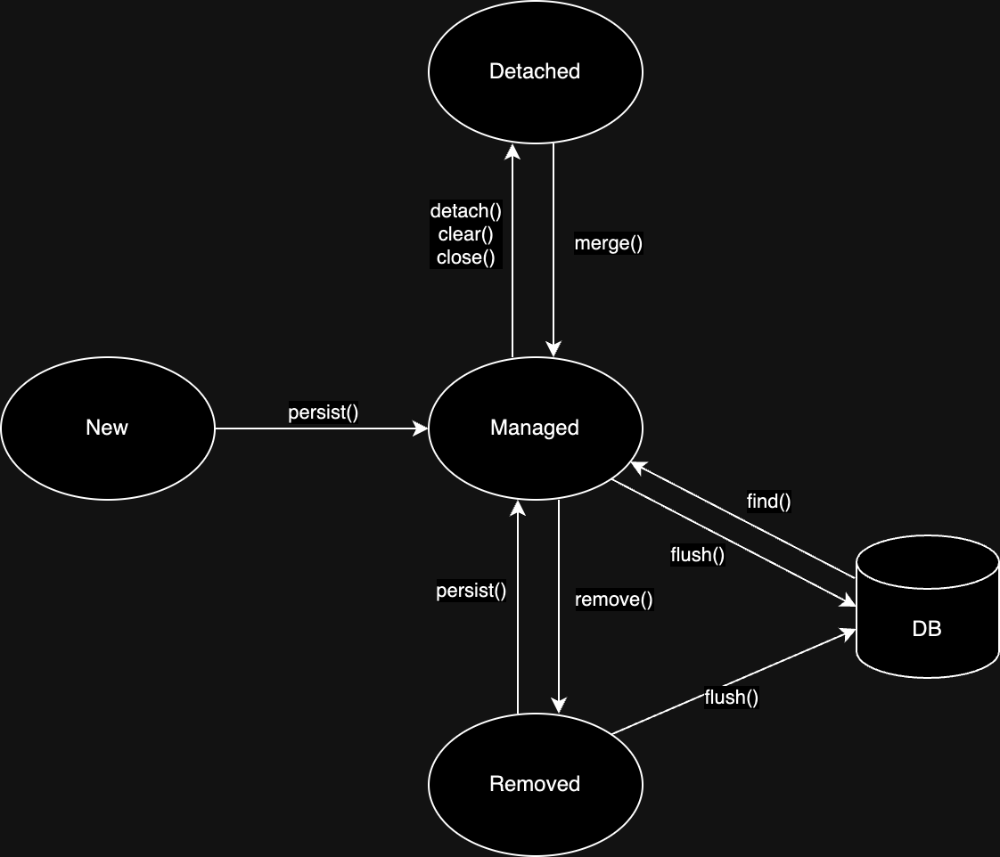

엔티티를 저장하는 환경으로, EntityManager를 통해 접근하고 관리되는 엔티티의 집합이다.

## 스프링 환경에서의 영속성 컨텍스트

스프링 프레임워크와 같은 컨테이너 환경에서는 `EntityManager`와 영속성 컨텍스트가 직접 관리되지 않고 컨테이너에 의해 관리된다.

- 생명주기: 영속성 컨텍스트는 트랜잭션의 생명주기와 동일하게 유지
    - 스프링의 `@Transactional`이 붙은 메서드가 시작될 때 생성되고, 메서드가 종료되어 트랜잭션이 커밋되거나 롤백될 때 함께 소멸
- 공유: 같은 트랜잭션 내에서는 여러 클래스에서의 주입 받은 `EntityManager`는 모두 동일한 영속성 컨텍스트 인스턴스 공유
    - 스프링의 트랜잭션 동기화 매니저를 통해 보장

결과으로 `@Transactional` 적용을 통해 트랜잭션 범위 영속성 컨텍스트(Transaction-Scoped Persistence Context)를 지정하고 사용할 수 있다.

## 엔티티 생명 주기



1. 비영속(New/Transient): 순수 자바 객체 상태
    - 영속성 컨텍스트나 데이터베이스와 전혀 관계가 없는 상태
2. 영속(Managed): `entityManager.persist()` 등을 통해 영속성 컨텍스트에 의해 관리되는 상태
    - 1차 캐시에 저장
    - 변경 감지 등의 기능을 제공 받음
3. 준영속(Detached): 영속성 컨텍스트에 의해 관리되다가 분리된 상태
    - 영속성 컨텍스트가 소멸(트랜잭션 종료)되거나 `detach()`, `clear()` 호출 시 전환
4. 삭제(Removed): `entityManager.remove()`를 통해 삭제된 상태
    - 트랜잭션 커밋 시 실제 데이터베이스에서 삭제

```java
class Example {

    public static void main(String[] args) {
        Member member = new Member(); // 1. 비영속
        member.setId("member1");
        member.setUsername("회원1");

        EntityManager entityManager = entityManagerFactory.createEntityManager();
        entityManager.getTransaction().begin();
        entityManager.persist(member); // 2. 영속

        entityManager.detach(member); // 3. 준영속
        entityManager.remove(member); // 4. 삭제
    }
}
```

## 영속성 컨텍스트 특징

### 1차 캐시와 동일성 보장

영속성 컨텍스트는 내부에 맵과 유사한 1차 캐시를 가지고 있으며, 엔티티의 식별자(@Id)를 키로, 엔티티 인스턴스를 값으로 저장한다.

| @Id |            Entity            |
|:---:|:----------------------------:|
|  1  | Member(id=1, username="회원1") |

- `em.find()` 호출 시, 우선 1차 캐시에서 엔티티 조회
- 캐시에 존재하면 DB 조회 없이 즉시 해당 인스턴스를 반환
- 캐시에 없으면 DB에서 조회한 후, 그 결과를 1차 캐시에 저장하고 반환

이러한 메커니즘 덕분에 같은 트랜잭션 내에서 동일한 식별자로 조회한 엔티티는 항상 같은 메모리 주소를 가진 인스턴스임이 보장된다(`member1 == member2` 결과가 `true`).

### 트랜잭션을 지원하는 쓰기 지연(transactional write-behind)

```java
class Example {

    public static void main(String[] args) {
        EntityManager entityManager = entityManagerFactory.createEntityManager();
        entityManager.getTransaction().begin();

        Member member1 = new Member(150L, "A");
        Member member2 = new Member(160L, "B");

        entityManager.persist(member1);
        entityManager.persist(member2);
        // 여기까지 INSERT SQL을 데이터베이스에 보내지 않음

        entityManager.getTransaction().commit(); // INSERT SQL 수행
    }
}
```

영속성 컨텍스트를 이용한 쓰기 지연 작업은 다음과 같은 절차로 진행된다.

1. `em.persist()` 호출 시, 엔티티를 1차 캐시에 저장
    - 그와 동시에 INSERT SQL을 생성하여 쓰기 지연 SQL 저장소에 등록
2. 트랜잭션 커밋 시점에 `flush()`가 호출
    - 쓰기 지연 SQL 저장소에 등록된 쿼리를 데이터베이스에 전송

### 변경 감지(Dirty Checking)

JPA는 엔티티가 1차 캐시에 처음 저장될 때의 상태를 스냅샷으로 만들어 별도로 보관한다.

```java
class Example {

    public static void main(String[] args) {
        EntityManager entityManager = entityManagerFactory.createEntityManager();
        entityManager.getTransaction().begin();

        Member member = entityManager.find(Member.class, 150L);
        member.setUsername("OGU");

        // persist()와 같은 메서드 호출 X

        entityManager.getTransaction().commit(); // UPDATE SQL 수행
    }
}
```

1. 트랜잭션 커밋 시점에 `flush()` 호출
2. JPA는 1차 캐시에 있는 모든 영속 상태 엔티티와 이전에 만들어둔 스냅샷을 비교
3. 만약 변경된 점이 있다면, `UPDATE` 쿼리를 생성하여 쓰기 지연 SQL 저장소에 저장
4. 쓰기 지연 SQL 저장소의 쿼리들을 데이터베이스에 전송하고 트랜잭션을 커밋

###### 참고자료

- [자바 ORM 표준 JPA 프로그래밍 - 기본편](https://www.inflearn.com/course/ORM-JPA-Basic)
