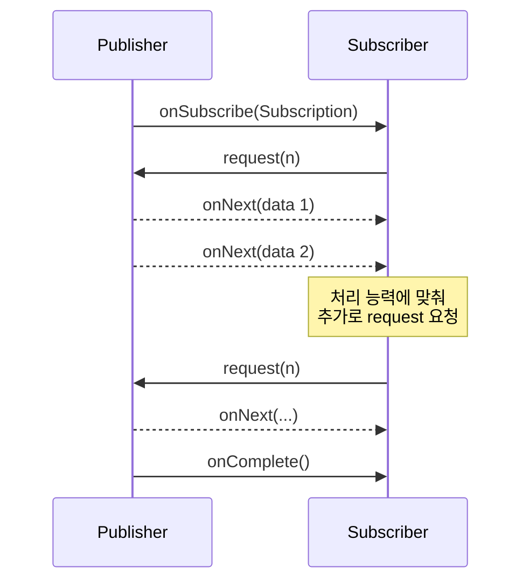

반응형 프로그래밍(Reactive Programming)은 데이터 흐름(Data Stream)과 변경 사항 전파(Propagation of Change)에 중점을 둔 프로그래밍 패러다임이다.

## 등장 배경

전통적인 Thread-per-Request 모델은 동시 연결 수가 늘어나면 스레드 자원이 선형적으로 증가하여 운영체제가 감당하지 못하는 한계에 직면한다.

- 블로킹 I/O의 비용: I/O 대기 중인 스레드는 CPU를 사용하지 않으면서도 스택·커널 자원을 점유
- 컨텍스트 스위칭 오버헤드: 스레드 수가 코어 수를 크게 초과하면 스케줄링 비용이 실제 작업 처리량을 잠식
- 외부 시스템 의존성 증가: 마이크로서비스·다중 외부 API 연동이 일반화되면서 I/O 대기 시간이 전체 응답 시간의 대부분을 차지

반응형 프로그래밍은 이 문제를 스레드를 늘리는 대신, 스레드가 대기하지 않는 방식으로 해결한다.

- 적은 수의 스레드로 비동기·논블로킹 처리를 수행하여 자원 효율 극대화
- 데이터 흐름을 선언적으로 조립한 뒤 구독 시점에 실행하여 합성·변환 용이
- 배압을 통해 송수신 속도 차이를 명시적으로 제어

## 핵심 개념

### 데이터 스트림(Data Stream)

클릭 이벤트, HTTP 요청, 데이터베이스 결과 등 시간에 따라 발생하는 모든 값을 시간 축 위의 스트림으로 통일적으로 추상화한다.

- 단발성 값(예: HTTP 응답)도 "0개 또는 1개의 항목으로 이루어진 스트림"으로 표현 가능
- 구독자(Subscriber)는 스트림에 대해 변환·필터링·합성을 선언적으로 정의하고, 데이터가 도착할 때마다 정의된 동작을 자동 수행
- 값이 언제 도착하는가와 값을 어떻게 처리하는가가 분리되어 비동기 코드를 동기 코드에 가깝게 작성 가능

### 비동기 & 논블로킹(Asynchronous & Non-Blocking)

작업을 요청한 스레드가 결과 도착을 기다리지 않고 즉시 반환되어 다른 작업을 처리한다.

- 논블로킹(Non-Blocking): 호출 즉시 제어권 반환, 스레드는 다른 채널의 이벤트를 처리 가능
- 비동기(Asynchronous): 작업 완료 시점에 콜백·이벤트 신호를 통해 결과 전달
- 효과: 동일한 스레드 수로 훨씬 많은 동시 요청을 처리 가능 (CPU 코어 수 ≈ 이벤트 루프 스레드 수)

### 배압(Backpressure)

발행자(Publisher)가 구독자(Subscriber)의 처리 속도를 무시하고 데이터를 밀어내면 메모리 버퍼가 누적되어 결국 서버 장애로로 이어진다.

- 배압은 구독자가 자신이 처리 가능한 데이터 양을 발행자에게 명시적으로 요청하여 흐름 속도를 조절하는 메커니즘
- 구체적으로 `Subscription.request(n)` 호출을 통해 "다음 n개 데이터까지만 보내라"는 신호를 발행자에게 전달
- 결과적으로 시스템은 가장 느린 구간(병목)의 처리 속도에 맞춰 안정적으로 동작



#### 배압 조절 전략

배압 조절 전략(Backpressure Strategy)은 구독자가 따라가지 못한 잉여 데이터를 어떻게 처리할지 정의한다.

- Cold Publisher: 소스가 구독자 요청량에 맞춰 데이터를 생성하므로 별도 전략 없이도 배압이 자연스럽게 성립
- Hot Publisher: 외부 이벤트 시점(마우스 입력, 센서 신호, 메시지 브로커 푸시 등)에 의해 발행이 결정되므로, 구독자 요청과 무관하게 데이터 누적
- 잉여 데이터 처리 정책을 명시하지 않으면 메모리 폭주로 이어지기 때문에, 아래 전략 중 하나를 명시적으로 선택해야 함

|   전략   |              동작               |         사용 시나리오          |
|:------:|:-----------------------------:|:------------------------:|
| BUFFER |   초과분을 버퍼에 보관 후 소비자 준비 시 전달   | 손실 불가, 단기 폭주만 흡수하면 되는 경우 |
|  DROP  |    수신 측이 요청하지 않은 신규 항목 폐기     | 최신 상태 유지가 필수가 아닌 메트릭·로그  |
| LATEST |  가장 최근 항목 1개만 유지하고 이전 항목 폐기   |  최신 값만 의미 있는 시세·센서 데이터   |
| ERROR  | 즉시 `IllegalStateException` 발생 |   손실 불허, 빠른 실패가 필요한 경우   |
| IGNORE |     배압 무시, 다운스트림에 그대로 전달      |   다운스트림이 무한 수요를 보장할 때만   |

Project Reactor는 위 전략을 적용할 수 있는 연산자를 제공한다.

- `onBackpressureBuffer(maxSize, overflowStrategy)`: 초과 시 정책(`DROP_OLDEST`, `DROP_LATEST`, `ERROR`) 지정 가능
- `onBackpressureDrop(consumer)`: 폐기되는 항목을 콜백으로 관찰 가능 (감사·로깅 용도)
- `onBackpressureLatest()`: 마지막 값만 보관, 소비자 요청 시 전달
- `onBackpressureError()`: 초과 즉시 에러 신호 발행

```java

void main() {
    Flux<Integer> source = Flux.range(1, 1_000_000); // 빠르게 발행되는 소스

    // 폭주 시 최근 1,000개까지만 버퍼링, 초과분은 가장 오래된 것부터 폐기
    source.onBackpressureBuffer(1_000, BufferOverflowStrategy.DROP_OLDEST)
            .publishOn(Schedulers.parallel())
            .subscribe(item -> System.out.println("처리: " + item));
}
```

#### 속도 조절 연산자

배압 외에도 발행 속도 자체를 조절하여 소비자 부담을 줄이는 연산자가 있다.

- `limitRate(n)`: 다운스트림의 `request` 크기를 n으로 제한해 사전에 흐름 제어
- `sample(duration)`: 일정 주기마다 가장 최근 값 1개만 통과 (시계열 다운샘플링)
- `buffer(size)` / `window(size)`: n개씩 묶어 배치 단위로 전달
- `delayElements(duration)`: 항목 사이 인위적 지연을 추가하여 발행 속도 강제 감소

## Reactive Streams 명세

반응형 프로그래밍을 구현하는 라이브러리들이 서로 호환될 수 있도록 JVM 환경에서는 Reactive Streams라는 표준 사양을 4가지 인터페이스로 구성하였다.

|    인터페이스     |                      주요 메서드                      |                 책임                  |
|:------------:|:------------------------------------------------:|:-----------------------------------:|
|  Publisher   |             `subscribe(Subscriber)`              |          데이터 스트림을 발행하는 주체           |
|  Subscriber  | `onSubscribe`, `onNext`, `onComplete`, `onError` |            발행된 신호를 수신·처리            |
| Subscription |           `request(long)`, `cancel()`            | Publisher와 Subscriber 사이의 연결, 배압 제어 |
|  Processor   |          Publisher + Subscriber 메서드 전체           |          중간 단계에서 데이터 가공·변환          |

### Signal Flow

Publisher는 정해진 순서와 규칙으로 신호를 발행한다.

1. `Subscriber.subscribe(Publisher)` 호출 → Publisher가 `Subscription` 객체 생성 후 `onSubscribe(Subscription)` 전달
2. Subscriber가 `subscription.request(n)` 호출 → Publisher가 처리 가능 수량을 인지
3. Publisher가 `onNext(data)`를 최대 n번 호출 → 데이터 발행
4. 종료 신호로 `onComplete()` 또는 `onError(Throwable)` 중 하나를 정확히 한 번 발행
5. 종료 신호 이후에는 추가 신호를 보낼 수 없음

이 규칙 덕분에 어떤 라이브러리 조합이든 동일한 신호 계약을 신뢰할 수 있다.

### Push/Pull 하이브리드 모델

Reactive Streams는 순수 Push 모델(Publisher가 일방적으로 밀어냄)도, 순수 Pull 모델(Subscriber가 매번 가져감)도 아닌 하이브리드 방식이다.

- Pull 측면: Subscriber가 `request(n)`으로 받을 수 있는 양을 먼저 선언
- Push 측면: 허용된 범위 내에서 Publisher가 데이터를 능동적으로 밀어냄
- 효과: 매 항목마다 왕복 비용을 치르지 않으면서도(Push의 효율) 소비자 과부하를 방지(Pull의 안정성) 가능

## 트레이드오프

반응형 프로그래밍은 모든 상황에 적합한 만능 솔루션이 아니며, 자원 효율과 개발·운영 복잡도 사이의 명확한 교환 관계가 존재한다.

### 장점

- 자원 효율: 적은 스레드로 높은 동시성 처리, 메모리·컨텍스트 스위칭 비용 절감
- 회복 탄력성: 배압을 통한 자연스러운 과부하 보호
- 합성성: 선언적 연산자 체인으로 비동기 흐름을 일관되게 조립 가능
- 응답성: 외부 I/O가 많은 워크로드에서 평균·꼬리 지연 시간 개선

### 단점

- 디버깅 난이도: 동기 스택 트레이스가 끊기고, 예외가 발생한 위치와 발생 원인 추적이 까다로움
- 학습 곡선: 연산자 의미·스레딩 모델·구독 시점 등 새로 익혀야 할 개념 다수
- 생태계 제약: 블로킹 라이브러리(JDBC, 동기 HTTP 클라이언트 등)를 그대로 사용하면 이벤트 루프가 차단되어 오히려 성능 저하
- 부적절한 적용: CPU 집약적이거나 단순 CRUD 위주 서비스에서는 기존 명령형 방식 대비 이득이 거의 없음

### 적용 판단 기준

|             상황             |     권장 모델     |
|:--------------------------:|:-------------:|
| 외부 I/O 호출이 많은 게이트웨이·집계 서비스 |   Reactive    |
| 수만 개 이상 동시 연결을 다루는 스트리밍·채팅 |   Reactive    |
| 단순 CRUD 위주, 연결 수가 수백~수천 수준 |   명령형(MVC)    |
|  블로킹 의존성을 제거할 수 없는 레거시 통합  | 명령형 또는 가상 스레드 |

Spring WebFlux, RxJava, Project Reactor와 같은 라이브러리들은 모두 이 Reactive Streams 사양을 준수하여 만들어졌기 때문에 함께 연동하여 사용할 수 있다.
