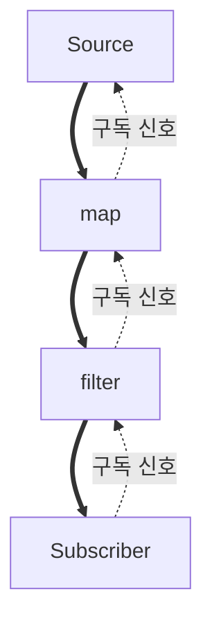

리액티브 스트림즈 명세 자체는 스레딩 모델을 강제하지 않아 특정 스레드에서 코드가 실행되도록 보장하지 않으며, 이는 개발자가 직접 관리해야 하는 영역이다.

- 기본적으로 리액터(Reactor)의 연산자 체인은 이전 단계의 신호를 발생시킨 스레드와 동일한 스레드에서 계속 실행
- 스케줄러는 이러한 실행 흐름을 의도적으로 다른 스레드로 전환할 때 사용

Spring WebFlux에서는 `Scheduler`를 통해 이 문제를 해결하며, 실행 컨텍스트(스레드)를 손쉽게 전환하고 제어할 수 있는 기능을 제공한다.

## 핵심 연산자: `publishOn` vs `subscribeOn`

리액티브 체인에서 코드가 어느 스레드에서 실행될지는 `subscribeOn`과 `publishOn` 두 연산자로 제어한다.

두 연산자가 별도로 존재하는 이유는, 리액티브 스트림이 두 단계의 신호 흐름으로 동작하기 때문이다.

### 두 단계의 신호 흐름

`subscribe()` 호출은 다음 두 단계를 차례로 일으킨다.

1. 구독 단계: `subscribe()`가 체인의 끝에서 시작해 소스까지 거슬러 올라가며, 각 연산자가 자신의 업스트림에 구독을 등록 (체인 전체에 1회)
2. 발행 단계: 소스가 생성한 `onNext`·`onComplete`·`onError` 신호가 아래로 내려오며 각 연산자를 통과 (요소마다 반복)



- 굵은 화살표(데이터 신호 하향): 발행 단계, 각 요소마다 반복
- 점선(구독 신호 상향): 구독 단계, 체인 전체에 1회

기본적으로 각 연산자는 직전 단계의 신호를 발생시킨 스레드를 그대로 이어받아 실행된다.

- 별도 지정이 없으면 전체 체인이 `subscribe()`를 호출한 스레드에서 동작
- 두 연산자는 이 두 단계 중 어느 쪽의 스레드를 바꿀지가 다름

|      연산자      |    바꾸는 단계     |         영향 받는 스레드         |
|:-------------:|:-------------:|:-------------------------:|
| `subscribeOn` | 구독 단계의 시작 스레드 | 소스의 데이터 발행 스레드까지 (체인 시작점) |
|  `publishOn`  | 발행 단계의 도중 스레드 |   자신보다 아래(다운스트림) 연산자들만    |

### `subscribeOn(Scheduler)`

리액티브 스트림은 `subscribe()` 호출 시 구독 신호가 체인의 가장 아래에서부터 위로(Upstream) 전파되면서 시작된다.

- 영향 범위: 구독 시작점과 데이터 소스를 포함한 업스트림 전체. `publishOn`으로 다른 스레드가 지정되기 전까지 영향
- 사용 횟수: 체인 내에 여러 번 선언되어도, 소스에 가장 가까운(= 코드상 맨 위쪽) `subscribeOn`만 유효
- 용도: 주로 블로킹 I/O 작업이나 오래 걸리는 초기화 작업을 별도의 스레드 풀에서 실행하여 기본 스레드(예: Netty 이벤트 루프)를 차단하지 않기 위해 사용

이처럼 `subscribeOn`은 이 구독 신호 전파 및 소스의 데이터 발행을 어떤 스레드에서 수행할지 결정한다.

#### 소스에 가장 가까운 것만 유효한 이유

`subscribeOn`은 "자신의 업스트림을 구독하는 작업"을 지정된 스케줄러의 스레드에서 실행하도록 재예약하는 연산자다.

- 구독 신호는 subscriber(아래) → source(위) 방향으로 1회 전파
- 여러 개의 `subscribeOn`이 체인에 있으면, 구독 신호가 위로 올라가며 각 지점마다 자신의 스케줄러로 스레드를 전환하려 시도
- 최종적으로 Source의 `subscribe()`를 호출하는 스레드는 소스 바로 위(= 소스에 가장 가까운) `subscribeOn`이 지정한 스케줄러의 스레드
- Source는 자신의 `subscribe()`가 호출된 스레드에서 데이터를 발행하므로, 결과적으로 소스에 가장 가까운 `subscribeOn`의 스케줄러만 데이터 발행 스레드를 결정

### `publishOn(Scheduler)`

`publishOn`은 자신보다 아래에 있는, 즉 다운스트림(Downstream) 연산자들의 실행 스레드를 지정된 스케줄러의 스레드로 변경한다.

- 영향 범위: `publishOn` 호출 이후의 모든 다운스트림 연산자
- 사용 횟수: 체인 내에서 여러 번 사용하여 각기 다른 스레드 컨텍스트로 전환 가능
- 용도: 특정 연산(예: CPU 집약적 작업)을 별도의 스레드에서 처리하고 싶을 때, 혹은 특정 스레드 컨텍스트로 다시 돌아와야 할 때 사용

연산자 체인에 스레드 경계를 만드는 것과 같으며, `publishOn`은 업스트림(Upstream)으로부터 신호(`onNext`, `onComplete`, `onError`)를 받아, 다시 전파(emit)한다.

|   항목   |     `subscribeOn()`      |           `publishOn()`            |
|:------:|:------------------------:|:----------------------------------:|
| 적용 범위  | 스트림 전체의 시작 스레드(Upstream) | 자신 이후의 연산자들(Downstream)의 실행 스레드 지정 |
| 위치 민감도 |      소스 근처 첫 선언만 적용      |         해당 지점에서 스레드 경계 생성          |
| 영향 신호  |        구독 신호(상향)         |             데이터 신호(하향)             |
| 주요 용도  | 블로킹 소스/초기화를 논블로킹 환경으로 격리 |      연산 특성에 따라 실행 스레드를 분리/전환       |

## 코드 예제

```java
public class SchedulerExample {

    public static void main(String[] args) throws InterruptedException {
        Flux.range(1, 3)
                // 구독 및 업스트림 연산(range, map 1)을 boundedElastic 스레드에서 실행
                .subscribeOn(Schedulers.boundedElastic())
                .map(i -> {
                    System.out.println("[map 1] on thread: " + Thread.currentThread().getName());
                    return i * 2;
                })
                .map(i -> {
                    System.out.println("[map 2] on thread: " + Thread.currentThread().getName());
                    return "Value " + i;
                })
                .publishOn(Schedulers.parallel())
                // 이 지점부터 다운스트림 연산을 parallel 스레드에서 실행
                .doOnNext(val -> System.out.println("[doOnNext] on thread: " + Thread.currentThread().getName()))
                .subscribe();
    }
}
```

### 다중 `publishOn` 사용

`publishOn`은 체인 어디에서든 새로운 스레드 경계를 만들 수 있어, 단계마다 적절한 스케줄러를 지정 가능하다.

```java
public class MultiPublishOnExample {

    public static void main(String[] args) {
        Flux.fromIterable(items)
                .subscribeOn(Schedulers.boundedElastic())   // 소스 발행은 blocking I/O용 스케줄러
                .map(MultiPublishOnExample::ioTransform)    // 위 스레드에서 실행
                .publishOn(Schedulers.parallel())           // 여기부터 CPU용 스레드로 전환
                .map(MultiPublishOnExample::cpuTask)
                .publishOn(Schedulers.single())             // 여기부터 단일 스레드로 전환
                .doOnNext(MultiPublishOnExample::sink)      // 순서가 중요한 출력 작업
                .subscribe();
    }
}
```

## 주요 스케줄러 종류

Project Reactor는 `Schedulers` 클래스를 통해 미리 정의된 스케줄러들을 제공한다.

- `Schedulers.parallel()`: CPU 코어 수만큼의 스레드를 가진 고정된 스레드 풀
    - CPU 집약적인 계산 작업에 최적화
- `Schedulers.boundedElastic()`: 필요에 따라 스레드를 동적으로 생성하고 재사용하는 스레드 풀
    - 스레드 수에 상한선 존재(기본값: CPU 코어 수 × 10)
    - 큐 크기에도 상한선 존재(기본값: 100,000)
    - 블로킹(Blocking) I/O 작업을 처리할 때 사용하기에 적합
- `Schedulers.single()`: 단 하나의 스레드를 재사용하는 스케줄러
    - 순서가 보장되어야 하는 작업 처리에 적합
- `Schedulers.immediate()`: 호출한 스레드를 그대로 사용 (전환 없음)
    - 테스트 또는 스케줄러 매개변수가 필수일 때 no-op으로 활용
- `Schedulers.fromExecutor(Executor)`: 기존 `Executor`·`ExecutorService`를 스케줄러로 래핑
    - 기존 스레드 풀과 통합이 필요한 경우 사용

`single()`과 `parallel()`은 모든 구독자가 동일한 인스턴스를 공유하지만, `newSingle()`·`newParallel()`은 매 호출마다 별도의 스케줄러를 생성한다.

-----

## Spring WebFlux에서의 활용

일반적인 WebFlux 컨트롤러에서는 스케줄러를 직접 다룰 일이 거의 없는데, 이벤트 루프 스레드에서 코드를 실행하기 때문이다.

하지만 레거시 블로킹(Blocking) 코드를 WebFlux 환경에서 호출해야 할 경우 스케줄러 사용은 필수적이다. 블로킹 코드가 WebFlux의 이벤트 루프 스레드를 점유하는 것을 막아야 하기 때문이다.

```java
// 레거시 JDBC 호출과 같은 블로킹 메서드
private User findUserByIdBlocking(String id) {
    // 이 스레드는 DB 응답이 올 때까지 멈춤(Block)
    return user;
}

// WebFlux에서 안전하게 호출하는 방법
public Mono<User> findUser(String id) {
    // 1. 블로킹 호출을 Mono로 래핑
    return Mono.fromCallable(() -> findUserByIdBlocking(id))
            // 2. 블로킹 작업을 위한 별도의 스레드 풀(boundedElastic)에서 실행하도록 지정
            .subscribeOn(Schedulers.boundedElastic());
}
```

`Schedulers.boundedElastic()`를 사용하면 `findUserByIdBlocking` 메서드가 이벤트 루프 스레드를 막지 않고, 블로킹 I/O 전용 스레드에서 안전하게 실행되도록 격리할 수 있다.

### WebFlux의 스레드 모델

Spring WebFlux는 기본적으로 적은 수의 고정된 스레드를 사용하여 수많은 동시 요청을 처리한다.

- 기본 스레드: Netty를 기본 서버로 사용하며, CPU 코어 수에 맞춰 생성된 이벤트 루프(Event Loop) 스레드를 사용
- 동작 원칙: 이벤트 루프 스레드는 절대 차단(block)되지 않아야 하며, I/O 작업이 완료될 때까지 기다리지 않고 다른 요청을 계속 처리
    - 만약 하나의 이벤트 루프 스레드가 `Thread.sleep()`, 블로킹 DB 호출 등으로 멈추게 되면, 해당 스레드에 할당된 모든 요청의 처리가 지연
    - 결국 시스템 전체의 처리량과 응답성을 심각하게 저하시키는 원인

### 스레드 사용 방식

실무에서는 다양한 상황에 맞춰 `Scheduler`를 전략적으로 사용해야 한다.

- 논블로킹 작업: 별도의 스케줄러를 지정할 필요가 없이, WebFlux의 기본 스레드(이벤트 루프)를 그대로 사용
- 블로킹 I/O (예: R2DBC가 아닌 JDBC, 외부 API 동기 호출)
    - `subscribeOn(Schedulers.boundedElastic())`을 사용
    - `boundedElastic` 스케줄러는 블로킹 I/O 작업을 위해 특별히 설계
    - 필요에 따라 스레드를 생성하지만, 무한정 생성되는 것을 막기 위해 상한선이 있으며 유휴 스레드는 자동으로 제거
    - 이벤트 루프 스레드가 아닌 별도의 스레드에서 블로킹 작업을 처리함으로써 전체 시스템의 반응성 유지 가능
- CPU 집약적인 계산 작업
    - `publishOn(Schedulers.parallel())` 사용
    - `parallel` 스케줄러는 CPU 코어 수만큼의 스레드를 가진 고정된 스레드 풀 제공
    - 계산이 많은 작업을 이벤트 루프에서 분리하여 다른 요청 처리에 영향을 주지 않도록 함

### 블로킹 코드 탐지

이벤트 루프에서 의도치 않은 블로킹 호출이 발생하면 시스템 전체 처리량이 급락하기 때문에, 개발 단계에서 자동으로 탐지할 수 있는 도구를 활용할 수 있다.

- BlockHound: JVM 에이전트 형태로 동작하며, 논블로킹 스레드(이벤트 루프, `parallel` 등)에서 블로킹 호출이 발생하면 즉시 예외 발생
    - 테스트 스코프에 등록하면 회귀 방지에 효과적
    - 의도된 블로킹은 `BlockHound.builder().allowBlockingCallsInside(...)`로 화이트리스트 등록 가능
