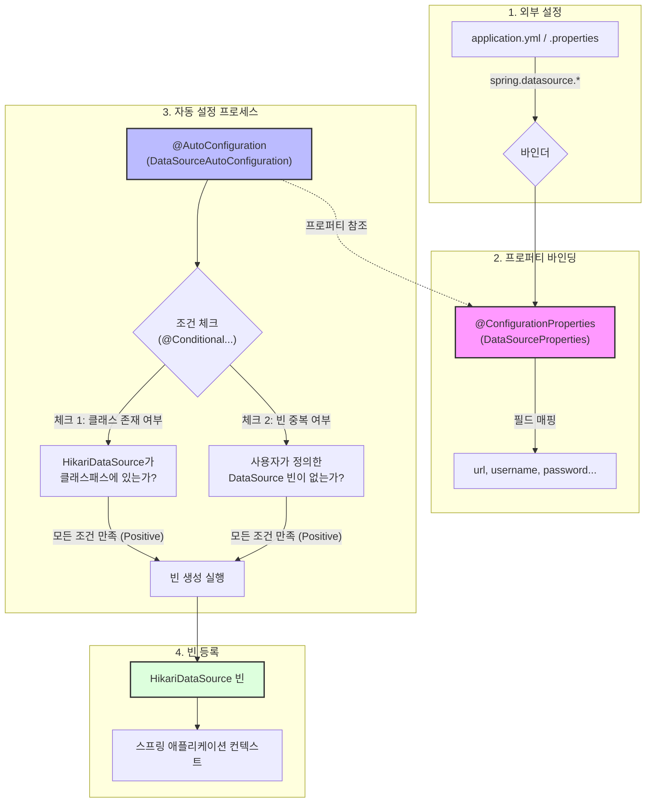

스프링 부트는 다양한 라이브러리와 기술 스택을 지원하며, 개발자가 별도의 코드 작성 없이도 쉽게 사용할 수 있도록 자동 설정(Auto Configuration) 기능을 제공한다.

## 자동 설정 메커니즘(Spring Boot 3.x 기준)

### 1. @EnableAutoConfiguration과 Import 선택기

`@SpringBootApplication`에 포함된 `@EnableAutoConfiguration` 애노테이션이 스프링 부트의 자동 설정 기능을 활성화한다.

- 내부적으로 `@Import(AutoConfigurationImportSelector.class)`를 사용하여 자동 설정 클래스를 스프링 컨테이너에 등록
- `AutoConfigurationImportSelector` 클래스는 설정된 후보군 중 실제 빈으로 등록할 클래스들을 필터링하여 결정
- `spring-boot-autoconfigure` 라이브러리 내의 `...autoconfigure.AutoConfiguration.imports` 파일을 사용하여 자동 설정 클래스 목록을 관리

### 2. 조건부 설정(@Conditional)

로드된 모든 자동 설정 클래스가 실제로 동작하는 것은 아니며, 각각의 자동 설정 클래스는 `@Conditional...` 애노테이션 그룹을 통해 특정 조건이 만족될 때만 활성화된다.

- `@ConditionalOnClass`: 특정 클래스가 클래스패스에 존재할 때
- `@ConditionalOnMissingBean`: 특정 빈이 이미 등록되어 있지 않을 때(개발자의 커스텀 설정을 우선시)
- `@ConditionalOnProperty`: 특정 설정 값이 존재하거나 일치할 때

### 3. 자동 설정의 우선순위 제어

여러 자동 설정이 얽혀 있을 때, 실행 순서를 제어하는 방법은 다음과 같다.

- `@AutoConfigureOrder`: 자동 설정 클래스 간의 절대적인 우선순위 지정
- `@AutoConfigureAfter` / `@AutoConfigureBefore`: 특정 자동 설정 클래스가 실행된 후 또는 전에 실행되도록 명시적 의존성 정의

## 프로퍼티 바인딩 및 빈 생성 상세 흐름(DataSource 예시)

자동 설정 클래스는 `@ConfigurationProperties`가 적용된 프로퍼티 객체를 참조한다.

1. 외부 설정(External Configuration): 설정 소스로부터 원천 데이터 수집
    - application.yml, .properties, 환경 변수 등 다양한 소스로부터 설정값 확보
    - spring.datasource와 같은 특정 접두사를 기반으로 관련 데이터를 바인더로 전달
2. 프로퍼티 바인딩(Property Binding): 설정 파일의 값을 자바 객체에 매핑
    - 확보된 데이터를 DataSourceProperties 클래스의 필드에 주입
    - 문자열 기반의 직접 접근 방식보다 타입 안정성 보장
    - 유연한 바인딩을 통해 다양한 소스의 값을 통합하여 자바 객체화 가능
3. 자동 설정 프로세스(Auto Configuration Process): 빈 생성 조건 검증
    - 클래스패스에 특정 라이브러리가 포함되어 있는지 확인
    - `@ConditionalOnClass`를 통해 HikariCP와 같은 실제 구현체의 존재 여부 판단
    - 주입받은 프로퍼티 객체에 필수적인 설정값(예: URL)이 누락되지 않았는지 검사
    - 조건이 하나라도 충족되지 않으면 해당 자동 설정은 전체가 무시되어 메모리 자원 절약
4. 빈 등록(Bean Registration): 최종 인스턴스 생성 및 컨테이너 등록
    - 모든 조건 충족 시 주입받은 프로퍼티를 사용하여 실제 빈(예: HikariDataSource) 생성
    - 사용자가 직접 빈을 정의 시 `@ConditionalOnMissingBean` 조건에 의해 자동 설정 빈은 생성되지 않음(개발자의 명시적 설정을 자동 설정보다 우선시)
    - 생성된 빈은 스프링 컨테이너(ApplicationContext) 등록

###### 참고자료

- [Spring Boot Reference Documentation - Auto-configuration](https://docs.spring.io/spring-boot/docs/current/reference/html/using.html#using.auto-configuration)
- [Spring Boot 3.0 Release Notes - New Auto-configuration Registration](https://github.com/spring-projects/spring-boot/wiki/Spring-Boot-3.0-Release-Notes#auto-configuration-registration)
