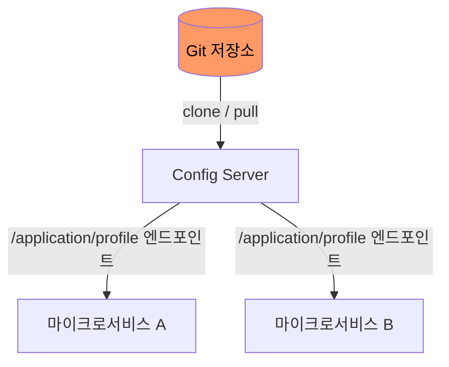
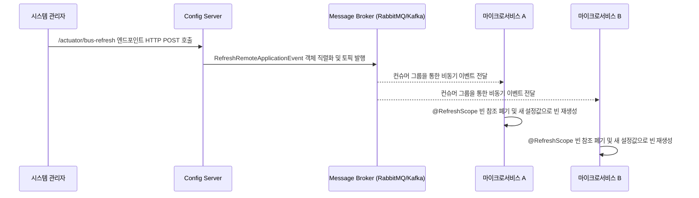

Spring Cloud Config Server는 설정을 외부 Git 저장소에서 단일 관리하고, 동적 리프레시를 통해 무중단으로 전파하는 거버넌스 모델을 제공한다.

## Config Server의 Git 저장소 기반 아키텍처

Config Server는 설정 파일을 Git 저장소에서 관리하여 버전 관리와 변경 이력 추적을 자연스럽게 지원한다.

- 기동 시 동작: Config Server는 지정된 Git 리포지토리를 로컬에 clone하고, 클라이언트 요청 시 해당 리포지토리에서 설정 파일을 읽어 JSON 형태로 응답
- 프로파일 매핑: 클라이언트의 `spring.application.name`과 `spring.profiles.active` 조합으로 `{application}-{profile}.yml` 파일을 탐색
- 우선순위: 애플리케이션별 설정 > 프로파일 설정 > 공통 설정(application.yml) 순으로 오버라이드

## @RefreshScope의 CGLIB 프록시 메커니즘

일반적인 싱글턴(Singleton) 빈은 애플리케이션 컨텍스트가 기동될 때 한 번만 생성되므로, Config Server에서 설정이 변경되어도 이미 주입된 값은 갱신되지 않는다.

- @RefreshScope 동작 원리: 해당 어노테이션이 붙은 빈은 실제 객체가 아닌 CGLIB 프록시 객체가 컨테이너에 등록
- 프록시 위임: 프록시는 내부적으로 실제 빈의 참조를 유지하며, 메서드 호출 시 실제 빈으로 위임
- 리프레시 시점: `/actuator/refresh` 호출 시 프록시가 보유한 실제 빈 참조를 무효화(invalidate)하고, 다음 호출 시 새로운 설정값으로 빈을 재생성
    - 애플리케이션 전체를 재시작하지 않고 해당 빈만 교체되며, 외부에서 주입받은 프록시 참조는 그대로 유지

## Fan-out 브로드캐스팅과 컨텍스트 리프레시

설정 정보가 변경되었을 때 각각의 마이크로서비스 인스턴스를 하나하나 재시작하는 것은 불가능하므로 Spring Cloud Bus를 활용한 팬아웃(Fan-out) 브로드캐스팅 메커니즘을 가동한다.

- 단일 호출로 전체 갱신: 관리자가 Config Server의 `/actuator/bus-refresh` 엔드포인트 하나만 호출하면 모든 인스턴스에 설정 변경 전파
- 선택적 갱신: 특정 서비스나 인스턴스만 대상으로 리프레시 이벤트를 발행하는 것도 가능
