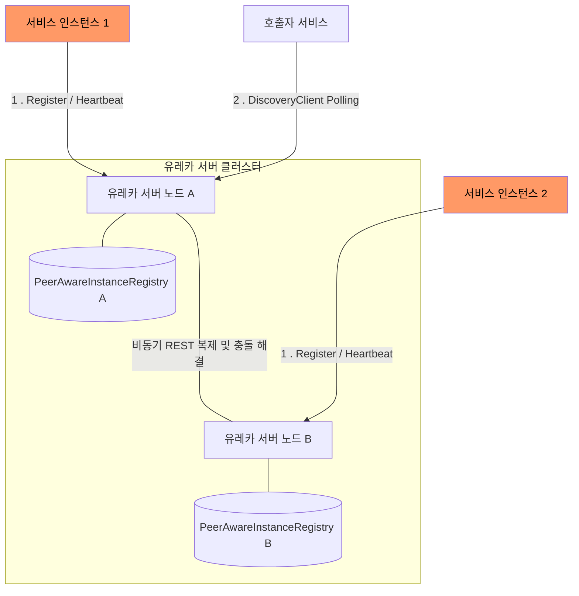
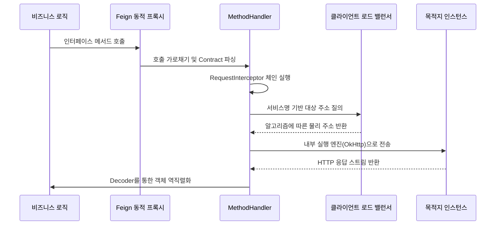

Spring Cloud는 서비스 디스커버리와 로드 밸런싱을 통해 분산 시스템의 연결성을 확보하는 강력한 메커니즘을 제공한다.

## Eureka Server - AP 기반 분산 레지스트리 아키텍처

유레카는 철저하게 가용성을 우선시하는 AP 시스템으로 설계되었다.(CAP 정리에서 Consistency보다 Availability와 Partition Tolerance를 선택)

### 서비스 등록 및 복제 메커니즘

유레카 서버 노드들은 리더-팔로워 구조가 아닌 상하 관계가 없는 Peer-to-Peer 방식으로 서로 연결되어 각 서버는 서비스 레지스트리 정보를 인메모리에 독립적으로 유지한다.

- 상태 동기화 프로토콜: 특정 유레카 서버에 서비스 등록이나 상태 변경 요청이 발생하면 해당 서버는 다른 모든 피어(Peer) 서버로 이벤트를 비동기 전파
- 델타(Delta) 업데이트와 정합성 검증: 네트워크 대역폭의 낭비를 막기 위해 전체 레지스트리가 아닌 최근 변경된 데이터(Delta)만 전송
    - 불일치 시에만 전체 레지스트리(Full Fetch)를 요청하여 최종 일관성 확보
- 최종 일관성(Eventual Consistency) 모델: 클라이언트의 주기적 캐시 갱신과 하트비트 메커니즘을 통해 시스템 전체의 정합성 최종적 보장

### Eureka Server의 3계층 캐시 아키텍처

유레카 서버는 수백만 번의 클라이언트 조회(Fetch) 요청을 지연 없이 처리하기 위해 내부적으로 ResponseCache 시스템을 운영한다.

|              캐시 계층              |    데이터 소스    |      갱신 주기       |          특징           |
|:-------------------------------:|:------------:|:----------------:|:---------------------:|
|  Registry (ConcurrentHashMap)   |  실시간 쓰기 데이터  |      즉시 반영       |  데이터의 단일 진실 원천(SSOT)  |
|   ReadWriteMap (Guava Cache)    |   Registry   |  실시간 및 180초 만료   | 쓰기 작업과 조회 작업 간의 완충 역할 |
| ReadOnlyMap (ConcurrentHashMap) | ReadWriteMap | 30초 (Timer Task) | 클라이언트 조회 전용으로 락 경합 방지 |

클라이언트는 항상 ReadOnlyMap을 조회하므로 인스턴스 등록 후 다른 서비스가 이를 감지하기까지 최대 30초의 물리적 지연이 발생할 수 있다.

### 자기 보호 모드(Self-Preservation)와 임대 관리

유레카 클라이언트는 DiscoveryClient를 통해 주기적으로 하트비트를 전송하여 임대 기간을 갱신한다.

- 임대 만료 관리: Eviction Task 스레드가 90초 동안 신호가 없는 인스턴스를 스캔하여 레지스트리에서 제거
- 자기 보호 모드 트리거: 최근 1분 동안 수신해야 하는 하트비트 총합의 기대 임계치보다 실제 수신량이 적을 경우 유레카는 이를 네트워크 장애로 판단

## Client-Side Load Balancing 전략

Spring Cloud는 기존 L4/L7 장비 기반의 서버 사이드 로드 밸런싱 대신 클라이언트 사이드 로드 밸런싱 방식을 지향한다.

- 로컬 캐시 라우팅: 클라이언트 애플리케이션 내부의 로드 밸런서가 유레카로부터 받은 인스턴스 목록을 기반으로 대상 인스턴스를 직접 선택
- 아키텍처적 이점: 모든 트래픽이 중앙 하드웨어를 거치지 않으므로 단일 장애점이 사라지며 네트워크 홉(Hop)이 줄어들어 지연 시간이 단축

## Feign Client의 선언적 통신 파이프라인

Feign Client는 인터페이스 정의와 어노테이션 설정만으로 HTTP 요청 로직을 구현할 수 있게 돕는 도구로 내부적으로 자바 리플렉션과 프록시 패턴을 사용한다.

