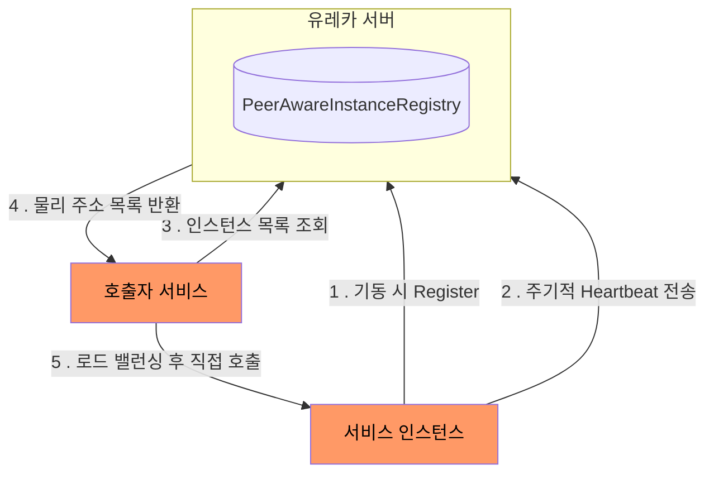
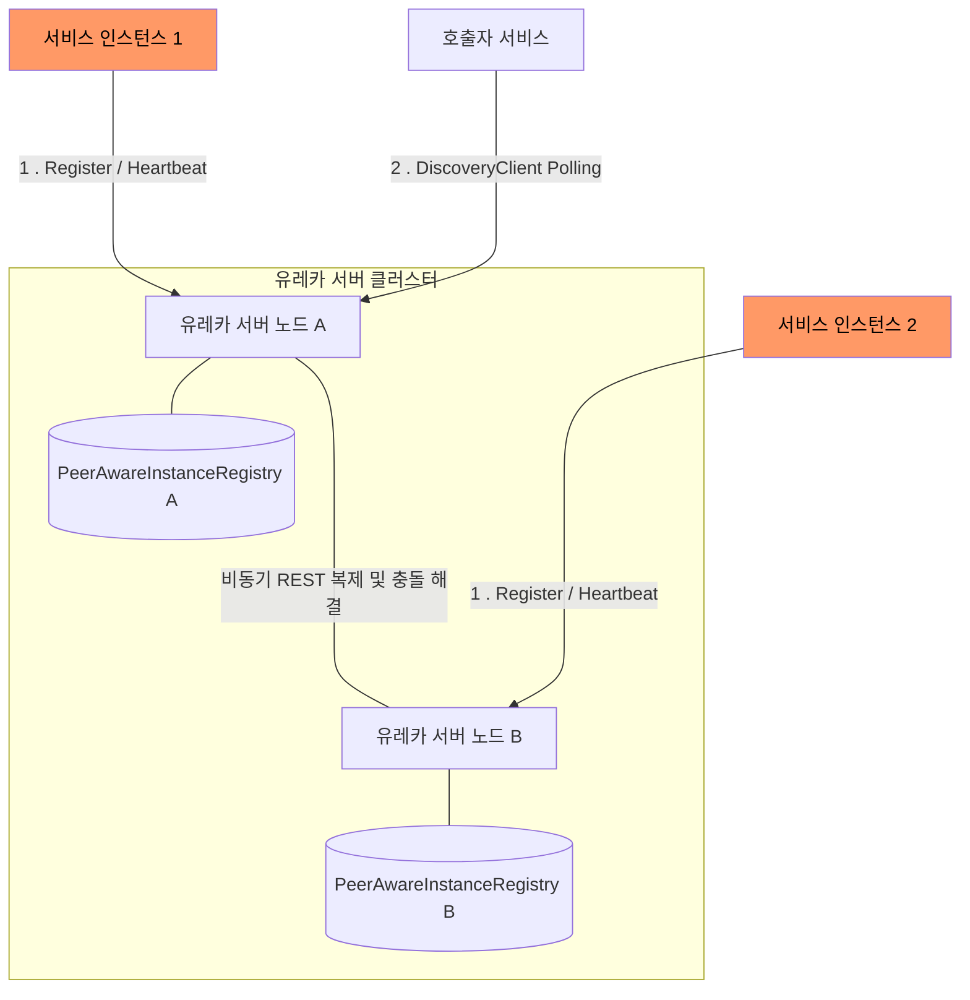
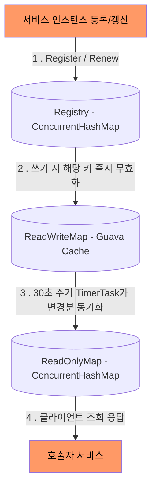
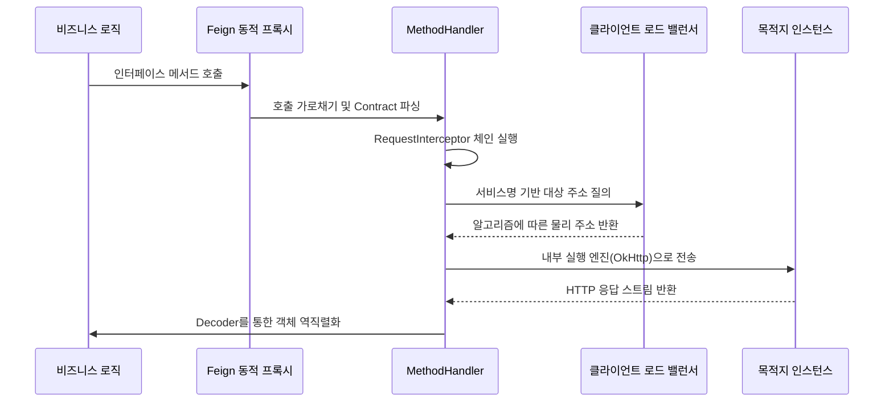

Spring Cloud는 서비스 디스커버리와 로드 밸런싱을 통해 분산 시스템의 연결성을 확보하는 강력한 메커니즘을 제공한다.

## Eureka Server - AP 기반 분산 레지스트리 아키텍처

마이크로서비스 환경에서는 서비스 인스턴스가 오토스케일링이나 배포에 의해 동적으로 생성 · 소멸되므로, IP와 포트를 사전에 고정할 수 없다.

- 서비스 디스커버리(Service Discovery): 각 서비스 인스턴스가 자신의 네트워크 위치를 중앙 레지스트리에 등록하고, 호출자가 레지스트리를 조회하여 대상의 물리 주소를 동적으로 획득하는 메커니즘
- 유레카(Eureka): Netflix가 개발한 서비스 디스커버리 서버로, Spring Cloud 생태계에서 사실상의 표준으로 사용

### 핵심 구성 요소와 동작 모델

유레카는 서버(Registry)와 클라이언트(DiscoveryClient)의 협력으로 동작한다.

- 유레카 서버: 서비스 인스턴스 정보를 인메모리 레지스트리(PeerAwareInstanceRegistry)에 보관하며, 여러 노드가 Peer-to-Peer로 연결되어 레지스트리를 상호 복제
    - PeerAwareInstanceRegistry: 피어 노드의 존재를 인식하고, 등록·갱신·삭제 이벤트를 다른 노드로 전파하는 책임을 가진 레지스트리 구현체
- 유레카 클라이언트(DiscoveryClient): 각 서비스 인스턴스에 내장되어 기동 시 자신을 등록(Register)하고, 주기적으로 하트비트(Heartbeat)를 전송하여 임대(Lease)를 갱신
- 서비스 조회: 호출자 서비스는 DiscoveryClient를 통해 유레카 서버에서 대상 서비스의 인스턴스 목록을 주기적으로 폴링(Polling)하여 로컬 캐시에 저장

### CAP 정리와 AP 선택

유레카는 CAP 정리에서 Consistency보다 Availability와 Partition Tolerance를 선택한 AP 시스템으로 설계되었다.

- 네트워크 분할(Network Partition) 상황에서도 각 노드가 독립적으로 서비스 등록과 조회 요청을 계속 처리
- 일시적으로 만료된 데이터가 조회될 수 있지만, 서비스 전체가 중단되는 2차 장애를 방지

### AP 설계의 공학적 근거

서비스 디스커버리는 강한 일관성(Strong Consistency)보다 가용성(Availability)이 우선되는 대표적인 사례다.

- 일시적 불일치의 허용 가능성: 클라이언트가 이미 내려간 인스턴스로 요청을 보내더라도 로드 밸런서의 재시도 로직이나 서킷 브레이커가 이를 보완
- CP 선택의 위험성: 레지스트리가 쿼럼(Quorum)을 확보하지 못해 서비스를 중단하면, 모든 클라이언트가 라우팅 정보를 잃어 전체 시스템 마비

### 서비스 디스커버리 솔루션 비교

|   비교 항목   |      Eureka       |      Consul      |    ZooKeeper    |
|:---------:|:-----------------:|:----------------:|:---------------:|
|  CAP 선택   |    AP (가용성 우선)    |   CP (일관성 우선)    |   CP (일관성 우선)   |
|  합의 알고리즘  |   없음 (Peer 복제)    |     Raft 합의      |     ZAB 합의      |
|  일관성 모델   | 최종 일관성 (Eventual) | 강한 일관성 (Strong)  | 강한 일관성 (Strong) |
|   헬스 체크   |  클라이언트 하트비트 (능동)  | 서버 측 HTTP/TCP 체크 |   세션 기반 임시 노드   |
| 멀티 데이터센터  |   미지원 (커스텀 필요)    |     네이티브 지원      |   미지원 (별도 구성)   |
| 네트워크 장애 시 |   각 노드 독립 운영 지속   | 리더 선출 실패 시 쓰기 불가 | 쿼럼 상실 시 서비스 중단  |

- Eureka: 대규모 마이크로서비스 환경에서 가용성이 최우선일 때 적합하며, Spring Cloud와의 통합이 가장 자연스러움
- Consul: 헬스 체크가 정교하고 멀티 데이터센터를 네이티브로 지원하여 글로벌 서비스에 유리
- ZooKeeper: 분산 잠금(Distributed Lock)이나 리더 선출(Leader Election) 같은 조정(Coordination) 작업에 강하지만, 서비스 디스커버리 전용 도구로는 과도한 복잡성

### 서비스 등록 및 복제 메커니즘

유레카 서버 노드들은 리더-팔로워 구조가 아닌 상하 관계가 없는 Peer-to-Peer 방식으로 서로 연결되어 각 서버는 서비스 레지스트리 정보를 인메모리에 독립적으로 유지한다.

- 상태 동기화 프로토콜: 특정 유레카 서버에 서비스 등록이나 상태 변경 요청이 발생하면 해당 서버는 다른 모든 피어(Peer) 서버로 이벤트를 비동기 전파
- 델타(Delta) 업데이트와 정합성 검증: 네트워크 대역폭의 낭비를 막기 위해 전체 레지스트리가 아닌 최근 변경된 데이터(Delta)만 전송
    - 불일치 시에만 전체 레지스트리(Full Fetch)를 요청하여 최종 일관성 확보
- 최종 일관성(Eventual Consistency) 모델: 클라이언트의 주기적 캐시 갱신과 하트비트 메커니즘을 통해 시스템 전체의 정합성 최종적 보장

### Eureka Server의 3계층 캐시 아키텍처

유레카 서버는 수백만 번의 클라이언트 조회(Fetch) 요청을 지연 없이 처리하기 위해 내부적으로 ResponseCache 시스템을 운영한다.

|              캐시 계층              |    데이터 소스    |      갱신 주기       |          특징           |
|:-------------------------------:|:------------:|:----------------:|:---------------------:|
|  Registry (ConcurrentHashMap)   |  실시간 쓰기 데이터  |      즉시 반영       |  데이터의 단일 진실 원천(SSOT)  |
|   ReadWriteMap (Guava Cache)    |   Registry   |  실시간 및 180초 만료   | 쓰기 작업과 조회 작업 간의 완충 역할 |
| ReadOnlyMap (ConcurrentHashMap) | ReadWriteMap | 30초 (Timer Task) | 클라이언트 조회 전용으로 락 경합 방지 |

#### 갱신 흐름

인스턴스 등록이나 상태 변경이 발생하면 데이터는 Registry → ReadWriteMap → ReadOnlyMap 순서로 단방향 전파된다.

- Registry 반영: 인스턴스의 Register, Renew, Cancel 요청이 들어오면 Registry(ConcurrentHashMap)에 즉시 반영
- ReadWriteMap 무효화: 쓰기 작업 발생 시 해당 키의 Guava Cache 엔트리를 즉시 무효화(invalidate)하여, 다음 조회 시 Registry에서 최신 데이터를 다시 로드
    - 180초 동안 조회가 없으면 TTL 만료로 자동 제거
- ReadOnlyMap 동기화: CacheUpdateTask(TimerTask)가 30초 주기로 ReadWriteMap의 각 키를 순회하며 ReadOnlyMap과 비교하여 변경분만 갱신

클라이언트는 항상 ReadOnlyMap을 조회하므로 인스턴스 등록 후 다른 서비스가 이를 감지하기까지 최대 30초의 물리적 지연이 발생할 수 있다.

- 이 지연은 서비스 디스커버리의 AP 특성에서 비롯되는 의도된 트레이드오프
- 빠른 감지가 필요한 경우 `eureka.server.responseCacheUpdateIntervalMs` 값을 줄여 갱신 주기 단축 가능

### 자기 보호 모드(Self-Preservation)와 임대 관리

유레카 클라이언트는 DiscoveryClient를 통해 주기적으로 하트비트를 전송하여 임대 기간을 갱신한다.

- 정상 모드(임대 만료 관리): Eviction Task 스레드가 60초 주기로 실행되어, 90초 동안 하트비트가 없는 인스턴스를 레지스트리에서 제거
- 자기 보호 모드 진입 조건: 최근 1분 동안 수신해야 하는 하트비트 총합의 기대 임계치보다 실제 수신량이 적을 경우, 유레카는 개별 인스턴스의 장애가 아닌 네트워크 장애로 판단

#### 자기 보호 모드가 필요한 이유

Eviction이 항상 동작하면 네트워크 장애 시 심각한 문제가 발생한다.

- 유레카 서버와 인스턴스 사이의 네트워크가 일시적으로 끊기면, 실제로는 정상인 인스턴스들도 하트비트를 보내지 못함
- Eviction Task가 이 인스턴스들을 전부 제거 → 레지스트리가 비어 클라이언트가 조회할 인스턴스가 없어져 전체 서비스 호출 불가

반대로 Eviction을 항상 중지하면, 진짜로 죽은 인스턴스가 영원히 레지스트리에 남아 클라이언트가 지속적으로 죽은 인스턴스로 요청을 보내게 된다.

- 자기 보호 모드는 이 두 상황을 하트비트 실종 비율로 구분하여 Eviction 동작을 전환하는 메커니즘

|       상황        |       판단 근거       |    Eviction 동작     |           이유            |
|:---------------:|:-----------------:|:------------------:|:-----------------------:|
| 소수 하트비트 실종 (정상) | 기대 임계치 이상 하트비트 수신 | 만료 인스턴스 제거 (정상 동작) | 개별 인스턴스 장애이므로 빠른 제거가 유리 |
|  다수 하트비트 동시 실종  |     기대 임계치 미달     |  제거 중지 (보호 모드 진입)  | 네트워크 장애로 판단하여 대량 오탈락 방지 |

## Client-Side Load Balancing 전략

Spring Cloud는 기존 L4/L7 장비 기반의 서버 사이드 로드 밸런싱 대신 클라이언트 사이드 로드 밸런싱 방식을 지향한다.

### 서버 사이드 vs 클라이언트 사이드 로드 밸런싱

|  비교 항목  |   서버 사이드 (L4/L7 장비)   |  클라이언트 사이드 (Spring Cloud)  |
|:-------:|:---------------------:|:--------------------------:|
| 라우팅 주체  |     중앙 로드 밸런서 장비      |     각 클라이언트 애플리케이션 내부      |
| 단일 장애점  | 로드 밸런서 장애 시 전체 트래픽 차단 |      장애점 없음 (분산 라우팅)       |
| 네트워크 홉  | 클라이언트 → LB → 서비스 (2홉) |      클라이언트 → 서비스 (1홉)      |
| 인스턴스 정보 |   LB가 헬스 체크로 직접 관리    | 서비스 레지스트리(Eureka)에서 주기적 조회 |
|  확장 비용  | 트래픽 증가 시 LB 장비 증설 필요  |    클라이언트 수에 비례하여 자동 분산     |
|  적합 환경  |  정적 인프라, 외부 트래픽 진입점   | 동적 스케일링이 빈번한 마이크로서비스 내부 통신 |

### 로드 밸런싱 알고리즘

Spring Cloud LoadBalancer는 ReactiveLoadBalancer 인터페이스의 구현체를 통해 인스턴스 선택 전략을 제공한다.

|             알고리즘             |                              동작 방식                               |            적합한 상황            |
|:----------------------------:|:----------------------------------------------------------------:|:----------------------------:|
| RoundRobinLoadBalancer (기본값) |               AtomicInteger 카운터를 증가시키며 인스턴스 목록을 순환               |     인스턴스 성능이 균일한 일반적인 환경     |
|      RandomLoadBalancer      |                 ThreadLocalRandom으로 인스턴스를 무작위 선택                 |   간단한 부하 분산, 캐시 분산 효과 기대 시   |
|         Weighted 방식          |                   인스턴스별 가중치를 지정하여 트래픽 비율 차등 분배                   | 카나리 배포, 성능 차이가 있는 인스턴스 혼용 시  |
|        Zone-aware 방식         | ZonePreferenceServiceInstanceListSupplier로 동일 존(Zone) 인스턴스 우선 선택 | 멀티 AZ 환경에서 존 간 네트워크 지연 최소화 시 |

- 기본 알고리즘은 RoundRobinLoadBalancer이며, @LoadBalancerClient 어노테이션을 통해 서비스별로 다른 전략 적용 가능
- Zone-aware 필터링은 인스턴스 선택 전에 동일 존의 인스턴스만 후보로 남기는 선행 필터로 동작

## Feign Client의 선언적 통신 파이프라인

Feign Client는 인터페이스 정의와 어노테이션 설정만으로 HTTP 요청 로직을 구현할 수 있게 돕는 도구로 내부적으로 자바 리플렉션과 프록시 패턴을 사용한다.

### 동적 프록시 생성 과정

애플리케이션이 기동될 때 @FeignClient가 붙은 인터페이스를 감지하고, Feign.Builder가 해당 인터페이스의 JDK 동적 프록시 객체를 생성한다.

- Contract 파싱: 인터페이스의 어노테이션(@GetMapping, @PathVariable 등)을 분석하여 HTTP 메서드, 경로, 파라미터 바인딩 정보를 메타데이터로 변환
- MethodHandler 매핑: 인터페이스의 각 메서드를 개별 MethodHandler(SynchronousMethodHandler)에 1:1로 매핑하여 Map 구조로 보관
- 프록시 호출 흐름: 비즈니스 코드에서 인터페이스 메서드를 호출하면 프록시가 이를 가로채어 해당 MethodHandler로 위임

### 확장 포인트(Extension Point)

Feign은 파이프라인의 각 단계를 독립적으로 교체할 수 있는 확장 포인트를 제공한다.

|       확장 포인트       |              역할               |                       사용 예시                       |
|:------------------:|:-----------------------------:|:-------------------------------------------------:|
| RequestInterceptor | 요청 전송 전 헤더·파라미터를 조작하는 인터셉터 체인 |          인증 토큰 주입, 공통 헤더(Trace ID 등) 추가           |
|    ErrorDecoder    |  HTTP 응답 코드에 따른 예외 매핑 전략 정의   |        4xx/5xx 응답을 비즈니스 예외로 변환, 재시도 대상 판별         |
| Encoder / Decoder  |    요청 본문 직렬화 및 응답 본문 역직렬화     |    Jackson 기반 JSON 변환(기본값), Protobuf 등 커스텀 포맷     |
|      Contract      |  어노테이션 해석 규칙을 정의하는 메타데이터 파서   |    Spring MVC 어노테이션 해석(SpringMvcContract, 기본값)    |
|   Client (실행 엔진)   |  실제 HTTP 통신을 수행하는 저수준 클라이언트   | 기본 JDK HttpURLConnection → OkHttp, Apache HC5로 교체 |

- RequestInterceptor는 체인 형태로 여러 개 등록 가능하며, 요청이 전송되기 직전에 순차 실행
- ErrorDecoder를 커스터마이즈하면 특정 HTTP 상태 코드에 대해 RetryableException을 던져 Feign의 내장 Retryer와 연계한 자동 재시도 구현 가능
