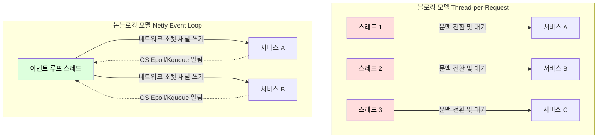
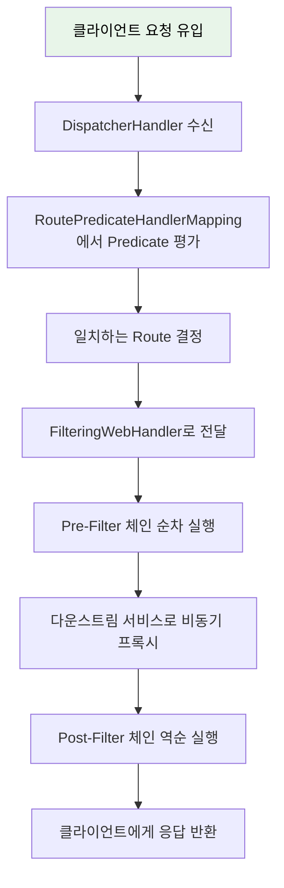
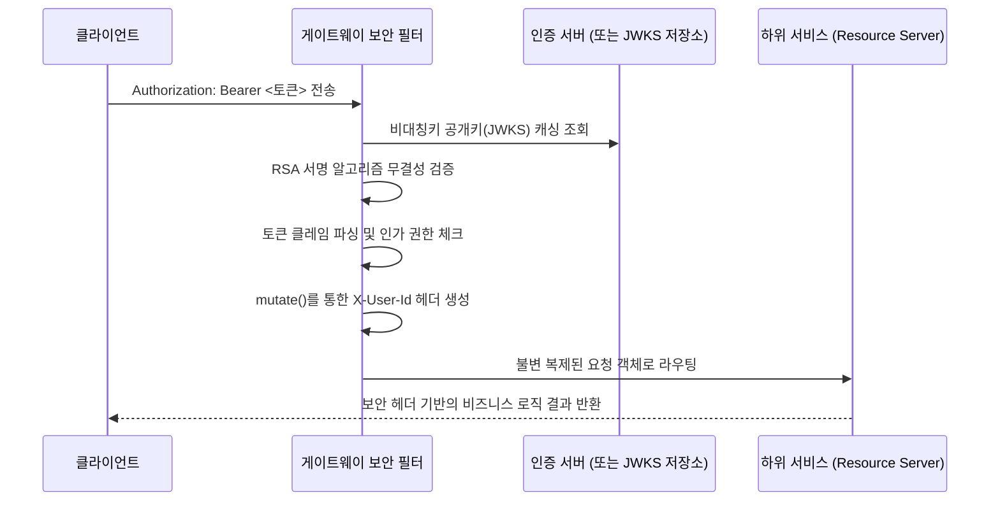

마이크로서비스 아키텍처 환경에서는 클라이언트가 내부의 수많은 서비스를 직접 호출할 경우 인증, 인가, 로깅, CORS 처리 등의 공통 관심사가 모든 서비스에 중복 구현되는 파편화 문제가 발생한다.

- API Gateway는 이러한 시스템의 전면에 배치되어 외부로부터 들어오는 모든 트래픽의 유일한 진입점 역할 수행
- 라우팅과 보안 통제 중앙화

## API Gateway 솔루션 비교

|   비교 항목   |  Spring Cloud Gateway  |       Nginx        |
|:---------:|:----------------------:|:------------------:|
|   구현 언어   |     Java (Reactor)     |         C          |
|  I/O 모델   |   Netty 기반 논블로킹 리액티브   |    이벤트 드리븐 논블로킹    |
|   설정 방식   |   Java 코드 / YAML 선언    |     nginx.conf     |
| Spring 통합 |  네이티브 (동일 JVM, DI 활용)  |      별도 프로세스       |
|   적합 환경   | Spring 기반 MSA 내부 게이트웨이 | 정적 리버스 프록시, 외부 진입점 |

- Spring Cloud Gateway는 Spring 생태계와의 자연스러운 통합이 최대 강점으로, 동일 JVM 내에서 Spring Security, Spring Cloud Config 등과 직접 결합 가능
- Nginx은 언어에 무관한 범용 게이트웨이로, Spring 외 기술 스택이 혼용되는 환경에 적합

## Reactive 아키텍처와 논블로킹 I/O 모델

API Gateway는 비즈니스 로직을 직접 연산하기보다는 들어온 요청을 하위 서비스로 넘기고 그 응답을 다시 클라이언트로 돌려보내는 전형적인 네트워크 I/O 바운드(I/O Bound) 작업에 해당한다.

### 서블릿 모델의 스레드 고갈 현상 (Thread Pool Exhaustion)

전통적인 톰캣(Tomcat)과 같은 블로킹 서블릿 컨테이너 모델(Thread-per-Request)에서는 클라이언트의 요청 하나당 온전한 OS 스레드가 하나씩 할당된다.

- I/O 대기(Wait) 상태: 게이트웨이가 하위 마이크로서비스로 HTTP 요청을 전송 후 응답을 돌려줄 때까지 게이트웨이의 스레드는 아무 작업도 하지 못한 채 블로킹 상태로 대기
- 장애 전파(Cascading Failure): 특정 하위 서비스에 병목 발생으로 게이트웨이의 대기 스레드가 누적되어 가용한 스레드 풀이 고갈되어 전체 시스템 마비

### Netty 이벤트 루프와 Epoll 매커니즘

Spring Cloud Gateway는 내장 웹 서버로 Netty를 채택하여 비동기 논블로킹(Asynchronous Non-blocking) 모델을 구현했다.



- 소수 스레드 운영: Netty는 CPU 코어 수에 맞춘 극소수의 이벤트 루프(Event Loop) 스레드만으로 수만 개의 연결 처리 가능
- 운영체제 레벨 알림: 요청을 수신한 스레드는 하위 서비스로 네트워크 요청을 비동기로 처리하여 결과를 기다리지 않고 즉시 루프로 복귀하여 다른 클라이언트의 요청 수신
- 배압(Backpressure) 제어: Project Reactor의 데이터 스트림 모델과 결합하여 구독자 기반의 속도 조절(배압) 로직이 내부적으로 동작

### 리액티브 모델 채택의 트레이드오프

논블로킹 모델은 높은 처리량과 자원 효율성을 제공하지만, 다음과 같은 운영상의 비용이 수반된다.

- 디버깅의 어려움: 비동기 콜백 체인에서는 전통적인 스택 트레이스가 끊기므로 오류 발생 지점을 추적하기 어려움
- 학습 곡선: Reactor의 Mono/Flux 연산자 체인, 배압 전략, 스케줄러 모델 등 비동기 프로그래밍 패러다임에 대한 깊은 이해 필요
- 블로킹 API 호출 금지: 이벤트 루프 스레드에서 블로킹 호출(JDBC, Thread.sleep 등)을 수행하면 전체 처리량이 급락하므로 모든 I/O를 비동기 API로 전환 필수

## 리액티브 라우팅 파이프라인의 시퀀스

클라이언트의 요청이 Netty를 통해 유입되면 내부적으로 고도로 추상화된 리액티브 컴포넌트 계층을 거치며 목적지를 찾아간다.

### Route 구성 요소와 탐색(Locator) 매커니즘

라우트(Route)는 게이트웨이가 요청을 어디로 보낼지 결정하는 가장 기본적인 데이터 모델이다.

|   구성 요소   |                역할 및 메커니즘                 |
|:---------:|:----------------------------------------:|
|    ID     |               라우트의 고유 식별자                |
|    URI    |            요청을 포워딩할 최종 목적지 주소            |
| Predicate |         들어온 요청이 해당 라우트에 부합하는지 판별         |
|  Filter   | 라우팅 전후로 HTTP 헤더, 바디, 상태 코드 변조하는 파이프라인 로직 |

- 게이트웨이는 기동 시점이나 런타임에 다양한 소스로부터 라우트 정보를 메모리에 로드
- 여러 소스를 조합하여 최종 라우트 테이블 구성

### Predicate 매칭과 리액티브 체인 생성

DispatcherHandler가 요청을 받으면 등록된 모든 Route의 Predicate를 순회하며 평가한다.

| 내장 Predicate 팩토리 |                평가 기준 및 동작                 |             예시              |
|:----------------:|:-----------------------------------------:|:---------------------------:|
|       Path       | 정규식 기반 경로 패턴 매칭 및 경로 변수(URI Variables) 추출 |    `/api/v1/orders/{id}`    |
|      Method      |    GET, POST, PUT 등 HTTP 메서드 일치 여부 검사     |            `GET`            |
|      Header      |        특정 헤더의 존재 여부 및 정규식 값 일치 검사         |     `X-Request-Id: \d+`     |
|      Weight      |     동일한 그룹 내에서 설정된 가중치 비율 기반의 트래픽 분할      | `group1, 80` / `group1, 20` |

- 조건이 일치하는 Route가 결정되면 FilteringWebHandler 개입
- 해당 핸들러는 해당 라우트 전용 게이트웨이 필터들과 시스템 전역에 적용되는 글로벌 필터들을 수집하여 GatewayFilterChain 형성

## 리액티브 체인으로 구현된 필터 실행

리액티브 필터 체인은 `Mono`와 같은 리액티브 타입으로 연결된다.

- 각 필터는 `filter(ServerWebExchange exchange, GatewayFilterChain chain)` 메서드 구현
    - `ServerWebExchange` 매개변수: HTTP 요청과 응답에 대한 모든 정보를 포함
    - `chain` 매개변수: '다음 필터'를 포함한 나머지 체인 전체를 의미
- 'Pre' 필터 로직: `chain.filter(exchange)`를 호출하기 전의 작업
    - 다운스트림 서비스로 요청이 전달되기 전에 실행되며, 주로 요청 헤더 추가나 인증 수행
- 'Post' 필터 로직: `chain.filter(exchange)`가 반환하는 `Mono<Void>`에 `.then()`, `flatMap` 같은 연산자를 사용하여 연결된 후속 작업
    - 다운스트림 서비스로부터 응답이 돌아온 후에 실행되며, 주로 응답 헤더 추가나 응답 본문 로깅

```java
public Mono<Void> filter(ServerWebExchange exchange, GatewayFilterChain chain) {
    // === 'Pre' 필터 ===
    ServerHttpRequest mutatedRequest = exchange.getRequest().mutate()
            .headers(h -> h.add("X-Request-ID", "some-value"))
            .build();

    ServerWebExchange mutatedExchange = exchange.mutate()
            .request(mutatedRequest)
            .build();

    // 체인 진행(논블로킹)
    return chain.filter(mutatedExchange)
            // === 'Post' 필터 ===
            .then(Mono.fromRunnable(() -> {
                ServerHttpResponse response = mutatedExchange.getResponse();
            }));
}
```

## 전체 요청 처리 파이프라인

내부적으로 Project Reactor와 Netty에 기반한 비동기 논블로킹 모델을 사용하여, 높은 처리량과 낮은 지연 시간을 제공한다.



### 리액티브 스트림 관점의 처리 흐름

모든 요청 처리 과정은 하나의 리액티브 파이프라인을 정의하는 것과 같다.

- 스트림 생성(Publisher 생성): 클라이언트 요청이 Netty의 이벤트 루프에 할당되면 `Mono<ServerWebExchange>` 스트림 객체로 포장
    - `Mono` 객체는 "요청을 어떻게 처리할지"에 대한 설계도(Publisher)이며, 아직 실행되지 않은 상태
- 처리 파이프라인 정의(Operator 체이닝): `DispatcherHandler`가 Route를 결정하고, 필요한 필터들을 순서대로 연결하여 파이프라인 완성
- 구독과 실행(Subscription): 파이프라인의 맨 끝에서 `.subscribe()`가 호출되는 순간 실제 데이터 흐름이 시작
    - 요청을 보낸 스레드는 결과를 기다리며 멈추지 않고(Non-Blocking) 즉시 반환되어 다른 요청 처리
- 비동기 응답 처리: 다운스트림 서비스로부터 응답이 이벤트로 도착하면 Post-Filter 로직을 거쳐 클라이언트에게 전달

## 무상태(Stateless) 중앙 집중식 보안 전략

게이트웨이 레이어에서 인증(Authentication)과 인가(Authorization)를 전담함으로써 하위 서비스들은 순수한 비즈니스 로직 구현에만 집중할 수 있다.



- 토큰 검증 중앙화: 각 하위 서비스가 개별적으로 JWT 검증 로직을 구현할 필요 없이, 게이트웨이에서 한 번만 검증
- 사용자 정보 전파: 검증된 토큰의 클레임(사용자 ID, 권한 등)을 커스텀 헤더(X-User-Id 등)로 변환하여 하위 서비스로 전달
