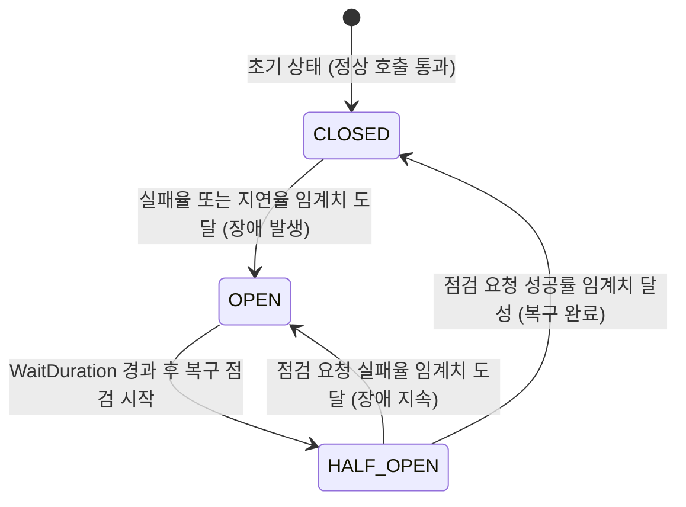
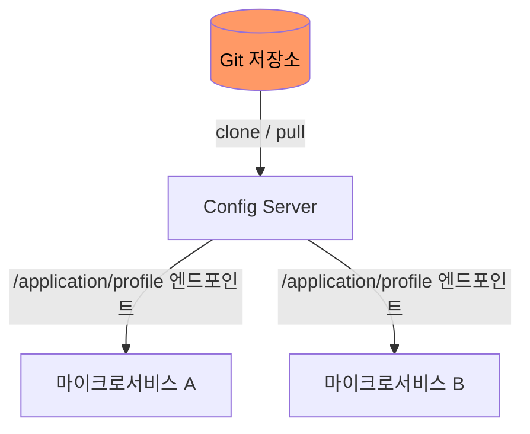
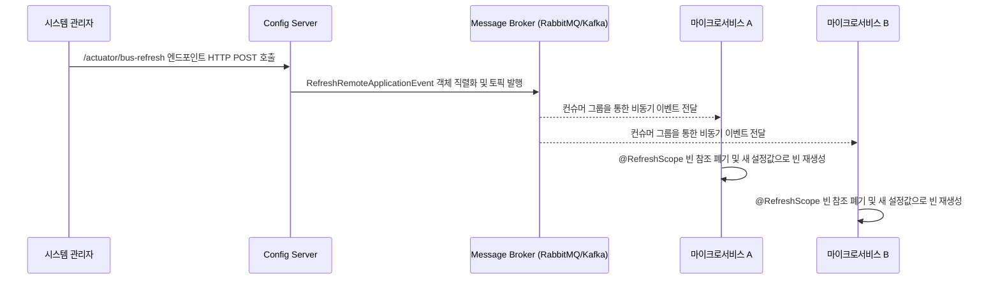

분산된 수많은 서비스의 상태를 얼마나 정확히 관측(Observability)하고 네트워크나 인프라 장애 발생 시 얼마나 유연하게 대응하는지는 분산 시스템의 신뢰성과 가용성을 결정하는 핵심 요소다.

## 복원력 설계 - Resilience4j 아키텍처

Resilience4j는 자바 8의 함수형 프로그래밍(Functional Programming) 패러다임과 람다(Lambda) 표현식을 활용하여 설계된 경량 결함 내성(Fault Tolerance) 라이브러리다.

- Netflix Hystrix의 후속으로, Hystrix가 유지보수 모드로 전환된 이후 Spring Cloud 생태계에서 널리 사용
- 데코레이터 패턴 기반 설계: 서킷 브레이커, 벌크헤드, 레이트 리미터 등 각 패턴을 독립적으로 조합하여 함수 호출을 래핑

### 서킷 브레이커의 상태 전이 모델

서킷 브레이커는 호출 대상 서비스의 가용성을 슬라이딩 윈도우 방식의 통계를 바탕으로 판단하여 장애 확산을 물리적으로 차단한다.

### 슬라이딩 윈도우의 비트셋(BitSet) 기반 내부 구현

Resilience4j는 호출 결과를 기록할 때 boolean 배열 대신 Ring Bit Buffer라는 BitSet 기반 자료구조를 사용한다.

- 메모리 효율: BitSet은 내부적으로 `long[]` 배열을 사용하므로 1,024건의 호출 상태를 단 16개의 long(64비트) 값으로 저장(128바이트)
- 비트 매핑: 성공한 호출은 0 비트, 실패한 호출은 1 비트로 기록
- 실패율 계산: 전체 비트 중 1 비트의 비율을 산출하여 실패율 도출

### Count-based vs Time-based 슬라이딩 윈도우

|  비교 항목  |           Count-based           |                 Time-based                  |
|:-------:|:-------------------------------:|:-------------------------------------------:|
| 윈도우 단위  |  최근 N건의 호출 결과를 고정 크기 순환 배열에 기록  |   최근 N초 동안의 호출 결과를 에폭(Epoch) 초 단위 버킷에 기록    |
|  자료구조   |    고정 크기 순환 배열 (Ring Buffer)    | N개의 부분 집계(Partial Aggregation) 버킷을 가진 순환 배열 |
| 집계 트리거  |    순환 배열이 가득 찬 후부터 실패율 계산 시작    |    매 에폭 초마다 가장 오래된 버킷을 새 버킷으로 교체하며 집계 갱신    |
| 적합한 상황  |  트래픽이 균일하여 호출 횟수 기준 판단이 적합한 환경  |       트래픽 변동이 크거나 시간 기반 장애 감지가 중요한 환경       |
| 메모리 사용량 | 윈도우 크기에 비례하는 고정 메모리 (BitSet 기반) |       윈도우 크기(초)에 비례하며 각 버킷이 집계 통계를 유지       |

### 고급 장애 격리 패턴 분석

|    패턴 이름    |                       메커니즘 및 내부 동작 원리                       |          해결 과제          |
|:-----------:|:-----------------------------------------------------------:|:-----------------------:|
|  Bulkhead   |  특정 서비스의 지연이 전체 스레드 풀을 점유하지 않도록 별도의 ThreadPool을 할당해 자원 격리   | 타 서비스로의 리소스 부족 장애 전파 방지 |
| RateLimiter | 토큰을 리필하는 토큰 버킷(Token Bucket) 알고리즘을 사용하여 허용치 이상의 요청 큐잉 or 거절 |  트래픽 폭주로 인한 인프라 과부하 방지  |
|    Retry    |                  일시적인 네트워크 순단 상황에 대비해 재시도                   |   일시적/간헐적 네트워크 오류 극복    |

## 중앙 집중식 거버넌스와 동적 리프레시

분산 시스템에서는 설정 파일의 파편화를 막기 위해 Spring Cloud Config Server를 통한 외부화된 환경 설정 주입이 요구된다.

### Config Server의 Git 저장소 기반 아키텍처

Config Server는 설정 파일을 Git 저장소에서 관리하여 버전 관리와 변경 이력 추적을 자연스럽게 지원한다.

- 기동 시 동작: Config Server는 지정된 Git 리포지토리를 로컬에 clone하고, 클라이언트 요청 시 해당 리포지토리에서 설정 파일을 읽어 JSON 형태로 응답
- 프로파일 매핑: 클라이언트의 `spring.application.name`과 `spring.profiles.active` 조합으로 `{application}-{profile}.yml` 파일을 탐색
- 우선순위: 애플리케이션별 설정 > 프로파일 설정 > 공통 설정(application.yml) 순으로 오버라이드

### @RefreshScope의 CGLIB 프록시 메커니즘

일반적인 싱글턴(Singleton) 빈은 애플리케이션 컨텍스트가 기동될 때 한 번만 생성되므로, Config Server에서 설정이 변경되어도 이미 주입된 값은 갱신되지 않는다.

- @RefreshScope 동작 원리: 해당 어노테이션이 붙은 빈은 실제 객체가 아닌 CGLIB 프록시 객체가 컨테이너에 등록
- 프록시 위임: 프록시는 내부적으로 실제 빈의 참조를 유지하며, 메서드 호출 시 실제 빈으로 위임
- 리프레시 시점: `/actuator/refresh` 호출 시 프록시가 보유한 실제 빈 참조를 무효화(invalidate)하고, 다음 호출 시 새로운 설정값으로 빈을 재생성
    - 애플리케이션 전체를 재시작하지 않고 해당 빈만 교체되며, 외부에서 주입받은 프록시 참조는 그대로 유지

### Fan-out 브로드캐스팅과 컨텍스트 리프레시

설정 정보가 변경되었을 때 각각의 마이크로서비스 인스턴스를 하나하나 재시작하는 것은 불가능하므로 Spring Cloud Bus를 활용한 팬아웃(Fan-out) 브로드캐스팅 메커니즘을 가동한다.

- 단일 호출로 전체 갱신: 관리자가 Config Server의 `/actuator/bus-refresh` 엔드포인트 하나만 호출하면 모든 인스턴스에 설정 변경 전파
- 선택적 갱신: 특정 서비스나 인스턴스만 대상으로 리프레시 이벤트를 발행하는 것도 가능

## 분산 관측성 - Distributed Tracing 시스템

마이크로서비스 환경에서 단일 요청은 여러 서비스를 넘나들며 처리되므로 어느 계층 어느 서버에서 성능 지연이나 에러가 발생했는지 추적하기 위해 Micrometer와 Zipkin이 활용된다.

### 추적 데이터 모델

전체 호출 흐름을 고유하게 식별하기 위해 분산 트랜잭션의 생명주기를 데이터화한다.

- Trace ID: 하나의 거대한 흐름을 의미하며, 최초 진입점에서 생성되어 전체 호출 체인에 걸쳐 유지
- Span ID: Trace 내의 개별 작업 단위로, 각 서비스가 요청을 처리할 때마다 새로 생성
- Parent Span ID: 상위 작업과의 인과 관계를 나타내며, 이를 통해 호출 트리(Call Tree) 구성

### 헤더 프로퍼게이션 규격

이러한 메타데이터가 서비스의 경계를 넘어 전달되기 위해 HTTP 헤더 주입(Propagation) 규격이 사용된다.

|        규격         |                        전송되는 실제 HTTP 헤더 포맷 및 구조                        |            호환성             |                 선택 기준                 |
|:-----------------:|:---------------------------------------------------------------------:|:--------------------------:|:-------------------------------------:|
|  B3 Propagation   |  `X-B3-TraceId`, `X-B3-SpanId`, `X-B3-ParentSpanId`, `X-B3-Sampled`   |  넷플릭스 등 초기 분산 시스템의 표준 규격   | 기존 Zipkin/Brave 기반 시스템과의 하위 호환이 필요할 때 |
| W3C Trace Context | `traceparent: 00-{trace-id}-{span-id}-01`, `tracestate: vendor=value` | 최신 글로벌 웹 표준, 멀티 클라우드 벤더 호환 |      신규 시스템 구축 시 권장 (벤더 중립적 표준)       |

- B3에서 W3C로의 전환 추세: W3C Trace Context는 W3C 공식 표준(Recommendation)으로 채택되어 벤더 종속성 없이 다양한 트레이싱 백엔드와 호환
- 게이트웨이나 서비스의 HTTP 클라이언트는 외부로 요청을 보낼 때 로컬 스레드 로컬이나 리액터 컨텍스트에 보관된 Trace 정보를 위 표준 헤더에 주입하여 다음 서비스로 전파

### 부하 제어를 위한 적응형 샘플링 (Adaptive Sampling)

초당 수만 건의 트래픽을 모두 추적하여 Zipkin 서버로 보내면 관측 시스템 자체가 거대한 오버헤드를 유발하여 본 서비스의 성능을 심각하게 저하시킨다.

- 샘플링 적용: 전체 트래픽 중 일부만 선별하여 추적 데이터를 남기는 방식으로 부하 방지
- 적응형 샘플링 알고리즘: 트래픽에 따라 샘플링 비율을 동적으로 조절하여 최소한의 가시성을 항상 확보
- 비용-가시성 트레이드오프: 샘플링 비율을 높이면 장애 분석 정밀도가 향상되지만 스토리지 비용과 네트워크 부하가 증가하고, 낮추면 비용은 절감되지만 희귀한 오류를 포착할 확률이 감소

|    샘플링 비율    |       가시성        |       비용        |            적합한 상황            |
|:------------:|:----------------:|:---------------:|:----------------------------:|
| 100% (전수 추적) | 모든 요청 추적, 최고 정밀도 | 스토리지/네트워크 비용 최대 | 개발·스테이징 환경, 장애 원인 분석이 시급한 상황 |
|    10~50%    |  대부분의 패턴을 포착 가능  |     적절한 비용      |         일반적인 프로덕션 환경         |
|     1~5%     |  전체적인 추세만 파악 가능  |     비용 최소화      |   초고트래픽 환경, 비용 최적화가 우선인 경우   |
