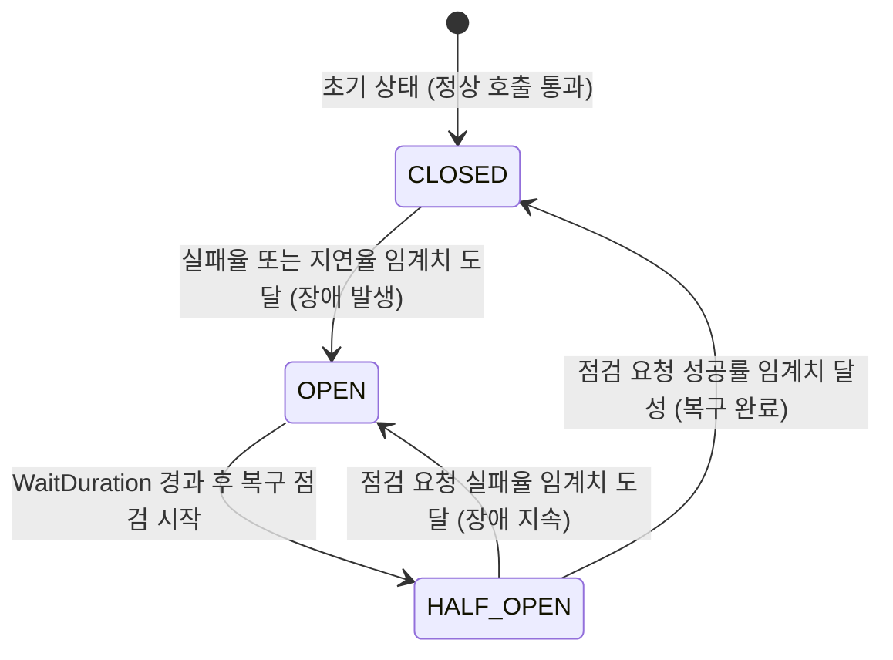
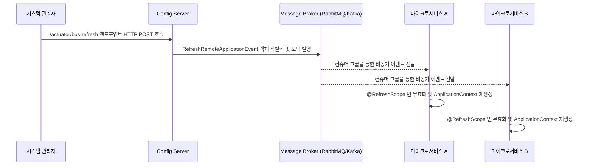

분산된 수많은 서비스의 상태를 얼마나 정확히 관측(Observability)하고 네트워크나 인프라 장애 발생 시 얼마나 유연하게 대응하는 것은 분산 시스템의 신뢰성과 가용성을 결정하는 핵심 요소다.

## 복원력 설계 - Resilience4j 아키텍처

Resilience4j는 자바 8의 함수형 프로그래밍(Functional Programming) 패러다임과 람다(Lambda) 표현식을 활용하여 설계된 경량 결함 내성(Fault Tolerance) 라이브러리다.

### 서킷 브레이커의 비트셋(BitSet) 기반 슬라이딩 윈도우

서킷 브레이커는 호출 대상 서비스의 가용성을 슬라이딩 윈도우 방식의 통계를 바탕으로 장애 확산을 물리적으로 차단한다.

### 고급 장애 격리 패턴 분석

|    패턴 이름    |                       메커니즘 및 내부 동작 원리                       |          해결 과제          |
|:-----------:|:-----------------------------------------------------------:|:-----------------------:|
|  Bulkhead   |  특정 서비스의 지연이 전체 스레드 풀을 점유하지 않도록 별도의 ThreadPool을 할당해 자원 격리   | 타 서비스로의 리소스 부족 장애 전파 방지 |
| RateLimiter | 토큰을 리필하는 토큰 버킷(Token Bucket) 알고리즘을 사용하여 허용치 이상의 요청 큐잉 or 거절 |  트래픽 폭주로 인한 인프라 과부하 방지  |
|    Retry    |                  일시적인 네트워크 순단 상황에 대비해 재시도                   |   일시적/간헐적 네트워크 오류 극복    |

## 중앙 집중식 거버넌스와 동적 리프레시

분산 시스템에서는 설정 파일의 파편화를 막기 위해 Spring Cloud Config Server를 통한 외부화된 환경 설정 주입이 요구된다.

### Fan-out 브로드캐스팅과 컨텍스트 리프레시

설정 정보가 변경되었을 때 각각의 마이크로서비스 인스턴스를 하나하나 재시작하는 것은 불가능하므로 Spring Cloud Bus를 활용한 팬아웃(Fan-out) 브로드캐스팅 메커니즘을 가동한다.

## 분산 관측성 - Distributed Tracing 시스템

마이크로서비스 환경에서 단일 요청은 여러 서비스를 넘나들며 처리되므로 어느 계층 어느 서버에서 성능 지연이나 에러가 발생했는지 추적하기 위해 Micrometer와 Zipkin이 활용된다.

### 추적 데이터 모델 및 프로퍼게이션 규격

전체 호출 흐름을 고유하게 식별하기 위해 분산 트랜잭션의 생명주기를 데이터화한다.

- Trace ID: 하나의 거대한 흐름을 의미
- Span ID: Trace 내의 개별 작업 단위
- Parent Span ID: 상위 작업과의 관계

이러한 메타데이터가 서비스의 경계를 넘어 전달되기 위해 HTTP 헤더 주입(Propagation) 규격이 사용된다.

|   헤더 프로퍼게이션 종류    |                        전송되는 실제 HTTP 헤더 포맷 및 구조                        |            호환성             |
|:-----------------:|:---------------------------------------------------------------------:|:--------------------------:|
|  B3 Propagation   |  `X-B3-TraceId`, `X-B3-SpanId`, `X-B3-ParentSpanId`, `X-B3-Sampled`   |  넷플릭스 등 초기 분산 시스템의 표준 규격   |
| W3C Trace Context | `traceparent: 00-{trace-id}-{span-id}-01`, `tracestate: vendor=value` | 최신 글로벌 웹 표준, 멀티 클라우드 벤더 호환 |

게이트웨이나 서비스의 HTTP 클라이언트는 외부로 요청을 보낼 때 로컬 스레드 로컬이나 리액터 컨텍스트에 보관된 Trace 정보를 위 표준 헤더에 주입하여 다음 서비스로 전파한다.

### 부하 제어를 위한 적응형 샘플링 (Adaptive Sampling)

초당 수만 건의 트래픽을 모두 추적하여 Zipkin 서버로 보내면 관측 시스템 자체가 거대한 오버헤드를 유발하여 본 서비스의 성능을 심각하게 저하시킨다.

- 전체 트래픽 중 일부만 선별하여 추적 데이터를 남기는 샘플링을 적용하여 부하 방지
- 트래픽에 따라 샘플링 비율을 조절하여 최소한의 가시성을 항상 확보하는 적응형 샘플링 알고리즘 주로 채택
- 스토리지 비용을 절감하면서도 유의미한 성능 분석 지표 획득 가능
