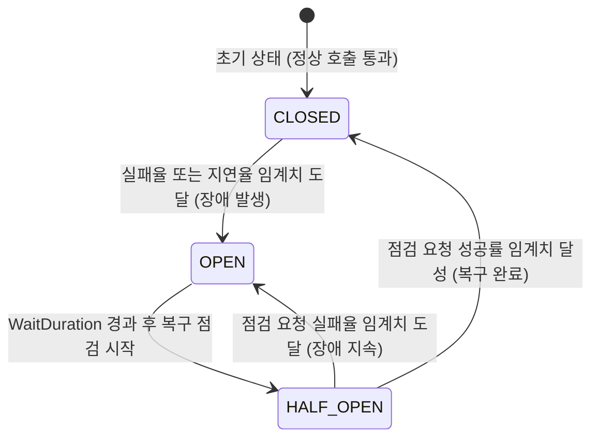

분산된 수많은 서비스가 서로를 호출하는 환경에서는 한 서비스의 장애가 호출 체인 전체로 번지는 연쇄 장애를 어떻게 차단하느냐가 가용성을 결정한다.

## Resilience4j 아키텍처

Resilience4j는 자바 8의 함수형 프로그래밍(Functional Programming) 패러다임과 람다(Lambda) 표현식을 활용하여 설계된 경량 결함 내성(Fault Tolerance) 라이브러리다.

- Netflix Hystrix의 후속으로, Hystrix가 유지보수 모드로 전환된 이후 Spring Cloud 생태계에서 널리 사용
- 데코레이터 패턴 기반 설계: 서킷 브레이커, 벌크헤드, 레이트 리미터 등 각 패턴을 독립적으로 조합하여 함수 호출을 래핑

## 서킷 브레이커의 상태 전이 모델

서킷 브레이커는 호출 대상 서비스의 가용성을 슬라이딩 윈도우 방식의 통계를 바탕으로 판단하여 장애 확산을 물리적으로 차단한다.

## 슬라이딩 윈도우의 비트셋(BitSet) 기반 내부 구현

Resilience4j는 호출 결과를 기록할 때 boolean 배열 대신 Ring Bit Buffer라는 BitSet 기반 자료구조를 사용한다.

- 메모리 효율: BitSet은 내부적으로 `long[]` 배열을 사용하므로 1,024건의 호출 상태를 단 16개의 long(64비트) 값으로 저장(128바이트)
- 비트 매핑: 성공한 호출은 0 비트, 실패한 호출은 1 비트로 기록
- 실패율 계산: 전체 비트 중 1 비트의 비율을 산출하여 실패율 도출

## Count-based vs Time-based 슬라이딩 윈도우

|  비교 항목  |           Count-based           |                 Time-based                  |
|:-------:|:-------------------------------:|:-------------------------------------------:|
| 윈도우 단위  |  최근 N건의 호출 결과를 고정 크기 순환 배열에 기록  |   최근 N초 동안의 호출 결과를 에폭(Epoch) 초 단위 버킷에 기록    |
|  자료구조   |    고정 크기 순환 배열 (Ring Buffer)    | N개의 부분 집계(Partial Aggregation) 버킷을 가진 순환 배열 |
| 집계 트리거  |    순환 배열이 가득 찬 후부터 실패율 계산 시작    |    매 에폭 초마다 가장 오래된 버킷을 새 버킷으로 교체하며 집계 갱신    |
| 적합한 상황  |  트래픽이 균일하여 호출 횟수 기준 판단이 적합한 환경  |       트래픽 변동이 크거나 시간 기반 장애 감지가 중요한 환경       |
| 메모리 사용량 | 윈도우 크기에 비례하는 고정 메모리 (BitSet 기반) |       윈도우 크기(초)에 비례하며 각 버킷이 집계 통계를 유지       |

## 고급 장애 격리 패턴 분석

|    패턴 이름    |                       메커니즘 및 내부 동작 원리                       |          해결 과제          |
|:-----------:|:-----------------------------------------------------------:|:-----------------------:|
|  Bulkhead   |  특정 서비스의 지연이 전체 스레드 풀을 점유하지 않도록 별도의 ThreadPool을 할당해 자원 격리   | 타 서비스로의 리소스 부족 장애 전파 방지 |
| RateLimiter | 토큰을 리필하는 토큰 버킷(Token Bucket) 알고리즘을 사용하여 허용치 이상의 요청 큐잉 or 거절 |  트래픽 폭주로 인한 인프라 과부하 방지  |
|    Retry    |                  일시적인 네트워크 순단 상황에 대비해 재시도                   |   일시적/간헐적 네트워크 오류 극복    |
