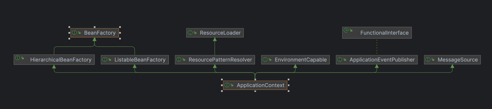

스프링 컨테이너는 애플리케이션을 구성하는 객체(빈)의 생성 -> 구성 -> 생명주기 관리를 담당하는 핵심 런타임으로, 개발자는 객체 생성·연결 책임을 컨테이너에 위임하고, 비즈니스 로직에 집중할 수 있다.

## BeanFactory & ApplicationContext

스프링 컨테이너는 실무에서 보통 `ApplicationContext`를 사용한다.(내부적으로 DI 코어인 `BeanFactory`를 포함)

- BeanFactory
    - 스프링 컨테이너의 최상위 인터페이스
    - 스프링 빈(Bean)을 관리하고 조회하는 역할로 핵심 DI 기능을 제공
    - `getBean()` 제공
- ApplicationContext
    - `BeanFactory` 기능을 모두 상속 받아 제공
    - 그 외에 아래를 포함한 많은 기능을 제공하여 애플리케이션 개발을 편리하게 지원

|         interface         |         description          |
|:-------------------------:|:----------------------------:|
|       MessageSource       |            국제화 기능            |
|    EnvironmentCapable     |           환경변수 기능            |
| ApplicationEventPublisher |  이벤트를 발행하고 구독하는 모델을 편리하게 지원  |
|      ResourceLoader       | 파일/클래스패스/외부 등에서 리소스를 편리하게 조회 |

## 스프링 컨테이너 생명주기

1. 구성 정보 로딩
    - 자바 기반(`@Configuration`/`@Bean`), `@ComponentScan`, XML 설정 등을 통해 구성 정보 읽음
    - 어떤 객체를 어떤 이름으로 생성하고, 어떤 방식으로 의존성 주입 할지 정의
2. 빈 정의 등록
    - 이름, 스코프(singleton/prototype/웹 스코프), 의존성, 초기화/소멸 메서드 등 메타데이터를 컨테이너에 등록
3. BeanFactoryPostProcessor 실행
    - 프로퍼티 치환 및 설정 가공(`@PropertySource`로 불러온 값 치환 및 `@ConfigurationProperties` 바인딩 등)
4. 빈 인스턴스화 & 의존성 주입
    - 생성자 호출 등을 통해 객체 생성 후 생성자/세터/필드 주입으로 의존성 연결
    - `@Autowired`, `@Qualifier`, `@Primary` 등의 규칙이 이 단계에서 적용
5. BeanPostProcessor 적용
    - 초기화 전/후 훅을 제공하는 후처리기 동작
    - 이 시점에 AOP 프록시가 적용
6. 초기화 콜백
    - `@PostConstruct`, `@Bean(initMethod=...)` 등으로 사용자 정의 초기화 로직 수행
7. 컨테이너 초기화 완료
    - 모든 싱글톤 빈이 준비되어 `getBean()` 조회와 애플리케이션 실행 가능 상태
8. 종료 단계
    - 컨텍스트 종료 시 `@PreDestroy`, `DisposableBean`, `@Bean(destroyMethod=...)` 호출

###### 참고자료

- [스프링 핵심 원리 - 기본편](https://www.inflearn.com/course/스프링-핵심-원리-기본편)
