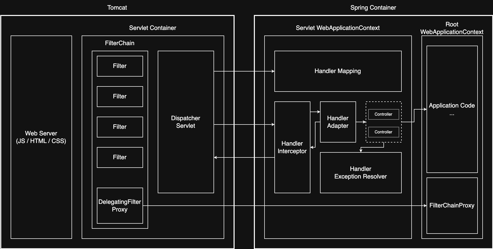

> Spring Web MVC는 Spring Framework에서 제공하는 웹 애플리케이션 프레임워크

## Spring Web MVC 아키텍처의 핵심 구성 요소



Spring Web MVC는 다양한 컴포넌트가 협력하여 HTTP 요청을 처리하고 응답을 생성하는 구조로 구성된다.

- Spring MVC는 보통 Tomcat 위에서 동작
- Tomcat은 웹 서버와 서블릿 컨테이너 역할을 함께 수행하며, 요청을 받아 서블릿에 위임하고, 스레드 풀을 통해 처리
- Spring Boot는 임베디드 컨테이너 사용이 기본값이며 Tomcat, Jetty, Undertow 중 선택 가능

Spring Web MVC는 크게 두 가지 구성으로 나뉜다.

- Servlet Container
    - Tomcat과 같은 WAS 내부에서 동작하며 Servlet의 생명주기를 관리하고 DispatcherServlet 실행 환경 제공
    - 요청/응답 처리 및 스레드 관리 수행
- Spring Container
    - IoC/DI 기반으로 관리되는 Spring 프레임워크의 핵심 컨테이너
    - 공통 Bean을 관리하는 Root Context와 Web 계층 Bean을 관리하는 Servlet Context로 구성

### 요청-응답 처리 파이프라인

1. 클라이언트 요청 도착
2. 서블릿 컨테이너가 등록된 필터 체인을 적용
3. DispatcherServlet이 요청을 수신
4. HandlerMapping에서 요청에 매칭되는 핸들러 탐색
5. HandlerAdapter가 컨트롤러 호출 규약을 수행
6. 컨트롤러가 모델 또는 응답 본문 생성
7. 반환 타입에 따라 ViewResolver 또는 HttpMessageConverter가 응답 생성
8. DispatcherServlet이 응답을 커밋

### 구성 요소 및 역할

|           구성 요소            |                        역할                         |
|:--------------------------:|:-------------------------------------------------:|
|        Filter Chain        | 인증 / 로깅 / CORS 등 공통 처리를 위한 Filter들이 체인 형태로 연결된 구조 |
|           Filter           |      FilterChain에 연결되어 서블릿 요청 전후에 공통 작업을 수행       |
|     DispatcherServlet      |    요청 수신 및 응답 반환 역할 수행하는 Spring MVC의 프론트 컨트롤러     |
|      Handler Mapping       |          요청 URI를 기준으로 Controller 탐색 및 결정          |
|    Handler Interceptor     |   Controller 전후로 실행되어 인증 / 로깅 / 전처리 / 후처리 등 수행    |
|      Handler Adapter       |               요청을 처리할 수 있는 핸들러를 실행                |
|         Controller         |            비즈니스 로직 수행 및 응답 데이터 혹은 뷰 반환            |
| Handler Exception Resolver |     Controller에서 발생한 예외를 View 혹은 Response로 변환     |
|      Application Code      |     사용자 정의 비즈니스 로직 코드(Service, Repository 등)      |
|   DelegatingFilterProxy    | Spring Bean으로 등록된 Filter를 서블릿 필터 체인에 연결하기 위한 프록시  |
|      FilterChainProxy      |       Spring Security가 내부적으로 사용하는 보안 필터 체인        |

## Spring MVC 코드 흐름 예시

아래는 Spring MVC에서 HTTP 요청을 처리하고 뷰를 렌더링하는 전체 흐름의 간단한 예시이다.

```java

@Controller
@RequestMapping("/spring")
public class SpringExampleController {

    @GetMapping("/example")
    public String process(Model model) {
        List<Member> members = new ArrayList<>();
        members.add(new Member("memberA", 10));
        members.add(new Member("memberB", 20));

        model.addAttribute("members", members);
        return "example";
    }
}
```

- `@Controller`: 해당 클래스를 스프링 컨테이너에 등록되는 웹 계층 컴포넌트로 인식. `HandlerMapping`이 이 애노테이션이 붙은 클래스를 핸들러로 탐색
- `@RequestMapping`, `@GetMapping`: URI와 HTTP 메서드 조건을 기반으로 특정 메서드에 요청을 매핑. 이 매핑 정보는 `HandlerMapping`에서 사용됨
- `Model`: 컨트롤러에서 데이터를 전달할 때 사용하는 객체로, 내부적으로 `ModelMap` 혹은 `ModelAndView`로 구성되어 뷰 렌더링 시 `ViewResolver`로 전달됨
- 반환 `String`: 논리적 뷰 이름을 나타내며, `ViewResolver`가 이를 기반으로 실제 물리적 뷰 경로를 결정하여 렌더링 수행

동작의 흐름은 다음과 같다.

1. 클라이언트가 `/spring/example` 경로로 HTTP 요청을 전송
2. 요청은 먼저 `Filter Chain`을 거치며, 등록된 `Filter`, `DelegatingFilterProxy`, `FilterChainProxy` 등이 보안, 로깅, CORS 등을 처리
3. 필터 처리가 끝나면 요청은 `Servlet Container`에 의해 `DispatcherServlet`으로 전달
4. `DispatcherServlet`은 `HandlerMapping`을 통해 해당 URI에 매핑된 컨트롤러(`SpringExampleController`)의 메서드를 탐색
5. 매핑된 핸들러 정보를 바탕으로 `HandlerAdapter`가 실제 컨트롤러 메서드를 호출할 수 있도록 실행 로직을 위임
6. 요청 전에는 필요한 경우 `Handler Interceptor`가 먼저 실행되어 인증, 로깅 등의 전처리를 수행
7. 컨트롤러 메서드 내부에서 비즈니스 로직 수행
8. `Model` 객체에 데이터 추가 (`Application Code` 영역에서 처리)
9. 논리 뷰 이름 `"example"`을 반환
10. `DispatcherServlet`은 반환된 논리 이름을 기반으로 `ViewResolver`를 통해 실제 JSP/HTML 뷰를 결정
11. 뷰 렌더링 중 예외가 발생하면 `Handler Exception Resolver`가 적절한 예외 응답으로 변환
12. 최종적으로 뷰가 렌더링되어 클라이언트에 응답 전송

## 반환 타입과 응답 처리

Spring MVC 컨트롤러 메서드는 다양한 반환 타입을 지원하며, 각 타입에 따라 응답 처리 방식이 다르다.

|        반환 타입        |                    처리 경로                     |
|:-------------------:|:--------------------------------------------:|
|       String        |        ViewResolver로 논리 이름 해석 후 뷰 렌더링        |
|    ModelAndView     |                뷰 이름과 모델 동시 지정                |
|        void         | 요청 경로 기반 뷰 선택 또는 직접 `HttpServletResponse` 사용 |
|  ResponseEntity<T>  |            상태 코드/헤더/본문을 명시적으로 구성             |
| `@ResponseBody` + T |               메시지 컨버터로 본문 직렬화                |

###### 참고자료

- [스프링 MVC 1편 - 백엔드 웹 개발 핵심 기술](https://www.inflearn.com/course/스프링-mvc-1)
