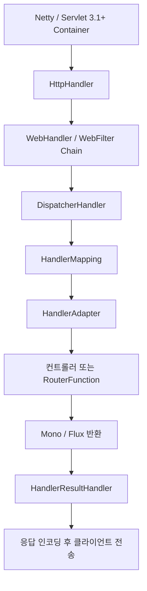

Spring WebFlux는 Spring Framework 5부터 도입된 반응형(Reactive) 웹 프레임워크이다.

- 기존의 Spring Web MVC와 동일한 역할을 하지만, 요청을 처리하는 내부 동작 방식의 차이가 존재
- WebFlux는 비동기 논블로킹(Asynchronous Non-Blocking) 방식 기반으로 동작
    - 적은 수의 스레드를 사용해 높은 동시성(Concurrency)과 확장성(Scalability)을 목표로 설계
- Reactive Streams 명세를 준수하며 Project Reactor의 `Mono`·`Flux`를 1차 타입으로 활용

## Spring WebFlux vs. Spring Web MVC

전통적인 MVC와 가장 큰 차이점은 프로그래밍 모델과 스레드 모델에 있다.

- Spring Web MVC
    - 동작 방식: 명령형(Imperative) 프로그래밍과 블로킹(Blocking) I/O 기반
    - 스레드 모델: 요청 하나당 스레드 하나를 할당하는 Thread-per-Request 모델을 사용
        - 요청이 많아지면 스레드 수도 그만큼 증가하여 컨텍스트 스위칭(Context Switching) 비용 증가
    - 기반 기술: Servlet API 위에서 동작하며, Tomcat, Jetty 같은 서블릿 컨테이너에서 주로 실행
- Spring WebFlux
    - 동작 방식: 반응형(Reactive) 프로그래밍과 논블로킹(Non-Blocking) I/O 기반
    - 스레드 모델: 적은 수의 고정된 스레드(보통 CPU 코어 수와 동일)로 모든 요청을 처리하는 이벤트 루프(Event Loop) 모델을 사용
        - I/O 작업 동안 스레드가 대기하지 않고 다른 요청을 처리하므로 자원 효율성 극대화
    - 기반 기술: Reactive Streams 명세를 기반으로 하며, Netty와 같은 비동기 논블로킹 서버에서 주로 실행

|     구분     |     Spring Web MVC      |      Spring WebFlux       |
|:----------:|:-----------------------:|:-------------------------:|
|  프로그래밍 모델  |    명령형 (Imperative)     |       반응형(Reactive)       |
|   I/O 모델   |     블로킹 (Blocking)      |    논블로킹(Non-Blocking)     |
|   스레드 모델   |       요청당 스레드 1개        |     이벤트 루프(적은 수의 스레드)     |
|   핵심 의존성   |       Servlet API       |   Reactive Streams API    |
|  기본 내장 서버  |         Tomcat          |           Netty           |
| HTTP 클라이언트 |    RestTemplate (동기)    |     WebClient (논블로킹)      |
|   DB 접근    |        JDBC, JPA        |  R2DBC, Reactive MongoDB  |
|  주요 사용 사례  | 일반적인 웹 애플리케이션, CRUD API | 고성능 API Gateway, 스트리밍 서비스 |

## 요청 처리 내부 흐름

WebFlux는 Servlet API에 의존하지 않고 자체 추상화인 `HttpHandler` → `WebHandler` → `DispatcherHandler` 위에서 동작한다.



- `HttpHandler`: 서버(Netty 등)와 WebFlux를 연결하는 최하위 추상화. 요청·응답을 `ServerHttpRequest`·`ServerHttpResponse`로 변환
- `DispatcherHandler`: MVC의 `DispatcherServlet`에 해당하는 중앙 디스패처
    - `HandlerMapping`으로 요청에 맞는 핸들러 탐색
    - `HandlerAdapter`로 핸들러 호출, 결과 `Mono`/`Flux` 획득
    - `HandlerResultHandler`로 결과를 응답으로 변환
- 모든 단계가 논블로킹으로 연결되어 있어, Netty 이벤트 루프 스레드를 점유하지 않고 신호 흐름을 따라 처리

## 핵심 구성 요소 및 프로그래밍 모델

Spring WebFlux는 개발자가 두 가지 프로그래밍 모델 중 하나를 선택하여 사용할 수 있도록 지원한다.

### 1. Annotation-based 방식(`@Controller`)

Spring Web MVC와 매우 유사한 방식으로, `@Controller`, `@RestController`, `@RequestMapping` 등의 어노테이션을 그대로 사용한다.

```java

@RestController
public class MemberController {

    @GetMapping("/members/{id}")
    public Mono<Member> getMemberById(@PathVariable String id) {
        // DB 조회 등 비동기 작업을 통해 Mono<Member>를 반환
        return memberRepository.findById(id);
    }

    @GetMapping("/members")
    public Flux<Member> getAllMembers() {
        // 모든 멤버를 스트림 형태로 반환
        return memberRepository.findAll();
    }
}
```

가장 큰 차이점은 반환 타입으로 Mono나 Flux와 같은 반응형 타입(Publisher)을 사용한다는 점이다.

- WebFlux는 컨트롤러가 반환한 Publisher를 구독(subscribe)하고, 데이터 스트림이 시작되면 비동기적으로 HTTP 응답을 처리
- 컨트롤러 메서드는 실제 데이터가 아닌 데이터의 흐름을 정의하고 반환하여, 스레드가 블로킹되지 않음

### 2. Functional 방식(`RouterFunctions`)

어노테이션 대신 라우터 함수(Router Function)를 사용하여 요청 경로와 핸들러 함수를 직접 매핑하는 방식이다.

```java

@Configuration
public class MemberRouter {

    @Bean
    public RouterFunction<ServerResponse> route(MemberHandler memberHandler) {
        return RouterFunctions
                .route(GET("/functional/members/{id}"), memberHandler::getMember)
                .andRoute(GET("/functional/members"), memberHandler::getAllMembers);
    }
}
```

핸들러는 `ServerRequest`를 받아 `Mono<ServerResponse>`를 반환하는 함수로 작성한다.

```java

@Component
public class MemberHandler {

    private final MemberRepository repository;

    public Mono<ServerResponse> getMember(ServerRequest request) {
        String id = request.pathVariable("id");
        return repository.findById(id)
                .flatMap(member -> ServerResponse.ok().bodyValue(member))
                .switchIfEmpty(ServerResponse.notFound().build());
    }

    public Mono<ServerResponse> getAllMembers(ServerRequest request) {
        return ServerResponse.ok().body(repository.findAll(), Member.class);
    }
}
```

- 라우팅 정의와 핸들러 로직이 명시적으로 분리되어 테스트 용이
- 어노테이션 처리 단계가 없어 라우팅 흐름을 코드로 직접 추적 가능
- 작은 단위의 마이크로서비스, 동적 라우팅 구성에 적합

## 주요 컴포넌트 생태계

WebFlux는 기존 MVC 컴포넌트를 논블로킹 버전으로 교체한 자체 생태계를 제공한다.

|     영역     |            MVC            |                 WebFlux                 |
|:----------:|:-------------------------:|:---------------------------------------:|
| HTTP 클라이언트 |      `RestTemplate`       |               `WebClient`               |
|     필터     |    `Filter` (Servlet)     |               `WebFilter`               |
|   인증·인가    | Spring Security (Servlet) |        Spring Security Reactive         |
|   DB 접근    |         JDBC, JPA         |      R2DBC, Reactive MongoDB·Redis      |
|   메시지 변환   |  `HttpMessageConverter`   | `HttpMessageReader`/`HttpMessageWriter` |
|    테스트     |         `MockMvc`         |             `WebTestClient`             |

`WebClient`는 WebFlux 환경뿐 아니라 MVC에서도 사용 가능한 표준 논블로킹 HTTP 클라이언트로 자리 잡았다.

-----

## WebFlux 선택 기준

Spring Web MVC는 여전히 대부분의 웹 애플리케이션에 훌륭하고 단순한 선택지이며, WebFlux는 다음과 같은 경우에 특히 유용하다.

- 높은 동시성 처리: 수만에서 수십만 개의 동시 연결을 효율적으로 처리해야 하는 경우(예: 실시간 채팅, 스트리밍 서비스, API Gateway)
- 리액티브 시스템 연동: 데이터베이스(R2DBC), 다른 마이크로서비스 등 호출하는 시스템이 이미 반응형으로 구성되어 있는 경우
- 함수형 프로그래밍: 함수형 라우팅 모델을 통해 애플리케이션 로직을 구성하는 것을 선호하는 경우
