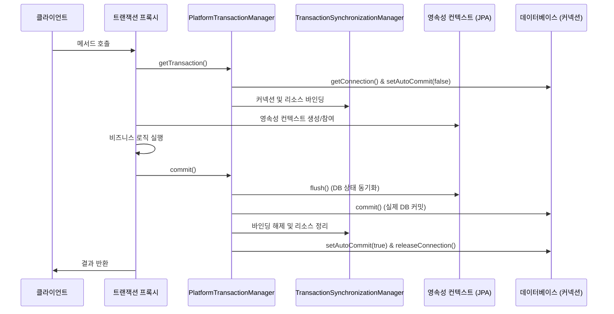
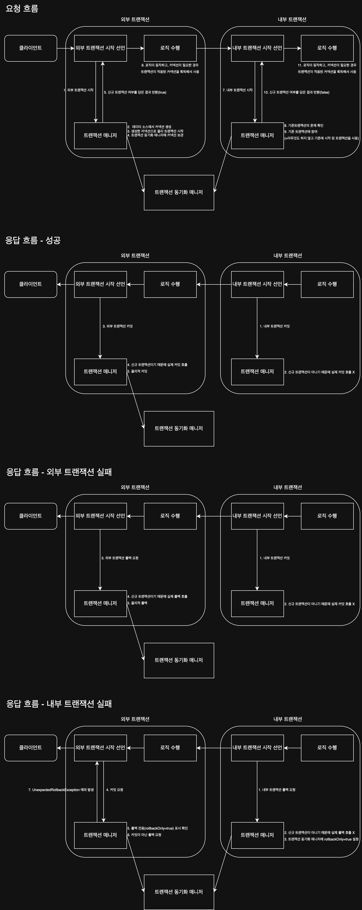

스프링은 `PlatformTransactionManager` 인터페이스를 통해 트랜잭션을 추상화하고 선언적 트랜잭션을 지원하여 트랜잭션을 편리하게 사용할 수 있도록 지원한다.

- 스프링 컨테이너는 `@Transactional` 애노테이션이 적용된 빈을 찾으면, 해당 빈의 실제 객체 대신 트랜잭션 로직을 담은 프록시 객체를 생성하여 컨테이너에 등록
- 다른 빈에서 의존성을 주입받을 때, 스프링 컨테이너는 실제 객체 대신 프록시 객체를 주입
- 클라이언트의 요청은 주입받은 프록시 객체를 통해 전달되며, 프록시는 트랜잭션 처리 후 실제 객체의 메서드를 호출

## 트랜잭션 동작 방식과 동기화

스프링 트랜잭션은 AOP, 영속성 컨텍스트(JPA), 실제 DB 커넥션이 결합되어 동작한다.



### 트랜잭션 커밋 과정 및 코드 분석

트랜잭션 커밋 과정은 다음과 같은 단계로 이루어진다.

1. `@Transactional` 메서드가 호출되면, 스프링은 AOP를 통해 트랜잭션 처리 시작
2. 해당 프록시는 실제 비즈니스 로직 실행 전후로 트랜잭션 관련 부가 기능을 수행하는 `TransactionInterceptor`에 제어를 위임
3. `TransactionInterceptor는` `PlatformTransactionManager`의 구현체를 사용하여 트랜잭션을 시작하고, 비즈니스 로직이 정상적으로 완료되면 커밋 요청
4. 실제 커밋 과정은 `PlatformTransactionManager`의 추상 클래스인 `AbstractPlatformTransactionManager`의 `processCommit` 메서드에서 단계적으로 처리

`processCommit` 메서드에서 커밋의 핵심 로직이 수행되며, 주요 단계는 다음과 같다.

```java

private void processCommit(DefaultTransactionStatus status) {
    try {
        boolean beforeCompletionInvoked = false;

        try {
            prepareForCommit(status);          // 1. 커밋 준비
            triggerBeforeCommit(status);       // 2. 커밋 전 콜백
            triggerBeforeCompletion(status);   // 3. 완료 직전 콜백
            beforeCompletionInvoked = true;

            // ... 세이브포인트/트랜잭션 분기 처리 등
            else if (status.isNewTransaction()) {
                doCommit(status);              // 4. DB 트랜잭션 커밋 (이 시점에 DB 트랜잭션 종료)
            }

        } catch (Exception ex) {
            // 예외 발생 시 롤백 및 예외 전파
            throw ex;
        }

        try {
            triggerAfterCommit(status);        // 5. 커밋 이후 콜백
        } finally {
            triggerAfterCompletion(            // 6. 완료 후 콜백
                    status, TransactionSynchronization.STATUS_COMMITTED
            );
        }

    } finally {
        cleanupAfterCompletion(status);        // 7. 트랜잭션 컨텍스트 정리 (리소스 언바인딩)
    }
}
```

1. `prepareForCommit`: 플러시 등 커밋 직전 준비 수행
2. `triggerBeforeCommit`: 커밋 전 콜백 실행
    - 아직 DB 트랜잭션이 살아있는 상태
3. `triggerBeforeCompletion`: 완료 직전 콜백 실행
4. `doCommit`: 실제 DB 커밋 수행
    - 이 시점에 DB 트랜잭션이 종료
5. `triggerAfterCommit`: 커밋 이후 콜백 실행
    - DB 트랜잭션은 이미 종료되었으나, 스프링 트랜잭션 컨텍스트는 아직 살아있는 상태
6. `triggerAfterCompletion`: 완료 후 콜백 실행
7. `cleanupAfterCompletion`: 스레드 컨텍스트 정리

## 트랜잭션 우선 순위

`@Transactional` 애노테이션은 클래스, 인터페이스, 메서드에 적용할 수 있으며, 우선순위는 더 구체적이고 자세한 것이 높은 우선순위를 가지는 것을 원칙으로 한다.

1. 클래스의 메서드
2. 클래스
3. 인터페이스의 메서드
4. 인터페이스

## 자기 호출(Self Invocation)

`@Transactional`이 적용 됐을 때 트랜잭션이 적용은 프록시 객체를 통해 수행되는데, 만약 프록시 객체를 거치지 않고 대상 객체를 직접 호출하게 되면 트랜잭션이 적용되지 않는다.  
보통의 경우는 프록시 객체를 거치기 때문에 문제가 되지 않지만, 대상 객체 내부에서 메서드 호출을 하게 되면 프록시를 거치지 않게 되어 위의 문제가 발생할 수 있다.

```java
class Example {

    public void external() {
        // do something
        internal(); // 프록시를 거치지 않고 대상 객체 내부에서 메서드 호출하기 때문에 트랜잭션이 적용되지 않는다.
    }

    @Transactional
    public void internal() {
        // do something
    }
}
```

클라이언트에서 external 메서드를 호출했을 때 다음과 같은 프로세스가 진행된다.

1. 클라이언트에서 프록시 호출
2. 프록시에서 external 메서드에 트랜잭션이 적용되어 있지 않기 때문에 트랜잭션 없이 메서드 호출
3. 실제 external 메서드 실행
4. external 메서드 내부에서 internal 메서드 호출
5. 실행 된 internal 메서드는 실제 객체에서 실행되기 때문에 트랜잭션이 적용되지 않는다.

이를 방지하기 위해 여러 해결방안들이 존재하지만 보통 실무에서는 별도 클래스로 분리하여 호출하는 것이 가장 적절한 방법이다.

## 초기화 시점

스프링 초기화 시점에는 트랜잭션 AOP가 적용되지 않을 수 있기 때문에 트랜잭션이 필요한 로직이 필요한 메서드 실행 시점을 스프링 컨테이너가 완전히 생성되고 난 뒤에 호출할 수 있도록 설정하는 것이 좋다.

```java
class Hello {

    @PostConstruct
    @Transactional
    public void init1() {
        boolean isActive = TransactionSynchronizationManager.isActualTransactionActive();
        log.info("tx active={} ", isActive); // false
    }

    @EventListener(ApplicationReadyEvent.class)
    @Transactional
    public void init2() {
        boolean isActive = TransactionSynchronizationManager.isActualTransactionActive();
        log.info("tx active={} ", isActive); // true
    }
}
```

## 트랜잭션 옵션

`@Transactional` 애노테이션을 통해 트랜잭션을 적용할 때 아래와 같이 옵션을 설정할 수 있으며, 지정하지 않은 경우엔 기본값이 적용된다.

```java

@Transactional(isolation = Isolation.DEFAULT, readOnly = false)
class Example {

}
```

애노테이션에 적용할 수 있는 옵션들은 아래와 같다.

### 1. rollbackFor / noRollbackFor

예외 발생시 스프랑 트랜잭션의 롤백 정책으로 기본 정책은 아래와 같다.

- 언체크 예외: 롤백
- 체크 예외: 롤백하지 않고 커밋

이 옵션에 추가로 롤백할 예외를 지정하게 되면, 해당 예외가 발생했을 때 롤백하게 된다.

```java

@Transactional(rollbackFor = Exception.class)
class Example {

}
```

반대로 `noRollbackFor` 옵션은 롤백하지 않을 예외를 지정할 수 있다.

### 2. isolation

트랜잭션 격리 수준 지정으로 보통 데이터베이스에서 설정한 트랜잭션 수준을 사용하는 `DEFAULT`를 사용한다.

### 3. timeout

트랜잭션 타임아웃을 지정하는 옵션으로 기본값은 -1로 무제한이다.

### 4. readOnly

- `false`: 읽기 쓰기가 모두 가능한 트랜잭션
- `true`: 읽기 전용 트랜잭션(드라이버나 DB에 따라 읽기 전용 트랜잭션을 지원하지 않을 수 있음)

### 5. propagation

트랜잭션 전파 옵션으로 기본값은 `REQUIRED`로, 대부분 이 옵션을 사용한다.

|      옵션       |            설명             |  기존 트랜잭션 X  |       기존 트랜잭션 O        |
|:-------------:|:-------------------------:|:-----------:|:----------------------:|
|   REQUIRED    |        하나의 트랜잭션 사용        | 새로운 트랜잭션 생성 |       기존 트랜잭션 사용       |
| REQUIRES_NEW  | 항상 새로운 트랜잭션 사용(커넥션 추가 점유) | 새로운 트랜잭션 생성 |      새로운 트랜잭션 생성       |
|    SUPPORT    |          트랜잭션 지원          | 트랜잭션 없이 진행  |       기존 트랜잭션 사용       |
| NOT_SUPPORTED |         트랜잭션 미지원          | 트랜잭션 없이 진행  | 트랜잭션 없이 진행(기존 트랜잭션 보류) |
|   MANDATORY   |     트랜잭션이 반드시 존재해야 함      |    예외 발생    |       기존 트랜잭션 사용       |
|     NEVER     |       트랜잭션을 사용하지 않음       | 트랜잭션 없이 진행  |         예외 발생          |

isolation , timeout , readOnly 는 트랜잭션이 처음 시작될 때만 적용되며, 트랜잭션에 참여하는 경우에는 적용되지 않는다.

## 트랜잭션 전파 흐름 - REQUIRED 옵션

트랜잭션 전파 옵션이 `REQUIRED`인 경우 이미 트랜잭션이 존재하면 해당 트랜잭션을 사용하고 없으면 새로운 트랜잭션을 생성하게 된다.  
하나의 커밋이라도 발생하면 전체 트랜잭션이 커밋되고, 하나의 롤백이라도 발생하면 전체 트랜잭션이 롤백되며, 그 원리와 순서는 아래와 같다.



### 내부 트랜잭션 실패로 외부 트랜잭션이 롤백되는 예시

```java
// 외부 트랜잭션
@Service
public class BatchRegistrationService {

    private final MemberService memberService;

    public BatchRegistrationService(MemberService memberService) {
        this.memberService = memberService;
    }

    @Transactional
    public void registerMultipleMembers() {
        for (long point = 0; point < 5; point++) {
            try {
                memberService.registerMember(point);
            } catch (Exception e) {
                System.out.println("예외 발생: " + e.getMessage());
            }
        }
    }
}

// 내부 트랜잭션
@Service
public class MemberService {

    private final MemberRepository memberRepository;

    public MemberService(MemberRepository memberRepository) {
        this.memberRepository = memberRepository;
    }

    @Transactional
    public void registerMember(long point) {
        if (point == 2L) {
            throw new RuntimeException("포인트가 2인 회원은 등록할 수 없습니다.");
        }
        Member member = new Member(point);
        memberRepository.save(member);
    }
}
```

외부 트랜잭션에서 예외를 감싸서 외부 트랜잭션에서의 예외 발생을 방지했지만, 내부 트랜잭션에서 예외가 발생하여 롤백 마킹됐기 때문에 전체 트랜잭션이 롤백된다.

###### 참고자료

- [스프링 DB 2편 - 데이터 접근 활용 기술](https://www.inflearn.com/course/스프링-db-2)
